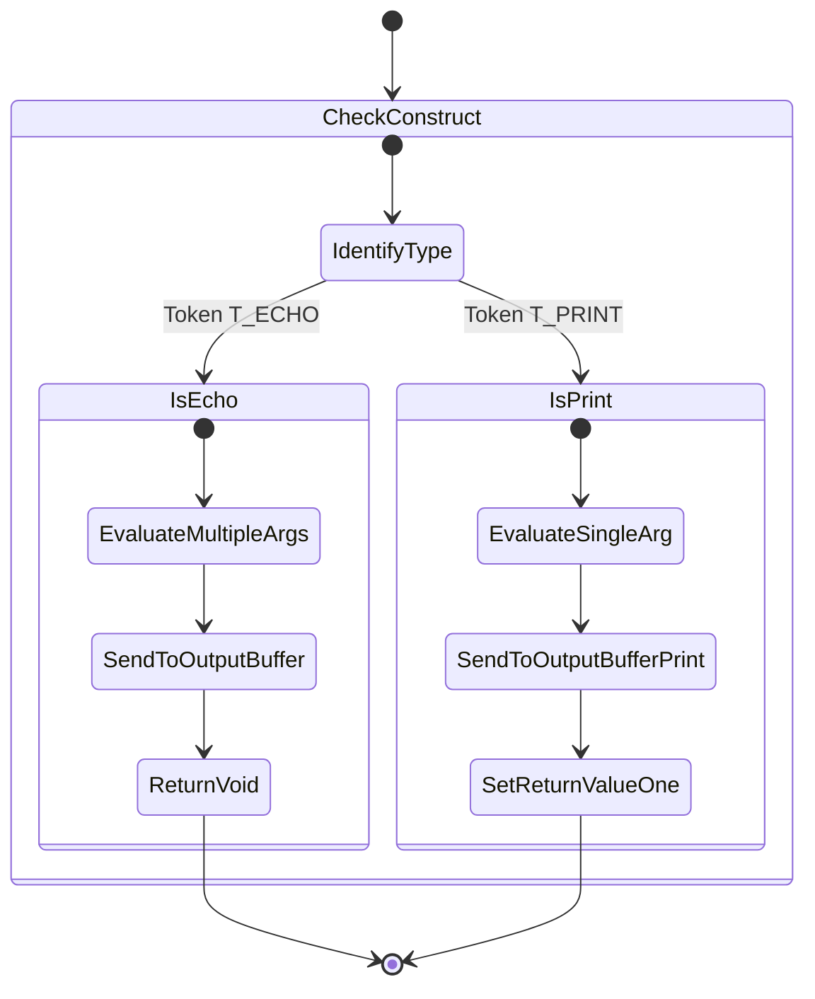

# print vs echo

PHP-তে Data বা Output ব্রাউজারে প্রদর্শন করার জন্য ব্যবহৃত দুটি মৌলিক এবং বহুল ব্যবহৃত ল্যাঙ্গুয়েজ কনস্ট্রাক্ট (Language Construct)।

---

# Table of Contents

* [Definition](#definition)
* [Why Important](#why-important)
* [Comparison](#comparison)
* [Internal Working](#internal-working)
* [Flow Diagram](#flow-diagram)
* [Code Examples](#code-examples)
* [Output](#output)
* [Real Project Example](#real-project-example)
* [Interview Answer (বাংলা)](#interview-answer-বাংলা)
* [Interview Answer (English)](#interview-answer-english)
* [Common Mistakes](#common-mistakes)
* [Follow-up Questions](#follow-up-questions)
* [Performance Notes](#performance-notes)
* [Best Practices](#best-practices)
* [Memory Tricks](#memory-tricks)
* [Summary](#summary)
* [Revision Checklist](#revision-checklist)
* [Difficulty](#difficulty)
* [Confidence](#confidence)
* [Interview Notes](#interview-notes)
* [References](#references)

---

# Definition

## Simple Definition

`echo` এবং `print` দুটোই ব্রাউজারে কোনো টেক্সট বা ভ্যারিয়েবলের ভ্যালু দেখানোর জন্য ব্যবহার করা হয়। তবে `echo` একটু বেশি দ্রুত কাজ করে এবং এটি একসাথে একাধিক ভ্যালু কমা (`,`) দিয়ে প্রিন্ট করতে পারে, যা `print` পারে না। অন্যদিকে `print` সবসময় একটি রিটার্ন ভ্যালু `1` দেয়, যার কারণে একে এক্সপ্রেশনের ভেতরেও ব্যবহার করা যায়।

## Official Definition

`echo` and `print` are not actual functions, but rather language constructs. `echo` outputs one or more expressions with no additional newline or space. It does not return any value. `print` outputs a single expression and always returns `1`, allowing it to be used in larger expressions where a value is expected.

## Interview Definition

In PHP, `echo` and `print` are language constructs used for outputting data. The key differences are: `echo` has no return value, accepts multiple parameters separated by commas, and is marginally faster. `print` has a return value of `1` (making it usable in expressions) and accepts only a single argument.

---

# Why Important

* **Core Output Mechanism:** PHP-তে ডায়নামিক HTML কন্টেন্ট জেনারেট করে ব্রাউজারে পাঠানোর জন্য এই দুটি প্রধান মাধ্যম।
* **Language Constructs vs Functions:** এরা কোনো অফিসিয়াল ফাংশন নয়, তাই ব্র্যাকেট `()` ছাড়াই কাজ করতে পারে, যা পারফরম্যান্সে বাড়তি সুবিধা দেয়।
* **Problem Solving:** কন্ডিশনাল এক্সপ্রেশন বা টার্নারি অপারেটরের ভেতরে সরাসরি আউটপুট দেওয়ার প্রয়োজন হলে `print` এর রিটার্ন ভ্যালু সাহায্য করে।
* **Laravel Context:** লারাভেলে আমরা সাধারণত ব্লেড টেমপ্লেটে `{{ $variable }}` ব্যবহার করি, যা ব্যাকএন্ডে কম্পাইল হয়ে `echo e($variable)`-এ রূপান্তরিত হয়। তাই `echo`-এর কার্যকারিতা জানা লারাভেল ডেভেলপারদের জন্য জরুরি।
* **Real Life Scenario:** একটি বড় লুপের মধ্যে হাজার হাজার ডেটা রেন্ডার করার সময় ভুল কনস্ট্রাক্ট ব্যবহার করলে মেমোরি ও এক্সিকিউশন টাইমে প্রভাব পড়তে পারে।

---

# Comparison

| Feature | echo | print |
| --- | --- | --- |
| **Return Value** | কোনো রিটার্ন ভ্যালু নেই (`void`) | সবসময় `1` রিটার্ন করে (`int`) |
| **Parameters** | একাধিক প্যারামিটার নিতে পারে (যেমন: `echo $a, $b, $c;`) | শুধুমাত্র একটি একক আর্গুমিণ্ট নিতে পারে |
| **Performance** | তুলনামূলকভাবে দ্রুত (মার্জিনাল ডিফারেন্স) | সামান্য ধীরগতির (রিটার্ন ভ্যালু ম্যানেজ করার জন্য) |
| **Usage in Expressions** | এক্সপ্রেশনের ভেতরে বা টার্নারি অপারেটরের ডানপাশে সরাসরি ব্যবহার করা যায় না | এক্সপ্রেশন বা স্টেটমেন্টের ভেতরে ব্যবহার করা যায় (যেমন: `$result = print "Hello";`) |
| **Laravel Usage** | Blade Engine ব্যাকএন্ডে `echo` ব্যবহার করে স্ট্রিং আউটপুট দেয় | লারাভেল ইকোসিস্টেমে এর ব্যবহার প্রায় দেখাই যায় না |

---

# Internal Working

1. **Zend Engine Parsing:** PHP যখন স্ক্রিপ্টটি পার্স করে, তখন `echo` এবং `print` কে টোকেন হিসেবে চেনে (`T_ECHO` এবং `T_PRINT`)। যেহেতু এরা ল্যাঙ্গুয়েজ কনস্ট্রাক্ট, তাই ফাংশন ওভারহেড (Function Call Stack) তৈরি হয় না।
2. **Expression Evaluation:** `echo` তার ডানপাশের সবকটি এক্সপ্রেশনকে ইভালুয়েট করে এবং সরাসরি আউটপুট বাফারে (Output Buffer) পাঠিয়ে দেয়। `print` প্রথমে তার আর্গুমেন্টটি ইভালুয়েট করে আউটপুট বাফারে পাঠায় এবং অভ্যন্তরীণভাবে রিটার্ন রেজিস্টারে `1` সেট করে।
3. **Memory/CPU Cycles:** `echo` কোনো ভ্যালু রিটার্ন করে না বলে এটি সিপিইউতে একটি অতিরিক্ত ইন্সট্রাকশন সাইকেল কম ব্যবহার করে। অন্যদিকে `print` কে এক্সপ্রেশন স্ট্যাকে `1` পুশ করতে হয়, যা একে সামান্য ধীরগতির করে।

---

# Flow Diagram



---

# Code Examples

## Basic Example

```php
<?php
// Using echo with and without parentheses
echo "Hello World with echo\n";
echo("Hello World with echo parentheses\n");

// Using print with and without parentheses
print "Hello World with print\n";
print("Hello World with print parentheses\n");
?>

```

**Explanation:** বেসিক সিনট্যাক্স প্রদর্শন। ব্র্যাকেট ছাড়া এবং ব্র্যাকেটসহ দুটিই কাজ করে কারণ এরা ল্যাঙ্গুয়েজ কনস্ট্রাক্ট।

## Intermediate Example

```php
<?php
// echo accepting multiple parameters
echo "This ", "is ", "a ", "multi-parameter ", "string.\n";

// print cannot take multiple parameters. This will cause a Parse Error:
// print "This ", "is ", "error"; 

// print inside an expression
$age = 20;
$age > 18 ? print "Allowed\n" : print "Not Allowed\n";
?>

```

**Explanation:** `echo`-তে কমা ব্যবহার করে মাল্টিপল স্ট্রিং দেওয়া হয়েছে। `print`-কে টার্নারি অপারেটরের ভেতর এক্সপ্রেশন হিসেবে ব্যবহার করা হয়েছে।

## Advanced Example

```php
<?php
// Advanced expression usage with print
$isValid = true;

// Since print returns 1, this statement is syntactically valid in PHP
$outputStatus = $isValid && print("System is running fine...\n");

echo "Value of outputStatus: " . $outputStatus . "\n";

// Understanding execution precedence
// echo ($isValid) && echo("This causes syntax error"); // Syntax Error
?>

```

**Explanation:** `print` এক্সপ্রেশনের অংশ হতে পারে বলে লজিক্যাল অ্যান্ড (`&&`) অপারেশনের সাথে যুক্ত করা গেছে, যা `echo` দিয়ে করলে কোড পার্সিং ইম্পসিবল হতো এবং সিনট্যাক্স এরর দিত।

## Laravel Example

```php
// In a standard Laravel Controller or Service Layer, we rarely use raw echo/print.
// But under the hood in compiled Blade views (storage/framework/views/):

// Blade code: Hello {{ $name }}
// Compiled PHP code:
echo "Hello " . e($name); 

// For streaming large responses, Laravel uses Symphony Response which utilizes echo internally
namespace App\Http\Controllers;

use Illuminate\Http\Request;
use Symfony\Component\HttpFoundation\StreamedResponse;

class ExportController extends Controller
{
    public function streamData()
    {
        return new StreamedResponse(function() {
            $handle = fopen('php://output', 'w');
            foreach (range(1, 10000) as $id) {
                // Using echo or native output functions for streaming chunk by chunk
                echo "Data Row " . $id . "\n";
                flush(); // Pushing data to client immediately
            }
            fclose($handle);
        });
    }
}

```

**Explanation:** লারাভেলের ব্লেড ইঞ্জিন এক্সপ্রেশন প্রিন্ট করার জন্য ব্যাকএন্ডে `echo` এবং এক্সকেপিং হেল্পার `e()` ব্যবহার করে। এছাড়াও স্ট্রিমড রেসপন্সের ক্ষেত্রে `echo` এবং `flush()` এর কম্বিনেশন ব্যবহার করা হয়।

---

# Output

### Basic Example Output:

```text
Hello World with echo
Hello World with echo parentheses
Hello World with print
Hello World with print parentheses

```

### Intermediate Example Output:

```text
This is a multi-parameter string.
Allowed

```

### Advanced Example Output:

```text
System is running fine...
Value of outputStatus: 1

```

---

# Real Project Example

## Business Requirement

একটি FinTech অ্যাপ্লিকেশনের বাল্ক ট্রানজেকশন রিপোর্ট জেনারেট করে সরাসরি ব্রাউজারে মেমোরি ওভারহেড ছাড়া ডাউনলোড বা স্ট্রিম করতে হবে। লাখ খানেক ডেটা একসাথে অ্যারেতে নিয়ে রিটার্ন করলে সার্ভার ক্র্যাশ (Memory Limit Exceeded) করে।

## Problem

ডেটাবেজ থেকে ৫,০০,০০০ রো তুলে সেটিকে মেমরিতে অবজেক্ট আকারে রাখলে মেমোরি লিমিট এক্সিড করে। রেগুলার ব্লেড ভিউ বা রিটার্ন স্টেটমেন্ট এখানে অকেজো।

## Solution

লারাভেলের `StreamedResponse` এবং PHP-এর র' `echo` ব্যবহার করে ডেটাবেজ কার্সার (Cursor) থেকে একটা একটা করে রো তুলে সরাসরি আউটপুট বাফারে ফ্ল্যাশ করা।

```php
public function exportTransactions()
{
    return new StreamedResponse(function() {
        // ওপেনিং আউটপুট স্ট্রিম
        $output = fopen('php://output', 'w');
        
        // CSV Header
        fputcsv($output, ['Transaction ID', 'Amount', 'Status']);

        // মেমোরি সাশ্রয়ী কার্সার লুপ
        foreach (Transaction::cursor() as $transaction) {
            fputcsv($output, [
                $transaction->id,
                $transaction->amount,
                $transaction->status
            ]);
            
            // বাফার সরাসরি ব্রাউজারে পুশ করে মেমোরি ক্লিয়ার রাখা
            ob_flush();
            flush();
        }
        fclose($output);
    }, 200, [
        'Content-Type' => 'text/csv',
        'Content-Disposition' => 'attachment; filename="transactions.csv"',
    ]);
}

```

## কেন এই Feature ব্যবহার করা হয়েছে

এখানে `echo` বা আউটপুট ডিরেক্ট স্ট্রিমিং মেকানিজম ব্যবহার করা হয়েছে কারণ এর কোনো রিটার্ন ওভারহেড নেই এবং ডাটা জেনারেট হওয়ার সাথে সাথে ইউজার ডাউনলোড করতে পারে। মেমরিতে পুরো ফাইল ধরে রাখতে হয় না।

## Production Experience

SaaS প্ল্যাটফর্মে এই মেথডোলজি ব্যবহারের ফলে মেমোরি ইউসেজ ৫০০ মেগাবাইট থেকে নেমে মাত্র ২ মেগাবাইটে চলে আসে, কারণ ডেটা প্রসেস হওয়ামাত্রই তা বাফার আউট হয়ে যায়।

---

# Interview Answer (বাংলা)

> "`echo` এবং `print` দুইটাই PHP-তে ডেটা আউটপুট বা ডিসপ্লে করার জন্য ব্যবহৃত ল্যাঙ্গুয়েজ কনস্ট্রাক্ট। এদের মূল পার্থক্য হলো ৩টি। প্রথমত, `echo` কোনো ভ্যালু রিটার্ন করে না, কিন্তু `print` সবসময় ইন্টিজার `1` রিটার্ন করে। দ্বিতীয়ত, `echo`-তে কমা ব্যবহার করে একাধিক স্ট্রিং বা প্যারামিটার একসাথে আউটপুট দেওয়া যায়, যা `print`-এ সম্ভব না। আর তৃতীয়ত, রিটার্ন ভ্যালুর কোনো ঝামেলা না থাকায় `echo` পারফরম্যান্সের দিক থেকে `print`-এর চেয়ে সামান্য দ্রুত কাজ করে। রিয়েল লাইফ প্রোজেক্টে বা লারাভেলের ব্লেড কম্পাইলেশনে সাধারণত `echo`-ই ডিফল্ট হিসেবে ব্যবহার করা হয়।"

---

# Interview Answer (English)

> "Although both `echo` and `print` serve as language constructs in PHP to output data to the browser, they have subtle technical distinctions. Firstly, `echo` has a `void` return type, whereas `print` executes as an expression and always returns an integer value of `1`. This allows `print` to be utilized within more complex expressions or conditional structures like ternary operators. Secondly, `echo` accepts multiple arguments separated by commas, avoiding string concatenation overhead, while `print` accepts only one argument. In terms of micro-optimization, `echo` is marginally faster because it does not write to the return register. In enterprise applications and standard modern engines like Laravel's Blade, `echo` is preferred and heavily used behind the scenes."

---

# Common Mistakes

| Mistake | কেন ভুল | সঠিক পদ্ধতি |
| --- | --- | --- |
| `print "a", "b", "c";` | `print` একাধিক আর্গুমেন্ট গ্রহণ করতে পারে না। এটি সিনট্যাক্স এরর দিবে। | `echo "a", "b", "c";` অথবা কনক্যাটিনেশন ব্যবহার করা। |
| `$result = echo "Hello";` | `echo` কোনো ভ্যালু রিটার্ন করে না, তাই একে অ্যাসাইনমেন্ট অপারেটরে রাখা যায় না। | `$result = print "Hello";` অথবা আগে ইকো করে পরে ভ্যালু সেট করা। |
| `echo($a, $b);` | ব্র্যাকেট দিলে `echo` ফাংশনের মতো আচরণ করার চেষ্টা করে এবং একাধিক প্যারামিটার দিলে সিনট্যাক্স এরর দেয়। | ব্র্যাকেট ছাড়া লিখুন: `echo $a, $b;` |
| Security vulnerable output | `echo $request->input` সরাসরি ইউজার ইনপুট ইকো করলে XSS অ্যাটাক হতে পারে। | লারাভেলের ব্লেড `{{ }}` বা `e()` হেল্পার ফাংশন ব্যবহার করা। |
| Excessive concatenation | `echo $a . $b . $c;` মেমরিতে নতুন কনক্যাটিনেটেড স্ট্রিং তৈরি করে যা মেমোরি কনসাম্পশন বাড়ায়। | কমা সেপারেটেড আর্গুমেন্ট ব্যবহার করা: `echo $a, $b, $c;` |

---

# Follow-up Questions

* What is a language construct in PHP and how does it differ from a built-in function?
* Why does `print` return `1`? Is there any scenario where it returns `0`?
* How does Laravel's Blade engine compile `{{ $variable }}` under the hood?
* Can we disable `echo` or `print` from `php.ini`?
* What is the difference between `echo` with commas vs `echo` with dot (.) concatenation in terms of memory allocation?
* How do `ob_start()` and output buffering affect `echo` and `print`?
* Can we use `echo` inside a short-circuit logical operation (e.g., `$condition && echo 'true'`)?
* What is the short echo tag in PHP and is it enabled by default?
* How to handle safe HTML escaping when outputting dynamic content using `echo`?
* In terms of CPU opcodes, how do `echo` and `print` differ?

---

# Performance Notes

* **Memory Usage:** `echo $str1, $str2;` কোনো অতিরিক্ত মেমোরি অ্যালোকেশন ছাড়াই বাফারে পাঠায়। কিন্তু `echo $str1 . $str2;` মেমরিতে একটি থার্ড স্ট্রিং তৈরি করে। তাই কমা ব্যবহার করা মেমোরি সাশ্রয়ী।
* **Time Complexity:** দুটিই $O(1)$ টাইম কমপ্লেক্সিটি মেইনটেইন করে। তবে Zend Engine-এ ওপদের (Opcode) দিক থেকে `echo` এর এক্সিকিউশন টাইম `print` এর চেয়ে ৩-৫% কম হতে পারে।
* **Optimization Tip:** প্রোডাকশন অ্যাপ্লিকেশনে লুপের ভেতর হাজার বার স্ট্রিং জোড়া লাগিয়ে প্রিন্ট না করে, আউটপুট বাফারিং (`ob_start()`) চালু রাখা উচিত অথবা রেসপন্স স্ট্রিম করা উচিত।

---

# Best Practices

* **Use Echo by Default:** আধুনিক PHP এবং লারাভেল ডেভেলপমেন্টে সবসময় স্ট্যান্ডার্ড আউটপুটের জন্য `echo` ব্যবহার করুন।
* **Avoid Parentheses:** `echo` বা `print` লেখার সময় ব্র্যাকেট `()` ব্যবহার করা এড়িয়ে চলুন। এতে কোড রিডিবিলিটি বাড়ে এবং ল্যাঙ্গুয়েজ কনস্ট্রাক্টের প্রপার ইউসেজ নিশ্চিত হয়।
* **Leverage Commas over Dots:** যখন একাধিক ভ্যারিয়েবল বা স্ট্রিং পর পর আউটপুট দিতে হবে, তখন ডট কনক্যাটিনেশন (`.`) না করে কমা (`,`) ব্যবহার করুন।
* **Contextual Escaping:** র' PHP ফাইলে ডাটা ইকো করার সময় অবশ্যই `htmlspecialchars()` ব্যবহার করুন সিকিউরিটির জন্য। লারাভেলে থাকলে ব্লেডের ডাবল কার্লি ব্রেস `{{ }}` ব্যবহার করুন।

---

# Memory Tricks

* **Echo = Echoing in a Canyon (Loud & Fast):** ইকো যেমন পাহাড়ে চিৎকার করলে দ্রুত প্রতিধ্বনিত হয় এবং কোনো কিছু ফেরত দেয় না (`void`), তেমনি PHP `echo`-ও ফাস্ট এবং নো রিটার্ন।
* **Print = Printing Press (Generates a Receipt):** একটি প্রিন্টিং প্রেস যেমন কিছু প্রিন্ট করলে সাথে একটা কাগজ বা রিসিট (Return Value `1`) বের করে দেয়, তেমনি `print` কনস্ট্রাক্টও আউটপুটের সাথে একটা রিটার্ন ভ্যালু দেয়।
* **Comma-friendly Echo:** **E-C-H-O** তে ৪টি অক্ষর, **C-O-M-M-A** তে ৫টি অক্ষর। মনে রাখুন `echo` কমা পছন্দ করে।

---

# Summary

1. `echo` এবং `print` হলো PHP-এর internal language constructs, কোনো ফাংশন নয়।
2. `echo` কোনো ভ্যালু রিটার্ন করে না (`void`), তাই এটি এক্সপ্রেশনে বসে না।
3. `print` সবসময় `1` রিটার্ন করে, যার কারণে একে টার্নারি অপারেটরে ব্যবহার করা যায়।
4. `echo` কমা দিয়ে আলাদা করে একাধিক আর্গুমেন্ট প্রিন্ট করতে পারে।
5. `print` শুধুমাত্র একটি একক আর্গুমেন্ট গ্রহণ করে।
6. পারফরম্যান্সের দিক থেকে `echo` সামান্য দ্রুতগতির।
7. লারাভেলের Blade Engine ব্যাকএন্ডে কম্পাইল হওয়ার সময় `echo` ব্যবহার করে।
8. কনক্যাটিনেশন (`.`) এর চেয়ে কমা (`,`) দিয়ে ইকো করা মেমোরি ইফিশিয়েন্ট।
9. এদের কোনোটির জন্যই ব্র্যাকেট বা প্যারেন্থেসিস `()` দেওয়া বাধ্যতামূলক নয়।
10. সরাসরি ইউজার ইনপুট ইকো করা বিপজ্জনক (XSS Vulnerability), তাই সবসময় এস্কেপিং করা উচিত।

---

# Revision Checklist

| Item | Status |
| --- | --- |
| Topic Understood | ☐ |
| Basic Example Practice | ☐ |
| Advanced Example Practice | ☐ |
| Laravel Example Practice | ☐ |
| Interview Ready | ☐ |
| Need More Practice | ☐ |

---

# Difficulty

⭐☆☆☆☆ (Beginner)

---

# Confidence

⭐⭐⭐⭐⭐

---

# Interview Notes

* **Most Asked Point:** ইন্টারভিউতে প্রায়ই ফ্রেশারদের এই প্রশ্নটি ট্র্যাপ হিসেবে করা হয়। মূল ফোকাস রাখতে হবে **Return Value** এবং **Multiple Parameters** এর পার্থক্যের ওপর।
* **Senior Level Discussion:** একজন সিনিয়র হিসেবে আলোচনাটি টেনে নিয়ে যেতে পারেন ওপি-কোড (Opcode) অ্যানালাইসিস, মেমোরি অপ্টিমাইজেশন (Concatenation vs Comma) এবং লারাভেলের স্ট্রিমড রেসপন্স ও ব্লেড কম্পাইলেশনের দিকে।
* **Laravel Interview Tips:** ইন্টারভিউয়ারকে জানান যে লারাভেলে সরাসরি র' ইকো সাধারণত কন্ট্রোলারে করা হয় না, বরং API রেসপন্স বা ব্লেড ভিউ এর মাধ্যমে হ্যান্ডেল হয়, যা ইন্টারনালি `echo` ব্যবহার করে।

---

# References

* [PHP Official Documentation: echo](https://www.php.net/manual/en/function.echo.php)
* [PHP Official Documentation: print](https://www.php.net/manual/en/function.print.php)
* [Laravel Documentation: Blade Templates](https://laravel.com/docs/master/blade)