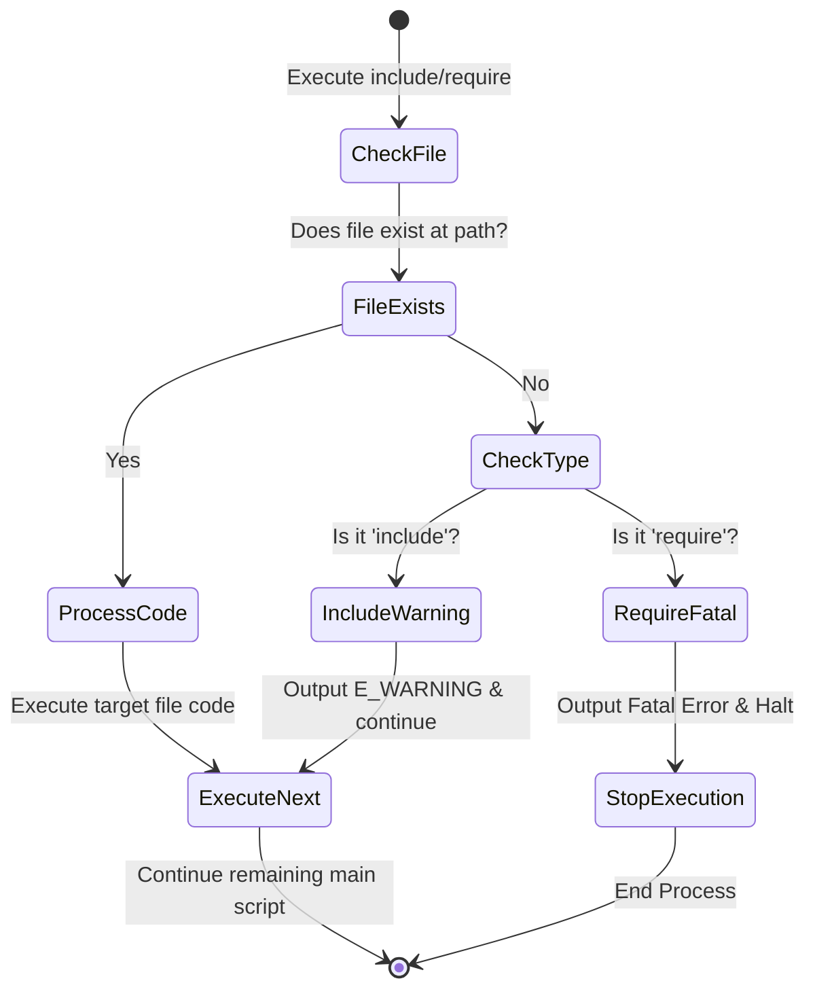

# PHP Include vs Require

PHP-তে বাহ্যিক ফাইলকে কারেন্ট স্ক্রিপ্টে যুক্ত করার জন্য `include` এবং `require` স্টেটমেন্ট ব্যবহার করা হয়, যা মূলত কোড পুনর্ব্যবহারযোগ্যতা (Code Reusability) নিশ্চিত করে।

---

# Table of Contents

* [Definition](#definition)
* [Why Important](#why-important)
* [Comparison](#comparison)
* [Internal Working](#internal-working)
* [Flow Diagram](#flow-diagram)
* [Code Examples](#code-examples)
* [Output](#output)
* [Real Project Example](#real-project-example)
* [Interview Answer (বাংলা)](#interview-answer-বাংলা)
* [Interview Answer (English)](#interview-answer-english)
* [Common Mistakes](#common-mistakes)
* [Follow-up Questions](#follow-up-questions)
* [Performance Notes](#performance-notes)
* [Best Practices](#best-practices)
* [Memory Tricks](#memory-tricks)
* [Summary](#summary)
* [Revision Checklist](#revision-checklist)
* [Difficulty](#difficulty)
* [Confidence](#confidence)
* [Interview Notes](#interview-notes)
* [References](#references)

---

# Definition

## Simple Definition

সহজ বাংলায়, `include` এবং `require` দিয়ে আমরা একটি PHP ফাইলের কোড অন্য আরেকটি PHP ফাইলে নিয়ে আসতে পারি। মূল পার্থক্য হলো, ফাইল খুঁজে না পেলে `include` একটি Warning (সতর্কবার্তা) দিয়ে বাকি কোড এক্সিকিউট করে, কিন্তু `require` একটি Fatal Error দিয়ে স্ক্রিপ্টের রানটাইম এক্সিকিউশন তাৎক্ষণিকভাবে বন্ধ করে দেয়।

## Official Definition

`include` এবং `require` হলো PHP-এর ল্যাঙ্গুয়েজ কনস্ট্রাক্ট (Language Constructs) যা নির্দিষ্ট ফাইলটিকে কারেন্ট স্ক্রিপ্টে রিড এবং ইভালুয়েট করে। `include` ফাইল না পাওয়া গেলে একটি `E_WARNING` ইস্যু করে এবং স্ক্রিপ্ট চালনা অব্যাহত রাখে। অন্যদিকে, `require` ফাইল না পাওয়া গেলে একটি `E_COMPILE_ERROR` (Fatal Error) রাইজ করে স্ক্রিপ্টের এক্সিকিউশন স্টপ করে দেয়।

## Interview Definition

In short, both `include` and `require` are used to import one PHP file into another. The key difference lies in their failure behavior: `include` throws a non-blocking `E_WARNING` allowing execution to continue, whereas `require` throws a blocking Fatal Error (`E_COMPILE_ERROR`) which halts script execution immediately.

---

# Why Important

* **Code Reusability:** একই কোড (যেমন: Database Connection, Header, Footer, Configuration) বারবার না লিখে একটি ফাইলে রেখে সর্বত্র ব্যবহার করা যায়।
* **Modular Architecture:** বড় প্রোজেক্টকে ছোট ছোট ম্যানেজেবল মডিউলে ভাগ করতে সাহায্য করে।
* **Problem Solving:** এটি মূলত ডুপ্লিকেট কোড দূর করে dry (Don't Repeat Yourself) প্রিন্সিপাল বজায় রাখতে সাহায্য করে।
* **When to use:** যখন কোনো ফাইলের অনুপস্থিতি অ্যাপ্লিকেশনের ক্র্যাশ ঘটায় না (যেমন: Footer বা Sidebar html), তখন `include` ব্যবহার করা হয়। আর যখন ফাইলের অনুপস্থিতি পুরো সিস্টেমকে অচল করে দেয় (যেমন: DB Config, Core Classes), তখন `require` ব্যবহার করা হয়।
* **Laravel Context:** মডার্ন লাভাভেল অ্যাপ্লিকেশনে সাধারণত সরাসরি `include` বা `require` ব্যবহার করতে হয় না, কারণ কম্পোজারের (Composer) PSR-4 Autoloading এবং Laravel-এর ব্লেড ডিরেক্টিভ (`@include`, `@extends`) ব্যাকএন্ডে এই কাজগুলো স্বয়ংক্রিয়ভাবে হ্যান্ডেল করে। তবে `public/index.php`-তে ফ্রেমওয়ার্ক বুটস্ট্র্যাপ করার জন্য `require` ব্যবহার করা হয়।

---

# Comparison

| Feature | `include` | `require` | `include_once` | `require_once` |
| --- | --- | --- | --- | --- |
| **Failure Behavior** | Emit `E_WARNING`, continues execution. | Emit `E_COMPILE_ERROR`, stops execution. | Emit `E_WARNING`, continues execution. | Emit `E_COMPILE_ERROR`, stops execution. |
| **Duplicate Includes** | Includes the file multiple times. | Includes the file multiple times. | Ignores subsequent includes if already included. | Ignores subsequent includes if already included. |
| **Performance** | Faster than `include_once`. | Faster than `require_once`. | Slower (Checks internal include history). | Slower (Checks internal include history). |
| **Usage Scenario** | Non-critical UI elements (Sidebar, Footer). | Critical System dependencies (Config, Classes). | Helper functions or configurations that shouldn't re-declare. | Class definitions, Core Framework Bootstrapping. |
| **Laravel Equivalent** | `@include('view')` | Used in `public/index.php` for vendor autoloading. | Rarely used directly. | Used for `autoload.php` loading. |

---

# Internal Working

1. **Syntax Parsing:** PHP ইঞ্জিন যখন `include` বা `require` স্টেটমেন্ট পায়, তখন এটি রানটাইমে ফাইল প্যাথটি রিজলভ করার চেষ্টা করে।
2. **File Searching:** যদি অ্যাবসোলিউট প্যাথ না দেওয়া থাকে, তবে PHP প্রথমে `php.ini`-তে কনফিগার করা `include_path`-এ ফাইলটি খোঁজে, তারপর কারেন্ট ওয়ার্কিং ডিরেক্টরিতে খোঁজে।
3. **Execution Stream:** ফাইলটি পাওয়া গেলে PHP ইঞ্জিন কারেন্ট এক্সিকিউশন কনটেক্সট সুইচ করে টার্গেট ফাইলের কোড রিড এবং এক্সিকিউট করে।
4. **Error Handling Logic:**
* যদি ফাইলটি **না পাওয়া যায়**:
* `include` হলে: PHP জেন্ড ইঞ্জিন (Zend Engine) একটি `E_WARNING` ইন্টারনাল টেবিলে রেজিস্টার করে এবং কারেন্ট ফাইলের পরবর্তী লাইনে জাম্প করে।
* `require` হলে: জেন্ড ইঞ্জিন একটি `E_COMPILE_ERROR` ট্রিগার করে, মেমরি ক্লিনআপ করে এবং এক্সিকিউশন থ্রেড কিল করে।


5. **Once Variant Optimization:** `_once` সাফিক্স থাকলে PHP একটি ইন্টারনাল হ্যাশ-টেবিল (`included_files`) চেক করে। যদি ফাইলটি ইতিমধ্যে মেমরিতে লোড করা থাকে, তবে এটি ফাইলটি পুনরায় রিড না করে সরাসরি `true` রিটার্ন করে।

---

# Flow Diagram



---

# Code Examples

## Basic Example

```php
<?php
// file_to_include.php
$greeting = "Hello from external file!";
?>

```

```php
<?php
// main.php
include 'file_to_include.php';
echo $greeting; 
?>

```

**Explanation:** এখানে `include` ব্যবহারের মাধ্যমে `file_to_include.php` ফাইলের ভেরিয়েবল `$greeting` সফলভাবে `main.php`-তে অ্যাক্সেস করা হয়েছে।

---

## Intermediate Example

```php
<?php
// missing_file_behavior.php

echo "Script Started...\n";

// Using include for a non-existing file
@include 'missing_sidebar.php'; 
echo "This will render even if include fails.\n";

// Using require for a non-existing file
require 'critical_config.php';

echo "This line will NEVER be executed.";
?>

```

**Explanation:** `missing_sidebar.php` না থাকলেও `include` এর কারণে স্ক্রিপ্ট পরের লাইনে যায়। কিন্তু `critical_config.php` না থাকায় `require` স্ক্রিপ্টটিকে সম্পূর্ণভাবে বন্ধ করে দেয়।

---

## Advanced Example

```php
<?php
// functions.php
function calculateTax($amount) {
    return $amount * 0.15;
}
?>

```

```php
<?php
// business_logic.php
require_once 'functions.php';
// require_once 'functions.php'; // পুনরায় কল করলেও কোনো এরর হবে না

echo "Tax Amount: " . calculateTax(1000);
?>

```

**Explanation:** যদি এখানে `require` ব্যবহার করা হতো এবং ভুলবশত ফাইলটি দুইবার কল হতো, তবে PHP "Fatal Error: Cannot redeclare calculateTax()" এরর দিত। `require_once` নিশ্চিত করে যে ফাইলটি কেবল একবারই লোড হবে।

---

## Laravel Example

লাভাভেলের কোর স্ট্রাকচারে `public/index.php` ফাইলে `require` এবং `require_once` এর ব্যবহার দেখা যায়:

```php
<?php

use Illuminate\Http\Request;

define('LARAVEL_START', microtime(true));

// 1. Register the Composer Autoloader (Critical - requires application to stop if missing)
require __DIR__.'/../vendor/autoload.php';

// 2. Bootstrapping the Laravel Application
$app = require_once __DIR__.'/../bootstrap/app.php';

// 3. Handle the incoming request
$handle = $app->make(Request::class);
// ... remaining laravel cycle

```

**Explanation:** লাভাভেল ফ্রেমওয়ার্ক চালু করার জন্য `vendor/autoload.php` এবং `bootstrap/app.php` ফাইল দুটি অপরিহার্য। ফাইলগুলো না থাকলে অ্যাপ্লিকেশন রান করা অসম্ভব, তাই এখানে `require` এবং `require_once` ব্যবহার করা হয়েছে।

---

# Output

### Basic Example Output:

```text
Hello from external file!

```

### Intermediate Example Output:

```text
Script Started...
PHP Warning:  include(missing_sidebar.php): Failed to open stream: No such file or directory in main.php on line 6
This will render even if include fails.
PHP Fatal error:  Uncaught Error: Failed opening required 'critical_config.php' in main.php:10

```

---

# Real Project Example

## Business Requirement

একটি Multi-tenant SaaS FinTech অ্যাপ্লিকেশনে ডায়নামিক গেটওয়ে কনফিগারেশন এবং ইউজার ইন্টারফেস থিমিং লোড করতে হবে।

## Problem

যদি থিম কনফিগারেশন ফাইল (যেমন: `sidebar_color.php`) কোনো কারণে মিসিং থাকে, তবে সম্পূর্ণ পেমেন্ট ড্যাশবোর্ড ক্র্যাশ করা যাবে না (Fallback থিম থাকবে)। কিন্তু যদি লেজার বুক বা পেমেন্ট ক্যালকুলেটর কোর ক্লাস মিসিং থাকে, তবে সিকিউরিটি ও ডাটা ইন্টিগ্রিটির স্বার্থে সিস্টেম তৎক্ষণাৎ বন্ধ করতে হবে।

## Solution

```php
<?php
// Base Controller for Tenant Dashboard

class TenantDashboard {
    public function __construct() {
        // Core Security & Config: Must exist, else HALT execution
        require __DIR__ . '/../config/security_rules.php';
        require_once __DIR__ . '/../src/PaymentGateways/LedgerCalculator.php';
    }

    public function renderDashboard() {
        $this->loadHeader();
        
        // Non-critical: Tenant custom sidebar layout
        // If file is missing, PHP emits warning but dashboard still loads with default layout
        include __DIR__ . '/../themes/tenant_custom_sidebar.php';
        
        $this->loadFooter();
    }
    
    private function loadHeader() { echo "Header Rendered\n"; }
    private function loadFooter() { echo "Footer Rendered\n"; }
}

```

## কেন এই Feature ব্যবহার করা হয়েছে

এখানে কোর মেকানিজমের জন্য `require` ব্যবহার করা হয়েছে যাতে কোনো সিকিউরিটি ফাইল মিসিং থাকলে হ্যাকাররা আংশিক স্ক্রিপ্ট এক্সিকিউশনের সুযোগ না পায়। আর কাস্টম থিমের জন্য `include` ব্যবহার করা হয়েছে যাতে ক্লায়েন্ট সাইড ভেঙে না পড়ে।

## Production Experience

FinTech অ্যাপ্লিকেশনে সচরাচর ওপেন-সোর্স ফাইলের ক্ষেত্রে `require_once` এর পরিবর্তে কম্পোজার অটোলোড ব্যবহার করা বেস্ট প্র্যাকটিস। সরাসরি `include` বড় স্কেলের প্রোজেক্টে ট্র্যাকিং করা কঠিন করে তোলে, তাই মডার্ন আর্কিটেকচারে এটি শুধু মাত্র ভিউ (HTML snippet) রেন্ডার করার জন্য সীমিত রাখা উচিত।

---

# Interview Answer (বাংলা)

> "PHP-তে `include` এবং `require` উভয়ই কারেন্ট ফাইলে অন্য কোনো ফাইলের কোড ইমপোর্ট করার জন্য ব্যবহৃত হয়। মূল পার্থক্য হচ্ছে তাদের এরর হ্যান্ডলিং বিহেভিয়ারে। `include` দিয়ে কোনো ফাইল লোড করার সময় যদি ফাইলটি না পাওয়া যায়, তবে PHP একটি নন-ব্লকিং `E_WARNING` দেয়, যার ফলে স্ক্রিপ্টের এক্সিকিউশন বন্ধ হয় না এবং পরবর্তী কোড রান করে। অন্যদিকে, `require` ব্যবহারের সময় ফাইল মিসিং থাকলে PHP একটি ব্লকিং `E_COMPILE_ERROR` বা Fatal Error দেয়, যা স্ক্রিপ্টের এক্সিকিউশন সাথে সাথে থামিয়ে দেয়। তাছাড়া ক্লাস ডেফিনিশন বা ফাংশন ফাইলের ক্ষেত্রে ডুপ্লিকেট লোডিং এড়াতে আমরা `include_once` বা `require_once` ব্যবহার করি যা ফাইলটি ইতিমধ্যে লোড হয়েছে কিনা তা ট্র্যাক রাখে।"

---

# Interview Answer (English)

> "In PHP, both `include` and `require` are language constructs used to merge the target file's content into the current script. The fundamental divergence resides in how they handle failure or missing files. `include` produces a non-fatal `E_WARNING`. If the file path is incorrect, the engine logs the warning and proceeds to execute the subsequent lines of code. This makes it ideal for non-critical assets like partial views or optional layouts. Conversely, `require` triggers an `E_COMPILE_ERROR` (Fatal Error) when a file is absent, immediately halting the script runtime execution. It is mandatory for structural components such as configuration payloads, environment settings, and bootstrap orchestrations. Furthermore, their variants `include_once` and `require_once` append an internal structural lookup against the compiled file hash table to prevent redundant operations and fatal redeclaration conflicts."

---

# Common Mistakes

| Mistake | কেন ভুল | সঠিক পদ্ধতি |
| --- | --- | --- |
| `include` দিয়ে ডাটাবেজ কনফিগারেশন ফাইল লোড করা। | ফাইল মিসিং হলে স্ক্রিপ্ট রান হতে থাকবে এবং ডাটাবেজ কানেকশন এরর হ্যান্ডেল না হয়ে ক্যায়াওস তৈরি করবে। | ডাটাবেজ কনফিগারেশনের জন্য সবসময় `require` ব্যবহার করা উচিত। |
| লুপের মধ্যে `include_once` বা `require_once` ব্যবহার করা। | `_once` মেকানিজম কেবল প্রথম ইটারেশনে ফাইলটি লোড করবে, বাকি ইটারেশনগুলোতে এটি স্কিপ হয়ে যাবে। | লুপের ভেতর ডায়নামিক ডেটার জন্য প্লেইন `include` বা `require` ব্যবহার করা উচিত। |
| রিলেটিভ প্যাথ ব্যবহার করা (`include 'file.php';`) | এটি কারেন্ট ওয়ার্কিং ডিরেক্টরির ওপর নির্ভর করে, যা CLI বা ক্রন জব থেকে রান করলে প্যাথ এরর দিতে পারে। | সবসময় ম্যাজিক কনস্ট্যান্ট `__DIR__` ব্যবহার করে অ্যাবসোলিউট প্যাথ দেওয়া উচিত: `require __DIR__ . '/file.php';` |
| `include()`-কে ফাংশন মনে করে ব্র্যাকেট জোর করে দেওয়া। | এটি কোনো ফাংশন নয়, এটি একটি Language Construct। অতিরিক্ত ব্র্যাকেট রিডাবিলিটি নষ্ট করে। | ব্র্যাকেট ছাড়া স্টেটমেন্ট আকারে লিখুন: `include 'filename.php';` |
| অটোলোডার থাকতেও ক্লাসের জন্য `require_once` ব্যবহার করা। | মডার্ন অ্যাপ্লিকেশনে শত শত ফাইলের জন্য ম্যানুয়াল `require_once` কোডবেস নষ্ট করে এবং পারফরম্যান্স ড্রপ করে। | Composer-এর PSR-4 Autoloading স্ট্যান্ডার্ড ব্যবহার করা উচিত। |

---

# Follow-up Questions

* What happens if a file returns a value in an `include` statement?
* Explain the precise performance penalty of using `require_once` over `require`.
* How does `set_include_path()` affect the file lookup mechanism in PHP?
* Why does Laravel use `require` instead of `require_once` inside its `public/index.php` autoloader load?
* Can you catch an error thrown by a missing `require` statement using a try-catch block in PHP 7+?
* What is the default value returned by an `include` if the file does not have a explicit return statement?
* How does opcode caching (like OPcache) optimize `require_once` statements?
* What is the security risk of passing a dynamic variable into `include` (Local File Inclusion)?
* Difference between `E_WARNING` and `E_COMPILE_ERROR` at the engine level.
* Why should we avoid mixing HTML output directly inside files evaluated via `require`?

---

# Performance Notes

* **Memory Usage:** `require_once` এবং `include_once` সিস্টেমে মেমরির ওভারহেড সামান্য বাড়ায় কারণ PHP-কে ইন্টারনাল হ্যাশ টেবিলে (`included_files`) ট্র্যাক রাখতে হয় কোন কোন ফাইল অলরেডি মেমরিতে রাইট হয়েছে।
* **Time Complexity:** - `include`/`require`: $O(1)$ directly hits the file system location if absolute.
* `_once` variants: $O(1)$ hash map lookup + File I/O for the first fetch.


* **Optimization Tips:** প্রোডাকশনে OPcache এনাবলড থাকলে `include_once` এবং `require_once` এর পারফরম্যান্স অবক্ষয় উল্লেখযোগ্যভাবে কমে যায় কারণ কম্পাইল্ড কোড মেমরিতেই অপ্টিমাইজড অবস্থায় সংরক্ষিত থাকে। সবসময় পরম পাথ বা অ্যাবসোলিউট পাথ (`__DIR__`) ব্যবহার করলে PHP-এর `include_path` ট্রাভার্সাল সার্চ টাইম বেঁচে যায়।

---

# Best Practices

* **Use Absolute Paths:** প্যাথ রেজোলিউশন ফাস্ট করার জন্য এবং সিকিউরিটি সুনিশ্চিত করতে `require __DIR__ . '/../path/file.php';` সিনট্যাক্স মেনে চলুন।
* **Fail Fast Principle:** অ্যাপ্লিকেশনের কোর বা ক্রিটিক্যাল ফাইল ইমপোর্টের ক্ষেত্রে অবশ্যই `require` ব্যবহার করুন যাতে ট্রাবলশুটিং দ্রুত করা যায়।
* **Template Separation:** ভিউ পার্ট বা থিম রেন্ডারিং এর জন্য `include` ব্যবহার করুন যাতে কোনো ফাইল মিসিং হলেও ইউজার ব্ল্যাংক স্ক্রিন না দেখে অন্তত ফ্যালব্যাক নোটিশ দেখতে পায়।
* **Leverage Autoloading:** বিজনেস লজিক, ক্লাস এবং হেল্পার মেথড ইমপোর্ট করার জন্য ম্যানুয়াল `require` পরিহার করে Composer Autoloader ব্যবহার করুন।

---

# Memory Tricks

* **R**equire = **R**equired (বাধ্যতামূলক, না থাকলে সিস্টেম ক্র্যাশ করবে/মারা যাবে)।
* **I**nclude = **I**gnorable (ঐচ্ছিক/সতর্কবার্তা দিবে কিন্তু কাজ থামাবে না)।
* **Once** = **O**nly One Time (ডুপ্লিকেশন লক মেকানিজম)।

---

# Summary

* `include` এবং `require` বাহ্যিক ফাইলের কোড কারেন্ট স্ক্রিপ্টে ইনজেক্ট করে।
* `include` ব্যর্থ হলে **Warning** দেয়, এক্সিকিউশন সচল থাকে।
* `require` ব্যর্থ হলে **Fatal Error** দেয়, এক্সিকিউশন স্টপ হয়।
* `_once` যুক্ত স্টেটমেন্টগুলো নিশ্চিত করে যে ফাইলটি কেবল একবারই স্ক্রিপ্টে অন্তর্ভুক্ত হবে।
* রিলেটিভ প্যাথের চেয়ে অ্যাবসোলিউট প্যাথ (`__DIR__`) পারফরম্যান্স ও সিকিউরিটির জন্য শ্রেয়।
* লাভাভেলে এই কনস্ট্রাক্টগুলো মূলত বুটস্ট্র্যাপ পর্যায় ছাড়া সরাসরি ভিউ লেভেলে ব্যবহৃত হয় না।
* লুপের ভেতর `_once` ভ্যারিয়েন্টগুলো প্রত্যাশিত ফল নাও দিতে পারে।
* রানটাইম এরর ও বাগ ট্র্যাকিং সহজ করতে 'Fail Fast' ধারণায় `require` বেশি উপযোগী।
* ফাইল না থাকলে `require` PHP 7+ এ `CompileError` এক্সেপশন থ্রো করে যা ট্রাই-ক্যাচ দিয়ে ধরা সম্ভব।
* কোডবেস ক্লিন ও স্ট্যান্ডার্ডাইজড রাখতে মডার্ন পিএইচপিতে কম্পোজার অটোলোডিংই প্রথম পছন্দ।

---

# Revision Checklist

| Item | Status |
| --- | --- |
| Topic Understood | ☐ |
| Basic Example Practice | ☐ |
| Advanced Example Practice | ☐ |
| Laravel Example Practice | ☐ |
| Interview Ready | ☐ |
| Need More Practice | ☐ |

---

# Difficulty

⭐⭐☆☆☆ (Beginner to Intermediate Concept)

---

# Confidence

⭐⭐⭐⭐⭐ (High yield interview topic)

---

# Interview Notes

* **Most Asked Point:** "হোয়াট ইজ দ্য মেইন ডিফারেন্স বিটুইন ইনক্লুড অ্যান্ড রিকোয়ার?" - চোখ বন্ধ করে এরর বিহেভিয়ার (Warning vs Fatal Error) বলতে হবে।
* **Senior Level Discussion:** ইন্টারভিউয়ার জানতে চাইতে পারে কিভাবে `require_once` মেমরিতে ও ওপকোড ক্যাশে ফাইল ট্র্যাক করে এবং কেন লার্জ স্কেলে কম্পোজার পিএসআর-৪ প্রেফার করা হয়।
* **Laravel Interview Tips:** লাভাভেলের ইন্টারভিউতে জিজ্ঞেস করলে উত্তর হবে ব্লেড ইঞ্জিনের `@include` কিন্তু কোর পিএইচপির `include` নয়, ওটি ব্লেডের নিজস্ব কম্পাইলার মেকানিজম দিয়ে কম্পাইল্ড ভিউ রিটার্ন করে।

---

# References

* [PHP Official Documentation: include](https://www.google.com/search?q=https://www.php.net/manual/en/function.include.php)
* [PHP Official Documentation: require](https://www.google.com/search?q=https://www.php.net/manual/en/function.require.php)