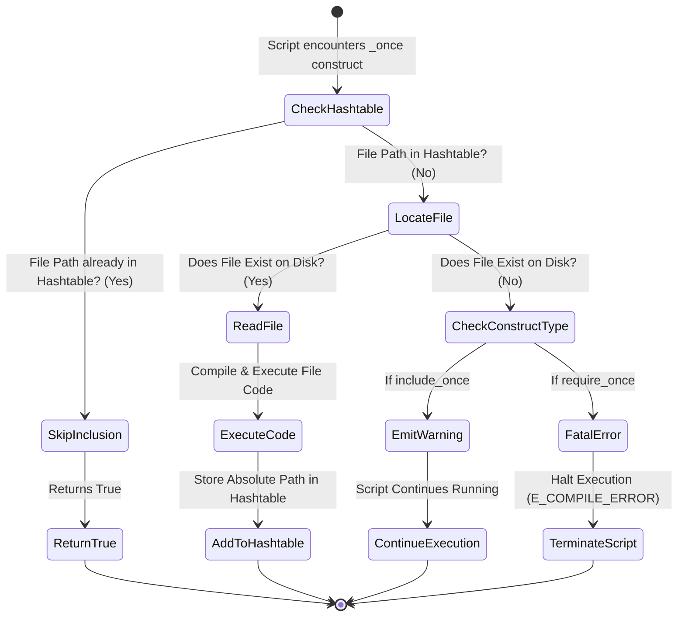

# `include_once` vs `require_once`

PHP অ্যাপ্লিকেশনে এক্সটার্নাল ফাইল বা স্ক্রিপ্ট যুক্ত করার জন্য `include_once` এবং `require_once` ব্যবহার করা হয়। এদের মূল পার্থক্য ফাইল না পাওয়া গেলে অ্যাপ্লিকেশনের আচরণ বা Error Handling-এর মধ্যে নিহিত।

---

# Table of Contents

* [Definition](#definition)
* [Why Important](#why-important)
* [Comparison](#comparison)
* [Internal Working](#internal-working)
* [Flow Diagram](#flow-diagram)
* [Code Examples](#code-examples)
* [Output](#output)
* [Real Project Example](#real-project-example)
* [Interview Answer (বাংলা)](#interview-answer-বাংলা)
* [Interview Answer (English)](#interview-answer-english)
* [Common Mistakes](#common-mistakes)
* [Follow-up Questions](#follow-up-questions)
* [Performance Notes](#performance-notes)
* [Best Practices](#best-practices)
* [Memory Tricks](#memory-tricks)
* [Summary](#summary)
* [Revision Checklist](#revision-checklist)
* [Difficulty](#difficulty)
* [Confidence](#confidence)
* [Interview Notes](#interview-notes)
* [References](#references)

---

# Definition

## Simple Definition

সহজ বাংলায়, `include_once` এবং `require_once` দুটিই একটি PHP ফাইলের ভেতর অন্য আরেকটি PHP ফাইলকে যুক্ত করতে ব্যবহার করা হয়। উভয় ক্ষেত্রেই PHP চেক করে ফাইলটি আগে লোড হয়েছে কিনা; যদি হয়ে থাকে তবে দ্বিতীয়বার লোড করে না (Duplicate Error রোধ করে)। মূল পার্থক্য হলো: `include_once` ফাইলটি খুঁজে না পেলে একটি Warning দিয়ে বাকি কোড এক্সিকিউট করে, কিন্তু `require_once` ফাইল না পেলে Fatal Error দিয়ে স্ক্রিপ্ট ওখানেই বন্ধ করে দেয়।

## Official Definition

`include_once` and `require_once` are language constructs in PHP used to include and evaluate a specified file during the execution of a script. This behavior is identical to `include` and `require` respectively, with the sole exception that if the code from the file has already been included, it will not be included again, preventing function redefinitions and variable reassignments.

## Interview Definition

In short, both constructs ensure a file is included exactly once per script execution to avoid fatal redefinition errors. The definitive difference lies in failure handling: `include_once` emits an `E_WARNING` and allows script continuation, whereas `require_once` throws an `E_COMPILE_ERROR` (Fatal Error) and immediately terminates execution if the file is missing.

---

# Why Important

* **Prevent Redefinition Errors:** একই ফাংশন, ক্লাস বা কনস্ট্যান্ট ডুপ্লিকেট লোড হলে PHP Fatal Error (`Cannot redeclare function...`) দেয়। `_once` সাফিক্সটি নিশ্চিত করে যে একটি ফাইল পুরো রিকোয়েস্ট লাইফসাইকেলে মাত্র একবারই ইভ্যালুয়েট হবে।
* **Execution Flow Control:** অ্যাপ্লিকেশনের ক্রিটিক্যাল ফাইল (যেমন: ডাটাবেজ কানেকশন, সিকিউরিটি হেডার) মিসিং থাকলে স্ক্রিপ্ট চালানো উচিত নয়। সেখানে `require_once` ব্যবহার করে ফেইল-ফাস্ট (Fail-fast) মেকানিজম নিশ্চিত করা হয়।
* **Laravel Context:** মডার্ন লারাভেল অ্যাপ্লিকেশনে ডেভেলপারদের সরাসরি `include_once` বা `require_once` খুব একটা লিখতে হয় না, কারণ Composer-এর `PSR-4` অটোলোডার ব্যাকহ্যান্ডে `require_once` ব্যবহার করে সব ক্লাস ও ফাইল বুটস্ট্র্যাপ করে। লারাভেলের `public/index.php` ফাইলে `autoload.php` এবং `app.php` লোড করতে `require` বা `require_once` ব্যবহৃত হয়।
* **Real Life Scenario:** একটি ই-কমার্স সাইটে পেমেন্ট গেটওয়ের কনফিগারেশন ফাইল যদি মিসিং থাকে, তবে পেমেন্ট প্রসেস রান করা বিপজ্জনক। এক্ষেত্রে `require_once` ব্যবহার করা আবশ্যিক। অন্যদিকে কোনো অপশনাল উইজেট বা সাইডবার টেমপ্লেট না থাকলে পুরো সাইট ডাউন না করে `include_once` দিয়ে একটি ওয়ার্নিং হ্যান্ডেল করাই শ্রেয়।

---

# Comparison

| Feature | `include_once` | `require_once` |
| --- | --- | --- |
| **Failure Severity** | `E_WARNING` (Non-fatal) | `E_COMPILE_ERROR` (Fatal Error) |
| **Script Termination** | স্ক্রিপ্ট এক্সিকিউশন সচল থাকে। | স্ক্রিপ্ট এক্সিকিউশন সাথে সাথে বন্ধ হয়ে যায়। |
| **Performance Impact** | ফাইল ট্র্যাক করার জন্য সামান্য ওভারহেড আছে। | `include_once`-এর মতোই ট্র্যাক ওভারহেড আছে। |
| **Usage Scenario** | অপশনাল ভিউ, লেআউট এলিমেন্ট বা থিম ফাইলের জন্য। | কনফিগারেশন, কোর ক্লাস, ফাংশন লাইব্রেরি বা সিকিউরিটি ফাইল। |
| **Laravel Usage** | ব্লেড ডাইরেক্টিভ ভিউ রেন্ডারিংয়ে ইন্টারনালি ব্যবহৃত হয়। | `public/index.php`, `config` ম্যাপিং এবং `Composer Autoloader`-এ ব্যবহৃত হয়। |
| **Interview Point** | ফাইল না থাকলে কোড কেন থামা উচিত নয়, তা জাস্টিফাই করতে হয়। | ডিফেন্সিভ প্রোগ্রামিং এবং অ্যাপ সিকিউরিটির জন্য কেন এটি বেস্ট চয়েস তা বলতে হয়। |

---

# Internal Working

1. **Tokenization & Compilation Phase:** PHP যখন স্ক্রিপ্ট রান করে, তখন এই ল্যাঙ্গুয়েজ কনস্ট্রাক্টগুলো এনকাউন্টার করলে ইঞ্জিন ফাইল পাথটি রিজলভ করে।
2. **Inclusion History Check:** PHP ইন্টারনালি একটি হ্যাশটেবিল (Hashtable) মেইনটেইন করে যেখানে কারেন্ট রিকোয়েস্টে ইতিমধ্যে ইনক্লুড হওয়া সমস্ত ফাইলের অ্যাবসলিউট পাথ (`realpath`) সংরক্ষিত থাকে।
3. **Lookup:** নতুন করে `_once` কল হলে PHP প্রথমে ওই টেবিলে পাথটি চেক করে। যদি পাথটি এক্সিস্ট করে, তবে ইনক্লুশন স্কিপ করা হয় এবং `true` রিটার্ন হয়।
4. **File I/O and Execution:** যদি ফাইলটি আগে লোড না হয়ে থাকে, তবে PHP ফাইলটি রিড করে। ফাইলটি না পাওয়া গেলে:
* `include_once`-এর ক্ষেত্রে ইঞ্জিন একটি `E_WARNING` রেইজ করে এবং এক্সিকিউশন পরবর্তী লাইনে নিয়ে যায়।
* `require_once`-এর ক্ষেত্রে ইঞ্জিন `E_COMPILE_ERROR` জেনারেট করে কম্পাইলেশন বা এক্সিকিউশন হল্ট করে দেয়।


---

# Flow Diagram



---

# Code Examples

## Basic Example

```php
<?php
// basic_config.php
$site_name = "TechZone";

// main.php
include_once 'basic_config.php';
include_once 'basic_config.php'; // দ্বিতীয়বার লোড হবে না, কোনো এরর হবে না।

echo "Welcome to " . $site_name;

```

### Explanation

এখানে `basic_config.php` ফাইলটি পর পর দুবার ইনক্লুড করা হলেও `include_once` ব্যবহারের কারণে PHP দ্বিতীয়বার এটিকে ইগনোর করেছে। ফলে ভ্যারিয়েবল ওভাররাইট বা কোনো নোটিশ জেনারেট হয়নি।

---

## Intermediate Example

```php
<?php
// functions.php
function calculateTax($amount) {
    return $amount * 0.15;
}

// process.php
// ভুল করে যদি 'require' ব্যবহার করা হতো তবে Fatal Error আসত redeclaration-এর জন্য
require_once 'functions.php';
require_once 'functions.php'; 

echo "Tax: " . calculateTax(1000);

```

### Explanation

মেথড বা ফাংশন ডিক্লেয়ারেশন সংবলিত ফাইলে `require_once` ব্যবহার করা লাইফ-সেভার। এটি নিশ্চিত করে যে `calculateTax` ফাংশনটি দ্বিতীয়বার ডিক্লেয়ার হয়ে ইঞ্জিন ক্র্যাশ করবে না।

---

## Advanced Example

```php
<?php
// Kernel/Bootstrap.php
declare(strict_types=1);

namespace App\Kernel;

class Bootstrap {
    public static function loadDependency(string $filePath): bool {
        // dynamic absolute path resolution for security and speed
        $resolvedPath = realpath(__DIR__ . '/../' . $filePath);
        
        if (!$resolvedPath) {
            // Non-blocking log logic if we were using include, but here we enforce stability
            @include_once 'optional_logger.php'; // Failure won't crash the system
            return false;
        }

        // Critical Core Components must use require_once
        return (bool) require_once $resolvedPath;
    }
}

```

### Explanation

এই অ্যাডভান্সড আর্কিটেকচারে ডাইনামিকালি ফাইল রিজলভ করা হচ্ছে। একটি অপশনাল লগিং হেল্পার লোড করার জন্য `include_once` এর আগে এরর সাপ্রেসর (`@`) ব্যবহার করা হয়েছে যাতে ফাইল না থাকলেও কোর বুটস্ট্র্যাপ সচল থাকে। তবে কোর ফাইলের জন্য `require_once` ব্যবহার করা হয়েছে যাতে কোনো ক্রিটিক্যাল ডিপেন্ডেন্সি মিসিং থাকলে অ্যাপ্লিকেশন ফেইল-ফাস্ট করে।

---

## Laravel Example

```php
<?php
// public/index.php (Simplified Core Architecture)

define('LARAVEL_START', microtime(true));

// 1. Register the Composer Autoloader
// Composer internally utilizes require/require_once to load PSR-4 classes.
require __DIR__.'/../vendor/autoload.php';

// 2. Run the Application
$app = require_once __DIR__.'/../bootstrap/app.php';

$kernel = $app->make(Illuminate\Contracts\Http\Kernel::class);

$response = $kernel->handle(
    $request = Illuminate\Http\Request::capture()
)->send();

$kernel->terminate($request, $response);

```

### Explanation

লারাভেলের এন্ট্রি পয়েন্ট `public/index.php`-এ `bootstrap/app.php` ফাইলটিকে `require_once` এর মাধ্যমে রিকোয়েস্ট করা হয়। কারণ এই ফাইলটি লারাভেল অ্যাপ্লিকেশনের অবজেক্ট (Container) রিটার্ন করে। এটি একাধিকবার লোড হলে সম্পূর্ণ অ্যাপ্লিকেশন স্টেট নষ্ট হয়ে যাবে, তাই এখানে `_once` সিকিউরিটি অত্যন্ত গুরুত্বপূর্ণ।

---

# Output

### `include_once` এর ক্ষেত্রে যদি ফাইল না থাকে:

```text
Warning: include_once(missing_file.php): Failed to open stream: No such file or directory in /var/www/html/index.php on line 5

Warning: include_once(): Failed opening 'missing_file.php' for inclusion in /var/www/html/index.php on line 5
Welcome to TechZone (Execution Continued)

```

### `require_once` এর ক্ষেত্রে যদি ফাইল না থাকে:

```text
Fatal error: require_once(): Failed opening required 'critical_file.php' (include_path='.:/usr/local/lib/php') in /var/www/html/index.php on line 5
  
  -- Execution Terminated Completely --

```

---

# Real Project Example

## Business Requirement

একটি FinTech Core Banking API ডেভেলপ করতে হবে যেখানে প্রতিটি ট্রানজেকশনের পূর্বে একটি `Encryption Library` এবং একটি `Optional Analytics Tracker` লোড করতে হবে।

## Problem

যদি কোনো কারণে ওএস লেভেলে পারমিশন ইস্যু বা ডেপ্লয়মেন্ট মিসটেকের কারণে `Encryption Library` ফাইলটি লোড না হয় এবং কোড সচল থাকে, তবে ট্রানজেকশন প্লেইন টেক্সটে প্রসেস হয়ে যাবে, যা একটি মারাত্মক সিকিউরিটি ভায়োলেশন। অন্যদিকে, `Analytics Tracker` যদি মিসিং হয় তবে বিজনেস লজিক বন্ধ হওয়া উচিত নয়।

## Solution

```php
<?php
namespace App\Services\Payment;

class TransactionEngine {
    public function executeTransaction($payload) {
        // Core Security Requirement: Must fail if missing
        try {
            require_once __DIR__ . '/../../Secure/EncryptionSDK.php';
        } catch (\Throwable $e) {
            throw new \RuntimeException("Critical Security Component Missing. Transaction Aborted.");
        }

        // Business Requirement: Non-blocking analytics
        // Using include_once avoids transaction rejection if analytics code is deploying/missing
        include_once __DIR__ . '/../../Helpers/OptionalAnalytics.php';

        // Core logic
        return \EncryptionSDK::encrypt($payload);
    }
}

```

## কেন এই Feature ব্যবহার করা হয়েছে

এখানে `EncryptionSDK.php`-এর জন্য `require_once` ব্যবহার করা হয়েছে কারণ এটি অ্যাপ্লিকেশনের লাইফলাইন। এটি ছাড়া প্রসেস রান করা মানেই ফিন্যান্সিয়াল রিস্ক। অপরদিকে `OptionalAnalytics.php`-এর জন্য `include_once` ব্যবহার করা হয়েছে যাতে অ্যানালিটিক্স সার্ভার বা ফাইল ডাউন থাকলেও মূল ব্যাংকিং লেনদেন ব্যাহত না হয়।

## Production Experience

SaaS এবং FinTech অ্যাপ্লিকেশনে স্ট্রিক্ট ফাইল ইনক্লুশন পলিসি মেইনটেইন করা হয়। কোনো স্ক্রিপ্ট ম্যানুয়ালি ইনক্লুড করার চেয়ে Composer Autoloader বা Laravel Service Provider ব্যবহার করা স্ট্যান্ডার্ড। তবে লিগ্যাসি কোড ইন্টিগ্রেশনের সময় ফাইল পাথের ক্ষেত্রে সর্বদা `__DIR__` (Magic Constant) ব্যবহার করে অ্যাবসলিউট পাথ নিশ্চিত করতে হয়, নতুবা রিলেটিভ পাথের কারণে Production এ `include_path` ট্র্যাকিং এরর হতে পারে।

---

# Interview Answer (বাংলা)

> "`include_once` এবং `require_once` এর মূল কাজ হলো কারেন্ট স্ক্রিপ্টে কোনো এক্সটার্নাল ফাইল যুক্ত করা এবং নিশ্চিত করা যে ফাইলটি যেন কেবল একবারই লোড হয়। ইন্টারনালি PHP একটি হ্যাশটেবিল দিয়ে ফাইলের পাথ ট্র্যাক করে ডুপ্লিকেট ইনক্লুশন এবং 'Function Redeclaration Error' রোধ করে। এদের প্রধান পার্থক্য হচ্ছে Error Handling-এ। `include_once` ফাইল খুঁজে না পেলে একটি `E_WARNING` জেনারেট করে এবং স্ক্রিপ্টের এক্সিকিউশন চালিয়ে যায়। এটি অপশনাল টেমপ্লেট বা নন-ক্রিটিক্যাল ফাইলের ক্ষেত্রে ব্যবহৃত হয়। অপরদিকে, `require_once` ফাইল না পেলে সরাসরি একটি Fatal Error (`E_COMPILE_ERROR`) থ্রো করে স্ক্রিপ্ট এক্সিকিউশন ওখানেই স্টপ করে দেয়। ডাটাবেজ কানেকশন, সিকিউরিটি প্যারামিটার বা কোর কনফিগারেশন ফাইলের জন্য `require_once` ব্যবহার করা বাধ্যতামূলক। রিয়েল প্রোজেক্টে বা লারাভেলে আমরা সাধারণত সরাসরি এগুলো লিখি না, বরং Composer-এর PSR-4 অটোলোডিং মেকানিজম ব্যাকহ্যান্ডে `require_once` ব্যবহার করে ক্লাসগুলো লোড করে।"

---

# Interview Answer (English)

> "Both `include_once` and `require_once` are PHP language constructs used to import external files into the current script execution context. Their primary built-in mechanism is to track included paths within an internal lookup table, ensuring that the same file isn't evaluated multiple times, which effectively prevents function or class redefinition errors.
> The foundational difference lies in how they react to inclusion failures. `include_once` triggers a non-blocking `E_WARNING` if the target file is missing, allowing the runtime execution flow to proceed uninterrupted. This is typically used for non-critical assets like layout partials or optional plugins. Conversely, `require_once` is a fail-fast construct; if the file is absent, it throws a fatal `E_COMPILE_ERROR` and instantly terminates execution. This is critical for foundational configurations, encryption services, or bootstrapping elements where a missing dependency could lead to corrupted application states or security exploits. In modern enterprise applications or Laravel frameworks, explicit usage is sparse as these mechanisms are implicitly handled by Composer's PSR-4 compliant autoloader."

---

# Common Mistakes

| Mistake | কেন ভুল | সঠিক পদ্ধতি |
| --- | --- | --- |
| **১. রিলেটিভ পাথ ব্যবহার করা** (`include_once 'file.php';`) | PHP-কে ওএস ডিরেক্টরি স্ট্রাকচারে ফাইলটি বারবার খুঁজতে হয় এবং `include_path` কনফিগারেশনের ওপর নির্ভর করতে হয়, যা স্লো এবং এরর-প্রোন। | সর্বদা অ্যাবসলিউট পাথ ব্যবহার করুন: `require_once __DIR__ . '/file.php';` |
| **২. লুপের ভেতর `_once` ব্যবহার করা** | লুপের প্রথম ইটারেশনে ফাইল লোড হবে, পরের ইটারেশনগুলোতে ফাইল আর লোড হবে না, যা ডেটা বা ভিউ লুপ করার ক্ষেত্রে বাগ তৈরি করবে। | লুপে ডাইনামিক ডেটা ইনক্লুড করতে শুধু `include` বা `require` ব্যবহার করুন। |
| **৩. প্যারেন্থেসিস বা ব্র্যাকেট ব্যবহার করা** (`include_once("file.php");`) | এগুলো ফাংশন নয়, ল্যাঙ্গুয়েজ কনস্ট্রাক্ট। ব্র্যাকেট দিলে অতিরিক্ত পার্সিং ওভারহেড তৈরি হয় এবং কোড স্ট্যান্ডার্ড (PSR) লঙ্ঘন হয়। | স্পেস দিয়ে লিখুন: `include_once __DIR__ . '/file.php';` |
| **৪. কোর কনফিগারেশনে `include_once` ব্যবহার করা** | ডাটাবেজ বা গ্লোবাল কনফিগ ফাইল মিসিং হলেও স্ক্রিপ্ট রান করার চেষ্টা করবে, ফলে শত শত অবজেক্ট এরর স্ক্রিনে আসবে। | কোর ফাইলের ক্ষেত্রে সর্বদা ফেইল-ফাস্ট নিশ্চিত করতে `require_once` ব্যবহার করুন। |
| **৫. ক্লাস লোড করার জন্য ম্যানুয়াল `require_once` লেখা** | হাজার হাজার ক্লাস ম্যানুয়ালি ইনক্লুড করলে কোড মেইনটেইনেবিলিটি নষ্ট হয় এবং মেমোরি কন্টেনশন বাড়ে। | `Composer Autoloader` এবং `PSR-4` স্ট্যান্ডার্ড অনুসরণ করুন। |

---

# Follow-up Questions

* What is the difference between `include` and `include_once`?
* How does PHP internally keep track of files included with the `_once` suffix?
* What happens if two files have different relative paths but resolve to the same absolute path when using `require_once`?
* Why is it considered a bad practice to use `include_once` or `require_once` inside a loop?
* How does `OPcache` affect the performance of `require_once`?
* Can you catch an error thrown by `require_once` using a standard `try-catch` block in PHP 7/8? (Hint: `Throwable`)
* What error code/level is triggered by `include_once` when a file is missing?
* How does Composer utilize `require` / `require_once` for autoloading files under the hood?
* Is there any memory performance difference between `require` and `require_once`?
* How does using `set_include_path()` affect file resolution in `include_once`?

---

# Performance Notes

* **Memory Usage:** `include_once` এবং `require_once` এক্সিকিউট হওয়ার পর PHP রিকোয়েস্ট মেমোরিতে ফাইলের অ্যাবসলিউট পাথ ট্র্যাক করে। অনেক বেশি ফাইল এভাবে ম্যানুয়ালি ট্র্যাক করলে ইন্টারনাল হ্যাশটেবিল বড় হয়, যা মেমোরি কনজাম্পশন সামান্য বাড়িয়ে দেয়।
* **Time Complexity:** ফাইলের সংখ্যা $N$ হলে, রিলেটিভ পাথের ক্ষেত্রে ডিস্ক আইও (Disk I/O) সার্চ টাইম $O(N)$ হতে পারে। তবে অ্যাবসলিউট পাথ ব্যবহার করলে হ্যাশটেবিল লুকআপ $O(1)$ টাইমে সম্পন্ন হয়।
* **Optimization Tip:** প্রোডাকশন এনভায়রনমেন্টে `OPcache` এনাবল রাখা অত্যন্ত জরুরি। OPcache ফাইলের প্রি-কম্পাইলড বাইটকোড শেয়ার্ড মেমোরিতে রেখে দেয়, ফলে `require_once` বারবার ডিস্ক রিড না করে মেমোরি থেকে ইনস্ট্যান্টলি ফাইল এক্সিকিউট করে।

---

# Best Practices

* **Rule of Thumb:** ফাইলটি ছাড়া অ্যাপ্লিকেশন অচল হলে `require_once` ব্যবহার করুন। ফাইলটি ছাড়া অ্যাপ্লিকেশন চালানো সম্ভব হলে `include_once` ব্যবহার করুন।
* **Always Absolute:** ইনক্লুশনের সময় রিলেটিভ পাথের ঝামেলা এড়াতে জাদুকরী কনস্ট্যান্ট `__DIR__` ব্যবহার করুন।
* **Don't reinvent the Autoloader:** মডার্ন পিএইচপি অ্যাপ্লিকেশনে ম্যানুয়াল ফাইল ইনক্লুশনের পরিবর্তে স্ট্রিক্টলি `PSR-4 Autoloading` মেইনটেইন করুন।
* **Return in Files:** কোনো কনফিগারেশন ফাইল ইনক্লুড করার সময় ফাইল থেকে সরাসরি অ্যারে রিটার্ন করানো ভালো প্র্যাকটিস। যেমন: `$config = require_once 'config.php';`

---

# Memory Tricks

### Real Life Analogy

> ধরুন আপনি একটি স্মার্টফোন অ্যাসেম্বল (Build) করছেন।
> * **Battery** হলো ফোনের কোর কম্পোনেন্ট। ব্যাটারি না থাকলে ফোন অন-ই হবে না। সো, ব্যাটারি লোড করার মেকানিজম হলো **`require_once`** (অবশ্যই লাগবে, ১ বারই লাগবে)।
> * **Phone Case / Cover** হলো অপশনাল অ্যাক্সেসরিজ। ব্যাক কভার না থাকলেও ফোন চলবে। কভার লোড করার মেকানিজম হলো **`include_once`** (না থাকলে ওয়ার্নিং দিবে কিন্তু ফোন সচল থাকবে)।
> 
> 

---

# Summary

* `include_once` এবং `require_once` ফাইলকে ডুপ্লিকেট ইনক্লুশন থেকে রক্ষা করে।
* ফাইল না পাওয়া গেলে `include_once` দেয় `E_WARNING` (নন-ব্লকিং)।
* ফাইল না পাওয়া গেলে `require_once` দেয় `E_COMPILE_ERROR` (ব্লকিং/Fatal)।
* উভয় কনস্ট্রাক্টই ইন্টারনালি একটি মেমোরি হ্যাশটেবিল মেইনটেইন করে ইনক্লুশন ট্র্যাক করে।
* এগুলো ফাংশন নয়, এগুলো পিএইচপির ল্যাঙ্গুয়েজ কনস্ট্রাক্ট (তাই ব্র্যাকেটের প্রয়োজন নেই)।
* রিলেটিভ পাথ এড়িয়ে `__DIR__` ব্যবহার করলে পারফরম্যান্স বুস্ট হয়।
* প্রোডাকশনে `OPcache` অন থাকলে ডিস্ক আইও ওভারহেড প্রায় শূন্য হয়ে যায়।
* লুপের মধ্যে `_once` ব্যবহার করা একটি লজিক্যাল অ্যান্টি-প্যাটার্ন।
* লারাভেল এবং মডার্ন ফ্রেমওয়ার্কের কোর বুটস্ট্র্যাপ রান করতে `require_once` ব্যবহৃত হয়।
* ডায়নামিক বা স্ট্যাটিক ক্লাস লোডিংয়ের জন্য ম্যানুয়াল ইনক্লুশনের চেয়ে Composer Autoloader শ্রেষ্ঠ।

---

# Revision Checklist

| Item | Status |
| --- | --- |
| Topic Understood | ☐ |
| Basic Example Practice | ☐ |
| Advanced Example Practice | ☐ |
| Laravel Example Practice | ☐ |
| Interview Ready | ☐ |
| Need More Practice | ☐ |

---

# Difficulty

⭐⭐☆☆☆ (Beginner to Intermediate Concept, but crucial for Senior Foundation)

---

# Confidence

⭐⭐⭐⭐⭐

---

# Interview Notes

* **Most Asked Point:** ইন্টারভিউয়াররা সাধারণত জিজ্ঞেস করেন, "ফাইল মিসিং হলে কোনটির আচরণ কেমন?" এক লাইনে বলবেন: `include_once` স্ক্রিপ্ট থামায় না, `require_once` স্ক্রিপ্ট থামিয়ে দেয়।
* **Senior Level Discussion:** সিনিয়র পজিশনের জন্য ডিস্ক আইও (Disk I/O) ওভারহেড এবং ওপক্যাশ (OPcache) মেমোরি অপ্টিমাইজেশন নিয়ে আলোচনা করতে হতে পারে। পিএইচপি কেন ইন্টারনালি `realpath` ক্যাশ করে তা ব্যাখ্যা করতে পারলে বোনাস পয়েন্ট পাওয়া যায়।
* **Laravel Interview Tips:** লারাভেল ইন্টারভিউতে মূলত জানতে চাওয়া হয় `public/index.php` ফাইলটি কিভাবে অটোলোডারকে রেজিস্টার করে। সেখানে `require` বা `require_once` এর ব্যবহার ফুটিয়ে তুলুন।

---

# References

* [PHP Official Documentation: include_once](https://www.php.net/manual/en/function.include-once.php)
* [PHP Official Documentation: require_once](https://www.php.net/manual/en/function.require-once.php)
* [Composer Autoloading Standard](https://www.google.com/search?q=https://getcomposer.org/doc/04-schema.md%23autoload)