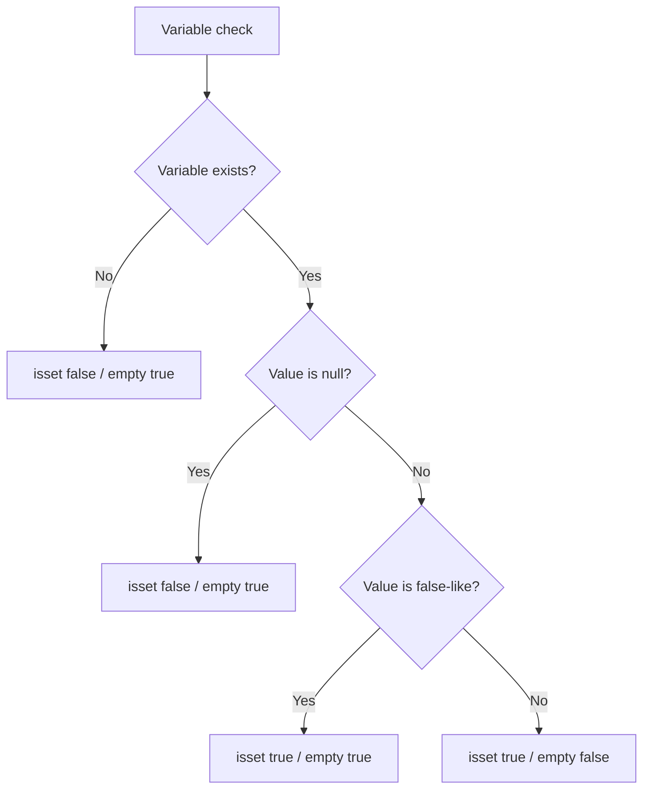

# `isset()` vs `empty()`

PHP-তে ভ্যারিয়েবল আছে কিনা, `null` কিনা, অথবা ভ্যালু empty হিসেবে বিবেচিত হয় কিনা তা যাচাই করার জন্য `isset()` এবং `empty()` খুব বেশি ব্যবহৃত হয়।

---

# Definition

`isset()` চেক করে কোনো ভ্যারিয়েবল ডিফাইন করা আছে এবং তার ভ্যালু `null` নয় কিনা। `empty()` চেক করে কোনো ভ্যারিয়েবল empty value কিনা। Empty values হলো `""`, `0`, `"0"`, `false`, `null`, `[]`, এবং undefined variable।

Interview answer: `isset()` is best for existence and non-null checks. `empty()` is best when you want to treat missing, null, false, zero, empty string, and empty array as no meaningful value.

---

# Comparison

| Case | `isset($x)` | `empty($x)` |
| --- | --- | --- |
| Undefined variable | `false` | `true` |
| `$x = null` | `false` | `true` |
| `$x = ""` | `true` | `true` |
| `$x = 0` | `true` | `true` |
| `$x = "0"` | `true` | `true` |
| `$x = false` | `true` | `true` |
| `$x = []` | `true` | `true` |
| `$x = "hello"` | `true` | `false` |

---

# Internal Working

1. `isset()` first checks whether the variable exists in the current symbol table.
2. If it exists, PHP checks whether the value is not `null`.
3. `empty()` performs an existence check first and then applies PHP's boolean conversion rules.
4. `empty()` does not raise a notice for undefined variables, which makes it safe for form input checks.

---

# Flow Diagram



---

# Code Examples

## Basic Example

```php
<?php
$name = "Moshiur";
$age = 0;
$email = null;

var_dump(isset($name));  // true
var_dump(isset($email)); // false
var_dump(empty($age));   // true
```

## Form Validation Example

```php
<?php
$request = [
    'email' => 'user@example.com',
    'phone' => '',
];

if (!empty($request['email'])) {
    echo "Email is provided";
}

if (isset($request['phone'])) {
    echo "Phone key exists, even if blank";
}
```

## Laravel Example

```php
<?php
// In Laravel, prefer request helpers and validation rules.
$email = request('email');

if (filled($email)) {
    // Similar intention to: isset($email) && $email !== ''
}
```

---

# Output

```text
bool(true)
bool(false)
bool(true)
```

---

# Real Project Example

একটি checkout form-এ `coupon_code` optional হতে পারে। key আছে কিনা জানতে `isset()` কাজে লাগে, কিন্তু user meaningful coupon দিয়েছে কিনা জানতে `empty()` বা Laravel-এর `filled()` ভালো।

---

# Interview Answer

বাংলা: `isset()` ভ্যারিয়েবল আছে এবং `null` না কিনা চেক করে। `empty()` ভ্যারিয়েবল missing, null, false, zero, empty string বা empty array কিনা চেক করে। তাই existence check-এর জন্য `isset()`, আর meaningful value check-এর জন্য `empty()` ব্যবহার করা হয়।

English: `isset()` checks whether a variable exists and is not null. `empty()` checks whether a variable is missing or contains a false-like value. Use `isset()` for existence checks and `empty()` for blank-value checks.

---

# Common Mistakes

- Treating `0` or `"0"` as valid input while using `empty()`.
- Using `isset()` when the requirement is to reject blank strings.
- Forgetting that `isset($x)` returns `false` when `$x` is `null`.

---

# Best Practices

- Use `isset()` for optional array keys.
- Use `empty()` only when `0`, `false`, and `"0"` should be considered empty.
- In Laravel, prefer validation rules such as `required`, `nullable`, `sometimes`, and helpers like `filled()`.

---

# Summary

`isset()` means exists and not null. `empty()` means no meaningful value according to PHP's loose truthiness rules.

| Status | Revision Checklist |
| --- | --- |
| ? | I know how `isset()` handles `null`. |
| ? | I know why `empty("0")` returns `true`. |
| ? | I can choose the correct check for form validation. |
