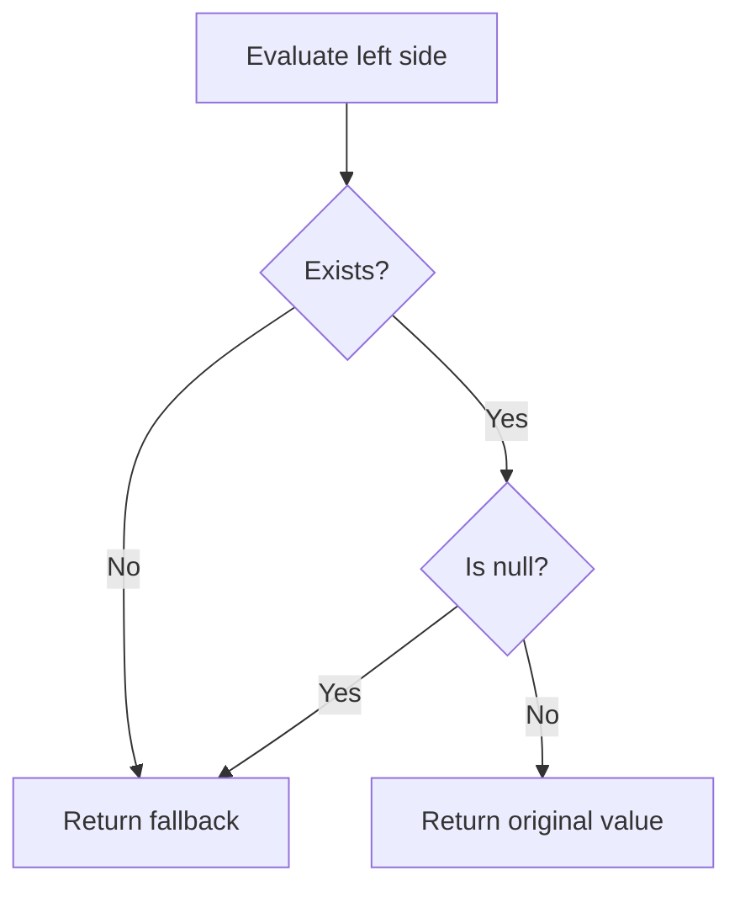

# Null Coalescing Operator

PHP-এর null coalescing operator `??` missing বা `null` value-এর জন্য safe default value দিতে ব্যবহৃত হয়। এটি PHP 7 থেকে এসেছে।

---

# Definition

`$value = $input ?? 'default';` মানে হলো: `$input` যদি set থাকে এবং `null` না হয়, তাহলে `$input` ব্যবহার করো; না হলে `'default'` ব্যবহার করো।

It is a shorthand for `isset($input) ? $input : 'default'`.

---

# Why Important

- Undefined array key warning এড়াতে সাহায্য করে।
- Request, config, session, and API payload থেকে safe value নেওয়া সহজ করে।
- Nested fallback readable রাখে।

---

# Comparison

| Syntax | Meaning | Undefined-safe |
| --- | --- | --- |
| `$x ?: 'default'` | False-like হলে default | No, if `$x` is undefined |
| `$x ?? 'default'` | Missing or null হলে default | Yes |
| `isset($x) ? $x : 'default'` | Exists and not null হলে value | Yes |

---

# Internal Working

1. PHP checks whether the left side exists.
2. If it does not exist, PHP returns the right side.
3. If it exists but is `null`, PHP returns the right side.
4. If it exists and is not `null`, PHP returns the left side.

---

# Flow Diagram



---

# Code Examples

## Basic Example

```php
<?php
$name = $_GET['name'] ?? 'Guest';
echo $name;
```

## Chained Fallback

```php
<?php
$displayName = $user['name'] ?? $user['username'] ?? $user['email'] ?? 'Unknown User';
echo $displayName;
```

## Laravel Example

```php
<?php
$perPage = request('per_page') ?? 15;
$timezone = config('app.timezone') ?? 'UTC';
```

---

# Output

```text
Guest
```

---

# Real Project Example

একটি API integration-এ সব response field সবসময় থাকে না। `??` ব্যবহার করে missing key warning ছাড়াই fallback value দেওয়া যায়।

```php
<?php
$city = $payload['customer']['address']['city'] ?? 'Not provided';
```

---

# Interview Answer

বাংলা: Null coalescing operator `??` left side missing বা `null` হলে right side fallback return করে। এটি `isset()` check-এর সংক্ষিপ্ত রূপ এবং array key বা request input handle করতে খুব useful।

English: The null coalescing operator returns the left operand if it exists and is not null; otherwise it returns the right operand. It is useful for safe defaults without undefined variable or array key warnings.

---

# Common Mistakes

- Thinking `??` checks empty string or `0`; it only checks missing or `null`.
- Using `?:` when undefined-safe behavior is needed.
- Overusing long chained fallbacks instead of validating input clearly.

---

# Best Practices

- Use `??` for defaults on optional values.
- Use validation when input is required.
- Use Laravel's `request('key', 'default')` when working directly with request input.

---

# Summary

`??` is the cleanest way to provide a default when a variable or array key may be missing or `null`.

| Status | Revision Checklist |
| --- | --- |
| ? | I know the difference between `??` and `?:`. |
| ? | I can safely read optional array keys. |
| ? | I know `0` and `""` do not trigger `??` fallback. |
