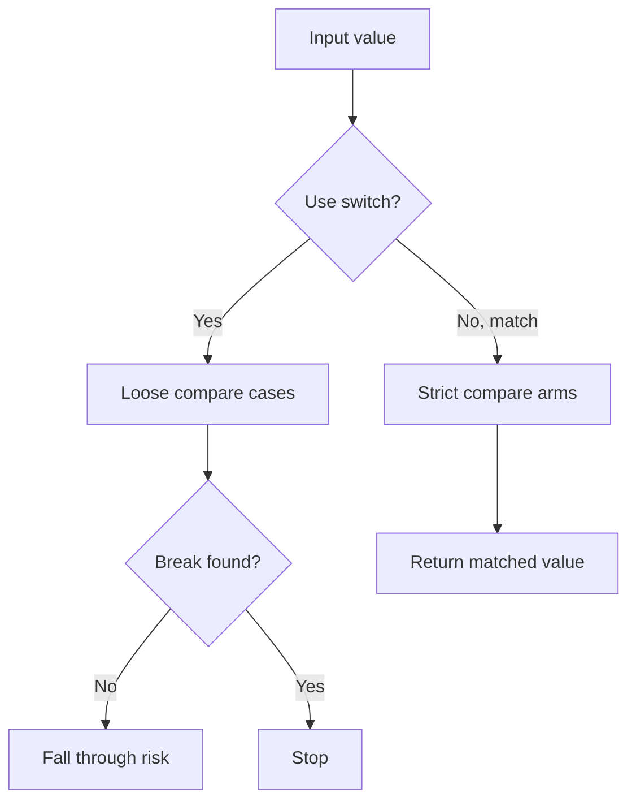

# `switch` vs `match`

PHP-তে multiple condition handle করার জন্য `switch` অনেক পুরোনো construct। PHP 8 থেকে `match` expression এসেছে, যা strict comparison, direct return value, এবং safer syntax দেয়।

---

# Definition

`switch` loosely compares values using `==` and executes statements until `break` is found. `match` strictly compares values using `===`, returns a value, and does not need `break`.

---

# Comparison

| Feature | `switch` | `match` |
| --- | --- | --- |
| PHP Version | Older PHP versions | PHP 8+ |
| Comparison | Loose `==` | Strict `===` |
| Returns value | No | Yes |
| Needs `break` | Yes | No |
| Fall-through risk | Yes | No |
| Multiple matching values | Multiple `case` blocks | Comma-separated values |

---

# Internal Working

1. `switch` evaluates the given expression once.
2. It compares the expression with each `case` using loose comparison.
3. When a case matches, execution continues until `break` or the end of the switch block.
4. `match` evaluates the expression and checks arms using strict comparison.
5. `match` returns the value from the matched arm and stops automatically.

---

# Flow Diagram



---

# Code Examples

## switch Example

```php
<?php
$role = 'admin';

switch ($role) {
    case 'admin':
        $label = 'Administrator';
        break;
    case 'editor':
        $label = 'Content Editor';
        break;
    default:
        $label = 'User';
}

echo $label;
```

## match Example

```php
<?php
$role = 'admin';

$label = match ($role) {
    'admin' => 'Administrator',
    'editor' => 'Content Editor',
    default => 'User',
};

echo $label;
```

## Strict Comparison Example

```php
<?php
$value = '1';

$result = match ($value) {
    1 => 'integer one',
    '1' => 'string one',
};

echo $result; // string one
```

---

# Output

```text
Administrator
string one
```

---

# Real Project Example

Payment status mapping-এ `match` clean এবং safe। কারণ status code `1` এবং string `'1'` আলাদা হলে strict matching দরকার হতে পারে।

```php
<?php
$statusText = match ($payment->status) {
    'pending' => 'Waiting for payment',
    'paid' => 'Payment received',
    'failed' => 'Payment failed',
    default => 'Unknown status',
};
```

---

# Interview Answer

বাংলা: `switch` loose comparison করে এবং `break` না দিলে fall-through হয়। `match` strict comparison করে, value return করে এবং break লাগে না। PHP 8+ project-এ simple mapping-এর জন্য `match` বেশি safe ও readable।

English: `switch` uses loose comparison and requires `break` to avoid fall-through. `match` uses strict comparison, returns a value, and does not fall through.

---

# Common Mistakes

- Forgetting `break` in `switch`.
- Expecting `match` to use loose comparison.
- Forgetting `default` in `match` when input may be unknown.

---

# Best Practices

- Use `match` for value mapping in PHP 8+.
- Use `switch` when multiple statements and older PHP compatibility are needed.
- Always add `default` when the input range is not fully controlled.

---

# Summary

`match` is stricter and safer for expression-based mapping. `switch` is still useful for older projects or statement-heavy branching.

| Status | Revision Checklist |
| --- | --- |
| ? | I know `match` uses `===`. |
| ? | I know why `break` is required in `switch`. |
| ? | I can choose between `switch` and `match`. |
