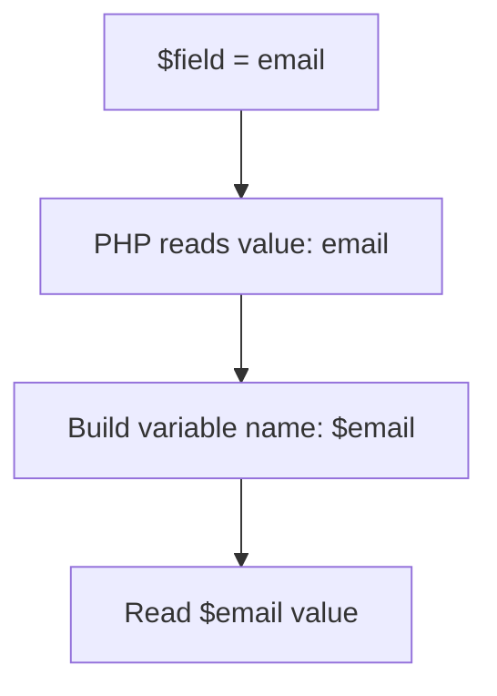

# Variable Variables

PHP variable variables এমন একটি feature যেখানে একটি variable-এর value আরেকটি variable-এর name হিসেবে ব্যবহার করা যায়। Syntax হলো `$$name`।

---

# Definition

যদি `$field = 'email';` এবং `$email = 'user@example.com';` হয়, তাহলে `$$field` মানে `$email`। অর্থাৎ PHP first variable-এর value পড়ে dynamic variable name তৈরি করে।

---

# Why Important

- Dynamic mapping বোঝার জন্য useful।
- Legacy PHP codebase-এ এই syntax দেখা যায়।
- Security risk বোঝার জন্য গুরুত্বপূর্ণ, কারণ user input দিয়ে variable তৈরি করলে unpredictable behavior হতে পারে।

---

# Internal Working

1. PHP evaluates the first variable, for example `$field`.
2. It reads the string value, for example `email`.
3. PHP then looks for a variable named `$email` in the current scope.
4. The value of that dynamically resolved variable is returned.

---

# Flow Diagram



---

# Code Examples

## Basic Example

```php
<?php
$name = 'framework';
$framework = 'Laravel';

echo $$name; // Laravel
```

## Dynamic Form Example

```php
<?php
$first_name = 'Md.';
$last_name = 'Moshiur';

$fields = ['first_name', 'last_name'];

foreach ($fields as $field) {
    echo $$field . PHP_EOL;
}
```

## Safer Alternative

```php
<?php
$data = [
    'first_name' => 'Md.',
    'last_name' => 'Moshiur',
];

foreach (['first_name', 'last_name'] as $field) {
    echo $data[$field] ?? '';
}
```

---

# Output

```text
Laravel
Md.
Moshiur
```

---

# Real Project Example

Legacy admin panels sometimes convert column names into variable names dynamically. In modern PHP and Laravel, associative arrays, DTOs, request objects, and model attributes are safer and more readable.

---

# Interview Answer

বাংলা: Variable variable হলো এমন feature যেখানে variable-এর value কে আরেকটি variable-এর name হিসেবে ব্যবহার করা হয়। যেমন `$name = 'title'; $title = 'PHP'; echo $$name;` output হবে `PHP`। তবে modern code-এ array বা object ব্যবহার করা ভালো।

English: A variable variable uses the value of one variable as the name of another variable. It is powerful but can reduce readability and create security issues if dynamic names come from user input.

---

# Common Mistakes

- User input থেকে সরাসরি variable variable তৈরি করা।
- Debugging কঠিন করে ফেলা।
- Arrays বা objects দিয়ে সহজে করা যায় এমন কাজ variable variable দিয়ে করা।

---

# Best Practices

- Avoid variable variables in new application code.
- Prefer associative arrays, DTOs, models, or config maps.
- Never create variable names directly from untrusted input.

---

# Summary

Variable variables are useful to understand PHP's dynamic nature, but they should be avoided in professional code unless there is a very specific reason.

| Status | Revision Checklist |
| --- | --- |
| ? | I understand how `$$name` is resolved. |
| ? | I know why arrays are safer. |
| ? | I can explain the security risk. |
