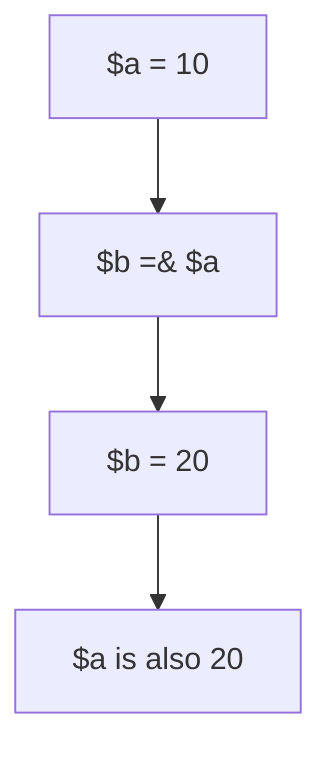

# References

PHP references allow two variable names to point to the same value container. The reference operator is `&`.

---

# Definition

সাধারণ assignment-এ value copy হয়। Reference assignment-এ দুইটি variable একই value container share করে। তাই একটির value পরিবর্তন করলে অন্যটির value-ও পরিবর্তিত হয়।

---

# Why Important

- Large arrays বা objects নিয়ে কাজ করার সময় behavior বুঝতে সাহায্য করে।
- `foreach` by reference ভুল ব্যবহার করলে hard-to-find bug হতে পারে।
- Function parameter by reference বুঝতে interview এবং debugging-এ কাজে লাগে।

---

# Internal Working

1. PHP variables point to internal containers called zvals.
2. Normal assignment can share a value until modification due to copy-on-write.
3. Reference assignment explicitly binds variables to the same container.
4. Modifying one referenced variable modifies the shared value.

---

# Flow Diagram



---

# Code Examples

## Basic Example

```php
<?php
$a = 10;
$b =& $a;

$b = 20;

echo $a; // 20
```

## Function Reference Example

```php
<?php
function addBonus(int &$salary): void
{
    $salary += 1000;
}

$salary = 50000;
addBonus($salary);

echo $salary; // 51000
```

## foreach Reference Warning

```php
<?php
$items = [1, 2, 3];

foreach ($items as &$item) {
    $item *= 2;
}
unset($item); // Important: break the reference

print_r($items);
```

---

# Output

```text
20
51000
Array
(
    [0] => 2
    [1] => 4
    [2] => 6
)
```

---

# Real Project Example

Bulk data transformation-এ array element directly modify করতে `foreach` by reference ব্যবহার করা যায়। তবে Laravel collection methods like `map()` usually provide cleaner and safer transformations.

---

# Interview Answer

বাংলা: Reference মানে দুইটি variable একই value container share করে। `&` দিয়ে reference তৈরি হয়। একটির পরিবর্তন অন্যটিতেও দেখা যায়। তবে unnecessary reference code readability কমায় এবং `foreach` reference unset না করলে bug তৈরি করতে পারে।

English: A reference makes two variables point to the same value container. It is useful for explicit mutation, but should be used carefully because it can create side effects.

---

# Common Mistakes

- `foreach` by reference শেষে `unset($item)` না করা।
- Performance improve হবে ভেবে সব জায়গায় reference ব্যবহার করা।
- Function side effect clear না রাখা।

---

# Best Practices

- Use references only when mutation is intentional.
- Prefer returning values from functions for clearer behavior.
- Always `unset()` referenced loop variables after `foreach`.

---

# Summary

References are powerful but risky. Use them when shared mutation is required and keep the side effect obvious.

| Status | Revision Checklist |
| --- | --- |
| ? | I know what `&` does. |
| ? | I know why `unset()` matters after referenced `foreach`. |
| ? | I can explain pass-by-reference. |
