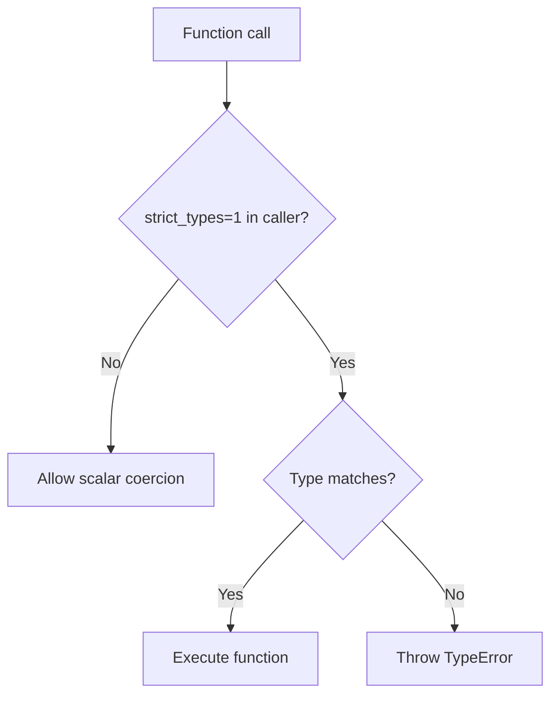

# Strict Types

PHP strict types control how scalar type declarations behave for function arguments. It is enabled per file using `declare(strict_types=1);`.

---

# Definition

By default, PHP may coerce scalar values. For example, a string `'10'` can be accepted where an `int` is expected. With `declare(strict_types=1);`, PHP requires the value to match the declared scalar type more strictly.

---

# Why Important

- Prevents unexpected type conversion bugs.
- Makes function contracts clearer.
- Improves reliability in service classes, domain logic, and APIs.
- Helps static analysis tools and team readability.

---

# Comparison

| Behavior | Weak Types | Strict Types |
| --- | --- | --- |
| `'10'` passed to `int` | Coerced to `10` | TypeError |
| `1` passed to `bool` | Coerced to `true` | TypeError |
| Return type mismatch | Can coerce in some cases | Stricter behavior |
| Scope | Default | Per calling file |

---

# Internal Working

1. PHP reads `declare(strict_types=1);` at the top of a file.
2. When that file calls a function with scalar type declarations, PHP enforces stricter argument types.
3. If the passed value does not match, PHP throws a `TypeError`.
4. Strict typing is controlled by the calling file, not the file where the function is defined.

---

# Flow Diagram



---

# Code Examples

## Weak Type Example

```php
<?php
function total(int $amount): int
{
    return $amount;
}

echo total('10'); // 10 in weak mode
```

## Strict Type Example

```php
<?php
declare(strict_types=1);

function total(int $amount): int
{
    return $amount;
}

echo total('10'); // TypeError
```

## Laravel Example

```php
<?php
declare(strict_types=1);

namespace App\Services;

final class InvoiceCalculator
{
    public function calculate(int $subtotal, int $tax): int
    {
        return $subtotal + $tax;
    }
}
```

---

# Output

```text
Weak mode: 10
Strict mode: TypeError
```

---

# Real Project Example

Payment calculation service-এ amount string হিসেবে চলে এলে weak typing সেটা integer-এ convert করে ফেলতে পারে। Strict types bug দ্রুত reveal করে, ফলে validation layer ঠিক করা যায়।

---

# Interview Answer

বাংলা: `declare(strict_types=1);` দিলে scalar type declarations strictভাবে enforce হয়। ভুল type pass করলে PHP `TypeError` দেয়। এটি per-file setting এবং calling file-এর উপর depend করে।

English: Strict types make PHP enforce scalar type declarations more strictly. If a value does not match the declared type, PHP throws a `TypeError`. It is enabled per file with `declare(strict_types=1);`.

---

# Common Mistakes

- Thinking strict types are global for the whole project.
- Placing `declare(strict_types=1);` after other executable code.
- Assuming strict types replace validation.

---

# Best Practices

- Add `declare(strict_types=1);` at the top of new service/domain PHP files.
- Still validate external input from requests, APIs, CSV, and forms.
- Use clear DTOs or value objects when data shape matters.

---

# Summary

Strict types make PHP code more predictable by rejecting unexpected scalar coercion at function boundaries.

| Status | Revision Checklist |
| --- | --- |
| ? | I know how to enable strict types. |
| ? | I know strict types are per file. |
| ? | I know strict types do not replace validation. |
