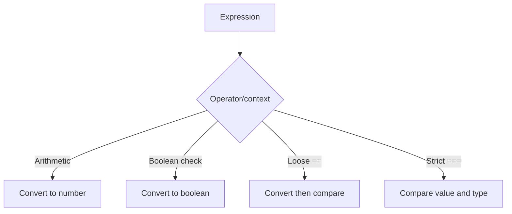

# Type Juggling

Type juggling হলো PHP-এর automatic type conversion behavior। PHP অনেক সময় context অনুযায়ী string, integer, boolean, float ইত্যাদি এক type থেকে আরেক type-এ convert করে।

---

# Definition

PHP loosely typed language হওয়ায় expression evaluate করার সময় type convert করতে পারে। যেমন `'10' + 5` করলে PHP string `'10'` কে number হিসেবে ধরতে পারে। আবার loose comparison `==` ব্যবহার করলে different type values equal হিসেবে evaluate হতে পারে।

---

# Why Important

- Loose comparison bug তৈরি করতে পারে।
- Authentication, token, payment, and validation logic-এ security risk হতে পারে।
- `empty()`, `==`, arithmetic operation, and boolean checks বোঝার জন্য type juggling জানা জরুরি।

---

# Comparison

| Expression | Result | Reason |
| --- | --- | --- |
| `'10' + 5` | `15` | String converted to number |
| `0 == false` | `true` | Loose comparison |
| `'0' == false` | `true` | Loose comparison |
| `0 === false` | `false` | Strict comparison checks type |
| `'10' === 10` | `false` | String and integer are different types |

---

# Internal Working

1. PHP checks the operator or context.
2. Arithmetic operators convert operands to numbers when possible.
3. Boolean contexts convert values to `true` or `false`.
4. Loose comparison converts values before comparing.
5. Strict comparison compares both value and type without juggling.

---

# Flow Diagram



---

# Code Examples

## Basic Example

```php
<?php
echo '10' + 5; // 15
```

## Loose vs Strict Comparison

```php
<?php
var_dump(0 == false);    // true
var_dump(0 === false);   // false
var_dump('10' == 10);    // true
var_dump('10' === 10);   // false
```

## Safer Validation Example

```php
<?php
$status = '0';

if ($status === '0') {
    echo 'Pending';
}
```

---

# Output

```text
15
bool(true)
bool(false)
bool(true)
bool(false)
Pending
```

---

# Real Project Example

Payment gateway response status `'0'` যদি pending বোঝায়, তাহলে `if (!$status)` লিখলে PHP এটিকে false ধরে ভুল branch execute করতে পারে। Strict comparison ব্যবহার করলে এই bug এড়ানো যায়।

---

# Interview Answer

বাংলা: Type juggling হলো PHP-এর automatic type conversion। Loose comparison বা arithmetic operation-এ PHP value convert করে। Bug এড়াতে গুরুত্বপূর্ণ জায়গায় `===` এবং `!==` ব্যবহার করা উচিত।

English: Type juggling is PHP's automatic type conversion. It happens in arithmetic, boolean context, and loose comparisons. Use strict comparisons to avoid unexpected behavior.

---

# Common Mistakes

- Authentication token compare করতে `==` ব্যবহার করা।
- `0`, `'0'`, `false`, and `null` একইভাবে treat করা।
- Validation ছাড়া numeric string দিয়ে calculation করা।

---

# Best Practices

- Prefer `===` and `!==` for comparisons.
- Cast intentionally when needed, for example `(int) $value`.
- Validate external input before business logic.
- Use Laravel validation rules like `integer`, `numeric`, `boolean`, and `in`.

---

# Summary

Type juggling makes PHP flexible but can create subtle bugs. Professional PHP code should use strict comparison and explicit validation.

| Status | Revision Checklist |
| --- | --- |
| ? | I know why `0 == false` is true. |
| ? | I know when to use `===`. |
| ? | I can explain type juggling in an interview. |
