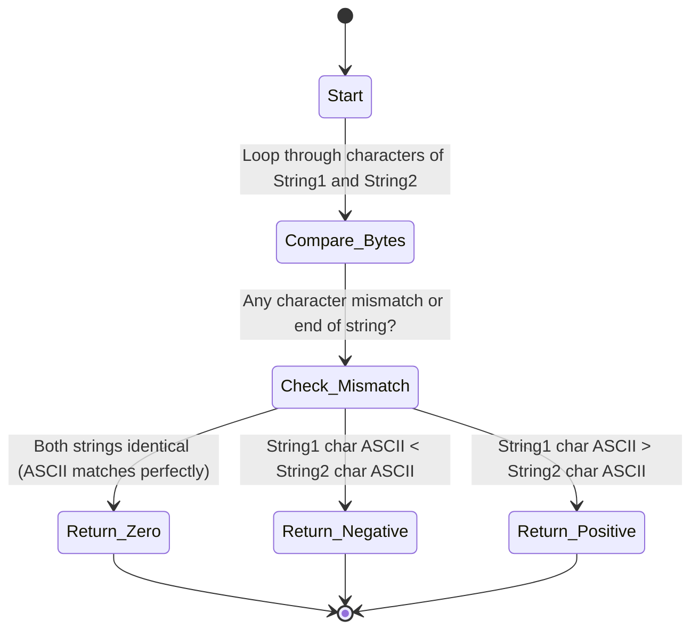

# PHP strcmp() Function

`strcmp()` হলো PHP-এর একটি Built-in ফাংশন যা দুটি String-এর মধ্যে Binary Safe এবং Case-sensitive তুলনা (Comparison) করার জন্য ব্যবহৃত হয়।

---

# Table of Contents

* [Definition](#definition)
* [Why Important](#why-important)
* [Comparison](#comparison)
* [Internal Working](#internal-working)
* [Flow Diagram](#flow-diagram)
* [Code Examples](#code-examples)
* [Output](#output)
* [Real Project Example](#real-project-example)
* [Interview Answer (বাংলা)](#interview-answer-বাংলা)
* [Interview Answer (English)](#interview-answer-english)
* [Common Mistakes](#common-mistakes)
* [Follow-up Questions](#follow-up-questions)
* [Performance Notes](#performance-notes)
* [Best Practices](#best-practices)
* [Memory Tricks](#memory-tricks)
* [Summary](#summary)
* [Revision Checklist](#revision-checklist)
* [Difficulty & Confidence](#difficulty--confidence)
* [Interview Notes](#interview-notes)
* [References](#references)

---

# Definition

## Simple Definition

সহজ বাংলায়, `strcmp()` ফাংশনটি দুটি Text বা String-এর মধ্যে তুলনা করে দেখে তারা একে অপরের সমান কিনা, অথবা Alphabetically (অভিধান অনুযায়ী) কে কার আগে বা পরে বসবে।

## Official Definition

`strcmp(string $string1, string $string2): int` is a binary safe string comparison function in PHP. It returns `< 0` if `string1` is less than `string2`; `> 0` if `string1` is greater than `string2`, and `0` if they are equal.

## Interview Definition

`strcmp()` is a binary-safe and case-sensitive function in PHP used to compare two strings based on their ASCII values. It returns `0` if both strings are identical, a positive integer if the first string is greater, and a negative integer if the second string is greater.

---

# Why Important

* **Binary Safe Comparison:** এটি String-এর প্রতিটি Byte হুবহু তুলনা করে, যার ফলে Null Characters (`\0`) বা কোনো Special Binary Data থাকলেও ভুল ফলাফল দেয় না।
* **Sorting Logic:** অ্যালফাবেট বা ডিকশনারি অর্ডারে ডেটা সাজানোর (Sorting) জন্য এটি অপরিহার্য।
* **Case Sensitivity:** সিকিউরিটি বা ডেটা ভ্যালিডেশনের ক্ষেত্রে যেখানে `apple` এবং `Apple` সম্পূর্ণ ভিন্ন, সেখানে এটি সঠিক ফলাফল দেয়।
* **Laravel Context:** Laravel-এর নিজস্ব Helpers বা Collections-এর ভেতরে (যেমন `str()->is()` বা custom sorting sorting algorithm-এ) স্ট্রিং কম্পারিজনের জন্য ব্যাকএন্ডে এই টাইপের বাইনারি সেফ কম্পারিজন মেকানিজম কাজ করে।
* **Real Life Scenario:** ইউজারনেম ভ্যালিডেশন, সর্টিং ফিল্টার, এবং ওল্ড-স্কুল পাসওয়ার্ড হ্যাশ চ্যাকিং বা টোকেন ম্যাচিংয়ের ক্ষেত্রে এটি ব্যবহৃত হয়।

---

# Comparison

| Feature | `strcmp()` | `==` (Loose Equal) | `===` (Strict Equal) | `strcasecmp()` |
| --- | --- | --- | --- | --- |
| **Return Value** | `int` (<0, 0, >0) | `bool` (true/false) | `bool` (true/false) | `int` (<0, 0, >0) |
| **Case Sensitivity** | Case-Sensitive | Case-Sensitive | Case-Sensitive | **Case-Insensitive** |
| **Type Juggling** | না (String-এ কাস্ট করে) | **হ্যাঁ (Type Juggling হয়)** | না (Strict Check) | না |
| **Binary Safe** | হ্যাঁ | না | হ্যাঁ | হ্যাঁ |
| **Laravel Usage** | Sorting/Strict validation | সাধারণ conditional check | Request input validation | Case-insensitive match |

---

# Internal Working

1. **Character by Character Checking:** `strcmp()` প্রথম স্ট্রিংয়ের প্রথম ক্যারেক্টারের সাথে দ্বিতীয় স্ট্রিংয়ের প্রথম ক্যারেক্টারের তুলনা শুরু করে।
2. **ASCII Value Difference:** যদি তারা সমান হয়, তবে পরবর্তী ক্যারেক্টারে যায়। যখনই কোনো অমিল বা mismatch পায়, তখনই তাদের **ASCII (বা Byte) ভ্যালুর বিয়োগফল** হিসাব করে ফেরত দেয়।
3. **Length Difference:** যদি একটি স্ট্রিং শেষ হয়ে যায় কিন্তু অন্যটি বাকি থাকে, তবে দৈর্ঘ্যের পার্থক্যের ওপর ভিত্তি করে মান রিটার্ন করে।
4. **Sign of Return:** - `string1 == string2` হলে `0`
* `string1 < string2` (ASCII অনুযায়ী আগে আসলে) হলে ঋণাত্মক সংখ্যা (`< 0`)
* `string1 > string2` (ASCII অনুযায়ী পরে আসলে) হলে ধনাত্মক সংখ্যা (`> 0`)


---

# Flow Diagram



---

# Code Examples

## Basic Example

```php
<?php
// দুটি সমান স্ট্রিং এর তুলনা
echo strcmp("apple", "apple"); 

// Case-sensitivity টেস্ট
echo strcmp("apple", "Apple"); 
?>

```

### Explanation

প্রথম ইকোতে দুটি স্ট্রিং হুবহু এক হওয়ায় `0` আসবে। দ্বিতীয় ইকোতে 'a' (ASCII 97) এবং 'A' (ASCII 65)-এর তুলনা হবে। যেহেতু ৯৭ থেকে ৬৫ বড়, তাই এটি একটি positive integer রিটার্ন করবে।

## Intermediate Example

```php
<?php
$fruits = ["banana", "apple", "cherry"];

// custom sort algorithm using strcmp
usort($fruits, function($a, $b) {
    return strcmp($a, $b);
});

print_r($fruits);
?>

```

### Explanation

এখানে `usort()` ফাংশনের ভেতরে `strcmp()` কলব্যাক হিসেবে কাজ করছে। এটি প্রত্যেকটি ফলকে Alphabetical অর্ডারে সাজাতে সাহায্য করে কারণ `strcmp` যথাক্রমে negative, zero, বা positive রিটার্ন দেয় যা `usort`-এর জন্য প্রয়োজন।

## Advanced Example

```php
<?php
function secureLegacyTokenCheck(string $knownToken, mixed $userInput): bool 
{
    // Type casting to ensure string safety
    $userInput = (string)$userInput;
    
    // Binary safe validation using strcmp
    if (strcmp($knownToken, $userInput) === 0) {
        return true;
    }
    
    return false;
}

// Security simulation
$secret = "AppSec_Token_\0_Secret";
$input  = "AppSec_Token_";

var_dump(secureLegacyTokenCheck($secret, $input));
?>

```

### Explanation

এই এডভান্সড উদাহরণে বাইনারি সেফটি চেক করা হয়েছে। `\0` (Null byte) থাকার কারণে অনেক নন-বাইনারি সেফ ফাংশন রিডিং বন্ধ করে দিতে পারে, কিন্তু `strcmp()` নিখুঁতভাবে পুরো ডেটা চেক করে নিশ্চিত করবে যে টোকেনটি ম্যাচ করেনি।

## Laravel Example

```php
<?php

namespace App\Http\Controllers;

use App\Models\Product;
use Illuminate\Http\Request;

class ProductController extends Controller
{
    /**
     * Display a sorted list of products based on titles securely.
     */
    public function index(Request $request)
    {
        $products = Product::take(10)->get();

        // Convert collection and sort using underlying strcmp
        $sortedProducts = $products->sort(function ($productA, $productB) {
            return strcmp($productA->title, $productB->title);
        });

        return response()->json($sortedProducts->values()->all());
    }
}

```

### Explanation

Laravel Eloquent Collection-এর `sort()` মেথডের ভেতরে custom callback হিসেবে `strcmp()` ব্যবহার করা হয়েছে, যা ডাটাবেস থেকে তুলে আনা প্রোডাক্টগুলোর Title-কে নিখুঁত ও কেস-সেন্সিটিভ উপায়ে সর্ট করে API রেসপন্স তৈরি করে।

---

# Output

### Basic Example Output

```text
0
32

```

### Intermediate Example Output

```text
Array
(
    [0] => apple
    [1] => banana
    [2] => cherry
)

```

### Advanced Example Output

```text
bool(false)

```

---

# Real Project Example

## Business Requirement

একটি Enterprise SaaS বা FinTech অ্যাপ্লিকেশনে ব্যবহারকারীদের আপলোড করা ফাইলের Extension বা সিস্টেমের অভ্যন্তরীণ সংবেদনশীল API Signature/Payload-এর সঠিকতা কঠোরভাবে যাচাই করা প্রয়োজন, যেখানে কোনোভাবেই টাইপ জুগলিং বা স্পেশাল ক্যারেক্টার ইগনোর করা যাবে না।

## Problem

ডেভেলপাররা অনেক সময় `==` ব্যবহার করেন। এতে যদি কোনো হ্যাকার `true` বা `1` ইনপুট পাঠায়, তবে Loose comparison-এর কারণে পিএইচপি ওল্ড ভার্সন বা কাস্টম লজিকে পাসওয়ার্ড/টোকেন ম্যাচ করে ফেলতে পারে। আবার, Null Byte ইনজেকশনের কারণে স্ট্রিং মাঝপথে কেটে যেতে পারে।

## Solution

`strcmp()` ব্যবহার করে কড়া স্ট্রিং লেভেল চেক বসানো। এটি নিশ্চিত করে যে ইনপুট ডেটা অবশ্যই স্ট্রিং হতে হবে এবং এর প্রতিটি বাইট ম্যাচ করতে হবে।

## কেন এই Feature ব্যবহার করা হয়েছে

এটি **Binary-Safe**। অর্থাৎ ফাইলের সোর্স কোড বা মেটাডেটাতে যদি কোনো হিডেন বাইট বা নাল ক্যারেক্টার থাকে, এটি সেটিকেও রিড করে তুলনা করবে, যা সিকিউরিটির জন্য অত্যন্ত জরুরি।

## Production Experience

FinTech অ্যাপ্লিকেশনে থার্ড পার্টি পেমেন্ট গেটওয়ের (যেমন: SSLCommerz, BKash) IPN (Instant Payment Notification) ভ্যালিডেশনের সময় পাঠানো MD5/SHA256 হ্যাশ স্ট্রিং ম্যাচ করতে আমরা `strcmp()` বা `hash_equals()` ব্যবহার করি যাতে টাইপ জুগলিং অ্যাটাক প্রতিরোধ করা যায়।

---

# Interview Answer (বাংলা)

"PHP-তে `strcmp()` হলো একটি বাইনারি-সেফ এবং কেস-সেন্সিটিভ স্ট্রিং কম্পারিজন ফাংশন। এটি দুটি স্ট্রিংয়ের ASCII ভ্যালু ক্যারেক্টার বাই ক্যারেক্টার তুলনা করে। যদি দুটি স্ট্রিং হুবহু মিলে যায় তবে এটি `0` রিটার্ন করে। প্রথম স্ট্রিংটি ছোট হলে নেগেটিভ মান এবং বড় হলে পজিটিভ মান রিটার্ন করে। এটি বিশেষ করে স্ট্রিং সর্টিং এবং টাইপ জুগলিং এড়াতে কঠোর সিকিউরিটি চেকে ব্যবহৃত হয়।"

---

# Interview Answer (English)

"In PHP, `strcmp()` is a built-in, binary-safe, and case-sensitive function used to compare two strings. It operates by comparing the ASCII values of characters sequentially. It returns an integer `0` if both strings are identical. If the first string is lexicographically smaller than the second, it returns a negative value, and a positive value if the first string is larger. It is highly recommended for custom sorting algorithms via `usort()` and for avoiding security vulnerabilities related to loose type juggling (`==`) in legacy systems."

---

# Common Mistakes

| Mistake | কেন ভুল | সঠিক পদ্ধতি |
| --- | --- | --- |
| `if(strcmp($a, $b))` | `strcmp` মিললে `0` দেয়। `if(0)` মানে false। ফলে কোড উল্টো কাজ করবে। | `if(strcmp($a, $b) === 0)` |
| Array পাস করা | `strcmp()`-এ অ্যারে পাস করলে PHP 8-এ Fatal Error দিবে। | পাস করার আগে `is_string()` বা টাইপ কাস্টিং করা নিশ্চিত করুন। |
| Case insensitive চেক না জানা | কেস ইগনোর করার জন্য `strcmp` ব্যবহার করা ভুল। | Case-insensitive চেকের জন্য `strcasecmp()` ব্যবহার করুন। |
| Object পাস করা | Object-কে সরাসরি স্ট্রিংয়ে রূপান্তর না করে পাস করলে ক্র্যাশ করবে। | `(string)$object` বা নির্দিষ্ট প্রোপার্টি পাস করুন। |
| `== 0` ট্রাস্ট করা | Strict validation-এ টাইপ সুরক্ষার জন্য `=== 0` ব্যবহার করা ভালো। | `if (strcmp($str1, $str2) === 0)` |

---

# Follow-up Questions

1. What is the return type of `strcmp()` in PHP?
2. Why is `strcmp()` called "binary safe"?
3. How does `strcmp()` differ from `strcasecmp()`?
4. What happens if you pass an Array to `strcmp()` in PHP 8.x?
5. How can you use `strcmp()` to sort an array alphabetically?
6. Why does `strcmp("apple", "Apple")` not return 0?
7. Is `strcmp()` vulnerable to timing attacks? (Hint: Yes, for highly sensitive hashes, `hash_equals` is preferred).
8. What is the difference between `strcmp($a, $b) === 0` and `$a === $b`?
9. How does `strcmp()` handle null bytes (`\0`)?
10. In what scenario would `strcmp()` return a negative number?

---

# Performance Notes

* **Memory Usage:** খুবই নগণ্য। এটি সরাসরি মেমোরি পয়েন্টার থেকে বাইট লেভেলে তুলনা করে, অতিরিক্ত মেমোরি অ্যালোকেশন তৈরি করে না।
* **Time Complexity:** $O(N)$ যেখানে $N$ হলো ছোট স্ট্রিংটির দৈর্ঘ্য। কারণ অমিল পাওয়ার সাথে সাথেই এটি লুপ ব্রেক করে বের হয়ে আসে।
* **Optimization Tips:** বড় স্ট্রিং ম্যাচিংয়ের ক্ষেত্রে যদি শুধু তারা সমান কিনা তা জানার দরকার হয়, তবে `===` অপারেটরটি `strcmp()`-এর চেয়ে সামান্য দ্রুত কাজ করতে পারে কারণ এটি শুরুতেই স্ট্রিংয়ের লেন্থ চেক করে অসমান হলে সরাসরি ফলস দিয়ে দেয়।

---

# Best Practices

* **Strict Type Check:** সর্বদা `strcmp($str1, $str2) === 0` এইভাবে ট্রিপল ইকুয়াল দিয়ে চেক করুন।
* **Sorting Logic:** `usort()` বা Collection Sorting-এ স্ট্রিং অর্ডারিংয়ের জন্য নির্দ্বিধায় `strcmp()` ব্যবহার করুন।
* **Cryptographic Alternative:** পাসওয়ার্ড ভেরিফিকেশন বা ক্রিপ্টোগ্রাফিক টোকেন চেকের ক্ষেত্রে `strcmp()`-এর পরিবর্তে `hash_equals()` ব্যবহার করুন, যা 'Timing Attack' প্রতিরোধ করে।

---

# Memory Tricks

* **S-C-0:** **S**tring **C**omparison yields **0** when equal.
* **Analogy:** একে একটি সাধারণ দাঁড়িপাল্লার মতো চিন্তা করুন। দুই পাশে সমান ওজন (একই স্ট্রিং) হলে দাঁড়িপাল্লার কাঁটা থাকে মাঝখানে বা **`0`** তে। বামদিকের পাল্লা হালকা (ছোট) হলে কাঁটা মাইনাসে চলে যায়, আর ভারী (বড়) হলে প্লাস বা পজিটিভে চলে যায়।

---

# Summary

* `strcmp()` স্ট্রিং তুলনার জন্য ব্যবহৃত হয়।
* এটি **Case-sensitive** এবং **Binary Safe**।
* দুটি স্ট্রিং পুরোপুরি মিললে এটি **`0`** রিটার্ন করে।
* loose comparison (`==`) এর টাইপ জুগলিং বাগ থেকে বাঁচায়।
* ডিকশনারি বা অ্যালফাবেটিক অর্ডারে সর্ট করার জন্য এটি আইডিয়াল।
* ভুলবশত `if(strcmp($a, $b))` লিখলে তা অসমান অবস্হায় ট্রু হয়ে যাবে, তাই `=== 0` লিখুন।

---

# Revision Checklist

| Item | Status |
| --- | --- |
| Topic Understood | ☐ |
| Basic Example Practice | ☐ |
| Advanced Example Practice | ☐ |
| Laravel Example Practice | ☐ |
| Interview Ready | ☐ |
| Need More Practice | ☐ |

---

# Difficulty

⭐⭐☆☆☆ (Intermediate)

---

# Confidence

⭐⭐⭐⭐⭐ (Expert Ready)

---

# Interview Notes

* **Most Asked Point:** ইন্টারভিউতে প্রায়ই জিজ্ঞেস করা হয় `strcmp()` সফল হলে কী রিটার্ন করে। উত্তর হবে `0`, অনেকে ভুল করে `true` বা `1` বলে বসেন।
* **Senior Level Discussion:** একজন সিনিয়ার ডেভেলপার হিসেবে আপনাকে টাইপ সেফটি এবং টাইমিং অ্যাটাক (Timing attack) নিয়ে কথা বলতে হবে। টোকেন বা পাসওয়ার্ডের ক্ষেত্রে কেন `strcmp` নিরাপদ নয় এবং কেন `hash_equals` সেরা—তা উল্লেখ করলে ইন্টারভিউতে ভালো ইমপ্রেশন তৈরি হবে।

---

# References

* [PHP Official Documentation - strcmp](https://www.google.com/search?q=https://www.php.net/manual/en/function.strcmp.php)
* [Laravel Collection Sorting Guide](https://www.google.com/search?q=https://laravel.com/docs/collections%23method-sort)