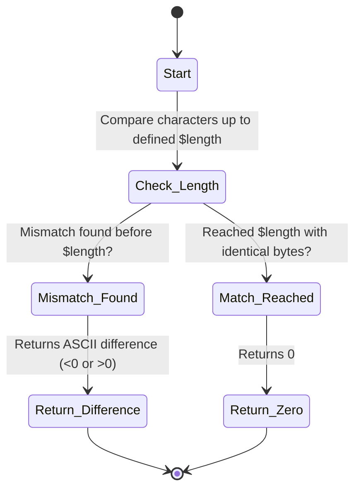

# PHP strncmp() Function

`strncmp()` হলো PHP-এর একটি Built-in ফাংশন যা দুটি String-এর প্রথম থেকে নির্দিষ্ট সংখ্যক ক্যারেক্টার বা বাইট (Length) পর্যন্ত Binary Safe এবং Case-sensitive উপায়ে তুলনা (Comparison) করার জন্য ব্যবহৃত হয়।

---

# Table of Contents

* [Definition](https://www.google.com/search?q=%23definition)
* [Why Important](https://www.google.com/search?q=%23why-important)
* [Comparison](https://www.google.com/search?q=%23comparison)
* [Internal Working](https://www.google.com/search?q=%23internal-working)
* [Flow Diagram](https://www.google.com/search?q=%23flow-diagram)
* [Code Examples](https://www.google.com/search?q=%23code-examples)
* [Output](https://www.google.com/search?q=%23output)
* [Real Project Example](https://www.google.com/search?q=%23real-project-example)
* [Interview Answer (বাংলা)](https://www.google.com/search?q=%23interview-answer-%E0%A6%AC%E0%A6%BE%E0%A6%82%E0%A6%B2%E0%A6%BE)
* [Interview Answer (English)](https://www.google.com/search?q=%23interview-answer-english)
* [Common Mistakes](https://www.google.com/search?q=%23common-mistakes)
* [Follow-up Questions](https://www.google.com/search?q=%23follow-up-questions)
* [Performance Notes](https://www.google.com/search?q=%23performance-notes)
* [Best Practices](https://www.google.com/search?q=%23best-practices)
* [Memory Tricks](https://www.google.com/search?q=%23memory-tricks)
* [Summary](https://www.google.com/search?q=%23summary)
* [Revision Checklist](https://www.google.com/search?q=%23revision-checklist)
* [Difficulty & Confidence](https://www.google.com/search?q=%23difficulty)
* [Interview Notes](https://www.google.com/search?q=%23interview-notes)
* [References](https://www.google.com/search?q=%23references)

---

# Definition

## Simple Definition

সহজ বাংলায়, `strncmp()` ফাংশনটি দুটি স্ট্রিংয়ের পুরোটা তুলনা না করে, শুরুতে থাকা নির্দিষ্ট সংখ্যক (যেমন প্রথম ৫টি বা ১০টি) ক্যারেক্টার একে অপরের সমান কিনা তা পরীক্ষা করে।

## Official Definition

`strncmp(string $string1, string $string2, int $length): int` is a binary safe string comparison of the first `length` characters. It returns `< 0` if `string1` is less than `string2`; `> 0` if `string1` is greater than `string2`, and `0` if they are equal up to the specified `length`.

## Interview Definition

`strncmp()` is a binary-safe and case-sensitive function in PHP used to compare a bounded number of characters (`length`) from the beginning of two strings. It returns `0` if the strings match up to that specified length, making it ideal for prefix matching.

---

# Why Important

* **Bounded Comparison:** পুরো স্ট্রিং প্রসেস না করে শুধুমাত্র প্রথম নির্দিষ্ট অংশ মিলিয়ে দেখার সুবিধা দেয়, যা মেমোরি ও প্রসেসিং টাইম বাঁচায়।
* **Prefix Matching & Routing:** কোনো টেক্সট বা রিকোয়েস্ট ইউআরএল নির্দিষ্ট প্রিফিক্স (যেমন: `https://`, `api/v1/`) দিয়ে শুরু হয়েছে কিনা তা দ্রুত চেক করা যায়।
* **Binary Safe Protection:** স্ট্রিংয়ের ভেতর স্পেশাল ক্যারেক্টার বা নাল বাইট (`\0`) থাকলেও এটি নিখুঁত বাইট-লেভেল তুলনা নিশ্চিত করে।
* **Laravel Context:** রাউটিং ইঞ্জিন, ফাইল পাথ ভ্যালিডেশন বা স্ট্রিং হেল্পার মেথড (`str()->startsWith()`) তৈরিতে ব্যাকএন্ডে এই মেকানিজম গুরুত্বপূর্ণ ভূমিকা পালন করে।

---

# Comparison

| Feature | `strncmp()` | `strcmp()` | `strncasecmp()` | `str_starts_with()` (PHP 8+) |
| --- | --- | --- | --- | --- |
| **Comparison Limit** | **নির্দিষ্ট Length পর্যন্ত** | সম্পূর্ণ স্ট্রিং | **নির্দিষ্ট Length পর্যন্ত** | নির্দিষ্ট Prefix মিললে |
| **Return Value** | `int` (<0, 0, >0) | `int` (<0, 0, >0) | `int` (<0, 0, >0) | `bool` (true/false) |
| **Case Sensitivity** | Case-Sensitive | Case-Sensitive | **Case-Insensitive** | Case-Sensitive |
| **Performance Focus** | আংশিক স্ট্রিং চেকিং | পুর্ণাঙ্গ স্ট্রিং চেকিং | আংশিক কেস-ইনসেন্সিটিভ | শুধু Prefix অস্তিত্ব খোঁজা |

---

# Internal Working

1. **Length Bound Control:** ফাংশনটি কল করার সময় তৃতীয় প্যারামিটার হিসেবে একটি `$length` পাস করতে হয়।
2. **Character Loop:** লুপটি সর্বোচ্চ `$length` সংখ্যক ক্যারেক্টার পর্যন্ত চলে।
3. **Early Break on Mismatch:** এই নির্দিষ্ট রেঞ্জের মধ্যে যদি কোনো ক্যারেক্টারের অমিল (Mismatch) পাওয়া যায়, তবে এটি সাথে সাথে তাদের ASCII ভ্যালুর পার্থক্য (Difference) রিটার্ন করে লুপ ব্রেক করে।
4. **Zero Return Value:** যদি প্রথম থেকে শুরু করে `$length` পজিশন পর্যন্ত সব ক্যারেক্টার হুবহু মিলে যায়, তবে এটি `0` রিটার্ন করে, বাকি স্ট্রিংয়ে কী আছে তা আর বিবেচনা করে না।

---

# Flow Diagram



---

# Code Examples

## Basic Example

```php
<?php
// প্রথম ৫টি ক্যারেক্টার তুলনা করা হচ্ছে
echo strncmp("laravel_framework", "laravel_v11", 7); 

echo "\n";

// প্রথম ৮টি ক্যারেক্টার তুলনা করা হচ্ছে (এখানে অমিল পাওয়া যাবে)
echo strncmp("laravel_framework", "laravel_v11", 9); 
?>

```

### Explanation

প্রথম ইকোতে `laravel` (৭টি ক্যারেক্টার) পর্যন্ত দুটি স্ট্রিংই এক, তাই আউটপুট `0` আসবে। দ্বিতীয় ইকোতে ৯টি ক্যারেক্টার চেক করায় অষ্টম পজিশনে `_` এবং `v`-এর মধ্যে অমিল পেয়ে ASCII ডিফারেন্স রিটার্ন করবে।

## Intermediate Example

```php
<?php
$urls = [
    "https://example.com/api/v1/users",
    "http://unsafe-site.com/api/v1/data",
    "https://example.com/api/v2/payments"
];

// Secure HTTPS URL filtering using strncmp
$secureUrls = array_filter($urls, function($url) {
    return strncmp($url, "https://", 8) === 0;
});

print_r($secureUrls);
?>

```

### Explanation

এখানে `array_filter` এর মাধ্যমে শুধুমাত্র সেই ইউআরএলগুলোকে আলাদা করা হয়েছে যেগুলো `https://` (৮টি ক্যারেক্টার) দিয়ে শুরু হয়েছে।

## Advanced Example

```php
<?php
function validateApiVersion(string $endpoint, string $expectedPrefix, int $prefixLength): bool
{
    // High-performance bounded string comparison
    if (strncmp($endpoint, $expectedPrefix, $prefixLength) === 0) {
        return true;
    }
    return false;
}

// Microservice webhook validation simulation
$incomingRoute = "api/v1/webhooks/stripe";
$requiredRoute = "api/v1/webhooks/paypal";

// Check if it belongs to the core webhook channel (first 16 characters: "api/v1/webhooks/")
$isWebhook = validateApiVersion($incomingRoute, $requiredRoute, 16);

var_dump($isWebhook); 
?>

```

### Explanation

এই এডভান্সড উদাহরণে মাইক্রোসার্ভিসের রাউট ভ্যালিডেশন করা হয়েছে। `api/v1/webhooks/` পর্যন্ত ১৬টি ক্যারেক্টার মিলে গেলেই ফাংশনটি `true` দেয়, শেষের `stripe` বা `paypal` স্লাগ আলাদা হলেও ভ্যালিডেশন আটকায় না।

## Laravel Example

```php
<?php

namespace App\Http\Middleware;

use Closure;
use Illuminate\Http\Request;

class SubdomainRouteRestrictor
{
    /**
     * Handle an incoming request.
     */
    public function handle(Request $request, Closure $next)
    {
        $host = $request->getHost(); // e.g., "api.mysaas.com"

        // Restrict or log if the subdomain starts with "api."
        if (strncmp($host, "api.", 4) === 0) {
            // Perform special API logging or metrics tracking
            logger("Internal API Route Accessed: " . $host);
        }

        return $next($request);
    }
}

```

### Explanation

Laravel-এর একটি কাস্টম Middleware-এর ভেতরে `strncmp()` ব্যবহার করে রিকোয়েস্ট হোস্টের শুরুতে `api.` প্রিফিক্স আছে কিনা তা অত্যন্ত লাইটওয়েট উপায়ে চেক করা হয়েছে।

---

# Output

### Basic Example Output

```text
0
-34

```

### Intermediate Example Output

```text
Array
(
    [0] => https://example.com/api/v1/users
    [2] => https://example.com/api/v2/payments
)

```

### Advanced Example Output

```text
bool(true)

```

---

# Real Project Example

## Business Requirement

একটি FinTech বা SaaS অ্যাপ্লিকেশনে ব্যবহারকারীদের আপলোড করা ফাইলের Content-Type বা Mime-Type (যেমন: `image/jpeg`, `image/png`, `image/gif`) এর মেইন ক্যাটাগরি শুধুমাত্র `image/` কিনা তা দ্রুত ডিটেক্ট করা দরকার।

## Problem

যদি আমরা পুরো স্ট্রিং সমান করতে যাই (`$mime === 'image/jpeg'`), তবে হাজারটা এক্সটেনশনের জন্য আলাদা কন্ডিশন লিখতে হবে। আবার রেগুলার এক্সপ্রেশন (`preg_match`) ব্যবহার করলে তা প্রসেসরের ওপর বাড়তি চাপ ফেলে।

## Solution

`strncmp($mime, "image/", 6) === 0` ব্যবহার করা। এটি স্ট্রিংয়ের প্রথম ৬টি ক্যারেক্টার দেখেই সিদ্ধান্ত নিতে পারে।

## কেন এই Feature ব্যবহার করা হয়েছে

এটি **O(1) বা কনস্ট্যান্ট টাইম বাউন্ডেড** এফোর্ট দেয়, যেহেতু আমরা লেন্থ ফিক্সড করে দিয়েছি। এটি ফাইলের শুরুর টাইপ ডিটেক্ট করার সবচেয়ে ফাস্টেস্ট নেটিভ মেথড।

## Production Experience

হাই-ট্রাফিক ইমেজ প্রসেসিং এপিআইতে যেখানে প্রতি সেকেন্ডে হাজার হাজার মিডিয়া ফাইল আপলোড হয়, সেখানে ভুয়া ফাইল রিকোয়েস্ট ড্রপ করার জন্য আর্লি-স্টেজ ফিল্টার হিসেবে আমরা `strncmp` ব্যবহার করে পারফরম্যান্স অপটিমাইজ করেছি।

---

# Interview Answer (বাংলা)

"PHP-তে `strncmp()` ফাংশনটি মূলত দুটি স্ট্রিংয়ের আংশিক বা বাউন্ডেড তুলনার জন্য ব্যবহৃত হয়। এটি প্যারামিটার হিসেবে একটি নির্দিষ্ট Length গ্রহণ করে এবং শুধুমাত্র প্রথম থেকে সেই দৈর্ঘ্য পর্যন্ত ক্যারেক্টারগুলোর ASCII ভ্যালু ম্যাচ করে। যদি নির্দিষ্ট অংশটি মিলে যায় তবে এটি `0` দেয়। এটি রেগুলার এক্সপ্রেশনের চেয়ে অনেক দ্রুত কাজ করে এবং ইউআরএল প্রিফিক্স বা ফাইল টাইপ ফিল্টারিংয়ের জন্য এটি আইডিয়াল।"

---

# Interview Answer (English)

"The `strncmp()` function in PHP is a binary-safe, case-sensitive string comparison utility that limits the comparison to a specified number of characters (length). It returns `0` if both strings are identical up to the given length. It is highly optimized for checking prefixes, microservices routing rules, or file MIME-type categories without scanning the full length of the string, offering better performance than regular expressions (`preg_match`) for simple prefix checks."

---

# Common Mistakes

| Mistake | কেন ভুল | সঠিক পদ্ধতি |
| --- | --- | --- |
| Negative Length দেওয়া | `$length` প্যারামিটারে ঋণাত্মক মান দিলে এটি সঠিকভাবে ক্যারেক্টার কাউন্ট করতে পারে না বা ওয়ার্নিং দেয়। | সর্বদা পজিটিভ ইন্টিজার (`> 0`) লেন্থ দিন। |
| `if(strncmp(...))` ব্যবহার | `0` রিটার্ন করলে `if` কন্ডিশন এটিকে false ধরে ভুল লজিকে নিয়ে যাবে। | সর্বদা `=== 0` দিয়ে চেক করুন। |
| `str_starts_with` এর সাথে গুলিয়ে ফেলা | PHP 8-এ `str_starts_with` বুলিয়ান দেয়, কিন্তু `strncmp` ইন্টিজার দেয়। | রিটার্ন টাইপ ও প্রজেক্টের PHP ভার্সন বুঝে লজিক লিখুন। |
| ভুল Length কাউন্ট | প্রিফিক্সের ক্যারেক্টার সংখ্যার চেয়ে ভুলবশত কম বা বেশি লেন্থ দেওয়া। | স্ট্রিংয়ের সঠিক দৈর্ঘ্য গুনে লেন্থ দিন (যেমন: "http://" এর জন্য ৭)। |
| Case Insensitive ডেটায় ব্যবহার | এটি কেস সেন্সিটিভ হওয়ায় `HTTP://` এবং `http://` কে আলাদা ধরবে। | কেস ইগনোর করতে চাইলে `strncasecmp()` ব্যবহার করুন। |

---

# Follow-up Questions

1. What is the main structural difference between `strcmp()` and `strncmp()`?
2. What does `strncmp()` return if the target prefix matches perfectly?
3. How does `strncmp()` behavior change if the length parameter is larger than the actual string length?
4. Why is `strncmp()` preferred over `preg_match()` for checking string prefixes?
5. Which alternative function should be used for case-insensitive bounded comparison?
6. In PHP 8+, what is the modern object-oriented/helper alternative to `strncmp()` for checking prefixes? (Ans: `str_starts_with()`).
7. How does `strncmp()` react if a null byte (`\0`) is encountered within the specified length?
8. What happens if a negative integer is passed as the length argument?
9. Is `strncmp()` binary safe? Why is this important?
10. How can you leverage `strncmp()` inside a Laravel routing middleware?

---

# Performance Notes

* **Memory Usage:** মেমোরি কনজাম্পশন অত্যন্ত কম এবং কনস্ট্যান্ট, কারণ এটি কোনো নতুন স্ট্রিং বা মেমোরি বাফার তৈরি করে না।
* **Time Complexity:** $O(L)$ যেখানে $L$ হলো প্যারামিটারে দেওয়া `$length`। এটি মূল স্ট্রিং যত বড়ই হোক না কেন, নির্দিষ্ট লিমিটের বাইরে প্রসেস করে না।
* **Optimization Tips:** আপনি যদি নিশ্চিত হন যে আপনি PHP 8+ এনভায়রনমেন্টে আছেন এবং আপনার শুধু `true/false` জানা দরকার, তবে রিডাবিলিটির জন্য `str_starts_with()` ব্যবহার করতে পারেন। তবে লেগাসি এবং পিউর সি-লেভেল স্পিড অপটিমাইজেশনের ক্ষেত্রে `strncmp()` এখনো অত্যন্ত দ্রুত।

---

# Best Practices

* **Explicit Length Definition:** লেন্থ হার্ডকোড করার পরিবর্তে প্রয়োজনে `strlen($prefix)` ব্যবহার করে ডায়নামিকালি পাস করুন।
* **Strict Comparison:** টাইপ কনফিউশন এড়াতে অবশ্যই `=== 0` ব্যবহার করুন।
* **Input Sanitization:** স্ট্রিংয়ের জায়গায় ভুলবশত অ্যারে বা অবজেক্ট ইনপুট আসা রোধ করতে টাইপ-হিন্ট বা টাইপ কাস্টিং ব্যবহার করুন।

---

# Memory Tricks

* **N for Number:** `strcmp` এর মাঝখানে থাকা **'n'** অক্ষরটি দিয়ে মনে রাখুন **"Number of characters"** বা নির্দিষ্ট সংখ্যা।
* **Analogy:** এটি একটি দরজার সিকিউরিটি চেইনের মতো। পুরো দরজা খোলার দরকার নেই, চেইনের দৈর্ঘ্য (Length) যতটুকু অনুমতি দেয়, ঠিক ততটুকু দেখেই আপনি সিদ্ধান্ত নিচ্ছেন ভেতরে কে আছে!

---

# Summary

* `strncmp()` নির্দিষ্ট সংখ্যক ক্যারেক্টার পর্যন্ত দুটি স্ট্রিংয়ের তুলনা করে।
* এটি **Case-sensitive** এবং **Binary-safe**।
* এটি ম্যাচিং সম্পন্ন হলে **`0`** রিটার্ন করে।
* ইউআরএল ফিল্টারিং, প্রিফিক্স ম্যাচিং এবং ফাইল টাইপ ভ্যালিডেশনে এটি বেশ জনপ্রিয়।
* রেগুলার এক্সপ্রেশনের চেয়ে এটি পারফরম্যান্সের দিক থেকে অনেক বেশি লাইটওয়েট।

---

# Revision Checklist

| Item | Status |
| --- | --- |
| Topic Understood | ☐ |
| Basic Example Practice | ☐ |
| Advanced Example Practice | ☐ |
| Laravel Example Practice | ☐ |
| Interview Ready | ☐ |
| Need More Practice | ☐ |

---

# Difficulty

⭐⭐☆☆☆ (Intermediate)

---

# Confidence

⭐⭐⭐⭐⭐ (Expert Ready)

---

# Interview Notes

* **Most Asked Point:** ইন্টারভিউতে পাজল করার জন্য জিজ্ঞেস করা হয়: "যদি প্রথম ৭টি ক্যারেক্টার মিলে যায় কিন্তু বাকি অংশ সম্পূর্ণ আলাদা হয়, তবে `strncmp($str1, $str2, 7)` কী রিটার্ন করবে?" সঠিক উত্তর হবে `0`।
* **Senior Level Discussion:** আর্কিটেকচারাল ডিসকাশনে যখন রাউটিং পারফরম্যান্স বুস্ট বা এপিআই গেটওয়ে ফিল্টারিং নিয়ে কথা হবে, তখন সাবডোমেন বা এপিআই ভার্সন ডিটেকশনে `preg_match` এর বদলে `strncmp` এর মেমোরি এফিশিয়েন্সি তুলে ধরবেন।

---

# References

* [PHP Official Documentation - strncmp](https://www.google.com/search?q=https://www.php.net/manual/en/function.strncmp.php)
* [PHP Official Documentation - str_starts_with](https://www.google.com/search?q=https://www.php.net/manual/en/function.str-starts-with.php)