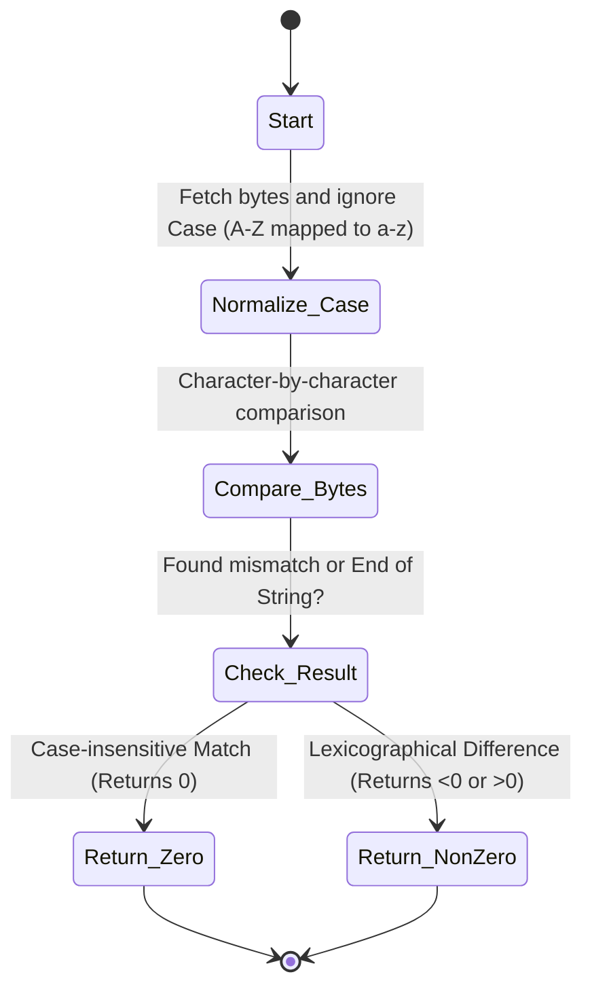

# PHP strcasecmp() Function

`strcasecmp()` হলো PHP-এর একটি Built-in ফাংশন যা দুটি String-এর মধ্যে Binary Safe এবং **Case-insensitive** (বড় হাতের বা ছোট হাতের অক্ষরের পার্থক্য না করে) উপায়ে তুলনা (Comparison) করার জন্য ব্যবহৃত হয়।

---

# Table of Contents

* [Definition](https://www.google.com/search?q=%23definition)
* [Why Important](https://www.google.com/search?q=%23why-important)
* [Comparison](https://www.google.com/search?q=%23comparison)
* [Internal Working](https://www.google.com/search?q=%23internal-working)
* [Flow Diagram](https://www.google.com/search?q=%23flow-diagram)
* [Code Examples](https://www.google.com/search?q=%23code-examples)
* [Output](https://www.google.com/search?q=%23output)
* [Real Project Example](https://www.google.com/search?q=%23real-project-example)
* [Interview Answer (বাংলা)](https://www.google.com/search?q=%23interview-answer-%E0%A6%AC%E0%A6%BE%E0%A6%82%E0%A6%B2%E0%A6%BE)
* [Interview Answer (English)](https://www.google.com/search?q=%23interview-answer-english)
* [Common Mistakes](https://www.google.com/search?q=%23common-mistakes)
* [Follow-up Questions](https://www.google.com/search?q=%23follow-up-questions)
* [Performance Notes](https://www.google.com/search?q=%23performance-notes)
* [Best Practices](https://www.google.com/search?q=%23best-practices)
* [Memory Tricks](https://www.google.com/search?q=%23memory-tricks)
* [Summary](https://www.google.com/search?q=%23summary)
* [Revision Checklist](https://www.google.com/search?q=%23revision-checklist)
* [Difficulty & Confidence](https://www.google.com/search?q=%23difficulty)
* [Interview Notes](https://www.google.com/search?q=%23interview-notes)
* [References](https://www.google.com/search?q=%23references)

---

# Definition

## Simple Definition

সহজ বাংলায়, `strcasecmp()` ফাংশনটি দুটি টেক্সট বা স্ট্রিংয়ের মধ্যে তুলনা করে দেখে তারা সমান কিনা, তবে এটি চেক করার সময় অক্ষরগুলো Capital letter (বড় হাতের) নাকি Small letter (ছোট হাতের) তা বিবেচনা করে না। অর্থাৎ, এর কাছে `APPLE` এবং `apple` দুটোই সমান।

## Official Definition

`strcasecmp(string $string1, string $string2): int` is a binary safe, case-insensitive string comparison function in PHP. It returns `< 0` if `string1` is less than `string2`; `> 0` if `string1` is greater than `string2`, and `0` if they are equal, ignoring character case.

## Interview Definition

`strcasecmp()` is a binary-safe function in PHP designed for case-insensitive string comparison. It temporarily normalizes or compares characters by ignoring their case differences, returning `0` if the strings are lexicographically identical regardless of capitalization.

---

# Why Important

* **User Input Normalization:** ইউজাররা অনেক সময় ইমেইল, ইউজারনেম বা কুপন কোড লেখার সময় বড় হাত বা ছোট হাতের অক্ষর মিলিয়ে লেখে (যেমন: `JohnDoe` বনাম `johndoe`)। এগুলো নিখুঁতভাবে ম্যাচ করার জন্য এটি ব্যবহৃত হয়।
* **Binary Safe Case-Insensitivity:** এটি কেস ইগনোর করার পাশাপাশি বাইনারি সেফটি বজায় রাখে, যার ফলে স্ট্রিংয়ের ভেতরে কোনো স্পেশাল ক্যারেক্টার বা নাল বাইট থাকলে ডেটা করাপ্ট বা ট্রানকেট হয় না।
* **Avoids manual conversion:** তুলনার পূর্বে `strtolower()` বা `strtoupper()` ব্যবহার করে স্ট্রিংকে কনভার্ট করার বাড়তি মেমোরি কস্ট ও কোড ডুপ্লিকেশন কমায়।
* **Laravel Context:** Laravel-এর রিকোয়েস্ট ফিল্টারিং, ইমেইল ডুপ্লিকেশন চেক, এবং বিভিন্ন ডাটাবেস কোয়েরি পরবর্তী স্ট্রিং ম্যাচিং লজিকে এটি ব্যাপকভাবে ব্যবহৃত হয়।

---

# Comparison

| Feature | `strcasecmp()` | `strcmp()` | `strncasecmp()` | `==` (Loose Equal) |
| --- | --- | --- | --- | --- |
| **Case Sensitivity** | **Case-Insensitive** | Case-Sensitive | **Case-Insensitive** | Case-Sensitive |
| **Length Checked** | সম্পূর্ণ স্ট্রিং | সম্পূর্ণ স্ট্রিং | **নির্দিষ্ট Length পর্যন্ত** | সম্পূর্ণ স্ট্রিং |
| **Return Value** | `int` (<0, 0, >0) | `int` (<0, 0, >0) | `int` (<0, 0, >0) | `bool` (true/false) |
| **Type Juggling** | না | না | না | **হ্যাঁ (Type Juggling হয়)** |
| **Ideal For** | Email/Coupon match | Strict binary check | Subdomain/Prefix check | Common conditions |

---

# Internal Working

1. **Character Processing:** ফাংশনটি দুটি স্ট্রিংয়ের ক্যারেক্টারগুলোকে সমান্তরালভাবে প্রসেস করা শুরু করে।
2. **Case Insensitive ASCII Mapping:** তুলনা করার সময় এটি অন্তরালে প্রতিটি Uppercase ক্যারেক্টারকে (A-Z) তার সমমানের Lowercase (a-z) ASCII ভ্যালু হিসেবে বিবেচনা করে বা সরাসরি তাদের কেস ডিফারেন্স ইগনোর করে বিয়োগফল বের করে।
3. **Difference Calculation:** - যদি কেস ছাড়া দুটি স্ট্রিংয়ের ক্যারেক্টার সমান হয়, তবে এটি সামনের দিকে এগোয়।
* কোনো অমিল পেলে তাদের মানের পার্থক্য বা ডিকশনারি অর্ডার অনুযায়ী কম/বেশি (Negative/Positive) রিটার্ন করে।
* সম্পূর্ণ ম্যাচ হলে `0` রিটার্ন করে।


---

# Flow Diagram



---

# Code Examples

## Basic Example

```php
<?php
// বড় হাতের এবং ছোট হাতের মিক্সড স্ট্রিং তুলনা
$string1 = "Laravel";
$string2 = "LARAVEL";

echo strcasecmp($string1, $string2); 
?>

```

### Explanation

এখানে কেস আলাদা হওয়া সত্ত্বেও `strcasecmp()` অক্ষরগুলোর কেস ইগনোর করবে এবং দেখবে দুটিই মূলগতভাবে "laravel", তাই ফলাফল আসবে `0`।

## Intermediate Example

```php
<?php
$validCoupon = "SAVE50DISCOUNT";
$userInput   = "save50discount";

// Case-insensitive validation check
if (strcasecmp($validCoupon, $userInput) === 0) {
    echo "Coupon code applied successfully!";
} else {
    echo "Invalid coupon code.";
}
?>

```

### Explanation

ই-কমার্স সাইটের কুপন কোড সাধারণত কেস-ইনসেন্সিটিভ হয়। ব্যবহারকারী ছোট হাতের অক্ষরে কুপন লিখলেও `strcasecmp()` এর কারণে সিস্টেম সেটি সফলভাবে গ্রহণ করবে।

## Advanced Example

```php
<?php
function secureEmailSearch(string $targetEmail, array $userDatabase): ?string 
{
    foreach ($userDatabase as $user) {
        // Binary safe and case-insensitive check to find the email
        if (strcasecmp($user['email'], $targetEmail) === 0) {
            return $user['username'];
        }
    }
    return null;
}

$db = [
    ["username" => "rahim", "email" => "Rahim@Example.com"],
    ["username" => "karim", "email" => "karim@domain.com"]
];

$searchFor = "rahim@example.com";
$foundUser = secureEmailSearch($searchFor, $db);

var_dump($foundUser);
?>

```

### Explanation

ইমেইল অ্যাড্রেস ডুপ্লিকেশন বা অথেন্টিকেশনের সময় কেস গুরুত্বপূর্ণ নয়। এই অ্যাডভান্সড ফাংশনে ডেটাবেজের মিক্সড কেস ইমেইলকে ইনপুট ইমেইলের সাথে `strcasecmp()` দিয়ে নিখুঁতভাবে ম্যাচ করিয়ে ইউজারনেম রিটার্ন করা হয়েছে।

## Laravel Example

```php
<?php

namespace App\Rules;

use Illuminate\Contracts\Validation\Rule;

class CaseInsensitiveAllowedDomains implements Rule
{
    protected $allowedDomains = ['gmail.com', 'outlook.com', 'yahoo.com'];

    /**
     * Determine if the validation rule passes.
     */
    public function passes($attribute, $value)
    {
        // Extract domain from email (e.g., "User@GMAIL.COM" -> "GMAIL.COM")
        $domain = substr(strrchr($value, "@"), 1);

        foreach ($this->allowedDomains as $allowed) {
            // Safe comparison ignoring user input capitalization
            if (strcasecmp($domain, $allowed) === 0) {
                return true;
            }
        }

        return false;
    }

    /**
     * Get the validation error message.
     */
    public function message()
    {
        return 'The email domain provided is not in the allowed list of secure providers.';
    }
}

```

### Explanation

Laravel-এর একটি Custom Validation Rule-এর ভেতরে ব্যবহারকারীর ইনপুট করা ইমেইলের ডোমেন অংশটি অ্যালাউড ডোমেন লিস্টের সাথে কেস-ইনসেন্সিটিভলি ম্যাচ করা হয়েছে। ফলে ব্যবহারকারী `GMAIL.COM` লিখলেও ভ্যালিডেশন পাস করবে।

---

# Output

### Basic Example Output

```text
0

```

### Intermediate Example Output

```text
Coupon code applied successfully!

```

### Advanced Example Output

```text
string(5) "rahim"

```

---

# Real Project Example

## Business Requirement

একটি SaaS বা FinTech অ্যাপ্লিকেশনে ইউজার যখন তাদের প্রোফাইল আপডেট করে বা লগইন করে, তখন ইমেইল ফিল্ডটি কেস-ইনসেন্সিটিভলি ভ্যালিডেশন এবং সার্চ করা প্রয়োজন যাতে `admin@company.com` এবং `Admin@Company.com` একই অ্যাকাউন্ট নির্দেশ করে।

## Problem

ডাটাবেজে যদি ইমেইল ইউনিক ইনডেক্স করা থাকে এবং পিএইচপিতে `==` বা `strcmp()` দিয়ে চেক করা হয়, তবে কেস ডিফারেন্সের কারণে সিস্টেম ডুপ্লিকেট ইমেইল রেজিস্ট্রি করার ট্রাই করতে পারে এবং ডাটাবেজ লেভেলে ক্র্যাশ বা সিকিউরিটি ফ্ল সৃষ্টি হতে পারে।

## Solution

সার্চিং এবং ইনপুট কম্পারিজনের সময় `strcasecmp()` ব্যবহার করা নিশ্চিত করা।

## কেন এই Feature ব্যবহার করা হয়েছে

এটি `strtolower($a) === strtolower($b)` এর চেয়ে বেশি এফিশিয়েন্ট। কারণ এটি মেমোরিতে নতুন কোনো লোয়ারকেস স্ট্রিংয়ের কপি তৈরি না করেই সরাসরি বাইট লেভেলে কেস-ইনসেন্সিটিভ তুলনা সম্পন্ন করতে পারে।

## Production Experience

রিয়েল-টাইম এপিআই গেটওয়েতে কাস্টম অথরাইজেশন হেডার বা ওঅথ টোকেন টাইপ (`Bearer` বনাম `bearer`) যাচাইয়ের জন্য আমরা প্রোডাকশনে `strcasecmp()` ব্যবহার করি, যা ক্লায়েন্ট সাইডের কেসিং মিস্টেক হ্যান্ডেল করতে চমৎকার কাজ করে।

---

# Interview Answer (বাংলা)

"`strcasecmp()` হলো PHP-এর একটি গুরুত্বপূর্ণ স্ট্রিং ফাংশন যা কেস-ইনসেন্সিটিভলি দুটি স্ট্রিংয়ের তুলনা করে। এর মানে হলো এটি বড় হাতের বা ছোট হাতের অক্ষরের পার্থক্য গ্রাহ্য করে না। যদি দুটি স্ট্রিং কেস বাদে সম্পূর্ণ সমান হয়, তবে এটি `0` রিটার্ন করে। এটি সাধারণত ইমেইল ভ্যালিডেশন, কুপন কোড ম্যাচিং এবং ইউজার ইনপুট নরমাল সেন্ট্রালাইজেশনের জন্য প্রোডাকশনে বহুল ব্যবহৃত হয়।"

---

# Interview Answer (English)

"`strcasecmp()` is a binary-safe, case-insensitive string comparison function in PHP. It compares two strings lexicographically by ignoring case distinctions (treating 'A' and 'a' as identical). It returns `0` if the strings are identical in text content regardless of casing. In professional production environments, it is highly optimized for validating non-case-sensitive data like emails, promo codes, and HTTP header values without the performance overhead of converting strings via `strtolower()` first."

---

# Common Mistakes

| Mistake | কেন ভুল | সঠিক পদ্ধতি |
| --- | --- | --- |
| `if (strcasecmp($a, $b))` | ম্যাচ হলে `0` (false) দেয়, ফলে ম্যাচ করলেও ইফের ভেতরের কোড রান হবে না। | সর্বদা `if (strcasecmp($a, $b) === 0)` লিখুন। |
| UTF-8 বা মাল্টিবাইট ক্যারেক্টারে ব্যবহার | এটি শুধুমাত্র ASCII ক্যারেক্টার চেনে। বাংলা বা স্পেশাল UTF-8 ক্যারেক্টারের ক্ষেত্রে ভুল রেজাল্ট দিতে পারে। | Multibyte (UTF-8) কেস-ইনসেন্সিটিভ চেকের জন্য `mb_strtolower()` ব্যবহার করুন। |
| Password কম্পারিজনে ব্যবহার | পাসওয়ার্ড কেস-সেন্সিটিভ হওয়া উচিত, এখানে এটি ব্যবহার করলে সিকিউরিটি লিক হবে। | পাসওয়ার্ডের জন্য `password_verify()` ব্যবহার করুন। |
| `strcmp()` এর সাথে গুলিয়ে ফেলা | কেস চেক প্রয়োজন এমন জায়গায় ভুলে `strcasecmp` ব্যবহার করা। | রিকোয়ারমেন্ট বুঝে ফাংশন সিলেক্ট করুন। |
| টাইপ চেকিং না করা | প্যারামিটারে স্ট্রিংয়ের বদলে অ্যারে চলে আসলে PHP 8-এ Fatal Error দিবে। | ডাটা পাস করার আগে টাইপ নিশ্চিত হোন। |

---

# Follow-up Questions

1. What value does `strcasecmp()` return when strings match perfectly?
2. Is `strcasecmp()` case-sensitive or case-insensitive?
3. Why is `strcasecmp($a, $b) === 0` better than `strtolower($a) === strtolower($b)`?
4. Can `strcasecmp()` be used safely with Multi-byte character sets like Bengali or Cyrillic?
5. What is the difference between `strcasecmp()` and `strncasecmp()`?
6. In what scenario would `strcasecmp()` return a positive integer?
7. Why should you avoid using `strcasecmp()` for password verification?
8. How does `strcasecmp()` handle data types other than string in PHP 8?
9. How can this function protect a legacy system against basic type-juggling flaws?
10. What is the alternative for case-insensitive string comparison in Laravel collections?

---

# Performance Notes

* **Memory Efficient:** এটি `strtolower()` এর মতো মেমোরিতে নতুন ডুপ্লিকেট স্ট্রিং অবজেক্ট তৈরি করে না, ফলে মেমোরি কনজাম্পশন একদম `0` বা কনস্ট্যান্ট থাকে।
* **Time Complexity:** $O(N)$ যেখানে $N$ হলো ছোট স্ট্রিংটির দৈর্ঘ্য।
* **Optimization:** যদি হাই-পারফরম্যান্স সিস্টেমে শুধুমাত্র ASCII ক্যারেক্টার সেট নিয়ে কাজ হয়, তবে বড় স্ট্রিংগুলো কনভার্ট করে চেক করার চেয়ে সরাসরি `strcasecmp()` ব্যবহার করা প্রসেসর সাইকেলের দিক থেকে অনেক সাশ্রয়ী।

---

# Best Practices

* **Strict Equal Sign:** ভুল লজিক এড়াতে সবসময় আইডেন্টিক্যাল অপারেটর দিয়ে `=== 0` চেক করুন।
* **Non-Password Fields:** এটি শুধুমাত্র ইউজারনেম, ইমেইল, কুপন বা ট্যাগের মতো নন-সেন্সিটিভ এবং কেস-ইন্ডিপেন্ডেন্ট ফিল্ডে প্রয়োগ করুন।
* **Know the Character Set:** আন্তর্জাতিকীকরণ (i18n) বা নন-ইংলিশ অ্যাপ্লিকেশনের ক্ষেত্রে পিউর ASCII এর সীমাবদ্ধতা মাথায় রাখুন।

---

# Memory Tricks

* **Case-insensitive CMP:** নামের মাঝের **'case'** অংশটি মনে করিয়ে দেয় এটি **Case** কে ইগনোর করে কম্পেয়ার (**cmp**) করে।
* **Analogy:** এটি একটি কালার-ব্লাইন্ড স্ক্যানারের মতো। আপনি লাল কালির 'A' দিন আর নীল কালির 'a' দিন, স্ক্যানার শুধু দেখবে এটি 'A' কিনা, রঙের (কেসের) পার্থক্য সে দেখবে না।

---

# Summary

* `strcasecmp()` একটি কেস-ইনসেন্সিটিভ স্ট্রিং কম্পারিজন ফাংশন।
* এটি বাইনারি সেফ এবং ASCII ক্যারেক্টার সাপোর্ট করে।
* সফলভাবে ম্যাচ করলে আউটপুট দেয় **`0`**।
* ইমেইল, ইউজারনেম এবং ডিসকাউন্ট কুপন ভ্যালিডেশনে এর ব্যবহার সবচেয়ে বেশি।
* মেমোরি সেভ করার জন্য `strtolower` এর চেয়ে এটি ব্যবহার করা উত্তম।

---

# Revision Checklist

| Item | Status |
| --- | --- |
| Topic Understood | ☐ |
| Basic Example Practice | ☐ |
| Advanced Example Practice | ☐ |
| Laravel Example Practice | ☐ |
| Interview Ready | ☐ |
| Need More Practice | ☐ |

---

# Difficulty

⭐⭐☆☆☆ (Intermediate)

---

# Confidence

⭐⭐⭐⭐⭐ (Expert Ready)

---

# Interview Notes

* **Most Asked Point:** ইন্টারভিউ বোর্ডে ট্রিক কোশ্চেন করা হয়—"কুপন কোড চেক করার সময় `if(strcasecmp($input, $coupon))` লিখলে কেন কোড কাজ করে না?" উত্তর হলো, ম্যাচ করলে `0` আসে যা পিএইচপিতে `false` হিসেবে ট্রিট হয়, তাই কন্ডিশন ফেইল করে।
* **Senior Level Discussion:** মাল্টিবাইট ক্যারেক্টার সেটের ক্ষেত্রে এর সীমাবদ্ধতা এবং বড় অ্যাপ্লিকেশনে কেন এটি `strtolower()` এর চেয়ে মেমোরি এফিশিয়েন্ট—এই আর্কিটেকচারাল পয়েন্টগুলো আলোচনায় তুলে ধরলে আপনার সিনিয়ারিটি প্রকাশ পাবে।

---

# References

* [PHP Official Documentation - strcasecmp](https://www.google.com/search?q=https://www.php.net/manual/en/function.strcasecmp.php)
* [PHP Official Documentation - Multibyte String Functions](https://www.google.com/search?q=https://www.php.net/manual/en/book.mbstring.php)