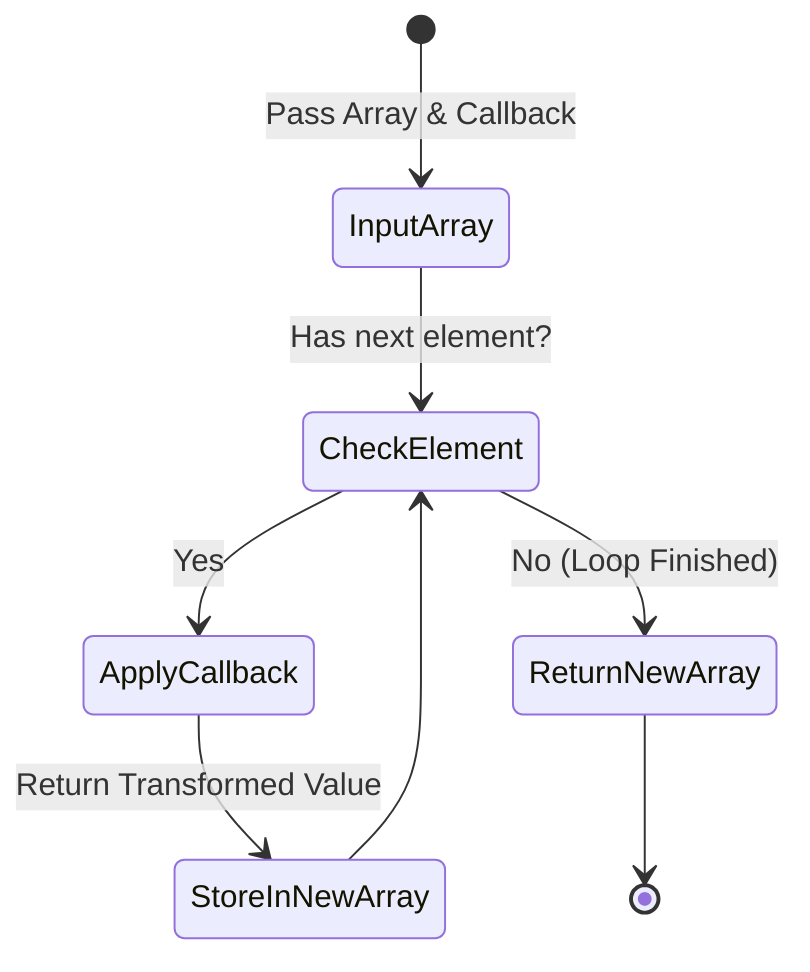

# Array Map

PHP-এর একটি অত্যন্ত শক্তিশালী Built-in Array Function যা কোনো Array-এর প্রতিটি Element-এর উপর একটি Callback Function Apply করে একটি নতুন Array Return করে।

---

# Table of Contents

* [Definition](#definition)
* [Why Important](#why-important)
* [Comparison](#comparison)
* [Internal Working](#internal-working)
* [Flow Diagram](#flow-diagram)
* [Code Examples](#code-examples)
* [Output](#output)
* [Real Project Example](#real-project-example)
* [Interview Answer (বাংলা)](#interview-answer-বাংলা)
* [Interview Answer (English)](#interview-answer-english)
* [Common Mistakes](#common-mistakes)
* [Follow-up Questions](#follow-up-questions)
* [Performance Notes](#performance-notes)
* [Best Practices](#best-practices)
* [Memory Tricks](#memory-tricks)
* [Summary](#summary)
* [Revision Checklist](#revision-checklist)

---

# Definition

## Simple Definition

সহজ বাংলায়, `array_map()` হলো একটি মেশিন বা প্রক্রিয়াকরণ টুল। আপনি একে একটি আইটেমের তালিকা (Array) এবং একটি নিয়ম (Callback Function) দেবেন; এটি তালিকার প্রতিটি আইটেমকে সেই নিয়ম অনুযায়ী পরিবর্তন করে আপনাকে সম্পূর্ণ নতুন একটি তালিকা তৈরি করে দেবে। আসল তালিকাটি অপরিবর্তিত থাকবে।

---

## Official Definition

`array_map()` applies the callback to the elements of the given arrays and returns a new array containing the modified results. The number of parameters that the callback function accepts must match the number of arrays passed to `array_map()`.

---

## Interview Definition

`array_map()` is a higher-order array function in PHP that iterates through one or more arrays, passes each element to a user-defined callback function, and returns a new array with the transformed values while preserving the original array (immutability).

---

# Why Important

* **Immutability (অপরিবর্তনশীলতা):** এটি মূল Array-কে Modify বা Mutate করে না, বরং একটি নতুন Transformed Array Return করে। ফলে Data Bug হবার সম্ভাবনা কমে যায়।
* **Eliminates Boilerplate Loop:** প্রথাগত `foreach` লুপ লিখে নতুন Array-তে Data Push করার বয়লারপ্লেট কোড লিখতে হয় না। কোডকে করে Clean এবং Readable।
* **Multiple Arrays Parallel Processing:** এটি একসাথে একাধিক Array নিয়ে সমান্তরালভাবে (Parallelly) কাজ করতে পারে, যা সাধারণ লুপ দিয়ে করতে গেলে কোড অনেক জটিল হয়ে যায়।

### কখন ব্যবহার করবেন

যখন আপনার একটি বিদ্যমান Array-এর প্রতিটি Element-কে কোনো নির্দিষ্ট Logic বা Transformation-এর মাধ্যমে পরিবর্তন করে ঠিক সমপরিমাণ (Same Length) Element বিশিষ্ট একটি নতুন Array তৈরি করার প্রয়োজন হয়।

### Laravel Context

Laravel Collections-এ ব্যাপকহারে `map()` Method ব্যবহার করা হয় (যেমন: `$collection->map(fn($item) => ...)`)। Laravel Eloquent API Resources বা Data Transformation-এর পেছনে এই Concept-টিই কাজ করে।

### Real Life Scenario

একটি ই-কমার্স প্ল্যাটফর্মে ইউজারদের অর্ডার করা প্রোডাক্টের প্রাইসগুলোর একটি Array আছে। ভ্যাট (VAT) যুক্ত করে নতুন প্রাইসের আরেকটি Array তৈরি করতে `array_map()` আদর্শ।

---

# Comparison

| Feature | `array_map()` | `array_walk()` | `foreach` Loop |
| --- | --- | --- | --- |
| **Return Value** | নতুন একটি Transformed Array Return করে। | Boolean (`true` on success, `false` on failure)। | কোনো Return Value নেই (Manual)। |
| **Original Array Modification** | মূল Array অপরিবর্তিত থাকে (Immutable)। | মূল Array-কে সরাসরি Modify করতে পারে (By Reference)। | মূল Array-কে Modify করতে পারে যদি `&` reference ব্যবহার করা হয়। |
| **Multiple Arrays Support** | একসাথে একাধিক Array Process করতে পারে। | শুধুমাত্র একটি Array নিয়ে কাজ করতে পারে। | একসাথে একাধিক Array সমান্তরালভাবে Process করা জটিল। |
| **Usage Intent** | Data Transformation / Mapping. | In-place Modification / Inspection. | General Purpose Iteration / Control Flow. |
| **Laravel Equivalent** | `$collection->map()` | `$collection->transform()` | `$collection->each()` |

---

# Internal Working

1. `array_map()` যখন কল হয়, তখন PHP Engine ইন্টারনালি Array-এর Internal Pointer-কে প্রথম Element-এ নিয়ে যায়।
2. এরপর এটি Callback Function-টিকে Execute করে এবং Array-এর বর্তমান Element-টিকে Parameter হিসেবে পাস করে।
3. Callback Function থেকে যে Value-টি Return হয়, তা একটি নতুন Temporary Array-তে জমা হয়।
4. এই প্রক্রিয়াটি Array-এর শেষ Element পর্যন্ত Step-by-Step চলতে থাকে।
5. যদি একাধিক Array পাস করা হয়, তবে এটি সবকটি Array থেকে একই Index-এর Element একসাথে নিয়ে Callback-এ পাস করে। যদি কোনো Array ছোট হয়, তবে তার জায়গায় `null` পাস হয়।

---

# Flow Diagram



---

# Code Examples

## Basic Example

```php
<?php
// প্রতিটি সংখ্যার বর্গ (Square) বের করা
$numbers = [1, 2, 3, 4, 5];

$squaredNumbers = array_map(function($num) {
    return $num * $num;
}, $numbers);

print_r($squaredNumbers);

```

### Explanation

এখানে `array_map()` প্রতিটি `$numbers`-এর Element-কে নিয়ে Anonymous Function-এর ভেতর পাঠাচ্ছে এবং বর্গ করে `$squaredNumbers` নামক নতুন একটি Array তৈরি করছে।

---

## Intermediate Example

Using Arrow Functions (PHP 7.4+) এবং Multiple Arrays Processing.

```php
<?php
$keys = ['first_name', 'last_name', 'role'];
$values = ['John', 'Doe', 'Developer'];

// একাধিক Array-কে একসাথে Combine করা
$profile = array_map(fn($key, $value) => [$key => $value], $keys, $values);

print_r($profile);

```

### Explanation

PHP 7.4-এর Arrow Function (`fn() =>`) ব্যবহার করা হয়েছে। এখানে `array_map()` একই সাথে `$keys` এবং `$values` থেকে Parallel-ভাবে Data নিয়ে Callback-এ পাঠাচ্ছে।

---

## Advanced Example

Using Class Methods as Callback এবং Array Utility.

```php
<?php

class PriceFormatter {
    private float $taxRate;

    public function __construct(float $taxRate) {
        $this->taxRate = $taxRate;
    }

    public function calculateTotal(float $price): string {
        $total = $price + ($price * $this->taxRate);
        return '$' . number_format($total, 2);
    }
}

$prices = [10.00, 20.50, 100.00];
$formatter = new PriceFormatter(0.15); // 15% Tax

// Class method-কে callback হিসেবে ব্যবহার
$finalPrices = array_map([$formatter, 'calculateTotal'], $prices);

print_r($finalPrices);

```

### Explanation

Callable Array Syntax `[$formatter, 'calculateTotal']` ব্যবহার করে একটি Object Method-কে `array_map()`-এর Callback হিসেবে সফলভাবে পাস করা হয়েছে, যা এন্টারপ্রাইজ অ্যাপ্লিকেশনে বহুল ব্যবহৃত।

---

## Laravel Example

```php
<?php

namespace App\Http\Controllers;

use App\Models\User;
use Illuminate\Http\Request;

class UserController extends Controller
{
    public function getActiveUsersEmails()
    {
        // Eloquent Collection থেকে Raw Array রূপান্তর
        $users = User::where('is_active', true)->get()->toArray();

        // array_map ব্যবহার করে শুধুমাত্র Email-এর Array তৈরি
        $emails = array_map(function($user) {
            return strtolower($user['email']);
        }, $users);

        return response()->json([
            'success' => true,
            'emails' => $emails
        ]);
    }
}

```

### Explanation

বাস্তব প্রোজেক্টে অনেক সময় Performance Optimization-এর জন্য Eloquent-এর ভারী Object-এর বদলে Raw Array নিয়ে কাজ করতে হয়। এখানে Active Users-দের ডাটা থেকে শুধুমাত্র ইমেইল ফিল্ডটি Extract এবং Sanitize করা হয়েছে।

---

# Output

### Output for Basic Example:

```php
Array
(
    [0] => 1
    [1] => 4
    [2] => 9
    [3] => 16
    [4] => 25
)

```

### Output for Intermediate Example:

```php
Array
(
    [0] => Array ( [first_name] => John )
    [1] => Array ( [last_name] => Doe )
    [2] => Array ( [role] => Developer )
)

```

### Output for Advanced Example:

```php
Array
(
    [0] => $11.50
    [1] => $23.58
    [2] => $115.00
)

```

---

# Real Project Example

## Business Requirement

একটি SaaS FinTech অ্যাপ্লিকেশনে, মাস শেষে ভেন্ডরদের পে-আউট (Payout) রিপোর্ট জেনারেট করতে হবে। ডাটাবেজে অ্যামাউন্টগুলো 'Cents' (Integer) হিসেবে সংরক্ষিত থাকে। আমাদের এটিকে 'USD' Currency ফরম্যাটে রূপান্তর করতে হবে এবং সিকিউরিটির জন্য সেনসিটিভ ভেন্ডর টাইটেল ট্রিম (Trim) ও স্যানিটাইজ করতে হবে।

## Problem

ডাটাবেজ থেকে আসা Raw Array-তে অনেকগুলো আনইউজড কলাম থাকে এবং অ্যামাউন্টগুলো ইন্টিজার ফরম্যাটে ($1 = 100 cents) থাকায় সরাসরি ফ্রন্টএন্ড বা রিপোর্টে পাঠানো যায় না। `foreach` লুপ দিয়ে করতে গেলে কোড অনেক বড় হয়ে যায় এবং References-এর কারণে মেমোরি ফাঁসের সম্ভাবনা থাকে।

## Solution

```php
<?php

$rawPayouts = [
    ['id' => 1, 'vendor' => '  Acme Corp  ', 'amount_cents' => 150050],
    ['id' => 2, 'vendor' => 'Stark Industries ', 'amount_cents' => 500000],
    ['id' => 3, 'vendor' => ' Wayne Ent. ', 'amount_cents' => 75000],
];

$sanitizedReports = array_map(function($payout) {
    return [
        'payout_id'   => $payout['id'],
        'vendor_name' => trim($payout['vendor']),
        'formatted_amount' => '$' . number_format($payout['amount_cents'] / 100, 2)
    ];
}, $rawPayouts);

print_r($sanitizedReports);

```

## কেন এই Feature ব্যবহার করা হয়েছে

`array_map()` ডাটার ইমিউটেবিলিটি নিশ্চিত করে মূল ডাটাকে অক্ষত রাখে এবং খুব সুনির্দিষ্টভাবে শুধুমাত্র প্রয়োজনীয় ফিল্ডগুলো ট্রান্সফর্ম করে নতুন একটি লাইটওয়েট স্ট্রাকচার রিটার্ন করে।

## Production Experience

FinTech অ্যাপ্লিকেশনে যেখানে মেমোরি ট্র্যাকিং ও ডাটা ইন্টিগ্রিটি প্রধান বিষয়, সেখানে `array_map()` ব্যবহার করলে সাইড-ইফেক্ট (Side-effects) মুক্ত কোড লেখা যায় যা ইউনিট টেস্টিং (Unit Testing)-এর জন্য অত্যন্ত সুবিধাজনক।

---

# Interview Answer (বাংলা)

> "`array_map()` হলো PHP-এর একটি Higher-order Array Function যা মূলত Data Transformation-এর জন্য ব্যবহৃত হয়। এটি এক বা একাধিক Array এবং একটি Callback Function ইনপুট হিসেবে নেয়। এরপর Array-এর প্রতিটি Element-কে ওই Callback Function-এর মধ্য দিয়ে পাস করিয়ে একটি সম্পূর্ণ নতুন Transformed Array রিটার্ন করে। এর সবচেয়ে বড় সুবিধা হলো এটি মূল Array-কে পরিবর্তন করে না, অর্থাৎ Immutability মেইনটেইন করে। বাস্তব প্রজেক্টে এপিআই রেসপন্স ফরম্যাটিং বা নির্দিষ্ট ডেটা স্যানিটাইজেশনের কাজে আমরা এটি ব্যবহার করি।"

---

# Interview Answer (English)

> "`array_map()` is a built-in higher-order array function in PHP designed for data transformation. It iterates over the elements of one or more arrays, applies a user-defined callback function to each element, and collects the returned values into a brand-new array. A crucial aspect of `array_map()` is that it preserves the original array, adhering to the principle of immutability. Furthermore, it supports processing multiple arrays in parallel. In enterprise applications, we frequently use it to format database result sets, sanitize inputs, or map raw data to API-compliant shapes."

---

# Common Mistakes

| Mistake | কেন ভুল | সঠিক পদ্ধতি |
| --- | --- | --- |
| **Callback-এ Return না করা** | Callback-এ `return` না দিলে নতুন Array-এর সব Value `null` হয়ে যাবে। | সর্বদা Callback এর ভেতর থেকে Transformed Value-টি `return` করতে হবে। |
| **Argument Order ভুল করা** | `array_map(callback, array)` আর `array_filter(array, callback)`-এর প্যারামিটার অর্ডার আলাদা। এটি গুলিয়ে ফেলা কমন ভুল। | মনে রাখুন: `array_map()`-এ **M**ap-এর **M** আগে, তাই **M**ethod/Callback আগে বসবে। |
| **Associative Array-এর Key আশা করা** | `array_map()` অ্যাসোসিয়েটিভ অ্যারের Key ধরে রাখতে পারে না, ইনডেক্স রিসেট হয়ে যায়। | অ্যাসোসিয়েটিভ অ্যারের Key এবং Value উভয়ই প্রসেস করতে চাইলে `array_walk()` বা `foreach` ব্যবহার করুন। |
| **একাধিক Array পাসের সময় অসঙ্গতি** | একাধিক Array পাস করলে এবং তাদের সাইজ সমান না হলে ছোট Array-র ক্ষেত্রে `null` পাস হয়, যা Error ঘটাতে পারে। | পাস করা সবকটি Array-র এলিমেন্ট সাইজ সমান আছে কিনা তা নিশ্চিত করা অথবা হ্যান্ডেল করা। |
| **Side-effects তৈরি করা** | Callback-এর ভেতর গ্লোবাল স্টেট পরিবর্তন করা বা ইনপুট মডিফাই করার চেষ্টা করা। | Callback-কে পিউর ফাংশন (Pure Function) হিসেবে রাখা, যা শুধু ইনপুট নিয়ে আউটপুট দেবে। |

---

# Follow-up Questions

* What is the parameter order of `array_map()` versus `array_filter()`?
* How does `array_map()` handle associative arrays?
* Can we pass multiple arrays to `array_map()`? If yes, how does it match elements?
* What happens if the callback function returns nothing in `array_map()`?
* How does `array_map()` differ from `array_walk()` regarding memory usage?
* Is it possible to use PHP built-in functions like `trim` or `strtoupper` directly as a callback in `array_map()`?
* How can you mimic `array_map()` behavior using a `foreach` loop?
* What is the performance impact of using `array_map()` over a traditional loop for large datasets?
* How do you implement `array_map()` functionality using Laravel Collections?
* Why is `array_map()` considered a functional programming concept?

---

# Performance Notes

* **Memory Usage:** যেহেতু `array_map()` সম্পূর্ণ নতুন একটি Array তৈরি করে মেমোরিতে রাখে, তাই বিশাল বড় ডেটাসেটের (যেমন: ১০০কে+ রো) ক্ষেত্রে এটি মেমোরি কনজাম্পশন (Memory Consumption) বাড়িয়ে দিতে পারে।
* **Time Complexity:** এর টাইম কমপ্লেক্সিটি $O(n)$, যেখানে $n$ হলো অ্যারের টোটাল এলিমেন্ট সংখ্যা।
* **Optimization Tip:** যদি মেমোরি অপটিমাইজেশন মুখ্য উদ্দেশ্য হয় এবং নতুন অ্যারের প্রয়োজন না থাকে, তবে `array_map()`-এর বদলে `array_walk()` বা জেনারেটর (`yield`) ব্যবহার করা শ্রেয়।

---

# Best Practices

* **Use Arrow Functions:** ছোট এবং সরল লজিকের ক্ষেত্রে PHP 7.4+ এর Arrow Functions (`fn() =>`) ব্যবহার করুন কোডের রিডাবিলিটি বাড়ানোর জন্য।
* **Keep Callbacks Pure:** Callback ফাংশনগুলোকে সবসময় "Pure" রাখুন, অর্থাৎ এরা যেন বাইরের কোনো ভ্যারিয়েবল মডিফাই না করে বা সাইড-ইফেক্ট তৈরি না করে।
* **Leverage Built-in Functions:** কাস্টম অ্যানোনিমাস ফাংশন না লিখে সরাসরি Built-in স্ট্রিং বা ম্যাথ ফাংশন পাস করুন। যেমন: `array_map('trim', $array)`।

---

# Memory Tricks

* **The "M" Rule:** `array_map()`-এর বানানে **M** দিয়ে শুরু। মনে রাখুন: **M**ethod/Callback আগে আসবে, **A**rray পরে আসবে। (`array_map($callback, $array)`)
* **Real Life Analogy:** ফ্যাক্টরির কনভেয়র বেল্ট (Conveyor Belt)। বেল্ট দিয়ে কাঁচামাল (Array) যাচ্ছে, মাঝখানে একজন রোবট (Callback) প্রতিটি মাল পরিবর্তন করছে এবং অপর প্রান্ত দিয়ে নতুন ফিনিশড প্রোডাক্ট বের হচ্ছে।

---

# Summary

1. `array_map()` একটি নতুন রূপান্তরিত (Transformed) অ্যারে রিটার্ন করে।
2. এটি মূল অ্যারে বা সোর্স ডেটাকে কখনো পরিবর্তন (Mutate) করে না।
3. প্যারামিটার অর্ডারে **Callback Function প্রথমে** এবং **Array দ্বিতীয় পজিশনে** থাকে।
4. অ্যাসোসিয়েটিভ অ্যারেতে ব্যবহার করলে এটি নিউমেরিক ইনডেক্সে রূপান্তর করে ফেলে।
5. একসাথে একাধিক অ্যারে সমান্তরালভাবে প্রসেস করতে পারে।
6. Callback ফাংশনে অবশ্যই ভ্যালু `return` করতে হবে, অন্যথায় `null` জমা হবে।
7. লজিক কোড সংক্ষিপ্ত করতে Arrow Function-এর সাথে এটি চমৎকার কাজ করে।
8. এটি মূলত Functional Programming-এর একটি অংশ।
9. বড় ডেটাসেটের ক্ষেত্রে এটি নতুন অ্যারে তৈরির কারণে বাড়তি মেমোরি নেয়।
10. Laravel-এর `$collection->map()` মেথডটি ইন্টারনালি এই কনসেপ্টেরই অবজেক্ট-ওরিয়েন্টেড রূপ।

---

# Revision Checklist

| Item | Status |
| --- | --- |
| Topic Understood | ☐ |
| Basic Example Practice | ☐ |
| Advanced Example Practice | ☐ |
| Laravel Example Practice | ☐ |
| Interview Ready | ☐ |
| Need More Practice | ☐ |

---

# Difficulty

⭐⭐☆☆☆ (Intermediate)

---

# Confidence

⭐⭐⭐⭐⭐

---

# Interview Notes

* **Most Asked Point:** ইন্টারভিউতে প্রায়ই `array_map()` এবং `array_walk()`-এর মূল পার্থক্য জিজ্ঞেস করা হয় (Return value vs Reference modification)।
* **Senior Level Discussion:** লার্জ স্কেল অ্যাপ্লিকেশনে মেমোরি অপটিমাইজেশনের প্রেক্ষিতে `array_map` বনাম `foreach`-এর ইমপ্যাক্ট এবং কখন জেনারেটর (Generators) ব্যবহার করতে হবে তা নিয়ে আলোচনা হতে পারে।
* **Laravel Interview Tips:** ইন্টারভিউয়ারকে ইমপ্রেস করতে বলুন যে, কিভাবে Laravel Collections-এর `map()` মেথড ব্যবহার করে ডেটা ট্রান্সফর্মেশন কোড আরও ফ্লুয়েন্ট এবং অবজেক্ট-ওরিয়েন্টেড করা যায়।

---

# References

* [PHP Official Documentation: array_map](https://www.php.net/manual/en/function.array-map.php)
* [Laravel Documentation: Collections Map](https://www.google.com/search?q=https://laravel.com/docs/collections%23method-map)