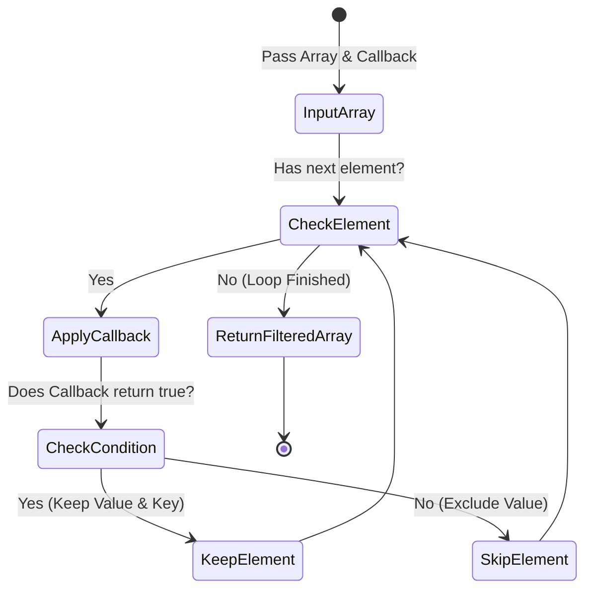

# Array Filter

PHP-এর একটি অত্যন্ত দরকারী Built-in Array Function যা কোনো Array-এর প্রতিটি Element-কে একটি Callback Function (Predicate) দ্বারা পরীক্ষা করে এবং নির্দিষ্ট শর্ত পূরণকারী Element-গুলো নিয়ে একটি নতুন filtered Array Return করে।

---

# Table of Contents

* [Definition](#definition)
* [Why Important](#why-important)
* [Comparison](#comparison)
* [Internal Working](#internal-working)
* [Flow Diagram](#flow-diagram)
* [Code Examples](#code-examples)
* [Output](#output)
* [Real Project Example](#real-project-example)
* [Interview Answer (বাংলা)](#interview-answer-বাংলা)
* [Interview Answer (English)](#interview-answer-english)
* [Common Mistakes](#common-mistakes)
* [Follow-up Questions](#follow-up-questions)
* [Performance Notes](#performance-notes)
* [Best Practices](#best-practices)
* [Memory Tricks](#memory-tricks)
* [Summary](#summary)
* [Revision Checklist](#revision-checklist)

---

# Definition

## Simple Definition

সহজ বাংলায়, `array_filter()` হলো একটি চালুনী বা ছাঁকনি (Filter)। আপনি একে একটি তালিকা (Array) এবং একটি শর্ত (Callback Function) দেবেন; এটি তালিকার প্রতিটি আইটেম পরীক্ষা করে দেখবে। যে আইটেমগুলো শর্ত পূরণ করবে, সেগুলোকে রেখে বাকিগুলো ফেলে দিয়ে আপনাকে একটি নতুন ছাঁকা তালিকা দেবে।

---

## Official Definition

`array_filter()` filters elements of an array using a callback function. If the callback function returns true, the current value from the array is returned into the result array. Array keys are preserved.

---

## Interview Definition

`array_filter()` is a higher-order array function in PHP that iterates through an array and passes each value to a callback function. If the callback returns `true`, the value is included in the resulting array; otherwise, it is excluded. By default, it preserves the original keys of the array.

---

# Why Important

* **Data Cleansing (ডাটা ক্লিনজিং):** Array থেকে কোনো অবাঞ্ছিত Data, যেমন: `null`, `false`, খালি স্ট্রিং (`""`), বা `0` সহজে দূর করতে এটি ব্যবহার করা হয়।
* **Immutability (অপরিবর্তনশীলতা):** এটি মূল Array-কে Mutate বা পরিবর্তন করে না, বরং শর্তসাপেক্ষে Filtered Data নিয়ে একটি নতুন Array তৈরি করে।
* **Flag-Based Filtering:** PHP 5.6+ থেকে এটি শুধুমাত্র Value নয়, বরং Array-এর Key অথবা Key ও Value উভয় নিয়েই Filter করার সুবিধা দেয় (Using Flags)।

### কখন ব্যবহার করবেন

যখন আপনার একটি বিদ্যমান Array থেকে নির্দিষ্ট কোনো Criteria বা Logic-এর ওপর ভিত্তি করে কিছু Element বাদ দেওয়ার এবং কিছু Element রেখে দেওয়ার প্রয়োজন হয়।

### Laravel Context

Laravel Collections-এ ব্যাপকহারে `$collection->filter(fn($value) => ...)` ব্যবহার করা হয়, যা এই PHP `array_filter()`-এর ওপর ভিত্তি করেই তৈরি এবং ডাটা স্যানিটাইজেশনে ব্যবহৃত হয়।

### Real Life Scenario

একটি ব্লগ অ্যাপ্লিকেশনে ডাটাবেজ থেকে সব পোস্ট তুলে আনার পর, শুধুমাত্র যে পোস্টগুলোর Status 'Published', সেগুলোকে আলাদা করার জন্য `array_filter()` অত্যন্ত উপযোগী।

---

# Comparison

| Feature | `array_filter()` | `array_map()` | `array_intersect()` |
| --- | --- | --- | --- |
| **Return Value** | ফিল্টার করা এবং শুধুমাত্র শর্ত পূরণ করা Element-এর নতুন Array। | মূল Array-এর সমান দৈর্ঘ্যের রূপান্তরিত (Transformed) নতুন Array। | একাধিক অ্যারের মধ্যে কমন থাকা এলিমেন্টগুলোর নতুন Array। |
| **Array Length** | সাধারণত মূল Array-এর চেয়ে ছোট বা সমান হয়। | মূল Array-এর দৈর্ঘ্যের সমান থাকে। | তুলনামূলক ছোট বা সমান হয়। |
| **Key Preservation** | অ্যাসোসিয়েটিভ এবং নিউমেরিক উভয় ক্ষেত্রে **Original Keys অক্ষত থাকে**। | নিউমেরিক ইনডেক্স রিসেট হয়ে যায় ($0, 1, 2...$)। | মূল অ্যারের কি (Keys) অক্ষত থাকে। |
| **Callback Usage** | Callback-কে Boolean (`true`/`false`) রিটার্ন করতে হয়। | Callback-কে Transformed Value রিটার্ন করতে হয়। | কোনো কাস্টম Callback লাগে না (সাধারণ সংস্করণে)। |
| **Laravel Equivalent** | `$collection->filter()` | `$collection->map()` | `$collection->intersect()` |

---

# Internal Working

1. `array_filter()` যখন কল হয়, তখন এটি Array-এর প্রথম Element থেকে শুরু করে প্রতিটি Element-কে ক্রমান্বয়ে Loop করে।
2. প্রতিটি Element-কে এটি নির্দিষ্ট করা Callback Function-এ আর্গুমেন্ট হিসেবে পাস করে।
3. Callback Function-টি যদি Boolean `true` (বা truthy value) রিটার্ন করে, তবে সেই Element এবং তার মূল Key-টিকে একটি নতুন Result Array-তে যুক্ত করা হয়।
4. যদি Callback ফাংশন `false` (বা falsy value) রিটার্ন করে, তবে সেটিকে বাদ দেওয়া হয়।
5. **বিশেষ নোট:** যদি কোনো Callback Function দেওয়া না হয়, তবে PHP বাই-ডিফল্ট সব 'Falsy' Values (যেমন: `null`, `0`, `""`, `[]`, `false`) অ্যারে থেকে রিমুভ করে দেয়।

---

# Flow Diagram



---

# Code Examples

## Basic Example

Without Callback (Removing Falsy Values).

```php
<?php
// অ্যারে থেকে সব 'Falsy' ভ্যালু ফিল্টার করা
$dirtyData = [0, 1, false, 2, '', 3, null, [], 4];

$cleanData = array_filter($dirtyData);

print_r($cleanData);

```

### Explanation

এখানে কোনো Callback পাস করা হয়নি। ফলে PHP নিজে থেকেই `0`, `false`, `''` (خালি স্ট্রিং), `null`, এবং `[]` (খালি অ্যারে) বাদ দিয়ে শুধু Truthy ভ্যালুগুলো রেখেছে। লক্ষ্য করুন, কি (Keys) কিন্তু সংরক্ষিত আছে (যেমন: ১-এর ইনডেক্স ১, ৪-এর ইনডেক্স ৮)।

---

## Intermediate Example

Using Array Filter with Custom Logic and Arrow Function.

```php
<?php
// শুধুমাত্র জোড় সংখ্যা (Even Numbers) ফিল্টার করা
$numbers = [12, 5, 8, 23, 42, 15];

$evenNumbers = array_filter($numbers, fn($num) => $num % 2 === 0);

print_r($evenNumbers);

```

### Explanation

PHP 7.4-এর Short Closure/Arrow Function ব্যবহার করে একটি কন্ডিশন দেওয়া হয়েছে। যে সংখ্যাগুলো ২ দ্বারা নিঃশেষে বিভাজ্য, শুধু সেগুলোই নতুন অ্যারেতে যুক্ত হচ্ছে।

---

## Advanced Example

Using Flags to Filter by Key and Value.

```php
<?php
$cart = [
    'prod_1' => ['price' => 50, 'status' => 'active'],
    'test_item' => ['price' => 0, 'status' => 'inactive'],
    'prod_2' => ['price' => 120, 'status' => 'active'],
    'draft_prod' => ['price' => 90, 'status' => 'active']
];

// শর্ত: Key-তে 'prod_' থাকতে হবে এবং Status 'active' হতে হবে
$filteredCart = array_filter(
    $cart,
    fn($value, $key) => str_starts_with($key, 'prod_') && $value['status'] === 'active',
    ARRAY_FILTER_USE_BOTH
);

print_r($filteredCart);

```

### Explanation

এখানে `ARRAY_FILTER_USE_BOTH` ফ্ল্যাগ ব্যবহার করা হয়েছে, যা Callback-এর ভেতর `$value` এবং `$key` উভয়কেই অ্যাক্সেস করতে দেয়। এর ফলে আমরা যেমন প্রোডাক্টের স্টেটাস চেক করতে পেরেছি, তেমনই কি-এর নাম 'prod_' দিয়ে শুরু কিনা তাও ভ্যালিডেট করতে পেরেছি।

---

## Laravel Example

```php
<?php

namespace App\Http\Controllers;

use App\Models\Product;
use Illuminate\Http\Request;

class ProductController extends Controller
{
    public function getAvailablePremiumProducts()
    {
        // ডাটাবেজ থেকে অ্যারে আকারে ডাটা আনা
        $products = Product::all()->toArray();

        // প্রিমিয়াম ও স্টক থাকা প্রোডাক্ট ফিল্টার
        $premiumAvailable = array_filter($products, function($product) {
            return $product['price'] >= 100 && $product['stock'] > 0;
        });

        // ইনডেক্স রিসেট করতে array_values ব্যবহার (API Response Standard-এর জন্য)
        return response()->json([
            'success' => true,
            'data' => array_values($premiumAvailable)
        ]);
    }
}

```

### Explanation

বাস্তব প্রোজেক্টে এপিআই রেসপন্স দেওয়ার সময় কাস্টম ফিল্টারিং শেষে ইনডেক্স ঠিক রাখা জরুরি। `array_filter()` মূল কি অক্ষত রাখায় আউটপুট অবজেক্টের মতো দেখাতে পারে, তাই JSON-এ সুন্দর সিকোয়েন্সিয়াল অ্যারে পেতে `array_values()` দিয়ে র্যাপ করা হয়েছে।

---

# Output

### Output for Basic Example:

```php
Array
(
    [1] => 1
    [3] => 2
    [5] => 3
    [8] => 4
)

```

### Output for Intermediate Example:

```php
Array
(
    [0] => 12
    [2] => 8
    [4] => 42
)

```

### Output for Advanced Example:

```php
Array
(
    [prod_1] => Array ( [price] => 50, [status] => active )
    [prod_2] => Array ( [price] => 120, [status] => active )
)

```

---

# Real Project Example

## Business Requirement

একটি E-Commerce বা SaaS অ্যাপ্লিকেশনে ব্যবহারকারী যখন কার্ট (Cart) সাবমিট করেন, তখন ব্যাকএন্ডে ইনভেন্টরি চেক করতে হয়। ব্যবহারকারী কিছু আইটেমের সংখ্যা (Quantity) ভুল করে `0` বা নেগেটিভ দিতে পারেন, অথবা কিছু আইটেম আউট অফ স্টক থাকতে পারে। আমাদের কার্ট প্রসেস করার আগে এই অবৈধ আইটেমগুলো ছাঁটাই করতে হবে।

## Problem

ইউজার ইনপুট থেকে আসা র ডেটায় কার্টের ইনডেক্সগুলো প্রোডাক্ট আইডি নির্দেশ করে। যদি আমরা সাধারণ লুপ চালিয়ে নতুন অ্যারেতে ডাটা পুশ করি, তবে অ্যাসোসিয়েটিভ আইডিগুলো হারিয়ে যেতে পারে যা পরবর্তীতে ইনভয়েস জেনারেশনে সমস্যা করবে।

## Solution

```php
<?php

$submittedCart = [
    102 => ['qty' => 2, 'in_stock' => true],
    105 => ['qty' => 0, 'in_stock' => true],  // ভুল ইনপুট
    108 => ['qty' => 1, 'in_stock' => false], // আউট অফ স্টক
    110 => ['qty' => 5, 'in_stock' => true],
];

// শুধুমাত্র ভ্যালিড এবং ইন-স্টক আইটেম রাখা
$validCart = array_filter($submittedCart, function($item) {
    return $item['qty'] > 0 && $item['in_stock'] === true;
});

print_r($validCart);

```

## কেন এই Feature ব্যবহার করা হয়েছে

`array_filter()` ব্যবহারের ফলে মূল প্রোডাক্ট আইডি (যেমন: `102`, `110`) ইনডেক্স হিসেবে হুবহু সংরক্ষিত থাকে এবং কোড একদম সংক্ষিপ্ত ও বাগ-মুক্ত হয়।

## Production Experience

FinTech বা Order Processing-এর মতো ক্রিটিক্যাল সিস্টেমে ইনপুট স্যানিটাইজেশনে `array_filter()` একটি স্ট্যান্ডার্ড প্র্যাকটিস। এটি সাইড-ইফেক্ট ছাড়াই সরাসরি ইনভ্যালিড পেলোড রিজেক্ট করতে সাহায্য করে।

---

# Interview Answer (বাংলা)

> "`array_filter()` হলো PHP-এর একটি খুবই দরকারী built-in function যা মূলত কোনো অ্যারে থেকে নির্দিষ্ট শর্তের ভিত্তিতে ডেটা ছাঁটাই বা ফিল্টার করার জন্য ব্যবহৃত হয়। এটি একটি অ্যারে এবং একটি কলব্যাক ফাংশন গ্রহণ করে। প্রতিটি উপাদানের জন্য কলব্যাক ফাংশনটি যদি `true` রিটার্ন করে, তবে সেই উপাদানটি নতুন ফিল্টার্ড অ্যারেতে থেকে যায়, অন্যথায় বাদ পড়ে। এর একটি বড় বৈশিষ্ট্য হলো এটি অ্যারের অরিজিনাল কি (Keys) সংরক্ষণ করে। আর যদি কোনো কলব্যাক দেওয়া না হয়, তবে এটি বাই-ডিফল্ট অ্যারে থেকে সব falsy ভ্যালু রিমুভ করে দেয়।"

---

# Interview Answer (English)

> "`array_filter()` is a powerful higher-order array function in PHP used to selectively filter elements of an array based on a callback condition. It iterates through the array, applying the callback function to each item. If the callback returns `true`, the element is retained in the new filtered array; otherwise, it is omitted. Crucially, `array_filter()` preserves the original keys of the array. Additionally, if the callback argument is omitted, PHP automatically filters out all falsy values like `null`, `false`, `0`, and empty strings. It also supports filtering by keys or both via flags."

---

# Common Mistakes

| Mistake | কেন ভুল | সঠিক পদ্ধতি |
| --- | --- | --- |
| **প্যারামিটার অর্ডার ভুল করা** | `array_filter($array, $callback)`-এ অ্যারে আগে বসে, যা `array_map()`-এর উল্টো। | মনে রাখুন: **F**ilter-এর **F** দিয়ে **F**irst, অর্থাৎ **A**rray **F**irst। |
| **API Response-এ Keys রিমেম্বার না করা** | `array_filter()` নিউমেরিক কি অ্যাসোসিয়েটিভের মতো রেখে দেয়, যা JSON-এ এনকোড হলে অবজেক্ট হয়ে যায়। | ফ্রন্টএন্ডে ক্লিন অ্যারে পাঠাতে আউটপুটকে `array_values($filteredArray)` দিয়ে ইনডেক্স রিসেট করুন। |
| **`0` বা `""` ডেটা হারিয়ে ফেলা** | কলব্যাক ছাড়া `array_filter()` কল করলে `0` বা খালি স্ট্রিংও ফালসি ভ্যালু হিসেবে ডিলিট হয়ে যায়, যা হয়তো আপনার ডেটায় দরকার ছিল। | যদি শুধু `null` সরাতে চান, তবে স্পষ্ট কলব্যাক লিখুন: `fn($val) => !is_null($val)`। |
| **কলব্যাকে Boolean রিটার্ন না করা** | কলব্যাক থেকে ভ্যালু রিটার্ন করলে ট্রুথি/ফালসি চেক হয়, যা অনেক সময় কনফিউশন তৈরি করে। | কলব্যাক থেকে সবসময় এক্সপ্লিসিটলি `true` বা `false` কম্পারিজনের মাধ্যমে রিটার্ন করুন। |
| **ফ্ল্যাগ ব্যবহার না করেই `$key` আশা করা** | ৩য় প্যারামিটার (Flag) না দিয়ে কলব্যাকে `$key` রিসিভ করার চেষ্টা করলে কাজ করবে না। | কি (Key) ফিল্টারিং করতে অবশ্যই `ARRAY_FILTER_USE_KEY` বা `BOTH` ফ্ল্যাগ পাস করুন। |

---

# Follow-up Questions

* What is the default behavior of `array_filter()` if no callback is provided?
* How do you reset the numeric keys of an array after applying `array_filter()`?
* What are the available flags for `array_filter()` and what do they do?
* Difference between `array_filter()` and `array_map()` in terms of parameter order and return array length?
* Does `array_filter()` modify the original array?
* Why does a filtered numeric array turn into a JSON object in a Laravel API response?
* How to filter an array only by its keys using `array_filter()`?
* What is the performance impact of `array_filter()` on very large arrays?
* Can you pass a class method as a callback to `array_filter()`?
* How does Laravel Collection's `filter()` method differ from native `array_filter()`?

---

# Performance Notes

* **Memory Usage:** এটি একটি নতুন ফিল্টার্ড অ্যারে রিটার্ন করায় মেমোরিতে নতুন ডাটা স্ট্রাকচার তৈরি হয়। তবে অবান্তর ডাটা বাদ পড়ায় ওভারঅল মেমোরি রিলিজ হতে সুবিধা হয়।
* **Time Complexity:** অ্যারের প্রতিটি এলিমেন্টকে একবার ভিজিট করতে হয় বলে এর টাইম কমপ্লেক্সিটি $O(n)$।
* **Optimization Tip:** যদি ডাটা ফিল্টার করার পর সঙ্গে সঙ্গে লুপ চালাতে চান, তবে কাস্টম `foreach` ও সর্তের ব্যবহার মেমোরি অ্যালোকেশন এক ধাপ কমাতে পারে, তবে কোডের রিডাবিলিটি নষ্ট হয়।

---

# Best Practices

* **Always Reset Keys for Sequential Arrays:** ফিল্টার করার পর যদি ডাটাটি কোনো JavaScript ক্লায়েন্ট বা API-তে পাঠাতে হয়, তবে `array_values()` ব্যবহার করে কি ইনডেক্স রিসেট করা নিশ্চিত করুন।
* **Use Strict Comparison:** কলব্যাকের কন্ডিশনে সবসময় টাইপ সেফটি বজায় রাখতে Strict Comparison (`===`) ব্যবহার করুন।
* **Leverage Arrow Functions:** কোড ক্লিন ও কনসাইজ রাখতে এবং `use` কিওয়ার্ড ছাড়া প্যারেন্ট স্কোপের ভ্যারিয়েবল অ্যাক্সেস করতে Arrow Functions ব্যবহার করুন।

---

# Memory Tricks

* **The "F" Rule (First):** `array_filter()`-এর বানানে **F** আছে। মনে রাখুন: **F**or **F**ilter, **A**rray comes **F**irst. (`array_filter($array, $callback)`)
* **Real Life Analogy:** সিকিউরিটি গার্ড মেটাল ডিটেক্টর নিয়ে দাঁড়িয়ে আছে। একেকজন মানুষ (Element) আসছে, চেক (Callback) হচ্ছে, পাস (True) করলে ভেতরে যাচ্ছে, না হলে ফেরত পাঠানো হচ্ছে।

---

# Summary

1. `array_filter()` শর্তের ভিত্তিতে অ্যারের উপাদান ছাঁটাই করে।
2. এটি মূল অ্যারের কোনো পরিবর্তন করে না (Immutable)।
3. এর প্যারামিটার অর্ডারে **Array প্রথমে** এবং **Callback ফাংশন দ্বিতীয় পজিশনে** থাকে।
4. ফিল্টারিংয়ের পরেও অ্যারের **মূল কি (Keys) সংরক্ষিত থাকে**।
5. কলব্যাক ফাংশন না দিলে সব Falsy ভ্যালু (`0`, `null`, `false`, `""`) স্বয়ংক্রিয়ভাবে রিমুভ হয়।
6. ৩য় প্যারামিটার হিসেবে `ARRAY_FILTER_USE_KEY` বা `ARRAY_FILTER_USE_BOTH` ফ্ল্যাগ ব্যবহার করা যায়।
7. এটি মূলত Boolean True/False রিটার্নের ওপর ভিত্তি করে কাজ করে।
8. API রেসপন্সে পাঠানোর আগে `array_values()` দিয়ে ইনডেক্স ঠিক করা বেস্ট প্র্যাকটিস।
9. এটি Functional Programming-এর একটি গুরুত্বপূর্ণ টুল।
10. Laravel-এর `$collection->filter()` মেথডটির মূল ভিত্তি এই ফাংশনটিই।

---

# Revision Checklist

| Item | Status |
| --- | --- |
| Topic Understood | ☐ |
| Basic Example Practice | ☐ |
| Advanced Example Practice | ☐ |
| Laravel Example Practice | ☐ |
| Interview Ready | ☐ |
| Need More Practice | ☐ |

---

# Difficulty

⭐⭐☆☆☆ (Intermediate)

---

# Confidence

⭐⭐⭐⭐⭐

---

# Interview Notes

* **Most Asked Point:** ইন্টারভিউতে প্রায়ই জিজ্ঞেস করা হয় কলব্যাক ছাড়া `array_filter` কল করলে কী হয় এবং এটি কীভাবে `0` বা `""` এর মতো ভ্যালিড ডেটাকে ইফেক্ট করে।
* **Senior Level Discussion:** অ্যাসোসিয়েটিভ ও নিউমেরিক অ্যারে ফিল্টার করার পর `json_encode()` করলে আউটপুটে কীভাবে প্রভাব পড়ে এবং `array_values()`-এর প্রয়োজনীয়তা নিয়ে গভীর আলোচনা হতে পারে।
* **Laravel Interview Tips:** ইন্টারভিউয়ারকে জানান যে র পিএইচপি-র `array_filter`-এর প্যারামিটার অর্ডার এবং লারাভেল কালেকশনের `filter` মেথডের স্ট্রাকচারগত মিল ও ইন্টারনাল সুবিধাগুলো আপনি জানেন।

---

# References

* [PHP Official Documentation: array_filter](https://www.php.net/manual/en/function.array-filter.php)
* [Laravel Documentation: Collections Filter](https://www.google.com/search?q=https://laravel.com/docs/collections%23method-filter)