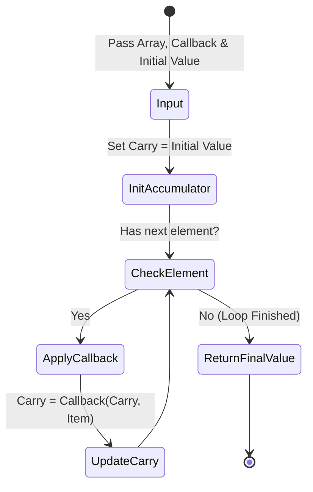

# Array Reduce

PHP-এর একটি অত্যন্ত শক্তিশালী Built-in Array Function যা কোনো Array-এর প্রতিটি Element-কে একটি Callback Function-এর মাধ্যমে ক্রমান্বয়ে Process করে পরিশেষে একটিমাত্র Single Value (যেমন: একটি Integer, String, বা Object)-তে রূপান্তর বা রিডিউস করে।

---

# Table of Contents

* [Definition](#definition)
* [Why Important](#why-important)
* [Comparison](#comparison)
* [Internal Working](#internal-working)
* [Flow Diagram](#flow-diagram)
* [Code Examples](#code-examples)
* [Output](#output)
* [Real Project Example](#real-project-example)
* [Interview Answer (বাংলা)](#interview-answer-বাংলা)
* [Interview Answer (English)](#interview-answer-english)
* [Common Mistakes](#common-mistakes)
* [Follow-up Questions](#follow-up-questions)
* [Performance Notes](#performance-notes)
* [Best Practices](#best-practices)
* [Memory Tricks](#memory-tricks)
* [Summary](#summary)
* [Revision Checklist](#revision-checklist)

---

# Definition

## Simple Definition

সহজ বাংলায়, `array_reduce()` হলো একটি মাটির ব্যাংক বা জমানোর পাত্র। আপনি একে একটি তালিকা (Array), একটি নিয়ম (Callback Function) এবং একটি শুরুর ভ্যালু (Initial Value) দেবেন। এটি তালিকার প্রথম থেকে শেষ পর্যন্ত প্রতিটি আইটেম ধরবে এবং নিয়মানুযায়ী পূর্বের জমানো ভ্যালুর সাথে নতুন আইটেমটি যোগ/প্রসেস করে সবশেষে একটি মাত্র চূড়ান্ত রেজাল্ট আপনার হাতে তুলে দেবে।

---

## Official Definition

`array_reduce()` applies iteratively the callback function to the elements of the array, so as to reduce the array to a single value.

---

## Interview Definition

`array_reduce()` is a higher-order array function in PHP used for data aggregation. It iteratively processes each element of an array using a callback function, carrying over an accumulator value from the previous iteration, and ultimately collapses the entire array into a single scalar or object value.

---

# Why Important

* **Data Aggregation (ডাটা পুঞ্জীভূতকরণ):** একটি অ্যারে থেকে টোটাল সামেশন (Summation), প্রোডাক্ট (Product), বা কোনো কমপ্লেক্স চেইন ক্যালকুলেশন করে একটি সিঙ্গেল রেজাল্ট বের করতে এটি ব্যবহার করা হয়।
* **State Carrying Capability:** এটি ইটারেশনের সময় এক ধাপের আউটপুট পরবর্তী ধাপে বহন করে নিয়ে যেতে পারে (via Accumulator), যা `array_map` বা `array_filter` সরাসরি পারে না।
* **Functional Alternative to Loops:** `foreach` লুপ ব্যবহার করে বাইরে একটি গ্লোবাল স্টেট বা ভ্যারিয়েবল ডিক্লেয়ার করে ডাটা পুশ করার প্রথাগত বয়লারপ্লেট কোড এড়ানো যায়।

### কখন ব্যবহার করবেন

যখন আপনার একটি সম্পূর্ণ Array-কে প্রসেস করে কোনো একটি নির্দিষ্ট Single Value (যেমন: মোট খরচ, সর্বোচ্চ সংখ্যা, একটি কম্বাইন্ড স্ট্রিং ইত্যাদি) তৈরি করার প্রয়োজন হয়।

### Laravel Context

Laravel Collections-এ বহুল ব্যবহৃত `$collection->reduce(fn($carry, $item) => ...)` মেথডটির পেছনে এই ফাংশনটিই মূল চালিকাশক্তি হিসেবে কাজ করে।

### Real Life Scenario

একটি কার্ট সিস্টেমে যতগুলো প্রোডাক্ট আছে, সেগুলোর দাম এবং পরিমাণের ওপর ভিত্তি করে পুরো কার্টের সর্বমোট সাবটোটাল (Subtotal) হিসাব করার জন্য `array_reduce()` সেরা পছন্দ।

---

# Comparison

| Feature | `array_reduce()` | `array_map()` | `array_filter()` |
| --- | --- | --- | --- |
| **Return Value** | একটি মাত্র Single Value (Scalar, Array, or Object)। | সমপরিমাণ দৈর্ঘ্যের একটি নতুন Transformed Array। | শর্ত পূরণ করা এলিমেন্টগুলোর একটি ছোট বা সমান নতুন Array। |
| **Primary Purpose** | Aggregation / Accumulation (সংক্ষিপ্তকরণ)। | Transformation / Mapping (রূপান্তর)। | Selection / Cleansing (ছাঁটাই)। |
| **Accumulator State** | স্টেট বহন করার জন্য `carry` ভ্যারিয়েবল থাকে। | কোনো স্টেট থাকে না, প্রতিটি উপাদান স্বাধীনভাবে কাজ করে। | কোনো স্টেট থাকে না, প্রতিটি উপাদান স্বাধীনভাবে কাজ করে। |
| **Initial Value Parameter** | ৩য় প্যারামিটার হিসেবে একটি Initial/Default Value দেওয়া যায়। | কোনো Initial Value-র সুযোগ নেই। | কোনো Initial Value-র সুযোগ নেই। |
| **Laravel Equivalent** | `$collection->reduce()` | `$collection->map()` | `$collection->filter()` |

---

# Internal Working

1. `array_reduce()` এক্সিকিউট হওয়ার সময় ৩টি জিনিস গ্রহণ করে: Array, Callback Function, এবং একটি ঐচ্ছিক Initial Value (যাকে Accumulator বা Carry বলা হয়)।
2. প্রথম ইটারেশনে, Callback ফাংশনটি দুটি আর্গুমেন্ট পায়: `$carry` (যা Initial Value থেকে আসে) এবং অ্যারের ১ম উপাদান `$item`।
3. Callback ফাংশনটি প্রসেস শেষে যে ভ্যালু রিটার্ন করে, সেটি পরবর্তী ইটারেশনের জন্য আপডেটড `$carry` হিসেবে সেট হয়।
4. দ্বিতীয় ইটারেশনে, সেই আপডেটড `$carry` এবং অ্যারের ২য় উপাদান `$item` আবার কলব্যাকে পাস হয়।
5. এই প্রক্রিয়াটি অ্যারের শেষ উপাদান পর্যন্ত চলতে থাকে এবং চূড়ান্ত ইটারেশনের পর প্রাপ্ত `$carry` ভ্যালুটি মূল ফাংশনের ফাইনাল আউটপুট হিসেবে রিটার্ন হয়।

---

# Flow Diagram



---

# Code Examples

## Basic Example

Calculating the sum of an array.

```php
<?php
$numbers = [10, 20, 30, 40];

// অ্যারের সব সংখ্যার যোগফল বের করা
$totalSum = array_reduce($numbers, function($carry, $item) {
    return $carry + $item;
}, 0); // ০ হলো Initial Value

echo $totalSum;

```

### Explanation

এখানে প্রথম ধাপে `$carry` এর মান `0` এবং `$item` এর মান `10`। দুটির যোগফল `10` পরবর্তী ধাপের `$carry` হয়ে যায়। এভাবে শেষ পর্যন্ত $0 + 10 + 20 + 30 + 40 = 100$ রিটার্ন হয়।

---

## Intermediate Example

Using Arrow Function to Flatten a Multi-dimensional Array.

```php
<?php
$nestedArray = [[1, 2], [3, 4], [5, 6]];

// মাল্টি-ডাইমেনশনাল অ্যারেকে ফ্ল্যাট বা সিঙ্গেল অ্যারেতে রূপান্তর
$flatArray = array_reduce($nestedArray, fn($carry, $item) => array_merge($carry, $item), []);

print_r($flatArray);

```

### Explanation

এখানে Initial Value হিসেবে একটি খালি অ্যারে `[]` পাস করা হয়েছে। প্রতি ইটারেশনে `$carry` অ্যারের সাথে ভেতরের ছোট ছোট অ্যারেগুলোকে `array_merge()` করে একটি সিঙ্গেল ফ্ল্যাট অ্যারে তৈরি করা হয়েছে।

---

## Advanced Example

Complex Data Aggregation (SaaS Inventory Valuation).

```php
<?php

$inventory = [
    ['product' => 'Laptop', 'qty' => 5, 'price' => 1200],
    ['product' => 'Mouse', 'qty' => 50, 'price' => 25],
    ['product' => 'Monitor', 'qty' => 10, 'price' => 300]
];

// মোট স্টক ভ্যালু এবং মোট আইটেমের সংখ্যা একসাথে একটি অবজেক্ট আকারে বের করা
$report = array_reduce($inventory, function($carry, $item) {
    $carry['total_items'] += $item['qty'];
    $carry['total_value'] += ($item['qty'] * $item['price']);
    return $carry;
}, ['total_items' => 0, 'total_value' => 0]);

print_r($report);

```

### Explanation

এখানে Initial Value হিসেবে একটি অ্যাসোসিয়েটিভ অ্যারে নেওয়া হয়েছে। প্রতি ইটারেশনে কারেন্ট প্রোডাক্টের কোয়ান্টিটি এবং প্রাইস মাল্টিপ্লাই করে গ্র্যান্ড টোটাল ও টোটাল আইটেম কাউন্ট একসাথে ট্র্যাক করা হয়েছে, যা অত্যন্ত এফিশিয়েন্ট।

---

## Laravel Example

```php
<?php

namespace App\Http\Controllers;

use App\Models\Order;
use Illuminate\Http\Request;

class OrderController extends Controller
{
    public function getMonthlyRevenueReport()
    {
        // ডাটাবেজ থেকে অ্যারে ফরম্যাটে অর্ডার ডাটা নিয়ে আসা
        $orders = Order::where('status', 'completed')->get(['subtotal', 'tax', 'discount'])->toArray();

        // নিট রেভিনিউ হিসাব করতে array_reduce ব্যবহার
        $netRevenue = array_reduce($orders, function($carry, $order) {
            $gross = $order['subtotal'] + $order['tax'];
            $net = $gross - $order['discount'];
            return $carry + $net;
        }, 0.0);

        return response()->json([
            'success' => true,
            'total_completed_orders' => count($orders),
            'net_revenue_usd' => number_format($netRevenue, 2)
        ]);
    }
}

```

### Explanation

বাস্তব প্রোজেক্টে ফাইন্যান্সিয়াল বা অ্যাকাউন্টিং রিপোর্টের জন্য গ্রস ও নিট ক্যালকুলেশন করতে হয়। এখানে প্রতিটি অর্ডারের ট্যাক্স যোগ ও ডিসকাউন্ট বিয়োগ করে নিখুঁতভাবে টোটাল রেভিনিউ ফিগার একটি মাত্র ভ্যারিয়েবলে নামিয়ে আনা হয়েছে।

---

# Output

### Output for Basic Example:

```php
100

```

### Output for Intermediate Example:

```php
Array
(
    [0] => 1
    [1] => 2
    [2] => 3
    [3] => 4
    [4] => 5
    [5] => 6
)

```

### Output for Advanced Example:

```php
Array
(
    [total_items] => 65
    [total_value] => 10250
)

```

---

# Real Project Example

## Business Requirement

একটি লজিস্টিকস বা ডেলিভারি ম্যানেজমেন্ট SaaS সিস্টেমে, একটি ডেলিভারি ট্রাকে কত ওজনের মালামাল লোড করা হচ্ছে তার লাইভ ট্র্যাকিং দরকার। প্রতিটি পার্সেলের একটি নির্দিষ্ট ওজন (Weight) এবং ক্যাটেগরি আছে। ট্রাকে সর্বোচ্চ ওজনের একটি লিমিট (Threshold) থাকে। আমাদের হিসাব করতে হবে কারেন্ট পার্সেলগুলোর মোট ওজন কত এবং তা ট্রাকের ধারণক্ষমতা পার করেছে কিনা।

## Problem

পার্সেল ডাটাগুলো ডাইনামিকালি এপিআই থেকে আসে। যদি কোনো সাধারণ লুপ চালানো হয়, তবে একাধিক জায়গায় লোকাল ভ্যারিয়েবল ডিক্লেয়ার ও গ্লোবাল স্টেট মিউটেশনের ভয় থাকে যা থ্রেড-সেফ বা কনকারেন্ট রিকোয়েস্টে বাগ তৈরি করতে পারে।

## Solution

```php
<?php

$parcels = [
    ['id' => 'P1', 'category' => 'Electronics', 'weight_kg' => 150.5],
    ['id' => 'P2', 'category' => 'Furniture', 'weight_kg' => 450.0],
    ['id' => 'P3', 'category' => 'Apparel', 'weight_kg' => 75.2]
];

$maxCapacity = 1000.0; // ১০০০ কেজি সর্বোচ্চ ক্ষমতা

// মোট ওজন একবারে বের করা
$totalWeight = array_reduce($parcels, function($accumulator, $parcel) {
    return $accumulator + $parcel['weight_kg'];
}, 0.0);

$isOverloaded = $totalWeight > $maxCapacity;

print_r([
    'total_loaded_weight' => $totalWeight,
    'max_limit' => $maxCapacity,
    'is_overloaded' => $isOverloaded ? 'Yes' : 'No'
]);

```

## কেন এই Feature ব্যবহার করা হয়েছে

`array_reduce()` এর মাধ্যমে অত্যন্ত ক্লিনভাবে এবং কোনো বাহ্যিক সাইড-ইফেক্ট ছাড়াই পুরো অ্যারের ডাটাকে একটি সুনির্দিষ্ট ওজনে রূপান্তরিত করা সম্ভব হয়েছে।

## Production Experience

হাই-ট্রাফিক ট্র্যাকিং সিস্টেমে ডাটা এগ্রিগেশনের জন্য এই ফাংশনটি মেমোরি আইসোলেশন নিশ্চিত করে, ফলে ডাটার বিকৃতি ঘটে না।

---

# Interview Answer (বাংলা)

> "`array_reduce()` হলো PHP-এর একটি গুরুত্বপূর্ণ higher-order function যা মূলত ডাটা এগ্রিগেশন বা একটি সম্পূর্ণ অ্যারে থেকে একটি সিঙ্গেল আউটপুট ভ্যালু তৈরি করতে ব্যবহৃত হয়। এটি একটি অ্যারে, একটি কলব্যাক ফাংশন এবং একটি অপশনাল ইনিশিয়াল ভ্যালু ইনপুট হিসেবে নেয়। প্রতি ইটারেশনে এটি পূর্ববর্তী ইটারেশনের প্রাপ্ত ফলাফল বা ক্যারি ভ্যালুটিকে পরবর্তী উপাদানের সাথে প্রসেস করে। ফাইনাল ইটারেশন শেষে এটি মাত্র একটি স্কেলার ভ্যালু, অ্যারে বা অবজেক্ট রিটার্ন করে। এটি সাধারণ `foreach` লুপের একটি ক্লিন এবং ফাংশনাল অল্টারনেটিভ।"

---

# Interview Answer (English)

> "`array_reduce()` is a built-in higher-order function in PHP designed for data accumulation and aggregation. It reduces an array to a single value by iteratively executing a callback function on each element. The callback accepts two primary arguments: the accumulator (or carry), which holds the result of the previous iteration, and the current array item. It also allows specifying an initial value to seed the accumulator. In production, we commonly use it to compute financial totals, flatten complex nested structures, or map an array into a single customized summary object without leaking external state."

---

# Common Mistakes

| Mistake | কেন ভুল | সঠিক পদ্ধতি |
| --- | --- | --- |
| **`return $carry` করতে ভুলে যাওয়া** | কলব্যাকের শেষে `$carry` রিটার্ন না করলে পরবর্তী ইটারেশনে এটি `null` হয়ে যায় এবং ক্যালকুলেশন ভেঙে পড়ে। | প্রতিবার কলব্যাকের শেষ লাইনে অবশ্যই আপডেট হওয়া `$carry` ভ্যালুটি `return` করতে হবে। |
| **Initial Value সেট না করা** | ইনিশিয়াল ভ্যালু না দিলে প্রথম ইটারেশনে `$carry` এর মান `null` থাকে, যা যোগ বা গুণের ক্ষেত্রে প্রথম উপাদান নষ্ট করতে পারে। | ডাটার ধরণ অনুযায়ী সবসময় একটি উপযুক্ত Initial Value (যেমন যোগে `0`, অ্যারেতে `[]`) দিন। |
| **প্যারামিটার অর্ডার গুলিয়ে ফেলা** | `array_reduce` এর প্যারামিটার অর্ডার: `($array, $callback, $initial)`। অনেকে ইনিশিয়াল ভ্যালু মাঝখানে দিয়ে ফেলেন। | মনে রাখুন: **R**educe-এর **R** দিয়ে **R**esult, এবং সবার শেষে থাকে **I**nitial। |
| **কলব্যাকের প্যারামিটার সিকোয়েন্স ভুল করা** | কলব্যাক ফাংশনে `function($item, $carry)` লেখা ভুল। প্রথম প্যারামিটার অবশ্যই `$carry` হতে হবে। | সঠিক ফরম্যাট: `function($carry, $item)`। ক্যারি প্রথমে আসবে। |
| **লার্জ স্কেলে `array_merge` করা** | `array_reduce`-এর ভেতরে বারবার বড় অ্যারে `array_merge()` করলে তা প্রতি ধাপে নতুন মেমোরি নেয় এবং স্লো হয়ে যায়। | লার্জ স্কেলে ফ্ল্যাট করার জন্য কাস্টম পুশ বা `array_merge(...$array)` স্প্রেড অপারেটর ব্যবহার করা ভালো। |

---

# Follow-up Questions

* What is the purpose of the third parameter in `array_filter()` vs `array_reduce()`?
* What happens if the array is empty and no initial value is provided to `array_reduce()`?
* Can `array_reduce()` return an object or another array instead of a primitive type?
* In the callback function of `array_reduce()`, which argument comes first: the accumulator or the current value?
* How can you implement `array_map()` functionality using `array_reduce()`?
* What is the difference between `array_reduce()` and a traditional `foreach` loop regarding variable scope?
* Why is it risky to use `array_merge()` inside `array_reduce()` for extremely large multi-dimensional arrays?
* How does Laravel's `$collection->reduce()` handle the initial value if omitted?
* Can you use a built-in PHP function like `max` or `min` as a callback for `array_reduce()`?
* What is the default return value of `array_reduce()` on an empty array with an initial value specified?

---

# Performance Notes

* **Memory Usage:** এটি ইন-প্লেস স্টেট পরিবর্তনের বদলে পিউর ফাংশন মেকানিজম ব্যবহার করায় প্রতিটি স্টেপে মেমোরি ট্র্যাক ধরে রাখে। তবে গ্লোবাল ভ্যারিয়েবল ডিক্লেয়ার না করায় মেমোরি লিক হবার চান্স কম।
* **Time Complexity:** সম্পূর্ণ অ্যারে একবার ব্রাউজ করার কারণে এর টাইম কমপ্লেক্সিটি $O(n)$।
* **Optimization Tip:** `array_reduce()`-এর ভেতরে কখনো লার্জ অ্যারে মার্জ অপারেশন ক্লোজ লুপে চালাবেন না, এটি পারফরম্যান্স সূচক মারাত্মকভাবে ড্রপ করায়।

---

# Best Practices

* **Explicit Initial Value:** সবসময় কোডের ইন্টেনশন পরিষ্কার রাখতে এবং টাইপ এরর এড়াতে এক্সপ্লিসিট ইনিশিয়াল ভ্যালু পাস করুন।
* **Keep it Simple:** কলব্যাকের ভেতরের লজিক অতিরিক্ত জটিল বা বড় করবেন না। লজিক বেশি বড় হয়ে গেলে সেটিকে একটি আলাদা নেমড ফাংশন বা প্রাইভেট মেথডে নিয়ে যান।
* **Type Hinting:** টাইপ সেফটি নিশ্চিত করতে পিএইচপি ৮+ এর Arrow Functions-এর সাথে রিটার্ন টাইপ ও ভ্যালু ভ্যালিডেশন ম্যাচ করে নিন।

---

# Memory Tricks

* **The Carry Concept:** মনে মনে ভাবুন আপনি বাজারের ব্যাগ নিয়ে দোকানে গেছেন। প্রতি কাউন্টার (Element) থেকে মাল নিচ্ছেন আর ব্যাগে (**Carry**) ভরছেন। শেষে পুরো ব্যাগটাই আপনার একক আউটপুট।
* **Syntax Order:** **A**rray **C**allback **I**nitial $\rightarrow$ সংক্ষেপে **ACI** (যেমন: এসিআই মটরস বা এসিআই কোম্পানি)। `array_reduce($array, $callback, $initial)`।

---

# Summary

1. `array_reduce()` একটি অ্যারেকে সিঙ্গেল ভ্যালুতে রূপান্তর করে।
2. এর রিটার্ন ভ্যালু যেকোনো ডেটা টাইপ (String, Int, Array, Object) হতে পারে।
3. এর প্যারামিটার সিকোয়েন্স হলো: **Array, Callback, Initial Value**।
4. কলব্যাক ফাংশনের প্রথম আর্গুমেন্ট হলো Accumulator বা Carry।
5. কলব্যাক থেকে সবসময় বর্তমান স্টেট বা ক্যারি ভ্যালুটি `return` করতে হয়।
6. ইনিশিয়াল ভ্যালু না দিলে প্রথম ইটারেশনে ক্যারি ভ্যালু `null` থাকে।
7. এটি ইমিউটেবল ফ্যাশনে কাজ করে, ফলে সাইড-ইফেক্ট মুক্ত কোড লেখা যায়।
8. মাল্টি-ডাইমেনশনাল অ্যারেকে ফ্ল্যাট করার জন্য এটি একটি চমৎকার টুল।
9. ডাটাবেজের রিপোর্টিং বা এগ্রিগেশন লজিক ব্যাকএন্ডে প্রসেস করতে এটি বহুল ব্যবহৃত।
10. এটি মূলত Functional Programming ধারণার একটি চমৎকার ইমপ্লিমেন্টেশন।

---

# Revision Checklist

| Item | Status |
| --- | --- |
| Topic Understood | ☐ |
| Basic Example Practice | ☐ |
| Advanced Example Practice | ☐ |
| Laravel Example Practice | ☐ |
| Interview Ready | ☐ |
| Need More Practice | ☐ |

---

# Difficulty

⭐⭐⭐☆☆ (Advanced Intermediate)

---

# Confidence

⭐⭐⭐⭐⭐

---

# Interview Notes

* **Most Asked Point:** `array_reduce` এর কলব্যাক প্যারামিটার অর্ডার (`$carry` আগে নাকি `$item` আগে) এবং রিটার্ন স্টেটমেন্ট মিস করলে কী ব্লান্ডার হয়, তা ইন্টারভিউ বোর্ডে বেশি ধরা হয়।
* **Senior Level Discussion:** বড় ডেটাসেটের ক্ষেত্রে ফাংশনাল রিডিউস মেথড বনাম ট্র্যাডিশনাল লুপের মেমোরি ফুটপ্রিন্ট এবং অপটিমাইজেশন স্ট্র্যাটেজি নিয়ে কথা হতে পারে।
* **Laravel Interview Tips:** লারাভেল মিডলওয়্যার পাইপলাইন বা রিকোয়েস্ট চেইনিং তৈরিতে ইন্টারনালি কিভাবে `array_reduce()` এর মতো কনসেপ্ট বা সোর্স কোড ব্যবহার করা হয়েছে, তা জানা থাকলে আপনি অন্যদের চেয়ে অনেক এগিয়ে থাকবেন।

---

# References

* [PHP Official Documentation: array_reduce](https://www.php.net/manual/en/function.array-reduce.php)
* [Laravel Documentation: Collections Reduce](https://www.google.com/search?q=https://laravel.com/docs/collections%23method-reduce)