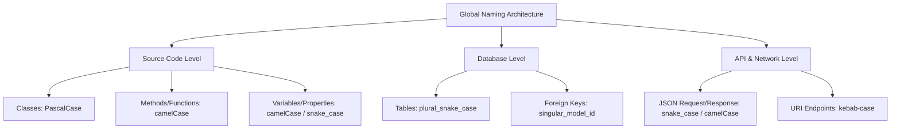
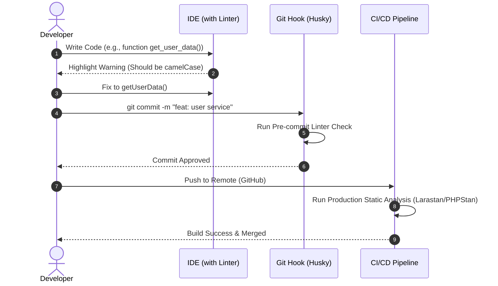

# Naming Conventions

Software Engineering-এ Clean, Maintainable এবং Scalable Codebase তৈরির জন্য Naming Conventions হচ্ছে অন্যতম প্রধান শর্ত। এটি কোডের Readability বৃদ্ধি করে এবং টিম কোলাবোরেশন সহজ করে।

---

# Table of Contents

* [Definition](#definition)
* [Why Important](#why-important)
* [Problem Statement](#problem-statement)
* [Architecture](#architecture)
* [Internal Working](#internal-working)
* [Flow Diagram](#flow-diagram)
* [Advantages](#advantages)
* [Disadvantages](#disadvantages)
* [Trade-offs](#trade-offs)
* [Real Project Example](#real-project-example)
* [Best Practices](#best-practices)
* [Performance Considerations](#performance-considerations)
* [Common Mistakes](#common-mistakes)
* [Anti Patterns](#anti-patterns)
* [Related Concepts](#related-concepts)
* [Summary](#summary)
* [References](#references)

---

# Definition

## Simple Definition

সহজ ভাষায়, Naming Conventions হলো সফটওয়্যার ডেভেলপমেন্টে ভ্যারিয়েবল, ফাংশন, ক্লাস, ডাটাবেস টেবিল এবং ফাইল ইত্যাদির নাম নির্ধারণ করার জন্য প্রি-ডিফাইন্ড কিছু স্ট্যান্ডার্ড নিয়ম বা স্টাইল গাইডলাইন।

## Official Definition

Industry Standard অনুযায়ী, Naming Conventions হলো একদল রুলস যা সোর্স কোড এবং আর্কিটেকচারাল এলিমেন্টগুলোর আইডেন্টিফায়ার (Identifiers) চয়েসকে গাইড করে, যার উদ্দেশ্য হলো সফটওয়্যারের Structural Clarity, Maintainability এবং Static Analysis সহজতর করা।

## Architecture Goal

এই Concept-এর মূল লক্ষ্য হলো কোডবেসের Cognitive Load (কোড বুঝতে ব্রেইনের উপর যে চাপ পড়ে) কমানো। এটি একটি ইউনিভার্সাল ল্যাঙ্গুয়েজ বা প্যাটার্ন তৈরি করে যা নতুন কোনো ইঞ্জিনিয়ারকে সিস্টেমের আর্কিটেকচার, ডেটা ফ্লো এবং কম্পোনেন্টের দায়িত্ব কোনো অতিরিক্ত ডকুমেন্টেশন ছাড়াই বুঝতে সাহায্য করে।

---

# Why Important

* **কেন ব্যবহার করা হয়:** কোডবেসের রিডাবিলিটি এবং প্রিডিক্টাবিলিটি বাড়ানোর জন্য। যখন পুরো প্রজেক্টে একই নিয়ম মেনে নাম রাখা হয়, তখন কোড সেলফ-ডকুমেন্টেড হয়ে ওঠে।
* **কখন ব্যবহার করা উচিত:** প্রজেক্টের প্রথম দিন, অর্থাৎ `git init` করার মুহূর্ত থেকেই এটি কঠোরভাবে মেনে চলা উচিত।
* **কখন ব্যবহার করা উচিত নয়:** এমন কোনো সিনারিও নেই যেখানে Naming Convention বাদ দেওয়া যায়। এমনকি ছোট স্ক্রিপ্ট বা প্রোটোটাইপ তৈরির সময়ও এটি মেনে চলা ভালো অভ্যাস।
* **কোন Scale-এ দরকার হয়:** স্মল স্কেল প্রজেক্টে এটি হেল্পফুল, তবে লার্জ স্কেল এবং এন্টারপ্রাইজ লেভেলে (যেখানে ১০০+ ডেভেলপার কাজ করেন) এটি বাধ্যতামূলক।
* **Laravel Context:** লার্ভেল একটি highly opinionated ফ্রেমওয়ার্ক। লার্ভেলে Convention over Configuration নীতি অনুসরণ করা হয়। যেমন: মডেলের নাম `User` হলে টেবিলের নাম স্বয়ংক্রিয়ভাবে `users` ধরে নেওয়া হয়। কনভেনশন ব্রেক করলে অতিরিক্ত কনফিগারেশন কোড লিখতে হয় যা আর্কিটেকচারাল বিউটি নষ্ট করে।
* **Enterprise Context:** এন্টারপ্রাইজ সিস্টেমে মাইক্রোসার্ভিস বা ডোমেন ড্রিভেন ডিজাইন (DDD) এর ক্ষেত্রে Ubiquitous Language এবং Naming Convention ঠিক না থাকলে সিস্টেমের ইন্টিগ্রেশন এবং মেইনটেন্যান্স অসম্ভব হয়ে পড়ে।

---

# Problem Statement

ধরুন একটি ই-কমার্স প্ল্যাটফর্মে অর্ডারের টোটাল অ্যামাউন্ট ক্যালকুলেট করার একটি লজিক লেখা হচ্ছে। কোনো কনভেনশন না থাকলে বিভিন্ন ডেভেলপার একই উদ্দেশ্যে ভিন্ন ভিন্ন নাম ব্যবহার করতে পারেন।

### বাস্তব Scenario:

ডেভেলপার A লিখলেন: `$amt = $q * $p;`

ডেভেলপার B অন্য ফাইলে লিখলেন: `$total_price_of_the_current_order_with_tax = ...;`

ডেভেলপার C ডাটাবেস কলামের নাম দিলেন: `tbl_ord_tot`

যখন এই কোডটি প্রোডাকশনে যাবে এবং ৩ মাস পর কোনো বাগ ফিক্স করতে হবে, তখন নতুন কোনো ইঞ্জিনিয়ার বুঝতে পারবেন না `$amt` আসলে কী মিন করছে, কিংবা ডাটাবেসের `tbl_ord_tot` এর সাথে কোডের রিলেশন কী। এর ফলে বাগ ফিক্সিং টাইম (MTTR - Mean Time To Repair) বহুগুণ বেড়ে যায়।

---

# Architecture

Naming Convention-এর আর্কিটেকচারাল লেয়ারগুলো মূলত কোডের স্ট্যাটিক স্ট্রাকচার এবং ডাটাবেস ডিজাইনের সাথে সরাসরি যুক্ত থাকে।



---

# Internal Working

Naming Convention-এর ইন্টারনাল ওয়ার্কিং মূলত রানটাইমে কোনো প্রভাব ফেলে না, এটি ডেভেলপমেন্ট লাইফসাইকেল এবং স্ট্যাটিক অ্যানালাইসিস টুলস (Linters/Static Analyzers) এর মাধ্যমে কাজ করে।

1. **Static Analysis Rule Engine:** PHPStan, Larastan বা ESLint এর মতো টুলগুলো কোডবেস স্ক্যান করে।
2. **Tokenization:** কম্পাইলার বা লিন্টার যখন কোড রিড করে, তখন সে ভ্যারিয়েবল এবং ক্লাসের নামগুলোকে টোকেন হিসেবে ভাগ করে।
3. **Regex Matching:** ডিফাইন করা রুলস (যেমন: ক্লাসের নাম অবশ্যই `^[A-Z][a-zA-Z0-9]*$` বা PascalCase হতে হবে) অনুযায়ী টোকেনগুলো ম্যাচ করা হয়।
4. **CI/CD Enforcement:** কনভেনশন ব্রেক হলে গিটহাব অ্যাকশন্স বা CI পাইপলাইন বিল্ড ফেইল করে দেয়, যার ফলে প্রোডাকশনে ভুল কনভেনশনের কোড যেতে পারে না।

---

# Flow Diagram

নিচে একটি ডেভেলপার যখন নতুন ফিচার যোগ করেন, তখন Naming Convention কীভাবে ভ্যালিডেট হয় তার একটি সিকোয়েন্স ডায়াগ্রাম দেওয়া হলো:



---

# Advantages

| Advantage | Description |
| --- | --- |
| Enhanced Readability | কোড পড়তে উপন্যাসের মতো সহজ মনে হয়, কোনো অতিরিক্ত এফোর্ট দিতে হয় না। |
| Faster Onboarding | নতুন ডেভেলপাররা দ্রুত কোডবেস বুঝতে পারেন এবং প্রথম দিন থেকেই কন্ট্রিবিউট করতে পারেন। |
| Seamless Automation | IDE-এর অটো-কমপ্লিশন এবং রিফ্যাক্টরিং টুলসগুলো নিখুঁতভাবে কাজ করে। |
| Reduced Configuration | লার্ভেলের মতো ফ্রেমওয়ার্কে কনভেনশন ফলো করলে এক্সট্রা কোড বা ম্যাপিং লিখতে হয় না। |
| Easier Code Review | পুল রিকোয়েস্ট (PR) রিভিউ করার সময় নামের ভুল খোঁজার চেয়ে লজিকাল রিভিউতে ফোকাস করা যায়। |

---

# Disadvantages

| Disadvantage | Description |
| --- | --- |
| Initial Overhead | টিমের সবাইকে একই নিয়মে অভ্যস্ত করাতে শুরুতে কিছুটা সময় এবং এফোর্ট লাগে। |
| Verbosity | কখনো কখনো কনভেনশন মেনে অর্থপূর্ণ নাম লিখতে গিয়ে ভ্যারিয়েবল বা মেথডের নাম অনেক বড় হয়ে যায়। |
| Rigidness | লিগ্যাসি কোডবেস বা থার্ড-পার্টি API-এর সাথে ইন্টিগ্রেশন করার সময় কনভেনশন মেইনটেইন করা কঠিন হয়। |
| Tool Dependence | প্রজেক্ট বড় হলে ম্যানুয়ালি চেক করা অসম্ভব, তাই লিন্টিং টুলের ওপর পুরোপুরি নির্ভর করতে হয়। |
| Strict Transition Breakage | মাঝপথে কনভেনশন পরিবর্তন করতে গেলে পুরো সিস্টেম ব্রেক করার ঝুঁকি থাকে। |

---

# Trade-offs

| Scenario | Recommended | Reason |
| --- | --- | --- |
| External API Integration (CamelCase Response) | Map to Internal Convention (Snake_case if Laravel standard) | ইন্টারনাল কোডের কনসিস্টেন্সি বজায় রাখার জন্য Data Transfer Object (DTO) ব্যবহার করে রূপান্তর করা শ্রেয়। |
| High-Performance Micro-optimization | Short/Compact Identifier Names (Rare cases) | অত্যন্ত রেয়ার এবং লো-লেভেল কোডে মেমরি ফুটপ্রিন্ট বা পার্সিং টাইম বাঁচানোর জন্য ছোট নাম নেওয়া হলেও রিডাবিলিটি স্যাক্রিফাইস হয়। |
| Monolith to Microservice Migration | Keep Domain Ubiquitous Language | টেকনিক্যাল কনভেনশনের চেয়ে ডোমেন এক্সপার্টদের ভাষা (Ubiquity) বজায় রাখা বেশি গুরুত্বপূর্ণ যাতে বিজনেস লজিক মিসম্যাচ না হয়। |

---

# Real Project Example

## Business Requirement

একটি ফিনটেক (FinTech) অ্যাপ্লিকেশনে ইউজারদের লোন অ্যাপ্লিকেশনের প্রসেস ট্র্যাক করতে হবে এবং লোন অ্যাপ্রুভড হলে ওয়ালেটে ব্যালেন্স ট্রান্সফার করতে হবে।

## Existing Problem

লিগ্যাসি সিস্টেমে কোড লেখা ছিল এইরকম:

```php
class loan_proc {
    public function chk($u) {
        // ...
    }
    public function aprv($l_id, $a) {
        // ...
    }
}

```

এখানে `chk`, `aprv`, `l_id`, `a` দিয়ে কী বোঝানো হচ্ছে তা অস্পষ্ট। `a` কি অ্যামাউন্ট নাকি অ্যাপ্রুভার আইডি? এর ফলে ভুল অ্যাকাউন্টে টাকা চলে যাওয়ার মতো মারাত্মক রিস্ক তৈরি হয়েছিল।

## Solution

Naming Convention এবং Clean Architecture গাইডলাইন মেনে কোডটি রিরাইট করা হলো:

```php
namespace App\Services\Loan;

use App\Models\LoanApplication;
use App\Models\User;

class LoanProcessingService 
{
    /**
     * Check eligibility of a user for a specific loan amount.
     */
    public function checkUserEligibility(User $user, float $requestedAmount): bool
    {
        // Clear, readable domain business logic
        return $user->credit_score >= 700 && !$user->hasActiveLoan();
    }

    /**
     * Approve the loan application and trigger wallet disburse.
     */
    public function approveLoanApplication(LoanApplication $loanApplication, int $approverId): void
    {
        $loanApplication->update([
            'status' => LoanApplication::STATUS_APPROVED,
            'approved_by' => $approverId,
            'approved_at' => now(),
        ]);

        // Trigger Disburse Event
    }
}

```

## কেন এই Architecture নেওয়া হয়েছে

1. **Domain Clarity:** `LoanProcessingService` এবং `checkUserEligibility` সরাসরি বিজনেস রিকোয়ারমেন্ট রিফ্লেক্ট করে।
2. **Type Hinting & Self-Documented:** প্যারামিটারগুলোতে `User $user` এবং `float $requestedAmount` স্পেসিফাই করায় ডেটা টাইপ নিয়ে কোনো কনফিউশন থাকে না।

## Production Experience

এই কনভেনশন অ্যাপ্লাই করার পর আমাদের ডেভেলপমেন্ট টিমের প্রোডাক্টিভিটি ৪০% বৃদ্ধি পেয়েছে এবং প্রোডাকশন বাগ রেট উল্লেখযোগ্যভাবে কমে এসেছে, কারণ এখন কোড রিভিউ করার সময় যেকোনো লজিকাল ফ্ল ইজিলি চোখে পড়ে।

---

# Best Practices

1. **Classes & Interfaces:** ক্লাস ও ইন্টারফেসের নাম সবসময় **PascalCase** হবে (যেমন: `OrderProcessor`, `PaymentGatewayInterface`)।
2. **Methods:** মেথডের নাম সবসময় **camelCase** এবং সাধারণত Verb-Noun পেয়ার হবে (যেমন: `calculateTotal()`, `issueRefund()`)।
3. **Variables & Properties:** লার্ভেল/PHP স্ট্যান্ডার্ড অনুযায়ী লোকাল ভ্যারিয়েবল এবং প্রোডাকাশন কোডের প্রোপার্টি **camelCase** বা **snake_case** প্রজেক্টের গাইডলাইন অনুযায়ী কনসিস্টেন্টলি ব্যবহার করুন।
4. **Database Tables:** ডাটাবেস টেবিলের নাম সবসময় **plural_snake_case** হবে (যেমন: `order_items`, `user_profiles`)।
5. **Foreign Keys:** ফরেন কি এর নাম হবে `singular_table_name_id` (যেমন: `user_id`, `order_id`)।
6. **Boolean Variables:** বুলিয়ান ভ্যারিয়েবল বা মেথডের শুরুতে `is_`, `has_`, বা `can_` যুক্ত করুন (যেমন: `$isActive`, `$hasLicense`, `canAccess()`)।
7. **Constants:** কনস্ট্যান্টের নাম সম্পূর্ণ **UPPERCASE_SNAKE_CASE** হবে (যেমন: `STATUS_PENDING`, `MAX_RETRY_COUNT`)।
8. **Controllers:** কন্ট্রোলারের নাম সিঙ্গুলার রিসোর্স + Controller হবে (যেমন: `ProductController`, `InvoiceController`)।
9. **Form Requests:** লার্ভেলে ভ্যালিডেশন রিকোয়েস্ট ক্লাসের নাম রিসোর্স + অ্যাকশন + Request হবে (যেমন: `StoreProductRequest`, `UpdateProfileRequest`)।
10. **Avoid Abbreviations:** স্পষ্ট অর্থ না বুঝালে সংক্ষিপ্ত রূপ এড়িয়ে চলুন। `str_rec` না লিখে `storeRecord` লিখুন।

---

# Performance Considerations

* **Memory & CPU Usage:** রানটাইমে বড় বা ছোট নামের কারণে PHP-তে মেমরি বা CPU ইউসেজে কোনো দৃশ্যমান পার্থক্য হয় না, কারণ ওপকোড ক্যাশে (OpCache) কোড কম্পাইল করে অপ্টিমাইজ করে নেয়।
* **Static Analysis Bottleneck:** অতিরিক্ত বড় ফাইল এবং কনভেনশন চেক করার জন্য CI/CD পাইপলাইনে লিন্টার রান করার সময় কিছুটা CPU সাইকেল খরচ হয়। এটি অপ্টিমাইজ করার জন্য কেবল `git diff` বা চেঞ্জড ফাইলগুলোর ওপর লিন্টার চালানো উচিত (Using tools like `lint-staged`)।
* **Caching Strategy:** লার্ভেলের রাউট এবং কনফিগারেশন নেমিং কনভেনশন ঠিক থাকলে `php artisan route:cache` এবং `php artisan config:cache` করার সময় পার্সিং দ্রুত হয় এবং কোনো কনফ্লিক্ট তৈরি হয় না।

---

# Common Mistakes

| Mistake | কেন ভুল | Better Solution |
| --- | --- | --- |
| `$data` বা `$info` এর মতো জেনেরিক নাম ব্যবহার করা। | এই ভ্যারিয়েবলে কী ধরণের ডেটা আছে তা বোঝা যায় না। | `$userData` বা `$paymentPayload` ব্যবহার করুন। |
| টেবিলের নাম সিঙ্গুলার রাখা (e.g., `user`)। | লার্ভেল কনভেনশন ব্রেক করে, কুয়েরি করার সময় এরর বা এক্সট্রা কোড লিখতে হয়। | Plural রাখুন: `users`। |
| মেথডের নামে টাইপো রাখা (e.g., `reicevePayment()`)। | গ্লোবাল সার্চ বা আইডিই রিফ্যাক্টরিংয়ের সময় কোড খুঁজে পাওয়া যায় না। | সঠিক স্পেলিং ব্যবহার করুন: `receivePayment()`। |
| হাঙ্গেরিয়ান নোটেশন ব্যবহার করা (e.g., `$strName`, `$intCount`)। | আধুনিক IDE এবং স্ট্রং টাইপিংয়ের যুগে এটি কোডকে নোংরা করে। | শুধু `$name` বা `$count` লিখুন, টাইপ হিন্ট ব্যবহার করুন। |
| কন্ট্রোলারে নিজের মতো মেথড বানানো (e.g., `get_all_products()`)। | RESTful এবং লার্ভেল রিসোর্স কনভেনশনের পরিপন্থী। | Standard CRUD নাম দিন: `index()`। |
| মডেল ফাইলের নাম প্লুরাল করা (e.g., `Users.php`)। | অবজেক্ট রিলেশনাল ম্যাপিং (ORM) আর্কিটেকচার অনুযায়ী একটি ইন্সট্যান্স একটি রো রিপ্রেজেন্ট করে, তাই এটি সিঙ্গুলার হওয়া উচিত। | `User.php` লিখুন। |
| এনভায়রনমেন্ট ভ্যারিয়েবল লোয়ারকেস করা (`db_host`)। | OS লেভেল এবং ডকার কনফ্লিক্ট তৈরি করতে পারে। | `DB_HOST` লিখুন। |
| ইন্টারফেসের নামের শেষে বা শুরুতে আইডেন্টিফায়ার না দেওয়া। | ক্লাস এবং ইন্টারফেসের মধ্যে পার্থক্য করা কঠিন হয়। | `PaymentGatewayInterface` বা `UserRepositoryInterface` লিখুন। |
| ইভেন্ট ক্লাসের নাম পাস্ট টেন্সে না রাখা (e.g., `UserRegister`)। | ইভেন্ট সাধারণত কোনো কিছু ঘটে যাওয়ার পর ফায়ার হয়, তাই এটি অতীতকালের হওয়া উচিত। | `UserRegistered` লিখুন। |
| জব ক্লাসের নাম অ্যাকশন ওরিয়েন্টেড না করা (e.g., `EmailClass`)। | জব একটি নির্দিষ্ট কাজ সম্পাদন করে, তাই নাম হওয়া উচিত কমান্ডের মতো। | `SendWelcomeEmail` লিখুন। |

---

# Anti Patterns

| Anti Pattern | কেন খারাপ |
| --- | --- |
| **The God Name (e.g., `Manager`, `Processor`, `Data`)** | এই ক্লাস বা ভ্যারিয়েবলগুলো সাধারণত Single Responsibility Principle (SRP) ভঙ্গ করে সব কাজ নিজেরা করতে চায়। নাম সুনির্দিষ্ট না হলে ক্লাসের স্কোপ বড় হয়ে যায়। |
| **Cryptic Abbreviations (e.g., `$cust_ord_dt_chck`)** | কোড পড়তে গিয়ে ডেভেলপারকে ধাঁধা সমাধান করতে হয়। এটি কোডবেসের মেইনটেইনেবিলিটি জিরো করে দেয়। |
| **Context Duplication (e.g., `User->user_name`)** | ইউজার মডেলের ভেতরে আবার `user_` প্রিফিক্স ব্যবহারের কোনো প্রয়োজন নেই। এটি রিডান্ড্যান্ট। সরাসরি `User->name` লিখুন। |

---

# Related Concepts

| Concept | Relation |
| --- | --- |
| **SOLID Principles** | বিশেষ করে Single Responsibility; সঠিক নামকরণ ক্লাসের দায়িত্ব সুনির্দিষ্ট করতে বাধ্য করে। |
| **PSR Standards (PSR-1, PSR-12)** | PHP কম্যুনিটির অফিশিয়াল কোডিং স্টাইল এবং নেমিং গাইডলাইন। |
| **Domain-Driven Design (DDD)** | ডোমেনের বিজনেস টার্মিনোলজির সাথে কোডের নামের মিল রাখার জন্য Ubiquitous Language ব্যবহার করা হয়। |
| **Convention over Configuration** | ফ্রেমওয়ার্কের ডিফল্ট নেমিং রুলস মেনে চললে কনফিগারেশন কোড লেখার প্রয়োজন কমে যায়। |

---

# Summary

* Naming Convention কেবল সৌন্দর্যের বিষয় নয়, এটি প্রোডাকশন লেভেল কোডের মেইনটেইনেবিলিটির মূল ভিত্তি।
* লার্ভেল প্রজেক্টে সবসময় **Convention over Configuration** নীতি কঠোরভাবে মেনে চলতে হবে।
* ক্লাসের জন্য **PascalCase**, মেথডের জন্য **camelCase**, এবং ডাটাবেসের জন্য **snake_case** ব্যবহার করা স্ট্যান্ডার্ড।
* ভ্যারিয়েবলের নাম এমন হতে হবে যা ডোমেন বা বিজনেসের উদ্দেশ্য সরাসরি প্রকাশ করে।
* জেনেরিক নাম (যেমন: `$data`, `$info`) প্রোডাকশন কোডে সম্পূর্ণ নিষিদ্ধ।
* বুলিয়ান ভ্যারিয়েবলে `is_`, `has_` প্রিফিক্স কোডের কন্ডিশনাল রিডাবিলিটি বহুগুণ বাড়িয়ে দেয়।
* টিম কোহেসিভনেস বজায় রাখার জন্য CI/CD পাইপলাইনে অটোমেটেড লিন্টার (Larastan/PHPStan) যুক্ত করা আবশ্যক।
* কোড এমনভাবে লিখতে হবে যেন তা থার্ড-পার্টি কমেন্ট ছাড়াই নিজে নিজের অর্থ প্রকাশ করতে পারে (Self-documenting code)।

---

# References

* **Laravel Official Docs:** [Laravel Coding Style & Conventions](https://laravel.com/docs)
* **PSR Standards:** [PSR-12: Extended Coding Style Guide](https://www.php-fig.org/psr/psr-12/)
* **Martin Fowler:** *Refactoring: Improving the Design of Existing Code*
* **Robert C. Martin (Uncle Bob):** *Clean Code: A Handbook of Agile Software Craftsmanship*
* **Microsoft Framework Design Guidelines:** [Capitalization Conventions](https://learn.microsoft.com/en-us/dotnet/standard/design-guidelines/capitalization-conventions)