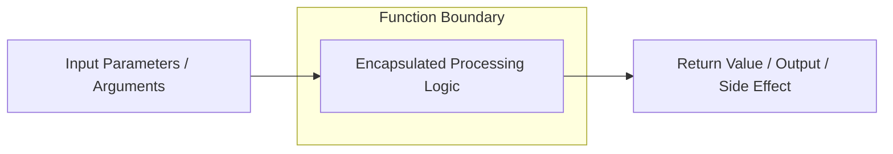
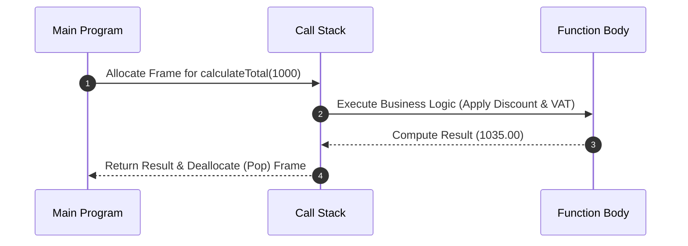

# Functions

সফটওয়্যার ইঞ্জিনিয়ারিংয়ে কোড রিইউজেবিলিটি (Reuseability), মডুলারিটি (Modularity) এবং ক্লিন কোড আর্কিটেকচারের সবচেয়ে মৌলিক ও শক্তিশালী একক হলো **Function** (ফাংশন)।

---

# Table of Contents

* Definition
* Why Important
* Problem Statement
* Architecture
* Internal Working
* Flow Diagram
* Advantages
* Disadvantages
* Trade-offs
* Real Project Example
* Best Practices
* Performance Considerations
* Common Mistakes
* Anti Patterns
* Related Concepts
* Summary
* References

---

# Definition

## Simple Definition

সহজ কথায়, ফাংশন হলো একটি নির্দিষ্ট কাজের জন্য তৈরি করা কোডের ব্লক, যাকে একটি নাম দেওয়া হয়। যখনই ওই কাজটি করার প্রয়োজন হয়, তখন পুরো কোডটি পুনরায় না লিখে শুধু ফাংশনের নামটি ডেকে (Call করে) কাজটি সম্পন্ন করা যায়।

## Official Definition

ইন্ডাস্ট্রি স্ট্যান্ডার্ড অনুযায়ী, ফাংশন হলো একটি Self-contained মডিউল বা সাব-প্রোগ্রাম যা এক বা একাধিক ইনপুট (Parameters) গ্রহণ করতে পারে, একটি নির্দিষ্ট বিজনেস লজিক বা কম্পিউটেশন এক্সিকিউট করে এবং একটি সুনির্দিষ্ট আউটপুট (Return Value) প্রদান করে কিংবা সাইড-ইফেক্ট (Side-effect) তৈরি করে।

## Architecture Goal

ফাংশনের মূল আর্কিটেকচারাল লক্ষ্য হলো **Separation of Concerns (SoC)** নিশ্চিত করা এবং জটিল গ্লোবাল স্টেট বা স্প্যাগেটি কোডকে ছোট ছোট, আইসোলেটেড এবং টেস্টযোগ্য ইউনিটে বিভক্ত করা।

---

# Why Important

* **কেন ব্যবহার করা হয়:** কোডের ডুপ্লিকেশন কমানো (DRY Principle), কোডকে রিডাবল করা এবং ডিবাগিং সহজ করার জন্য।
* **কখন ব্যবহার করা উচিত:** যখনই কোনো কোডের লজিক একাধিক জায়গায় প্রয়োজন হয়, অথবা একটি নির্দিষ্ট কাজের লজিক ১০ লাইনের বেশি বড় হতে শুরু করে, তখন সেটিকে ফাংশনে রূপান্তর করা উচিত।
* **কখন ব্যবহার করা উচিত নয়:** যখন কোনো অপারেশন অত্যন্ত ট্রাভিয়াল এবং ওয়ান-টাইম হয় (যেমন: শুধুমাত্র দুটি সংখ্যার যোগফল যা অন্য কোথাও লাগবে না) এবং যেখানে অতিরিক্ত ফাংশন কল ওভারহেড পারফরম্যান্সে প্রভাব ফেলতে পারে (যেমন: আল্ট্রা-লো-লেটেন্সি গেম লুপ)।
* **কোন Scale-এ দরকার হয়:** ছোট স্ক্রিপ্ট থেকে শুরু করে ট্রিলিয়ন-লাইন এন্টারপ্রাইজ মাইক্রোসার্ভিস—সব স্কেলেই ফাংশন অপরিহার্য।
* **Laravel Context:** লার্ভেলে ফাংশন বিভিন্ন রূপে ব্যবহৃত হয়—কন্ট্রোলার মেথড, হেল্পার ফাংশন (`collect()`, `config()`), মডেল রিলেশনশিপ এবং ইভেন্ট লিসেনার।
* **Enterprise Context:** এন্টারপ্রাইজ আর্কিটেকচারে Pure Functions ব্যবহার করে ডোমেন লজিক লেখা হয় যাতে কনকারেন্ট এবং প্যারালাল প্রসেসিংয়ে ডেটা রেস (Data Race) বা স্টেট করাপশন না হয়।

---

# Problem Statement

ধরুন একটি ফিনটেক অ্যাপে ইউজার ট্রানজেকশনের ওপর ভ্যাট (VAT) এবং ডিসকাউন্ট ক্যালকুলেট করতে হবে। ফাংশন ছাড়া কোডবেস দেখতে এমন হবে:

### বাস্তব Scenario: (ফাংশন ছাড়া স্প্যাগেটি কোড)

```php
// Checkout Controller
$amount = 1000;
$discount = $amount * 0.10;
$payable = $amount - $discount;
$vat = $payable * 0.15;
$total = $payable + $vat;

// Invoice Controller (একই লজিক আবার লিখতে হচ্ছে)
$invoiceAmount = 5000;
$invoiceDiscount = $invoiceAmount * 0.10;
$invoicePayable = $invoiceAmount - $invoiceDiscount;
$invoiceVat = $invoicePayable * 0.15;
$invoiceTotal = $invoicePayable + $invoiceVat;

```

**সমস্যা:** আগামীকাল যদি ভ্যাট ১৫% থেকে কমিয়ে ১২% করা হয়, তবে ডেভেলপারকে পুরো প্রোজেক্টের শত শত ফাইল খুঁজে এই ম্যানুয়াল লজিক পরিবর্তন করতে হবে। কোনো একটি জায়গায় মিস হলে ডাটাবেসে ভুল হিসাব জমা হবে।

---

# Architecture

একটি আদর্শ ফাংশনের আর্কিটেকচারাল বাউন্ডারি তিনটি ব্লকে বিভক্ত: Input Layer (Arguments), Processing Layer (Encapsulated Logic), এবং Output Layer (Return Type)।



---

# Internal Working

রানটাইমে (যেমন: PHP Engine বা V8 Engine) একটি ফাংশন কল কীভাবে কাজ করে তার ধাপগুলো নিচে দেওয়া হলো:

1. **Stack Frame Creation:** যখন একটি ফাংশন ইনভোক বা কল করা হয়, তখন ইঞ্জিনের মেমরিতে (Call Stack) একটি নতুন Stack Frame তৈরি হয়।
2. **Context Isolation:** এই ফ্রেমের ভেতরে ফাংশনের লোকাল ভ্যারিয়েবল এবং আর্গুমেন্টগুলো রাখা হয়। এটি বাইরের গ্লোবাল মেমরি থেকে সম্পূর্ণ আইসোলেটেড থাকে।
3. **Execution:** CPU ফাংশনের ভেতরের ইন্সট্রাকশনগুলো লাইন বাই লাইন এক্সিকিউট করে।
4. **Return & Stack Pop:** ফাংশন যখন `return` স্টেটমেন্টে পৌঁছায়, তখন রিটার্ন ভ্যালুটি কলারের কাছে পাঠিয়ে দেওয়া হয় এবং ওই Stack Frame টি মেমরি থেকে মুছে ফেলা (Pop) হয়।

---

# Flow Diagram

নিচে একটি ফাংশন এক্সিকিউশন লাইফসাইকেলের সিকোয়েন্স ডায়াগ্রাম দেখানো হলো:



---

# Advantages

| Advantage | Description |
| --- | --- |
| Code Reusability | একবার লিখে বারবার ব্যবহার করা যায়, ফলে ডেভেলপমেন্ট টাইম কমে। |
| Maintainability | লজিক পরিবর্তন করতে হলে শুধু একটি নির্দিষ্ট ফাংশনে পরিবর্তন করলেই পুরো সিস্টেমে তা রিফ্লেক্ট হয়। |
| Testability | ফাংশনগুলোকে আলাদাভাবে Unit Test করা খুব সহজ, বিশেষ করে Pure Functions। |
| Readability | বড় জটিল কোডকে অর্থপূর্ণ নাম দিয়ে ফাংশনে ভাগ করলে কোড সেলফ-ডকুমেন্টেড হয়ে যায়। |
| Variable Scope Control | লোকাল ভ্যারিয়েবলগুলো ফাংশনের বাইরে অ্যাক্সেস করা যায় না, যা ডেটা লিক হওয়া রোধ করে। |

---

# Disadvantages

| Disadvantage | Description |
| --- | --- |
| Execution Overhead | প্রতিবার ফাংশন কলের জন্য Call Stack মেমরি এবং CPU সাইকেল খরচ হয় (Stack Allocation Overhead)। |
| Stack Overflow Risk | রিকার্সিভ ফাংশনে (Recursive Function) সঠিক বেস কন্ডিশন না থাকলে Call Stack ফুল হয়ে অ্যাপ্লিকেশন ক্র্যাশ করতে পারে। |
| Code Fragmentation | অতিরিক্ত ছোট ছোট ফাংশনে ভাগ করলে কোডবেস বেশি স্ক্যাটার্ড হয়ে যেতে পারে, ফলে ট্র্যাকিং কঠিন হয়। |
| Side-Effect Management | ফাংশন যদি গ্লোবাল স্টেট পরিবর্তন করে (Impure Function), তবে সিস্টেমে অপ্রত্যাশিত বাগ তৈরি হতে পারে। |

---

# Trade-offs

| Scenario | Recommended | Reason |
| --- | --- | --- |
| High-Frequency Micro-operations | Inline Code / Macro | লুপের ভেতর কোটি বার রান হওয়া ১ লাইনের লজিকের জন্য ফাংশন কল ওভারহেড এড়ানো শ্রেয়। |
| Complex Domain Calculation | Well-named Isolated Function | পারফরম্যান্সের সামান্য ওলটপালটের চেয়ে কোডের কারেক্টনেস এবং মেইনটেইনেবিলিটি এন্টারপ্রাইজে বেশি জরুরি। |
| Functional Programming in PHP | Anonymous Functions / Closures | মেমরি ফুটপ্রিন্ট কিছুটা বাড়লেও ডেটা কালেকশন ফিল্টারিং বা ম্যাপ করার জন্য ক্লোজার ব্যবহার কোডকে ক্লিন করে। |

---

# Real Project Example

## Business Requirement

একটি SaaS ই-কমার্স প্ল্যাটফর্মে বিভিন্ন কারেন্সি এবং কাস্টমার টায়ারের (VIP, Regular) ওপর ভিত্তি করে ফাইনাল চেকআউট প্রাইস হিসাব করতে হবে।

## Existing Problem

সব লজিক কন্ট্রোলারের ভেতরেই ডুপ্লিকেট করা ছিল, ফলে কারেন্সি কনভার্সন রেট চেঞ্জ হলে বা নতুন কাস্টমার টায়ার আসলে কোড ব্রেক করতো।

## Solution

ডোমেন লেভেলে একটি ডেডিকেটেড, টাইপ-হিন্টেড এবং টেস্টেড ফাংশন আর্কিটেকচার তৈরি করা হলো:

```php
namespace App\Services\Billing;

class PricingCalculator 
{
    /**
     * Calculates the final payable amount considering discount tier and tax.
     */
    public function calculateFinalPrice(float $basePrice, float $discountPercentage, float $taxRate): float 
    {
        if ($basePrice < 0 || $discountPercentage < 0 || $taxRate < 0) {
            throw new \InvalidArgumentException("Values cannot be negative.");
        }

        $discountAmount = $basePrice * ($discountPercentage / 100);
        $discountedPrice = $basePrice - $discountAmount;
        
        $taxAmount = $discountedPrice * ($taxRate / 100);
        
        return round($discountedPrice + $taxAmount, 2);
    }
}

```

## কেন এই Architecture নেওয়া হয়েছে

1. **Immutability & Safety:** ইনপুট প্যারামিটারগুলো চেঞ্জ হচ্ছে না, নতুন ভ্যালু রিটার্ন হচ্ছে।
2. **Defensive Programming:** নেগেটিভ ভ্যালু আসলে শুরুতেই এক্সেপশন থ্রো করছে, যা ইনভ্যালিড ক্যালকুলেশন প্রোডাকশনে যাওয়া আটকায়।

---

# Best Practices

1. **Single Responsibility Principle (SRP):** একটি ফাংশন কেবল একটি নির্দিষ্ট কাজ করবে। `saveUserAndSendEmail()` একটি অ্যান্টি-প্যাটার্ন। এটিকে দুটি আলাদা ফাংশনে ভাগ করুন।
2. **Keep it Short:** আদর্শ ফাংশন ২০-৩০ লাইনের বেশি হওয়া উচিত নয়।
3. **Use Meaningful Names:** নাম দেখলেই যেন কাজ বোঝা যায়। জেনেশুনে Verb-Noun কম্বিনেশন ব্যবহার করুন (যেমন: `fetchOrders()`, `validateToken()`)।
4. **Strict Type Hinting:** ইনপুট এবং রিটার্ন টাইপ সবসময় স্পেসিফাই করুন (যেমন: `function add(int $a, int $b): int`)।
5. **Minimize Arguments:** একটি ফাংশনে ৩টির বেশি আর্গুমেন্ট পাস করা এড়িয়ে চলুন। বেশি লাগলে DTO বা অবজেক্ট পাস করুন।
6. **Prefer Pure Functions:** সম্ভব হলে এমন ফাংশন লিখুন যা বাইরের কোনো গ্লোবাল স্টেট পরিবর্তন করে না এবং একই ইনপুটের জন্য সবসময় একই আউটপুট দেয়।
7. **Avoid Side Effects:** ফাংশনের ভেতরে গ্লোবাল ভ্যারিয়েবল মডিফাই করা থেকে বিরত থাকুন।
8. **Return Early (Guard Clauses):** কন্ডিশনাল চেকের ক্ষেত্রে শুরুতেই ইনভ্যালিড কেসগুলো রিটার্ন করে দিন, এতে কোডের নেস্টিং কমে।
9. **Don't Use Boolean Flags as Arguments:** `processPayment($amount, true)` না লিখে `processCreditCardPayment()` এবং `processPaypalPayment()` আলাদা করুন।
10. **Document Complex Logic:** ফাংশনের ভেতরের জটিল অ্যালগরিদম DocBlock (`/ ... */`) দিয়ে কমেন্ট করুন।

---

# Performance Considerations

* **Memory Allocation:** ফাংশন যখনই কল হয়, স্ট্যাক মেমরিতে জায়গা তৈরি হয়। অতিরিক্ত ডিপ নেস্টেড ফাংশন কল মেমরি কনজাম্পশন বাড়ায়।
* **CPU Cache Line:** ছোট এবং কম্প্যাক্ট ফাংশনগুলো CPU-র ক্যাশ মেমরিতে (L1/L2 Cache) সহজে ফিট হয়ে যায়, যা এক্সিকিউশন স্পিড বহুগুণ বাড়িয়ে দেয়।
* **Laravel Optimization:** লার্ভেল প্রোডাকশনে অপটিমাইজ করার জন্য ক্লোজার-বেসড রাউটের পরিবর্তে কন্ট্রোলার মেথড ব্যবহার করা উচিত, কারণ কন্ট্রোলার মেথডগুলো `route:cache` এর মাধ্যমে প্রি-কম্পাইলড ও ক্যাশড হতে পারে।

---

# Common Mistakes

| Mistake | কেন ভুল | Better Solution |
| --- | --- | --- |
| ফাংশনের ভেতরেই গ্লোবাল কি-ওয়ার্ড বা `$_GET`/`$_POST` রিড করা। | ফাংশনটি বাইরের গ্লোবাল এনভায়রনমেন্টের ওপর টাইটলি কাপলড হয়ে পড়ে এবং টেস্ট করা যায় না। | প্রয়োজনীয় ডেটা প্যারামিটার হিসেবে পাস করুন। |
| রিটার্ন টাইপ ডিক্লেয়ার না করা। | টাইপ সেফটি নষ্ট হয় এবং রানটাইমে আনএক্সপেক্টেড ডেটা টাইপ আসার রিস্ক থাকে। | PHP 7/8 স্ট্যান্ডার্ড অনুযায়ী `: void` বা `: int` টাইপ ব্যবহার করুন। |
| পাস-বাই-রেফারেন্সের অনাবশ্যক ব্যবহার (`&$variable`)। | ডেটার স্টেট ট্র্যাকিং কঠিন করে তোলে এবং অপ্রত্যাশিত সাইড ইফেক্ট তৈরি করে। | ভ্যালু রিটার্ন করে নতুন ভ্যারিয়েবলে অ্যাসাইন করুন। |
| একই ফাংশনে স্ট্রিং, অ্যারে বা অবজেক্ট মিক্সড রিটার্ন করা। | কলার কোডে প্রতিবার রিড করার আগে টাইপ চেক (`is_array()`) করতে হয়। | সুনির্দিষ্ট টাইপ বা DTO/অবজেক্ট রিটার্ন করুন। |
| এরর হ্যান্ডেল না করে সাইলেন্টলি `null` রিটার্ন করা। | পরবর্তীতে `NullPointerException` বা `Error: Call to a member function on null` ঘটার কারণ হয়। | কাস্টম এক্সেপশন থ্রো করুন অথবা `Optional` প্যাটার্ন ফলো করুন। |

---

# Anti Patterns

| Anti Pattern | কেন খারাপ |
| --- | --- |
| **Arrow Spaghetti (Deep Nesting)** | ফাংশনের ভেতর যদি ৩ বা ৪ লেয়ারের `if-else` বা `foreach` লুপ থাকে, তবে কোডের রিডাবিলিটি ধ্বংস হয়ে যায়। |
| **The Swiss Army Knife Function** | একটি মাত্র ফাংশন যা মুড বা ফ্ল্যাগের ওপর ভিত্তি করে ১০ রকমের কাজ করে। এটি মেইনটেইনেবিলিটির জন্য নরকতুল্য। |

---

# Related Concepts

| Concept | Relation |
| --- | --- |
| **SOLID (Single Responsibility)** | ফাংশন ডিজাইনের মূল মন্ত্র। একটি ফাংশন = একটি রেসপন্সিবিলিটি। |
| **Closures / Anonymous Functions** | নামবিহীন ফাংশন যা বাইরের স্কোপের ভ্যারিয়েবল ক্যাপচার করতে পারে (ইন-লাইন অপারেশনের জন্য উপযোগী)। |
| **Recursion** | যখন একটি ফাংশন নিজের ভেতর থেকে নিজেকেই আবার কল করে (গাছ বা ট্রি-লাইক ডেটা স্ট্রাকচার ট্রাভার্সাল করার জন্য ব্যবহৃত)। |
| **High-Order Functions** | যে ফাংশনগুলো অন্য কোনো ফাংশনকে আর্গুমেন্ট হিসেবে গ্রহণ করে বা আউটপুট হিসেবে রিটার্ন করে (যেমন: `array_map`)। |

---

# Summary

* ফাংশন হলো সফটওয়্যারের বিল্ডিং ব্লক, যা মডুলারিটি এবং কোড রিইউজেবিলিটি নিশ্চিত করে।
* প্রতিটি ফাংশনকে **Single Responsibility Principle (SRP)** মেনে ডিজাইন করতে হবে।
* কোড সেফটির জন্য **Strict Typing** এবং **Return Early** প্যাটার্ন ব্যবহার করা অত্যন্ত জরুরি।
* মেথড ও ফাংশনের নাম এমন হওয়া উচিত যা কোনো এক্সট্রা কমেন্ট ছাড়াই কোডের উদ্দেশ্য ফুটিয়ে তোলে।
* প্রোডাকশন কোডে গ্লোবাল স্টেট পরিবর্তনকারী ইমপিউর ফাংশন এবং ডীপ নেস্টিং এড়িয়ে চলা উচিত।

---

# References

* **Clean Code Book:** Robert C. Martin (Clean Functions Chapter)
* **PHP Docs:** [PHP Functions Reference](https://www.php.net/manual/en/language.functions.php)
* **Martin Fowler:** [Refactoring - Decompose Conditional & Extract Method](https://martinfowler.com/)
* **MDN Web Docs:** [Functions & Scope Guide](https://developer.mozilla.org/)