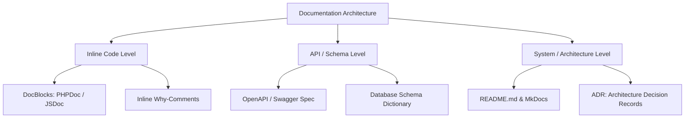
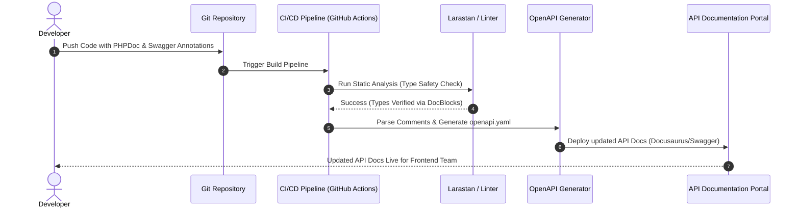

# Comments & Documentation

সফটওয়্যার ইঞ্জিনিয়ারিংয়ে কোডবেসের দীর্ঘমেয়াদী স্থায়িত্ব, রক্ষণাবেক্ষণযোগ্যতা (Maintainability) এবং টিম কোলাবোরেশন নিশ্চিত করার জন্য কোডের উদ্দেশ্য ও কার্যকারিতা লিখিতভাবে প্রকাশ করার মাধ্যমই হলো **Comments & Documentation**।

---

# Table of Contents

* [Definition](#definition)
* [Why Important](#why-important)
* [Problem Statement](#problem-statement)
* [Architecture](#architecture)
* [Internal Working](#internal-working)
* [Flow Diagram](#flow-diagram)
* [Advantages](#advantages)
* [Disadvantages](#disadvantages)
* [Trade-offs](#trade-offs)
* [Real Project Example](#real-project-example)
* [Best Practices](#best-practices)
* [Performance Considerations](#performance-considerations)
* [Common Mistakes](#common-mistakes)
* [Anti Patterns](#anti-patterns)
* [Related Concepts](#related-concepts)
* [Summary](#summary)
* [References](#references)

---

# Definition

## Simple Definition

সহজ ভাষায়, কমেন্টস হলো সোর্স কোডের ভেতরে লেখা কিছু নোট বা ব্যাখ্যা যা কম্পিউটার এক্সিকিউট করে না, কিন্তু ডেভেলপাররা কোডটি সহজে বোঝার জন্য ব্যবহার করেন। আর ডকুমেন্টেশন হলো পুরো সিস্টেমের আর্কিটেকচার, এপিআই এবং সেটআপ গাইডলাইনের একটি বিস্তারিত বিবরণী।

## Official Definition

Industry Standard অনুযায়ী, সোর্স-লেভেল কমেন্টস (যেমন: PHPDoc, JSDoc) এবং সিস্টেম ডকুমেন্টেশন (যেমন: OpenAPI/Swagger, Architecture Decision Records বা ADR) হলো এমন একটি স্ট্রাকচার্ড মেটাডেটা মেকানিজম, যা সোর্স কোডের স্ট্যাটিক অ্যানালাইসিস, অটোমেটেড এপিআই জেনারেশন এবং হিউম্যান-রিডবল নলেজ ট্রান্সফার নিশ্চিত করে।

## Architecture Goal

এই কনসেপ্টের মূল লক্ষ্য হলো কোডের **Cognitive Load** কমানো। এটি কোডের "What" (কোডটি কী করছে) তা কোড নিজেই প্রকাশ করার পর, "Why" (কোডটি কেন এইভাবে লেখা হয়েছে, বিশেষ কোনো বিজনেজ ডিসিশন বা ওয়ার্কঅ্যারাউন্ড আছে কিনা) তা রেকর্ড করে রাখে, যাতে সিস্টেমের টেকনিক্যাল ডেট (Technical Debt) হ্রাস পায়।

---

# Why Important

* **কেন ব্যবহার করা হয়:** কোডকে সেলফ-ডকুমেন্টিং করা, এপিআই এর ব্যবহার সহজ করা এবং ফিউচার রিফ্যাক্টরিং সেফ করা।
* **কখন ব্যবহার করা উচিত:** যখন কোডে কোনো জটিল বিজনেস লজিক, থার্ড-পার্টি এপিআই-এর অদ্ভুত রেসপন্স হ্যান্ডলিং, বা পারফরম্যান্স অপ্টিমাইজেশনের জন্য কোনো আনকনভেনশনাল কোড লিখতে হয়।
* **কখন ব্যবহার করা উচিত নয়:** কোডটি যদি খুব সাধারণ এবং স্বব্যাখ্যাত (Self-explanatory) হয়, তবে সেখানে কমেন্ট করা উচিত নয়। "Bad code-কে কমেন্ট দিয়ে ঢাকবেন না, কোড রিফ্যাক্টর করুন।"
* **কোন Scale-এ দরকার হয়:** লার্জ স্কেল এন্টারপ্রাইজ এবং ওপেন সোর্স প্রজেক্টে এটি লাইফ-সেভার হিসেবে কাজ করে।
* **Laravel Context:** লার্ভেল তার নিজস্ব কোডবেসে চমৎকারভাবে PHPDoc ব্লকের সাহায্যে আইডিই-এর অটো-কমপ্লিশন (IDE Auto-completion) এবং টাইপ-হিন্টিং সহজ করে। কাস্টম সার্ভিস ক্লাস বা মেথডে এর সঠিক ব্যবহার Larastan বা PHPStan-এর মতো স্ট্যাটিক অ্যানালাইসিস টুলকে নিখুঁতভাবে টাইপ রিড করতে সাহায্য করে।
* **Enterprise Context:** মাইক্রোসার্ভিস বা এন্টারপ্রাইজ ডোমেনে প্রজেক্টের রিকোয়ারমেন্ট এবং টিম মেম্বার ঘন ঘন চেঞ্জ হয়। প্রপার ডকুমেন্টেশন না থাকলে অনবোর্ডিং কস্ট আকাশচুম্বী হতে পারে।

---

# Problem Statement

ধরুন একটি ফিনটেক অ্যাপ্লিকেশনে বাংলাদেশ ব্যাংকের একটি রেগুলেশন অনুযায়ী রাত ১২টার পর নির্দিষ্ট কিছু ট্রানজেকশনে ৫% এক্সট্রা ট্যাক্স কাটতে হবে এবং এটি একটি জটিল সূত্রের মাধ্যমে করা হয়েছে।

### বাস্তব Scenario: (কমেন্ট এবং ডকুমেন্টেশন ছাড়া কোড)

```php
public function applyFee(Order $order): void
{
    $t = carbon()->now()->hour;
    if ($t >= 0 && $t < 4) {
        $order->fee = $order->amount * 0.05;
    }
}

```

**সমস্যা:** ৬ মাস পর নতুন একজন ডেভেলপার এসে ভাববেন, "রাত ১২টা থেকে ৪টা পর্যন্ত কেন ৫% ট্যাক্স কাটা হচ্ছে? এটা তো লজিক্যাল না!" তিনি হয়তো এটিকে একটি বাগ ভেবে রিমুভ করে দিবেন, যার ফলে বিজনেস রেগুলেশন ভায়োলেট হবে এবং কোম্পানি বড় ধরণের আইনি জটিলতা বা জরিমানার সম্মুখীন হবে।

---

# Architecture

ডকুমেন্টেশন এবং কমেন্টসের আর্কিটেকচারাল লেয়ারটি মূলত সোর্স কোড থেকে শুরু করে এক্সটার্নাল এপিআই পোর্টাল পর্যন্ত বিস্তৃত থাকে।



---

# Internal Working

আধুনিক ডেভেলপমেন্ট ওয়ার্কফ্লোতে কমেন্টস এবং ডকুমেন্টেশন শুধু টেক্সট হিসেবে পড়ে থাকে না, এগুলো রানটাইম এবং বিল্ড-টাইমে গুরুত্বপূর্ণ ভূমিকা পালন করে:

1. **Tokenization & Compilation:** কোড কম্পাইল বা ইন্টারপ্রেট হওয়ার সময় (যেমন PHP-তে OpCache), কম্পাইলার সিঙ্গেল-লাইন (`//`) বা মাল্টি-লাইন (`/* */`) কমেন্টগুলোকে টোকেনাইজেশনের সময় ইগনোর করে। ফলে রানটাইমে কোনো এক্সিকিউশন ওভারহেড থাকে না।
2. **Reflection API:** DocBlocks (`/ ... */`) কিন্তু কম্পাইলার পুরোপুরি মুছে ফেলে না। এগুলো মেমরিতে থাকে এবং ল্যাঙ্গুয়েজের Reflection API দিয়ে রিড করা যায়। লার্ভেল বা অন্যান্য ফ্রেমওয়ার্ক অনেক সময় এর মাধ্যমে কাস্টম অ্যানোটেশন বা ভ্যালিডেশন রুলস প্রসেস করে।
3. **Static Analysis Check:** Larastan/PHPStan কোড রান না করেই এই DocBlock-এর `@param` এবং `@return` টাইপগুলো চেক করে কোডে কোনো পটেনশিয়াল টাইপ-মিসম্যাক্স বা বাগ আছে কিনা তা ডিটেক্ট করে।

---

# Flow Diagram

নিচে একটি সিআই/সিডি (CI/CD) পাইপলাইনের ফ্লো ডায়াগ্রাম দেওয়া হলো, যেখানে সোর্স কোডের কমেন্টস থেকে স্বয়ংক্রিয়ভাবে পাবলিক এপিআই ডকুমেন্টেশন জেনারেট হচ্ছে:



---

# Advantages

| Advantage | Description |
| --- | --- |
| Explains the 'Why' | কোড কী করছে তা কোড নিজেই বলে, কিন্তু কেন করছে (যেমন কোনো লিগ্যাসি বাগ ফিক্সের কারণে) তা কমেন্ট স্পষ্ট করে। |
| Static Analysis Support | সঠিক DocBlock টাইপ-হিন্টিং লিন্টার টুলগুলোকে (যেমন PHPStan) রানটাইম এরর আগেভাগেই ধরতে সাহায্য করে। |
| Automated Documentation | কোডের কমেন্ট থেকেই অটোমেটিক Swagger/OpenAPI ডকুমেন্টেশন জেনারেট করা সম্ভব, ফলে ডাবল খাটনি বাঁচে। |
| Accelerates Onboarding | নতুন ডেভেলপাররা কারো সাহায্য ছাড়াই README এবং কোড কমেন্টস পড়ে সিস্টেমের আর্কিটেকচার বুঝতে পারেন। |
| Facilitates Refactoring | কোনো জটিল কোড ব্লকের পেছনে কী ডিপেন্ডেন্সি আছে তা কমেন্টে লেখা থাকলে রিফ্যাক্টরিং করা নিরাপদ হয়। |

---

# Disadvantages

| Disadvantage | Description |
| --- | --- |
| Documentation Rot | কোড আপডেট করা হলেও কমেন্ট আপডেট না করা হলে, আউটডেটেড কমেন্ট ডেভেলপারদের ভুল পথে চালিত করে। |
| Code Clutter / Noise | অতিরিক্ত এবং অপ্রয়োজনীয় কমেন্ট কোডের আসল লজিককে ঢেকে ফেলে এবং রিডাবিলিটি নষ্ট করে। |
| Maintenance Overhead | কোড পরিবর্তনের সাথে সাথে ডকুমেন্টেশনও সিঙ্কড রাখতে অতিরিক্ত সময় ও এফোর্ট দিতে হয়। |
| False Sense of Security | কোড খারাপ লিখে শুধু সুন্দর কমেন্ট দিয়ে রাখলে সিস্টেমের আর্কিটেকচারাল ডেফিসিয়েন্সি দূর হয় না। |
| Execution Overhead (Reflection) | অত্যন্ত রেয়ার কেসে, রানটাইমে রিফ্লেকশন দিয়ে বড় বড় কমেন্ট ব্লক পার্স করতে গেলে মেমরি ইউসেজ সামান্য বাড়তে পারে। |

---

# Trade-offs

| Scenario | Recommended | Reason |
| --- | --- | --- |
| Simple REST API CRUD | Self-Documenting Code + Auto OpenAPI | কোড নিজেই যথেষ্ট পরিষ্কার, তাই এখানে অতিরিক্ত ইন-লাইন কমেন্টের চেয়ে স্ট্যান্ডার্ড এপিআই স্কিমা ডকুমেন্টেশন বেশি কার্যকর। |
| Legacy System Integration | Heavy Inline "Why" Comments | লিগ্যাসি সিস্টেমের আচরণ প্রায়শই অদ্ভুত হয়। কেন একটি নির্দিষ্ট হ্যাক বা ফিক্স ব্যবহার করা হয়েছে তা লিখে না রাখলে পরবর্তীতে কোড ব্রেক করবে। |
| Core Domain / Financial Algorithms | Mathematical DocBlocks & Unit Test Docs | ফিন্যান্সিয়াল ক্যালকুলেশনের প্রতিটি স্টেপের পেছনের বিজনেস রুলস এবং ফর্মুলা কমেন্টে রেফারেন্সসহ থাকা বাধ্যতামূলক। |

---

# Real Project Example

## Business Requirement

একটি গ্লোবাল SaaS অ্যাপ্লিকেশনে Stripe পেমেন্ট গেটওয়ের সাথে ইন্টিগ্রেশন করতে হবে। স্ট্রাইপের ওয়েবহুক (Webhook) ইভেন্টগুলো প্রসেস করার সময় কিছু নেটওয়ার্ক লেটেন্সির কারণে মাঝে মাঝে ইভেন্ট ডুপ্লিকেট আসে (Idempotency Issue)। তাই ইভেন্ট আইডি লক করে প্রসেস করতে হবে।

## Existing Problem

পূর্বে কোনো কমেন্ট বা ডকুমেন্টেশন ছাড়া শুধু একটি ডাটাবেস লক মেকানিজম ইমপ্লিমেন্ট করা ছিল। পরবর্তী এক ডেভেলপার এসে ভাবলেন এই লকটি অপ্রয়োজনীয় এবং এটি কুয়েরি স্লো করছে, তাই তিনি লকটি সরিয়ে দেন। ফলশ্রুতিতে একই পেমেন্টের জন্য কাস্টমারের অ্যাকাউন্ট ডুপ্লিকেট চার্জ হওয়া শুরু করে।

## Solution

নেমিং কনভেনশন, টাইপ হিন্টিং এবং সঠিক ডকুমেন্টেশনসহ সার্ভিস ক্লাসটি রিরাইট করা হলো:

```php
namespace App\Services\Payment;

use App\Models\Order;
use Illuminate\Support\Facades\Redis;
use App\Exceptions\Payment\DuplicateWebhookException;

/**
 * Service to handle incoming Stripe Webhook events with idempotency guarantees.
 */
class StripeWebhookProcessor
{
    private const LOCK_TTL_SECONDS = 300; // 5 minutes

    /**
     * Processes the payment.succeeded webhook event safely.
     * 
     * @param string $eventId Unique identifier from Stripe (evt_xxx)
     * @param array $payload Raw webhook data
     * @throws DuplicateWebhookException If the event is already being processed or completed
     */
    public function processPaymentSucceeded(string $eventId, array $payload): void
    {
        // WHY: Stripe can send duplicate webhooks within a short window.
        // We use a Redis distributed lock to ensure idempotency.
        $lockKey = "stripe_event_lock:{$eventId}";
        $isAcquired = Redis::set($lockKey, 'processing', 'EX', self::LOCK_TTL_SECONDS, 'NX');

        if (!$isAcquired) {
            throw new DuplicateWebhookException("Event {$eventId} is already processed or under processing.");
        }

        $order = Order::findOrFail($payload['data']['object']['metadata']['order_id']);
        
        if ($order->isPaid()) {
            return;
        }

        $order->markAsPaid();
    }
}

```

## কেন এই Architecture নেওয়া হয়েছে

1. **Explain the Why:** কমেন্টে স্পষ্ট করে বলা হয়েছে যে স্ট্রাইপ ডুপ্লিকেট ওয়েবহুক পাঠাতে পারে এবং কেন রেডিস লক ব্যবহার করা হয়েছে।
2. **Strict Type Hinting & Exceptions:** `@param`, `@throws` ব্যবহারের ফলে আইডিই এবং লিন্টার সাথে সাথেই যেকোনো ইনভ্যালিড ডেটা পাসিং ডিটেক্ট করতে পারে।

## Production Experience

এই কমেন্ট এবং স্ট্রাকচার যোগ করার পর থেকে আমাদের পেমেন্ট মডিউলে কোনো আনডকুমেন্টেড ব্রেক-ডাউন হয়নি এবং নতুন ডেভেলপাররা কোনো আর্কিটেকচারাল ভুল ছাড়াই নিরাপদে পেমেন্ট মেথড মডিফাই করতে পারছেন।

---

# Best Practices

1. **Write "Why", Not "What":** কোড কী করছে তা কমেন্টে লিখবেন না। কোড কেন এই উপায়ে লেখা হয়েছে (RCA বা বিজনেস ডিসিশন) তা লিখুন।
2. **Keep Comments Synchronized:** কোড রিফ্যাক্টর বা চেঞ্জ করার সময় সংশ্লিষ্ট কমেন্ট বা DocBlock সবার আগে আপডেট করুন।
3. **Use Official DocBlocks:** মেথড এবং ক্লাসের উপরে স্ট্যান্ডার্ড ফরম্যাট (যেমন PHP-তে PHPDoc) ব্যবহার করুন।
4. **Leverage Return Types and Type Hints:** টাইপ হিন্ট ও রিটার্ন টাইপ ব্যবহার করে কোডকে সেলফ-ডকুমেন্টিং করুন, যাতে কমেন্টের ওপর নির্ভরতা কমে।
5. **Use TODO Comments Wisely:** কোনো সাময়িক কাজের জন্য `// TODO: Refactor this after v2 release` লিখুন এবং ট্র্যাক করার জন্য টিকেট আইডি যুক্ত করুন।
6. **Write a Comprehensive README.md:** প্রতিটি প্রজেক্টের রুট ফাইলে লোকাল সেটআপ গাইড, এনভায়রনমেন্ট ভ্যারিয়েবল এবং আর্কিটেকচার ওভারভিউ সংক্ষেপে উল্লেখ করুন।
7. **Document Public APIs via OpenAPI:** এক্সটার্নাল বা ফ্রন্টএন্ড কনজাম্পশনের জন্য মেথডের উপরে Swagger/OpenAPI অ্যানোটেশন ব্যবহার করুন।
8. **Avoid Noise:** `// Increment i by 1` এর মতো অর্থহীন কমেন্ট লেখা থেকে সম্পূর্ণ বিরত থাকুন।
9. **Use Architecture Decision Records (ADR):** বড় আর্কিটেকচারাল চেঞ্জ (যেমন: MySQL থেকে PostgreSQL-এ মাইগ্রেশন) কেন করা হলো তা একটি ডেডিকেটেড ফোল্ডারে মার্কডাউন ফাইল হিসেবে রেকর্ড রাখুন।
10. **Use Guard Clauses to Avoid Commenting Loops:** কোডের নেস্টিং কমিয়ে কোড সোজা করুন, যাতে তা এমনিতেই রিডাবল হয় এবং কমেন্টের প্রয়োজন না পড়ে।

---

# Performance Considerations

* **Opcache Elimination:** প্রোডাকশনে PHP Opcache সোর্স কোড থেকে কমেন্টগুলো স্ট্রিপ আউট (মুছে) ফেলে কম্পাইলড বাইটকোড মেমরিতে রাখে। তাই কমেন্ট বেশি হলে প্রোডাকশনে রিকোয়েস্ট প্রসেসিং স্পিডে কোনো ইমপ্যাক্ট পড়ে না।
* **File Size and I/O:** ফাইল সাইজ সামান্য বড় হতে পারে, তবে আধুনিক SSD এবং মেমরি ক্যাশিংয়ের যুগে এটি কোনো পারফরম্যান্স বটলনেক তৈরি করে না।
* **Reflection and Annotations:** লার্ভেলে যদি থার্ড-পার্টি প্যাকেজের মাধ্যমে রানটাইমে অ্যানোটেশন পার্স করা হয়, তবে তা রিকোয়েস্ট লাইফসাইকেলকে স্লো করতে পারে। এই ক্ষেত্রে প্রোডাকশনে সর্বদা `php artisan config:cache` এবং ওআরএম লেভেলের ক্যাশিং মেকানিজম অন রাখতে হবে।

---

# Common Mistakes

| Mistake | কেন ভুল | Better Solution |
| --- | --- | --- |
| `// $user->save();` এভাবে মরা কোড (Dead Code) কমেন্ট করে রেখে দেওয়া। | কোডবেসে আবর্জনা তৈরি করে এবং গিট হিস্ট্রি থাকতে এর কোনো প্রয়োজন নেই। | এই কোডটি ডিলিট করে দিন। গিট থেকে প্রয়োজনে পরে রিকভার করা যাবে। |
| কোডের নাম খারাপ রেখে কমেন্ট দিয়ে ব্যাখ্যা করা। | এটি ব্যাড ডিজাইন প্র্যাকটিস। কোড সবসময় ফার্স্ট-ক্লাস রিডাবল হতে হবে। | ভ্যারিয়েবল বা মেথডের নাম রিফ্যাক্টর করে অর্থপূর্ণ নাম দিন। |
| আউটডেটেড বা ভুল কমেন্ট রেখে দেওয়া। | নতুন ডেভেলপারদের ভুল লজিকে কোড লিখতে বাধ্য করে, যা মারাত্মক বাগ তৈরি করে। | কোড চেঞ্জের সাথে সাথেই কমেন্ট মুছে দিন বা আপডেট করুন। |
| প্রতিটি লাইনের পাশে পাশে কমেন্ট লেখা। | কোডের ভিজ্যুয়াল ক্লিননেস নষ্ট করে এবং রিডাবিলিটি কমায়। | কোড ব্লকটি একটি অর্থপূর্ণ ফাংশনে রূপান্তর করুন। |
| জেনেশুনে ইউজার পাসওয়ার্ড বা এপিআই কি কমেন্টে লিখে রাখা। | সিকিউরিটি ব্রিচ হওয়ার সম্ভাবনা থাকে, গিট রিপোজিটরিতে সিক্রেট লিক হয়। | `.env` ফাইল এবং সিক্রেট ম্যানেজার ব্যবহার করুন। |
| `@param mixed $data` টাইপ ডিফাইন করা। | স্ট্যাটিক অ্যানালাইজার এবং আইডিই এর মাধ্যমে টাইপ সেফটি নিশ্চিত করা যায় না। | সুনির্দিষ্ট টাইপ বা অবজেক্ট ক্লাস ডিক্লেয়ার করুন। |
| কমেন্টে কাউকে ব্যক্তিগত আক্রমণ বা অনানুষ্ঠানিক ভাষা ব্যবহার করা। | প্রফেশনাল কোডবেসের স্ট্যান্ডার্ড নষ্ট করে। | সবসময় ফরমাল এবং টেকনিক্যাল ভাষা ব্যবহার করুন। |
| লার্ভেল কন্ট্রোলারের ডিফল্ট মেথডেও (`index`, `store`) বড় বড় কমেন্ট করা। | এগুলো স্ট্যান্ডার্ড CRUD মেথড, এখানে অতিরিক্ত কমেন্ট নোয়েজ তৈরি করে। | কমেন্ট ছাড়াই কোড ক্লিন রাখুন। |
| পলিসির নাম বা পারমিশন লজিক কমেন্টে লিখে চেক করা। | লজিক কোডের ভেতরে এক্সিকিউট হওয়া উচিত, কমেন্টে নয়। | লার্ভেল গেট বা পলিসি (`$this->authorize()`) ব্যবহার করুন। |
| পুরো ডাটাবেস স্কিমা ম্যানুয়ালি ফাইলে লিখে রাখা। | স্কিমা চেঞ্জ হলে ফাইল আউটডেটেড হয়ে যায়। | লার্ভেল মাইগ্রেশন এবং ডাটাবেস সিডার ব্যবহার করুন, যা নিজেই লিভিং ডকুমেন্টেশন। |

---

# Anti Patterns

| Anti Pattern | কেন খারাপ |
| --- | --- |
| **The Storyteller (গল্পকার)** | কমেন্টের ভেতরে টেকনিক্যাল কারণ বা লজিক না লিখে কীভাবে বাগটি ধরা পড়ল বা কার দোষ ছিল তার বিশাল গল্প লেখা। এটি কোডের ক্লিননেস নষ্ট করে। |
| **The Apology Comment (ক্ষমা চাওয়া)** | "আমি জানি এই কোডটা খুব বাজে হয়েছে, সময় কম ছিল তাই এভাবে করলাম।" এটি একটি অ্যান্টি-প্যাটার্ন। খারাপ কোড পুশ করার চেয়ে টিকিট বা টেকনিক্যাল ডেট বোর্ডে টাস্ক ক্রিয়েট করা উচিত। |
| **Redundant Mirroring** | কোড যা বলছে হুবহু সেটাই কমেন্টে পুনরায় লেখা। যেমন: `return true; // returns true`। এটি সম্পূর্ণ অর্থহীন নয়েজ। |

---

# Related Concepts

| Concept | Relation |
| --- | --- |
| **SOLID (Single Responsibility)** | একটি ক্লাসের রেসপন্সিবিলিটি সুনির্দিষ্ট থাকলে তার ডকুমেন্টেশনও ছোট এবং নিখুঁত হয়। |
| **Self-Documenting Code** | কোড লেখার এমন একটি স্টাইল যেখানে সঠিক নামকরণ এবং স্ট্রাকচারের কারণে এক্সটার্নাল কমেন্টের প্রয়োজন সর্বনিম্ন পর্যায়ে নেমে আসে। |
| **Static Code Analysis** | PHPDoc কমেন্টের ওপর ভিত্তি করে রানটাইমের আগেই কোডের বাগ এবং টাইপ এরর খুঁজে বের করার প্রক্রিয়া। |
| **Living Documentation** | টেস্ট কেস (Unit/Feature Tests) এবং মাইগ্রেশন ফাইল যা কোডবেসের পরিবর্তনের সাথে সাথে স্বয়ংক্রিয়ভাবে আপডেট হয় এবং সিস্টেমের বর্তমান অবস্থা রিফ্লেক্ট করে। |

---

# Summary

* কমেন্টস সোর্স কোডে কম্পিউটারের জন্য নয়, মানুষের পড়ার জন্য লেখা হয়।
* সবসময় কোড কী করছে তা না লিখে, কোডটি কেন এভাবে লেখা হয়েছে (The "Why") তার ওপর ফোকাস করুন।
* ব্যাড কোডকে কমেন্ট দিয়ে চমৎকার বানানোর চেষ্টা না করে কোডটি রিফ্যাক্টর করুন।
* পিএইচপি এবং লার্ভেল প্রজেক্টে টাইপ সেফটির জন্য স্ট্যান্ডার্ড PHPDoc ব্লক ব্যবহার করা অত্যন্ত জরুরি।
* কমেন্ট নিয়মিত আপডেট না করলে তা নলেজের চেয়ে কনফিউশন বেশি তৈরি করে।
* প্রোডাকশন এনভায়রনমেন্টে কমেন্টসের কারণে কোনো পারফরম্যান্স ড্রপ হয় না, কারণ কম্পাইলার/ওপকোড এগুলো ইগনোর করে।
* এপিআই ডকুমেন্টেশনের জন্য ম্যানুয়াল ফাইলের চেয়ে কোড কমেন্ট থেকে অটো-জেনারেটেড OpenAPI/Swagger স্পেসিফিকেশন বেস্ট প্র্যাকটিস।
* প্রজেক্টের রুট লেভেলে একটি আর্কিটেকচার ওভারভিউসহ `README.md` থাকা টিম কোলাবোরেশনের জন্য অপরিহার্য।

---

# References

* **Robert C. Martin (Uncle Bob):** *Clean Code: A Handbook of Agile Software Craftsmanship (Chapter 4: Comments)*
* **Martin Fowler:** *Refactoring: Improving the Design of Existing Code*
* **PHP-FIG:** [PSR-5: PHPDoc Standard (Draft)](https://github.com/php-fig/fig-standards/blob/master/proposed/phpdoc.md)
* **Stripe API Documentation Style:** [How Stripe Documents APIs](https://stripe.com/docs)
* **Laravel Framework Codebase Style:** [Laravel Coding Conventions](https://laravel.com/docs)