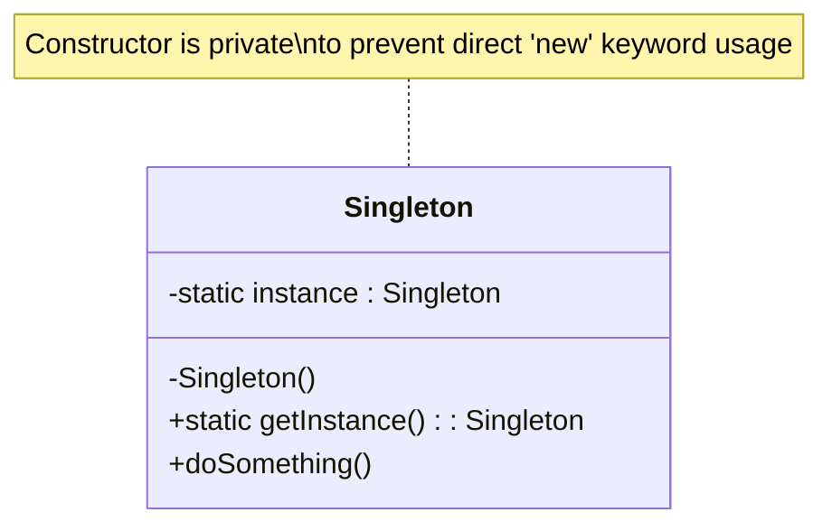
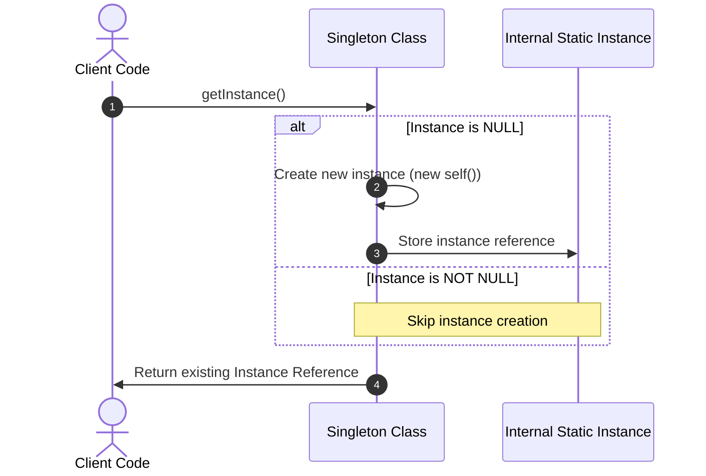

# Singleton Pattern

ক্রিয়েশনাল ডিজাইন প্যাটার্নের অন্তর্ভুক্ত এমন একটি আর্কিটেকচারাল প্যাটার্ন যা নিশ্চিত করে যে একটি ক্লাসের কেবল একটিমাত্র ইন্সট্যান্স (Instance) থাকবে এবং গ্লোবালি সেই ইন্সট্যান্সটি অ্যাক্সেস করার একটি নির্দিষ্ট মাধ্যম প্রদান করে।

---

# Table of Contents

* [Definition](#definition)
* [Why Important](#why-important)
* [Problem Statement](#problem-statement)
* [Architecture](#architecture)
* [Internal Working](#internal-working)
* [Flow Diagram](#flow-diagram)
* [Advantages](#advantages)
* [Disadvantages](#disadvantages)
* [Trade-offs](#trade-offs)
* [Real Project Example](#real-project-example)
* [Best Practices](#best-practices)
* [Performance Considerations](#performance-considerations)
* [Common Mistakes](#common-mistakes)
* [Anti Patterns](#anti-patterns)
* [Related Concepts](#related-concepts)
* [Summary](#summary)
* [References](#references)

---

# Definition

## Simple Definition

সহজ বাংলায় বলতে গেলে, Singleton হলো এমন একটি নিয়ম বা কোডিং স্টাইল যার মাধ্যমে একটি নির্দিষ্ট ক্লাসের অবজেক্ট বা ইন্সট্যান্স পুরো অ্যাপ্লিকেশনে একবারই তৈরি করা যায়। আপনি যতবারই ওই ক্লাসটিকে কল করবেন, প্রতিবারই সে আপনাকে আগে থেকে তৈরি করা সেই একই অবজেক্টটি ফেরত দেবে। নতুন কোনো অবজেক্ট তৈরি হতে দেবে না।

---

## Official Definition

Singleton Pattern হলো Gang of Four (GoF) দ্বারা সংজ্ঞায়িত একটি Creational Design Pattern। এটি নিশ্চিত করে যে রানটাইমে একটি ক্লাসের কেবল একটিই ইন্সট্যান্স (Single Instance) থাকবে এবং এটি ওই ইন্সট্যান্সে পৌঁছানোর জন্য একটি গ্লোবাল অ্যাক্সেস পয়েন্ট (Global Access Point) প্রদান করে। এর প্রধান উদ্দেশ্য হলো অবজেক্ট ক্রিয়েশনকে রেস্ট্রিক্ট করা যেন রিসোর্স অপচয় না হয় এবং গ্লোবাল স্টেট ম্যানেজমেন্ট সহজ হয়।

---

## Architecture Goal

এই Concept মূলত তৈরি হয়েছে সিস্টেমের এমন কিছু Shared Resource বা State ম্যানেজ করার জন্য, যা একাধিকবার তৈরি করলে সিস্টেমে ডেটা ইনকনসিস্টেন্সি (Inconsistency) অথবা মেমোরি ও কানেকশনের অপচয় ঘটে।

এটি মূলত নিচের সমস্যাগুলো সমাধান করে:

* **রিসোর্স ডুপ্লিকেশন রোধ করা:** যেমন একই ডাটাবেজের মাল্টিপল কানেকশন পুল তৈরি হওয়া আটকানো।
* **গ্লোবাল স্টেট সিনক্রোনাইজেশন:** লগার (Logger), কনফিগারেশন ম্যানেজার (Configuration Manager) বা ক্যাশ মেমোরির মতো উপাদানগুলোর স্টেট পুরো অ্যাপ্লিকেশনে একই রাখা।

---

# Why Important

* **কেন ব্যবহার করা হয়:** যখন কোনো অ্যাপ্লিকেশনে একটি নির্দিষ্ট সার্ভিসের স্টেট (State) বা রিসোর্স শেয়ারড হওয়া আবশ্যক এবং সেটির মাল্টিপল কপি তৈরি হলে সিস্টেমে কনফ্লিক্ট হওয়ার সম্ভাবনা থাকে, তখন এটি ব্যবহার করা হয়।
* **কখন ব্যবহার করা উচিত:** ডাটাবেজ কানেকশন হ্যান্ডলার, অ্যাপ্লিকেশন কনফিগারেশন লোডার, সেন্ট্রালাইজড লগার সিস্টেম এবং পেমেন্ট গেটওয়ের API ক্লায়েন্ট ইন্সট্যান্স তৈরিতে।
* **কখন ব্যবহার করা উচিত নয়:** যখন ক্লাসের অবজেক্টের মধ্যে কোনো গ্লোবাল স্টেট রাখার প্রয়োজন নেই অথবা যেখানে প্রতিটি রিকোয়েস্টে আলাদা আলাদা ডাটা কনটেক্সট বা আইসোলেশন (Isolation) প্রয়োজন হয়।
* **কোন Scale-এ দরকার হয়:** স্মল স্কেল থেকে শুরু করে হাইপার-স্কেল এন্টারপ্রাইজ সিস্টেমে এটি দরকার হয়, বিশেষ করে যেখানে লিমিটেড এক্সটার্নাল রিসোর্স (যেমন- থার্ডপার্টি API কানেকশন লিমিট বা হার্ডওয়্যার আইও পোর্ট) অপ্টিমাইজড উপায়ে ব্যবহার করতে হয়।
* **Laravel Context:** লারাভেলে সার্ভিস কন্টেইনারের (Service Container) মাধ্যমে `$this->app->singleton()` মেথড ব্যবহার করে থার্ড-পার্টি ক্লায়েন্ট (যেমন: S3 storage client, Stripe client) বা কাস্টম ম্যানেজার ক্লাসকে রেজিস্টার করা হয়। লারাভেলের নিজস্ব Request, Config, এবং Database Connection ক্লাসগুলো ইন্টারনালি সিঙ্গেলটন হিসেবেই আচরণ করে।
* **Enterprise Context:** মাইক্রোসার্ভিস বা এন্টারপ্রাইজ মনোলিথ অ্যাপ্লিকেশনে সেন্ট্রালাইজড সার্ভিস ডিসকভারি ক্লায়েন্ট, রেট লিমিটার (Rate Limiter) এবং গ্লোবাল ইন-মেমোরি ক্যাশ ক্লায়েন্ট (যেমন Redis/Memcached client) ম্যানেজ করতে এটি অপরিহার্য।

---

# Problem Statement

ধরুন আপনি একটি বড় FinTech অ্যাপ্লিকেশনে কাজ করছেন যেখানে সেন্ট্রালাইজড লগার (Logger) সার্ভিস রয়েছে যা প্রতিদিন লাখ লাখ ট্রানজেকশনের লগ ফাইলে রাইট করে।

যদি প্রতিবার লগের ডাটা পুশ করার সময় `new Logger()` করে নতুন অবজেক্ট তৈরি করা হয়, তবে নিচের সমস্যাগুলো দেখা দেবে:

1. **File Lock Issue:** অপারেটিং সিস্টেম লেভেলে একই ফাইলে একসাথে একাধিক অবজেক্ট থেকে রাইট করার চেষ্টা করলে ফাইল লকিং এরর (File lock exception) আসবে।
2. **Memory Bloat:** প্রতি সেকেন্ডে হাজার হাজার রিকোয়েস্ট আসলে সমপরিমাণ অবজেক্ট তৈরি হয়ে মেমোরি (RAM) ফুল হয়ে যাবে এবং PHP-র Garbage Collector ক্র্যাশ করবে।
3. **Connection Exhaustion:** যদি এটি কোনো রিমোট লগিং সার্ভিস (যেমন Loggly বা Datadog) হয়, তবে প্রতি রিকোয়েস্টে নতুন TCP/HTTP হ্যান্ডশেক করতে গিয়ে কানেকশন পুল শেষ হয়ে যাবে (Socket exhaustion)।

---

# Architecture



---

# Internal Working

১. **Private Constructor:** প্রথমত, ক্লাসের কনস্ট্রাক্টরকে `private` বা `protected` করে দেওয়া হয়। এর ফলে বাইরের কোনো কোড থেকে `new MyClass()` লিখে এর ইন্সট্যান্স তৈরি করা অসম্ভব হয়ে যায়।
২. **Static Property:** ক্লাসের ভেতরেই একটি `private static $instance` ভ্যারিয়েবল রাখা হয়, যা নিজের তৈরি করা একমাত্র অবজেক্টটিকে ধরে রাখে।
৩. **Static Static Method (getInstance):** গ্লোবাল অ্যাক্সেসের জন্য একটি `public static function getInstance()` মেথড থাকে।
৪. **Runtime Flow:** যখনই কোনো কোড `getInstance()` কল করে:
* এটি প্রথমে চেক করে `$instance` ভ্যারিয়েবলটি খালি (null) কিনা।
* যদি খালি থাকে, তবে সে `new self()` কল করে প্রথমবারের মতো অবজেক্ট তৈরি করে `$instance`-এ অ্যাসাইন করে।
* যদি আগে থেকেই অবজেক্ট তৈরি করা থাকে, তবে নতুন কিছু না করে সরাসরি আগের অবজেক্টটি রিটার্ন করে দেয়।
৫. **Clone and Wakeup Restriction:** পিএইচপিতে অবজেক্ট ক্লোনিং এবং সিরিয়ালাইজেশন আটকাতে `__clone()` এবং `__wakeup()` মেথডগুলোকে প্রাইভেট বা এক্সেপশন থ্রোয়িং করে দেওয়া হয়।

---

# Flow Diagram



---

# Advantages

| Advantage | Description |
| --- | --- |
| **Controlled Access** | গ্লোবাল ইন্সট্যান্সের ওপর সম্পূর্ণ নিয়ন্ত্রণ থাকে, ফলে ডেটা ম্যানিপুলেশন ট্র্যাক করা সহজ হয়। |
| **Reduced Memory Footprint** | বারবার অবজেক্ট ক্রিয়েশন এবং ডেস্ট্রাকশন না হওয়ায় মেমোরি ওভারহেড এবং CPU সাইকেল সাশ্রয় হয়। |
| **State Consistency** | পুরো অ্যাপ্লিকেশনে একটি মাত্র অবজেক্ট থাকায় শেয়ারড স্টেটের ডাটা সবসময় সিনক্রোনাইজড থাকে। |
| **Lazy Initialization** | অ্যাপ্লিকেশন স্টার্ট হওয়ার সাথে সাথেই মেমোরি নেয় না, বরং যখন প্রথমবার `getInstance()` কল করা হয় ঠিক তখনই মেমোরি অ্যালোকেট হয়। |
| **Avoids Global Variables** | গ্লোবাল ভেরিয়েবলের মতো নেমস্পেস পলিউশন (Namespace pollution) বা অনিচ্ছাকৃত ডাটা ওভাররাইটের ঝুঁকি ছাড়াই গ্লোবাল অ্যাক্সেস দেয়। |

---

# Disadvantages

| Disadvantage | Description |
| --- | --- |
| **Violates SRP (Single Responsibility)** | এটি একই সাথে নিজের লাইফসাইকেল কন্ট্রোল করে এবং নিজের মূল বিজনেস লজিকও হ্যান্ডেল করে, যা SOLID-এর ১ম নীতি লঙ্ঘন করে। |
| **Hides Dependencies** | কোডের যেকোনো জায়গা থেকে সরাসরি কল করায় কম্পোনেন্টগুলোর মধ্যে Tight Coupling তৈরি হয় এবং ডিপেন্ডেন্সিগুলো স্পষ্ট থাকে না। |
| **Testing Difficulties** | গ্লোবাল স্টেট ধারণ করার কারণে ইউনিট টেস্টিং (Mocking) করা অত্যন্ত কঠিন হয়ে পড়ে। এক টেস্টের স্টেট অন্য টেস্টকে প্রভাবিত করে (Test Pollution)। |
| **Concurrency & Thread Safety** | মাল্টি-থ্রেডেড এনভায়রনমেন্টে (যেমন Java/Go বা PHP-র Swoole/RoadRunner) প্রোপার লকিং ছাড়া রেস কন্ডিশন (Race Condition) তৈরি হতে পারে। |
| **Hard to Extend** | প্রাইভেট কনস্ট্রাক্টর থাকার কারণে সিঙ্গেলটন ক্লাসকে সহজে এক্সটেন্ড (Inherit) করা যায় না। |

---

# Trade-offs

| Scenario | Recommended | Reason |
| --- | --- | --- |
| **High Concurrency State Sharing** | Dependency Injection (DI) Container | গ্লোবাল সিঙ্গেলটন ক্লাসের চেয়ে DI কন্টেইনারের মাধ্যমে সিঙ্গেলটন লাইফসাইকেল ম্যানেজ করলে টেস্টিবিলিটি ও ডিকাপলিং বজায় থাকে। |
| **Stateless Utility / Helper Classes** | Static Methods Only | যদি ক্লাসে কোনো স্টেট ধরে রাখার প্রয়োজন না হয়, তবে সিঙ্গেলটন প্যাটার্ন না লিখে সরাসরি স্ট্যাটিক মেথড ব্যবহার করা শ্রেয়। |
| **Multi-tenant Isolated Configurations** | Factory Pattern | মাল্টি-টেন্যান্সির ক্ষেত্রে গ্লোবাল সিঙ্গেলটন বিপদে ফেলতে পারে, কারণ এক টেন্যান্টের ডাটা অন্য টেন্যান্টে লিক হওয়ার ঝুঁকি থাকে। সেখানে ফ্যাক্টরি প্যাটার্ন ভালো। |

---

# Real Project Example

An Enterprise Payment Gateway Integration System (SaaS Integration Platform).

## Business Requirement

একটি গ্লোবাল SaaS প্ল্যাটফর্মে Stripe পেমেন্ট গেটওয়ের মাধ্যমে সাবস্ক্রিপশন প্রসেস করতে হবে। স্ট্রাইপ API ক্লায়েন্ট ইন্সট্যান্সটি তৈরি করার সময় সিক্রেট কি, ওয়েবহুক সিক্রেট এবং বিভিন্ন HTTP ক্লায়েন্ট কনফিগারেশন (Timeout, Retries) লোড করতে হয় যা বেশ ব্যয়বহুল (Resource Intensive)।

## Existing Problem

ডেভেলপাররা প্রতিবার ইনভয়েস জেনারেট, চার্জ প্রসেস এবং কাস্টমার আপডেট করার সময় আলাদা আলাদা জায়গায় `new StripeClient($config)` তৈরি করছিল। এতে প্রতি রিকোয়েস্টে একাধিকবার কনফিগারেশন ফাইল রিড হচ্ছিল এবং রিডান্ড্যান্ট অবজেক্ট তৈরি হয়ে মেমোরি লিক হচ্ছিল।

## Solution

লারাভেলের সার্ভিস কন্টেইনার ব্যবহার করে `StripeGatewayClient` ক্লাসটিকে সিঙ্গেলটন হিসেবে রেজিস্টার করা হয়েছে।

```php
<?php

namespace App\Services\Payment;

use Stripe\StripeClient;
use Exception;

class StripeGatewayClient
{
    private static ?self $instance = null;
    private StripeClient $client;
    private array $config;

    // ১. প্রাইভেট কনস্ট্রাক্টর যাতে বাইরে থেকে new করা না যায়
    private function __construct()
    {
        $this->config = config('services.stripe');
        
        if (empty($this->config['secret'])) {
            throw new Exception("Stripe secret key is missing in configuration.");
        }

        // ভারী অবজেক্ট ইনিশিয়ালাইজেশন একবারই হবে
        $this->client = new StripeClient($this->config['secret']);
    }

    // ২. ক্লোনিং ব্লক করা
    private function __clone() {}

    // ৩. আনসিরিয়ালাইজেশন ব্লক করা
    public function __wakeup()
    {
        throw new Exception("Cannot unserialize a singleton.");
    }

    // ৪. গ্লোবাল অ্যাক্সেস পয়েন্ট
    public static function getInstance(): self
    {
        if (self::$instance === null) {
            self::$instance = new self();
        }
        return self::$instance;
    }

    public function getClient(): StripeClient
    {
        return $this->client;
    }
}

```

**Laravel Service Provider Registry:**

```php
<?php

namespace App\Providers;

use Illuminate\Support\ServiceProvider;
use App\Services\Payment\StripeGatewayClient;

class PaymentServiceProvider extends ServiceProvider
{
    public function register(): void
    {
        // লারাভেল কন্টেইনারে সিঙ্গেলটন হিসেবে বাইন্ড করা
        $this->app->singleton(StripeGatewayClient::class, function ($app) {
            return StripeGatewayClient::getInstance();
        });
    }
}

```

## কেন এই Architecture নেওয়া হয়েছে

১. **রিসোর্স অপ্টিমাইজেশন:** স্ট্রাইপ ক্লায়েন্টের নেটওয়ার্ক সেটিংস এবং API কি কনফিগারেশন বারবার মেমোরিতে লোড করতে হয় না।
২. **থ্রেড সেফটি এবং মেমোরি লিক রোধ:** রোডরানার (RoadRunner) বা লারাভেল অক্টেন (Laravel Octane) এর মতো লং-রানিং প্রসেসে অবজেক্ট রি-ইউজ নিশ্চিত করে।

## Production Experience

লারাভেল অক্টেন (Swoole) দিয়ে প্রোডাকশনে অ্যাপটি পুশ করার পর দেখা গেল প্রথাগতভাবে তৈরি অবজেক্টগুলো মেমোরি থেকে রিলিজ হচ্ছিল না (Memory Leak)। সিঙ্গেলটনে কনভার্ট করার পর এবং কন্টেইনার ম্যানেজড করার পর মেমোরি ইউজ স্ট্যাটিক লেভেলে চলে আসে এবং API রেসপন্স টাইম প্রায় ১৫% কমে যায় কারণ কনফিগারেশন বুটস্ট্র্যাপিং টাইম জিরো হয়ে গিয়েছিল।

---

# Best Practices

1. **Use DI Containers Over Manual Singletons:** ম্যানুয়ালি ক্লাসের ভেতরে `getInstance()` না লিখে লারাভেলের সার্ভিস কন্টেইনারের `$this->app->singleton()` ব্যবহার করুন। এতে কোড টেস্ট করা সহজ হয়।
2. **Ensure Laziness:** প্রয়োজন ছাড়া কনস্ট্রাক্টরের ভেতর ভারী টাস্ক রাখবেন না, কেবল মেথড এক্সিকিউশনের সময় ডাটা পুশ করুন।
3. **Prevent Cloning:** সর্বদা `__clone()` মেথড ওভাররাইড করে প্রাইভেট বা এক্সেপশন থ্রোয়িং করে রাখুন।
4. **Prevent Deserialization:** সর্বদা `__wakeup()` মেথড প্রটেক্ট করুন যাতে হ্যাকাররা অবজেক্ট ইনজেক্ট করতে না পারে।
5. **Keep It Stateless If Possible:** সিঙ্গেলটন ক্লাসের ভেতরে রিকোয়েস্ট-স্পেসিফিক মেমোরি ডাটা (যেমন কারেন্ট লগড-ইন ইউজার আইডি) স্টোর করবেন না। এতে স্টেট পলিউশন হতে পারে।
6. **Thread Safety in Async PHP:** Swoole বা OpenSwoole ব্যবহার করলে রানটাইমে স্ট্যাটিক প্রোপার্টি চেঞ্জের ক্ষেত্রে মিউটেক্স (Mutex/Locking) মেকানিজম মাথায় রাখুন।
7. **Make Dependencies Explicit:** সিঙ্গেলটন ক্লাসকে সরাসরি গ্লোবাল স্কোপে কল না করে কনস্ট্রাক্টর ইনজেকশনের মাধ্যমে পাস করুন।
8. **Subclassing Care:** যদি সিঙ্গেলটন ক্লাস ইনহেরিট করতে হয়, তবে `self` এর জায়গায় `static` কিওয়ার্ড (Late Static Binding) ব্যবহার করুন।
9. **Destructor Cleanup:** যদি কোনো ফাইল ওপেন বা সকেট কানেকশন থাকে, তবে `__destruct()` মেথডে প্রপার ক্লোজিং লজিক লিখুন।
10. **Fail Fast Configuration:** কনস্ট্রাক্টরের ভেতরেই প্রয়োজনীয় কনফিগারেশন ভ্যালিডেশন করে ফেলুন যেন ভুল থাকলে অ্যাপ্লিকেশন শুরুতেই এরর দেয়।

---

# Performance Considerations

* **Memory Usage:** সিঙ্গেলটন অবজেক্ট অ্যাপ্লিকেশনের পুরো লাইফসাইকেল জুড়ে মেমোরিতে থাকে। ট্র্যাডিশনাল PHP-FPM-এ এটি প্রতিটি রিকোয়েস্টের শেষে ধ্বংস হয়ে যায়, তাই মেমোরি ইমপ্যাক্ট কম। কিন্তু Laravel Octane/Swoole এনভায়রনমেন্টে এটি চিরকাল মেমোরিতে থেকে যায়, তাই মেমোরি লিক এড়াতে সতর্ক থাকতে হবে।
* **CPU Usage:** বারবার অবজেক্টের জন্য মেমোরি অ্যালোকেশন এবং গার্বেজ কালেকশন না হওয়ায় CPU সাইকেল সেভ হয়।
* **Scalability Bottleneck:** মাল্টি-থ্রেডেড ব্যাকএন্ডে যদি সিঙ্গেলটন ক্লাসের ভেতরের রিসোর্স লকড হয়ে থাকে, তবে এটি অ্যাপ্লিকেশনের থ্রুপুট (Throughput) কমিয়ে দিতে পারে।
* **Caching Strategy:** সিঙ্গেলটন ক্লাসের ভেতর ইন্টারনাল মেমোরি ক্যাশ (Array caching) রাখলে খেয়াল রাখতে হবে যেন সেই অ্যারের সাইজ আনলিমিটেড ভাবে বড় না হয়।
* **Database Impact:** ডাটাবেজ সিঙ্গেলটন কানেকশন ব্যবহারের সময় কানেকশন টাইমআউট (Interactive Timeout) হ্যান্ডেল করার মেকানিজম থাকতে হবে, নাহলে লং-রানিং প্রসেসে `MySQL server has gone away` এরর আসবে।

---

# Common Mistakes

| Mistake | কেন ভুল | Better Solution |
| --- | --- | --- |
| `MyClass::getInstance()` সরাসরি কন্ট্রোলারে কল করা | এর ফলে টাইট কাপলিং তৈরি হয় এবং ক্লাসটি মক বা টেস্ট করা অসম্ভব হয়ে যায়। | লারাভেলের `App\Services\MyClass` টাইপ-হিন্ট করে কনস্ট্রাক্টর ইনজেকশন ব্যবহার করা। |
| সিঙ্গেলটনে ইউজার সেশন ডেটা রাখা | লারাভেল অক্টেনের মতো এনভায়রনমেন্টে এক ইউজারের ডাটা অন্য ইউজারের কাছে চলে যাবে (Cross-request data leak)। | সেশন ডাটা রিকোয়েস্ট অবজেক্টে রাখুন, সিঙ্গেলটনে নয়। |
| `__clone` মেথড ডিফাইন না করা | অ্যাপ্লিকেশন কোডের অন্য কেউ `clone $instance` করে আরেকটি কপি তৈরি করে ফেলতে পারবে। | `private function __clone() {}` লিখে ক্লোনিং ডিজেবল করা। |
| ডাটাবেজ কানেকশন রিকানেক্ট লজিক না রাখা | লং রানিং স্ক্রিপ্টে ডাটাবেজ কানেকশন ড্রপ করলে সিঙ্গেলটন অবজেক্ট মৃত কানেকশন ধরে রাখবে। | মেথড কলের আগে কানেকশন অ্যালাইভ আছে কিনা চেক করা (Ping/Reconnect)। |
| ওভারইউজ করা (উটিলিটি ক্লাসে ব্যবহার) | সাধারণ গাণিতিক হিসাব বা স্ট্রিং ম্যানিপুলেশন ক্লাসের জন্য সিঙ্গেলটন বানানো আর্কিটেকচারাল জটিলতা বাড়ায়। | সরাসরি Helper Function বা Plain Static Methods ব্যবহার করা। |

---

# Anti Patterns

| Anti Pattern | কেন খারাপ |
| --- | --- |
| **The God Object Singleton** | যখন একটি মাত্র সিঙ্গেলটন ক্লাসের ভেতর লগার, ডাটাবেজ, মেইলিং—সব ফিচার ঢুকিয়ে দেওয়া হয়। এটি কোডের মেইনটেনেবিলিটি ধ্বংস করে। |
| **Global State Container** | সিঙ্গেলটন ক্লাসকে যখন ডাটাবেজের বিকল্প হিসেবে গ্লোবাল ভেরিয়েবল বা অ্যাপ্লিকেশন স্টেট শেয়ার করার ডাম্পিং গ্রাউন্ড বানানো হয়। এটি ডিবাগিংকে অসম্ভব করে তোলে। |

---

# Related Concepts

| Concept | Relation |
| --- | --- |
| **SOLID (Single Responsibility)** | সিঙ্গেলটন প্রায়শই SRP ভঙ্গ করে। তাই এটি ব্যবহারের সময় ব্যালেন্স রাখা জরুরি। |
| **Dependency Injection Container** | আধুনিক ফ্রেমওয়ার্কে সিঙ্গেলটন প্যাটার্ন নিজে না লিখে DI কন্টেইনার দিয়ে এর লাইফসাইকেল কন্ট্রোল করা বেস্ট প্র্যাকটিস। |
| **Factory Pattern** | সিঙ্গেলটন যেখানে একটি নির্দিষ্ট অবজেক্ট রিটার্ন করে, ফ্যাক্টরি সেখানে রানটাইম কন্ডিশনের ওপর ভিত্তি করে নতুন নতুন অবজেক্ট তৈরি করে। |
| **Monostate Pattern** | সিঙ্গেলটনের বিকল্প, যেখানে একাধিক অবজেক্ট তৈরি করা যায় কিন্তু তারা সবাই ইন্টারনালি একই স্ট্যাটিক স্টেট শেয়ার করে। |

---

# Summary

* সিঙ্গেলটন প্যাটার্ন নিশ্চিত করে যে একটি অ্যাপ্লিকেশনে একটি ক্লাসের একটিমাত্র ইন্সট্যান্স থাকবে।
* এটি গ্লোবাল অ্যাক্সেস পয়েন্ট প্রদান করে কিন্তু গ্লোবাল ভেরিয়েবলের অপব্যবহার রোধ করে।
* কনস্ট্রাক্টরকে `private` করার মাধ্যমে অবজেক্টের অনাকাঙ্ক্ষিত সৃষ্টি রুখে দেওয়া হয়।
* ক্লোনিং এবং সিরিয়ালাইজেশন ডিজেবল করা সিঙ্গেলটনের নিরাপত্তা ও কার্যকারিতার জন্য আবশ্যক।
* আধুনিক আর্কিটেকচারে ম্যানুয়াল সিঙ্গেলটনের চেয়ে **Dependency Injection Container Managed Singleton** বেশি গ্রহণযোগ্য।
* লং-রানিং এনভায়রনমেন্টে (Swoole, Octane) সিঙ্গেলটন ব্যবহারে স্টেট লিক হওয়ার ব্যাপারে চরম সতর্ক থাকতে হবে।
* এটি মূলত ডাটাবেজ, লগার, ক্যাশ ও এক্সটার্নাল API ক্লায়েন্ট ম্যানেজমেন্টের জন্য সবচেয়ে উপযোগী।
* অপ্রয়োজনীয় সিঙ্গেলটন ব্যবহার কোডকে আনটেস্টেবল (Untestable) এবং টাইটলি কাপলড (Tightly Coupled) করে তোলে।

---

# References

* **Gang of Four (GoF) Book:** Design Patterns: Elements of Reusable Object-Oriented Software.
* **Martin Fowler:** Patterns of Enterprise Application Architecture (Bliki - Singleton).
* **Laravel Docs:** Service Container Singletons ([Laravel Service Container](https://www.google.com/search?q=https://laravel.com/docs/container)).
* **Refactoring Guru:** Singleton Pattern Guide ([Refactoring Guru - Singleton](https://refactoring.guru/design-patterns/singleton)).
* **PHP Documentation:** OOP Static Properties & Magic Methods ([PHP Manual](https://www.php.net/manual/en/language.oop5.magic.php)).