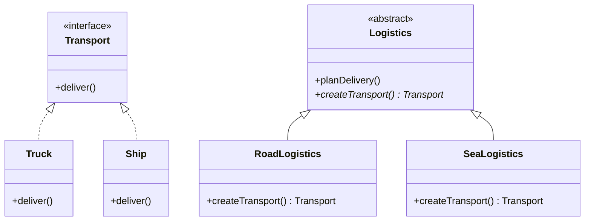
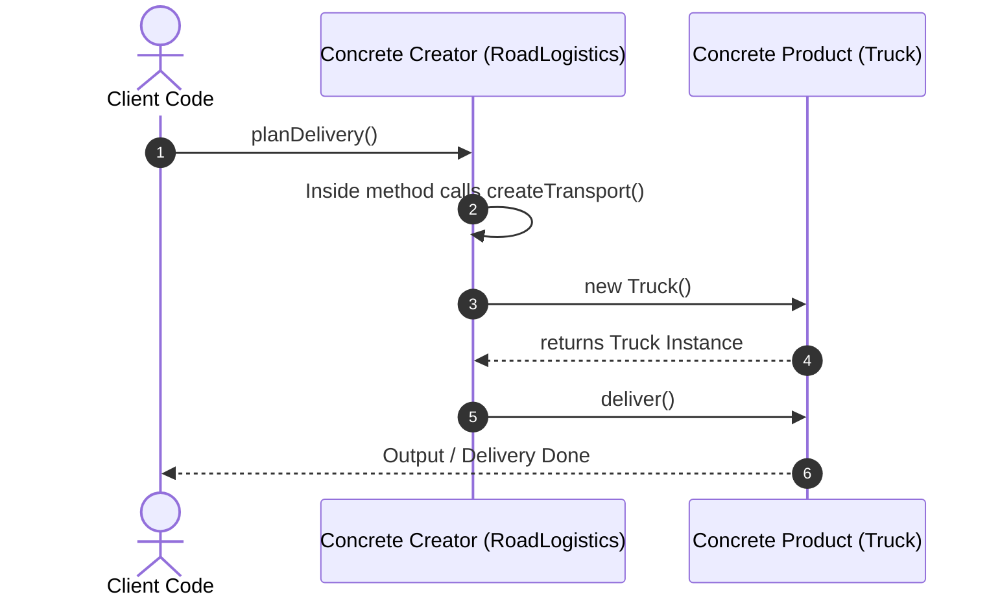

# Factory Method Pattern

ক্রিয়েশনাল ডিজাইন প্যাটার্নের অন্তর্ভুক্ত এমন একটি আর্কিটেকচারাল প্যাটার্ন যা সাব-ক্লাসগুলোকে অবজেক্ট তৈরির দায়িত্ব অর্পণ করে অবজেক্ট ক্রিয়েশনের লজিককে ক্লায়েন্ট কোড থেকে সম্পূর্ণ আলাদাকরনের সুবিধা দেয়।

---

# Table of Contents

* [Definition](#definition)
* [Why Important](#why-important)
* [Problem Statement](#problem-statement)
* [Architecture](#architecture)
* [Internal Working](#internal-working)
* [Flow Diagram](#flow-diagram)
* [Advantages](#advantages)
* [Disadvantages](#disadvantages)
* [Trade-offs](#trade-offs)
* [Real Project Example](#real-project-example)
* [Best Practices](#best-practices)
* [Performance Considerations](#performance-considerations)
* [Common Mistakes](#common-mistakes)
* [Anti Patterns](#anti-patterns)
* [Related Concepts](#related-concepts)
* [Summary](#summary)
* [References](#references)

---

# Definition

## Simple Definition

সহজ বাংলায় বলতে গেলে, Factory Method হলো একটি "অবজেক্ট তৈরির কারখানা"। কোডের ভেতর সরাসরি `new MyClass()` লিখে অবজেক্ট তৈরি না করে, আমরা একটি নির্দিষ্ট মেথডকে (Factory Method) বলি আমাদের অবজেক্ট এনে দিতে। সেই মেথডটি পরিস্থিতির ওপর ভিত্তি করে সঠিক অবজেক্টটি তৈরি করে আমাদের হাতে দেয়। এর ফলে কোন অবজেক্ট কখন তৈরি হচ্ছে, তা নিয়ে মূল কোডকে চিন্তা করতে হয় না।

---

## Official Definition

Factory Method Pattern হলো একটি Creational Design Pattern যা একটি ইন্টারফেসে অবজেক্ট তৈরি করার জন্য একটি মেথড ডিফাইন করে, কিন্তু কোন ক্লাসের অবজেক্ট তৈরি হবে তা সাব-ক্লাসগুলোকে (Subclasses) সিদ্ধান্ত নেওয়ার অনুমতি দেয়। এটি একটি ক্লাসকে তার অবজেক্ট ক্রিয়েশনের দায়িত্ব সাব-ক্লাসের ওপর ডিফাইন করার স্বাধীনতা দিয়ে Loose Coupling নিশ্চিত করে।

---

## Architecture Goal

এই Concept তৈরির মূল উদ্দেশ্য হলো অ্যাপ্লিকেশনের অবজেক্ট ক্রিয়েশন লজিক এবং বিজনেস লজিককে আলাদা করা (Separation of Concerns)।

এটি মূলত নিচের সমস্যাগুলো সমাধান করে:

* **Tight Coupling দূর করা:** ক্লায়েন্ট কোড সরাসরি কোনো কংক্রিট ক্লাসের (Concrete Class) ওপর নির্ভরশীল থাকে না।
* **Open/Closed Principle মান্য করা:** কোডের বিদ্যমান স্ট্রাকচার পরিবর্তন না করেই সিস্টেমে নতুন ধরনের প্রোডাক্ট বা অবজেক্ট যুক্ত করার সুবিধা দেওয়া।

---

# Why Important

* **কেন ব্যবহার করা হয়:** যখন কোনো অ্যাপ্লিকেশনে এমন একাধিক ক্লাস থাকে যা একই ইন্টারফেস বা প্যারেন্ট ক্লাস শেয়ার করে এবং রানটাইমে কন্ডিশনের ওপর ভিত্তি করে তাদের যেকোনো একটির অবজেক্ট তৈরি করার প্রয়োজন হয়।
* **কখন ব্যবহার করা উচিত:** মাল্টিপল লজিস্টিকস/শিপিং মেথড (যেমন: DHL, FedEx), একাধিক পেমেন্ট গেটওয়ে প্রসেসর (যেমন: Stripe, PayPal, SSLCommerz), বা বিভিন্ন ফরম্যাটে ডকুমেন্ট এক্সপোর্টার (PDF, CSV, Excel) তৈরির ক্ষেত্রে।
* **কখন ব্যবহার করা উচিত নয়:** যদি আপনার সিস্টেমে কেবল একটি বা দুটি নির্দিষ্ট ক্লাস থাকে এবং ভবিষ্যতে সেগুলো পরিবর্তনের বা নতুন ক্লাস যুক্ত হওয়ার কোনো সম্ভাবনা না থাকে।
* **কোন Scale-এ দরকার হয়:** মিডিয়াম থেকে লার্জ স্কেল এন্টারপ্রাইজ সিস্টেমে এটি অত্যন্ত জরুরি, যেখানে সিস্টেমকে প্লাগইন-ভিত্তিক বা এক্সটেনসিবল (Extensible) করতে হয়।
* **Laravel Context:** লারাভেলে `Notification` চ্যানেল বা `Storage::disk('s3')` অথবা `Auth::guard('api')` এর ইন্টারনাল আর্কিটেকচার মূলত ফ্যাক্টরি প্যাটার্ন অনুসরণ করে তৈরি। ড্রাইভার পরিবর্তনের সাথে সাথে লারাভেল ব্যাকএন্ডে সঠিক অবজেক্ট তৈরি করে নেয়।
* **Enterprise Context:** মাল্টি-টেন্যান্ট (Multi-tenant) আর্কিটেকচারে যেখানে এক এক টেন্যান্টের জন্য আলাদা ডাটাবেজ ড্রাইভার বা আলাদা নোটিফিকেশন ইঞ্জিন রানটাইমে অ্যাসাইন করতে হয়, সেখানে এটি বহুল ব্যবহৃত।

---

# Problem Statement

ধরুন আপনি একটি Logistics / Courier Management SaaS অ্যাপ্লিকেশন তৈরি করছেন। শুরুতে অ্যাপটি শুধু সড়ক পথের ট্রাক (Truck) সাপোর্ট করত। তাই আপনার সমস্ত কোডবেস জুড়ে `new Truck()` লিখে লজিক হ্যান্ডেল করা হয়েছে।

ব্যবসা বড় হওয়ায় এখন আপনাকে জলপথের জাহাজ (Ship) এবং আকাশপথের বিমান (Airplane) ডেলিভারি সিস্টেম যুক্ত করতে হবে।

এখন আপনি যদি নতুন কোড যুক্ত করতে যান, তবে নিচের সমস্যাগুলো দেখা দেবে:

1. **Code Duplication & Modification:** পুরো কোডবেসের যেখানে যেখানে `new Truck()` ছিল, সেখানে সেখানে বড় বড় `if-else` বা `switch` কেস বসিয়ে `new Ship()` বা `new Airplane()` লিখতে হবে।
2. **Violation of OCP:** প্রতিবার নতুন কোনো ট্রান্সপোর্ট মেথড যুক্ত করতে গেলে বিদ্যমান টেস্ট করা কোড এডিট করতে হবে, যা সিস্টেমে নতুন বাগে (Bug) জন্ম দিতে পারে।
3. **High Coupling:** আপনার পুরো বিজনেস লজিক সরাসরি কংক্রিট অবজেক্টের (Truck/Ship) সাথে শক্তভাবে যুক্ত হয়ে যাবে।

---

# Architecture



---

# Internal Working

১. **Product Interface:** প্রথমে একটি কমন ইন্টারফেস বা অ্যাবস্ট্রাক্ট ক্লাস (যেমন `Transport`) তৈরি করা হয়, যা সব কংক্রিট অবজেক্ট মানতে বাধ্য থাকবে।
২. **Concrete Products:** এই ইন্টারফেসকে ইমপ্লিমেন্ট করে বিভিন্ন কংক্রিট ক্লাস (যেমন `Truck`, `Ship`) তৈরি হয়, যার ভেতর আসল বিজনেস লজিক থাকে।
৩. **Creator Class (Factory):** একটি প্যারেন্ট ক্রিয়েটর ক্লাস বা ইন্টারফেস থাকে যা একটি `abstract` মেথড ডিফাইন করে (যেমন `createTransport()`)। এই মেথডটিই হলো আমাদের **Factory Method**।
৪. **Concrete Creators:** সাব-ক্লাসগুলো (যেমন `RoadLogistics`, `SeaLogistics`) এই ফ্যাক্টরি মেথডটিকে ওভাররাইড করে এবং তাদের নিজস্ব কংক্রিট প্রোডাক্টের অবজেক্ট তৈরি করে রিটার্ন করে।
৫. **Runtime Resolution:** ক্লায়েন্ট কোড সরাসরি কংক্রিট প্রোডাক্ট চেনে না। সে শুধু ক্রিয়েটর ক্লাসকে কল করে মেথড এক্সিকিউট করে, রানটাইমে সঠিক অবজেক্টটি তৈরি হয়ে চলে আসে।

---

# Flow Diagram



---

# Advantages

| Advantage | Description |
| --- | --- |
| **Loose Coupling** | ক্লায়েন্ট কোড সরাসরি কংক্রিট প্রোডাক্ট ক্লাসের সাথে যুক্ত থাকে না, ফলে কোড অনেক নমনীয় হয়। |
| **Open/Closed Principle** | বিদ্যমান ক্লায়েন্ট কোড না ভেঙেই সিস্টেমে নতুন নতুন প্রোডাক্ট টাইপ যোগ করা যায়। |
| **Single Responsibility** | অবজেক্ট তৈরির সমস্ত কোড এক জায়গায় (Factory-তে) কেন্দ্রীভূত থাকে, যা মেইনটেইন করা সহজ। |
| **Code Reusability** | অবজেক্ট তৈরির জটিল লজিক বা কনফিগারেশন বারবার না লিখে এক জায়গার লজিক পুরো অ্যাপে রি-ইউজ করা যায়। |
| **Easier Testing** | ইন্টারফেস ব্যবহারের কারণে টেস্ট করার সময় আসল অবজেক্টের বদলে মক (Mock) অবজেক্ট সহজে ইনজেক্ট করা যায়। |

---

# Disadvantages

| Disadvantage | Description |
| --- | --- |
| **Increased Complexity** | প্যাটার্নটি ইমপ্লিমেন্ট করতে অনেকগুলো নতুন সাব-класс এবং ইন্টারফেস তৈরি করতে হয়, যা কোডের ফাইল সংখ্যা বাড়িয়ে দেয়। |
| **Over-engineering** | ছোট বা সাধারণ প্রোজেক্টে যেখানে অবজেক্ট ডাইনামিকালি চেঞ্জ হওয়ার সুযোগ নেই, সেখানে এটি ব্যবহার করলে কোড জটিল হয়ে যায়। |
| **Deep Hierarchy** | কোড এক্সটেন্ড করতে করতে একসময় ক্রিয়েটর ক্লাসের চেইন বা হায়ারার্কি অনেক গভীর হয়ে যেতে পারে। |

---

# Trade-offs

| Scenario | Recommended | Reason |
| --- | --- | --- |
| **Simple Object Creation based on a string/type** | Simple Factory (Static Factory) | যদি কোনো সাব-ক্লাসিংয়ের প্রয়োজন না হয়, তবে পুরো ফ্যাক্টরি মেথড প্যাটার্ন না লিখে একটি সিঙ্গেল ক্লাসের স্ট্যাটিক মেথড দিয়ে অবজেক্ট তৈরি করা সহজ। |
| **Creating Families of Related Products** | Abstract Factory Pattern | যখন আলাদা আলাদা একক অবজেক্ট নয়, বরং একগুচ্ছ রিলেটেড অবজেক্ট (যেমন: Windows Button + Windows Checkbox) একসাথে তৈরি করতে হয়। |

---

# Real Project Example

An Enterprise Notification Dispatcher (SaaS Platform).

## Business Requirement

একটি এন্টারপ্রাইজ অ্যাপ্লিকেশনে ইউজারদের নোটিফিকেশন পাঠাতে হবে। ইউজার তার প্রোফাইল সেটিংসে চয়েস করতে পারে সে নোটিফিকেশনটি `Email`, `SMS`, নাকি `Slack`-এ পেতে চায়।

## Existing Problem

শুরুতে শুধু ইমেইল ছিল। পরবর্তীতে SMS ও Slack যুক্ত করায় ডেভেলপাররা কন্ট্রোলারের ভেতর বড় বড় `switch-case` লিখেছিল। যখনই নতুন কোনো চ্যানেল (যেমন: WhatsApp) যোগ করার রিকোয়েস্ট আসে, পুরো কন্ট্রোলার ফাইল এডিট করতে হতো এবং টেস্ট ব্রেক করার ঝুঁকি থাকত।

## Solution

```php
<?php

namespace App\Services\Notification;

// ১. Product Interface
interface NotificationSenderInterface
{
    public function send(string $to, string $message): bool;
}

// ২. Concrete Products
class EmailNotification implements NotificationSenderInterface
{
    public function send(string $to, string $message): bool {
        // Send Email via Mailgun/SES
        return true;
    }
}

class SmsNotification implements NotificationSenderInterface
{
    public function send(string $to, string $message): bool {
        // Send SMS via Twilio
        return true;
    }
}

// ৩. Base Creator Class
abstract class NotificationLogistics
{
    // The Factory Method
    abstract public function createSender(): NotificationSenderInterface;

    public function dispatchNotification(string $to, string $message): bool
    {
        // ফ্যাক্টরি মেথড কল করে অবজেক্ট নেওয়া হচ্ছে
        $sender = $this->createSender();
        return $sender->send($to, $message);
    }
}

// ৪. Concrete Creators
class EmailLogistics extends NotificationLogistics
{
    public function createSender(): NotificationSenderInterface {
        return new EmailNotification();
    }
}

class SmsLogistics extends NotificationLogistics
{
    public function createSender(): NotificationSenderInterface {
        return new SmsNotification();
    }
}

```

**Client Code Usage:**

```php
<?php

namespace App\Http\Controllers;

use App\Services\Notification\EmailLogistics;
use App\Services\Notification\SmsLogistics;
use Exception;

class NotificationController extends Controller
{
    public function sendUserNotification($user, $message)
    {
        // রানটাইমে ইউজারের প্রিফারেন্স অনুযায়ী ফ্যাক্টরি সিলেক্ট করা হচ্ছে
        $creator = match($user->notification_preference) {
            'email' => new EmailLogistics(),
            'sms'   => new SmsLogistics(),
            default => throw new Exception("Unsupported notification channel")
        };

        // ক্লায়েন্ট কোড জানেই না ব্যাকএন্ডে কি অবজেক্ট তৈরি হচ্ছে
        $creator->dispatchNotification($user->contact_info, $message);
    }
}

```

## কেন এই Architecture নেওয়া হয়েছে

১. **WhatsApp এক্সটেনশন সহজ:** ভবিষ্যতে WhatsApp যুক্ত করতে হলে শুধু `WhatsAppNotification` এবং `WhatsAppLogistics` নামে দুটি নতুন ক্লাস বানালেই হবে, পুরানো কোনো কোড টাচ করতে হবে না।
২. **Separation of Logic:** কন্ট্রোলারের কাজ শুধু রিকোয়েস্ট নেওয়া, নোটিফিকেশন পাঠানোর মেকানিজম তৈরি করা সম্পূর্ণ আলাদা লেয়ারে চলে গেছে।

## Production Experience

এই রিফ্যাক্টরিংয়ের পর সিস্টেমে নতুন পুশ নোটিফিকেশন (Firebase) চ্যানেল যুক্ত করতে আমাদের মাত্র ৩০ মিনিট সময় লেগেছিল এবং মূল ট্রানজেকশনাল কোডে কোনো টাচ না করায় জিরো রিগ্রেশন (Zero Regression) বা বাগ জেনারেট হয়েছিল।

---

# Best Practices

1. **Program to an Interface, not an Implementation:** ফ্যাক্টরি মেথড সবসময় যেন কংক্রিট ক্লাসের বদলে ইন্টারফেস বা অ্যাবস্ট্রাক্ট ক্লাস রিটার্ন করে।
2. **Use Modern PHP Match Expressions:** টাইপ রেজোলিউশনের জন্য পুরাতন `switch-case` এর বদলে পিএইচপি ৮+ এর `match()` এক্সপ্রেশন ব্যবহার করুন।
3. **Keep Creators Lean:** ক্রিয়েটর ক্লাসের ভেতরে অবজেক্ট তৈরির বাইরের অতিরিক্ত বিজনেস লজিক লেখা থেকে বিরত থাকুন।
4. **Name Explicitly:** ফ্যাক্টরি মেথডের নাম সবসময় অর্থবহ রাখুন, যেমন: `create`, `make`, `build`, অথবা `get`.
5. **Leverage Dependency Injection:** ফ্যাক্টরি ক্লাসগুলোর অবজেক্ট সরাসরি `new` না করে ডিআই কন্টেইনারের মাধ্যমে রেজলভ করুন।
6. **Throw Custom Exceptions:** যদি কোনো আনসাপোর্টেড টাইপ রিকোয়েস্ট করা হয়, তবে একটি সুনির্দিষ্ট কাস্টম এক্সেপশন (যেমন: `UnsupportedDriverException`) থ্রো করুন।
7. **Combine with Singleton if Needed:** যদি ফ্যাক্টরি দ্বারা তৈরি প্রোডাক্টটি স্টেটলেস (Stateless) হয়, তবে মেমোরি বাঁচাতে একই অবজেক্ট ক্যাশ করে রিটার্ন করতে পারেন।
8. **Enforce Strict Types:** পিএইচপিতে টাইপ সেফটি নিশ্চিত করতে ফাইলের শুরুতে `declare(strict_types=1);` ব্যবহার করুন।
9. **Document with PHPDoc:** আপনার ফ্যাক্টরি মেথড কোন কোন ইন্টারফেস রিটার্ন করতে পারে তা PHPDoc (`@return NotificationSenderInterface`) দিয়ে স্পষ্ট করুন যাতে IDE অটো-কমপ্লিশন ঠিকঠাক কাজ করে।
10. **Write Unit Tests for Each Concrete Creator:** প্রতিটি সাব-ক্লাস সঠিক প্রোডাক্ট তৈরি করছে কিনা তা আলাদা আলাদা ভাবে টেস্ট করুন।

---

# Performance Considerations

* **Memory Usage:** ফ্যাক্টরি মেথড ব্যবহারের কারণে মেমোরি ইউজেসে সরাসরি কোনো নেতিবাচক প্রভাব পড়ে না, কারণ এটি রানটাইমে কেবল প্রয়োজনীয় অবজেক্টটিই তৈরি করে।
* **CPU Usage:** অবজেক্ট ক্রিয়েশনের আগে ছোট একটি ডাইনামিক রেজোলিউশন (যেমন: স্ট্রিং ম্যাচিং বা ক্লাস এক্সিস্টেন্স চেক) হয়, যা সিপিইউ-র জন্য খুবই নগণ্য।
* **Scalability Bottleneck:** যদি আপনার ফ্যাক্টরি মেথডের ভেতর অবজেক্ট তৈরির সময় প্রতিবার ডাটাবেজ কোয়েরি বা ফাইল রিড করতে হয়, তবে সেটি সিস্টেমে বটলেনেক (Bottleneck) তৈরি করতে পারে।
* **Caching Strategy:** ভারী অবজেক্টের ক্ষেত্রে ফ্যাক্টরির ভেতরেই অবজেক্টগুলোকে একটি স্ট্যাটিক অ্যারেতে ক্যাশ (`Flyweight` কনসেপ্টের সাথে মিলিয়ে) করে রাখা যেতে পারে যাতে বারবার অবজেক্ট ইনিশিয়ালাইজেশন এড়ানো যায়।

---

# Common Mistakes

| Mistake | কেন ভুল | Better Solution |
| --- | --- | --- |
| ফ্যাক্টরি মেথডের রিটার্ন টাইপ কংক্রিট ক্লাস দেওয়া | এটি loose coupling এর মূল উদ্দেশ্যই নষ্ট করে দেয়। | রিটার্ন টাইপ সবসময় কমন `Interface` দিন। |
| ইন্টারনাল মেথডে সরাসরি `$_POST` বা গ্লোবাল ইনপুট নেওয়া | ফ্যাক্টরির ভেতর সরাসরি গ্লোবাল রিকোয়েস্ট ভেরিয়েবল অ্যাক্সেস করা কোডের টেস্টেবিলিটি নষ্ট করে। | প্রয়োজনীয় প্যারামিটার মেথড আর্গুমেন্ট হিসেবে পাস করুন। |
| প্রতিটি অবজেক্টের জন্য জোর করে ফ্যাক্টরি মেথড বানানো | অতিরিক্ত সিম্পল ক্লাসের জন্য এটি করলে কোডে ক্লাসের সংখ্যা অযথা বেড়ে যায় (Over-engineering)। | অবজেক্ট ক্রিয়েশন যদি একদম স্ট্রেটফরোয়ার্ড হয়, সরাসরি `new` ব্যবহার করুন। |
| এক্সেপশন হ্যান্ডেল না করা | ভুল টাইপ ইনপুট দিলে যদি হ্যান্ডেল না করা হয়, তবে রানটাইমে ফ্যাটাল এরর দিয়ে অ্যাপ ক্র্যাশ করবে। | ট্রাই-ক্যাচ ব্লক বা ক্লিয়ার ভ্যালিডেশন লেয়ার ব্যবহার করুন। |

---

# Anti Patterns

| Anti Pattern | কেন খারাপ |
| --- | --- |
| **The Hardcoded Switch Factory** | ক্রিয়েটর সাব-ক্লাস তৈরি না করে একটি মাত্র ক্লাসের ভেতর পৃথিবীর সব টাইপের `if-else` বা `switch` ঢুকিয়ে দেওয়া। এটি ওপেন/ক্লোজড প্রিন্সিপাল পুরোপুরি লঙ্ঘন করে। |

---

# Related Concepts

| Concept | Relation |
| --- | --- |
| **SOLID (Open/Closed Principle)** | ফ্যাক্টরি মেথড সরাসরি OCP মানতে সাহায্য করে, কারণ নতুন কোড অ্যাড করতে পুরাতন কোড বদলাতে হয় না। |
| **Abstract Factory** | ফ্যাক্টরি মেথড সাধারণত একটি মেথড দিয়ে একটি অবজেক্ট বানায়, আর অ্যাবস্ট্রাক্ট ফ্যাক্টরি পুরো একটি অবজেক্ট ফ্যামিলি তৈরি করার ইন্টারফেস দেয়। |
| **Simple Factory** | এটি কোনো আসল গোফ (Gof) প্যাটার্ন নয়, সাধারণত একটি স্ট্যাটিক মেথড দিয়ে অবজেক্ট তৈরির সহজ রূপ। |

---

# Summary

* ফ্যাক্টরি মেথড অবজেক্ট তৈরির লজিককে ক্লায়েন্ট কোড থেকে আড়াল করে।
* এটি মূলত ইন্টারফেস এবং সাব-ক্লাসের পলিমরফিজম (Polymorphism) ধারণার ওপর ভিত্তি করে কাজ করে।
* কোডকে এক্সটেনসিবল এবং প্লাগ-অ্যান্ড-প্লে (Plug and Play) বানানোর জন্য এটি আইডিয়াল।
* এটি সিস্টেমের Tight Coupling কমিয়ে Loose Coupling নিশ্চিত করে।
* লারাভেলের মতো মডার্ন ফ্রেমওয়ার্কের ড্রাইভার-ভিত্তিক আর্কিটেকচার সম্পূর্ণ এই থিওরির ওপর প্রতিষ্ঠিত।
* অবজেক্ট তৈরির জটিলতা এবং রুলস এক জায়গায় হ্যান্ডেল করার কারণে বাগ ট্র্যাকিং সহজ হয়।

---

# References

* **Gang of Four (GoF) Book:** Design Patterns: Elements of Reusable Object-Oriented Software.
* **Martin Fowler:** Enterprise Application Patterns & Refactoring techniques.
* **Refactoring Guru:** Factory Method Pattern Explained ([Refactoring Guru - Factory Method](https://refactoring.guru/design-patterns/factory-method)).
* **Laravel Framework Source Code:** `Illuminate\Notifications\ChannelManager` as a real-world case study.