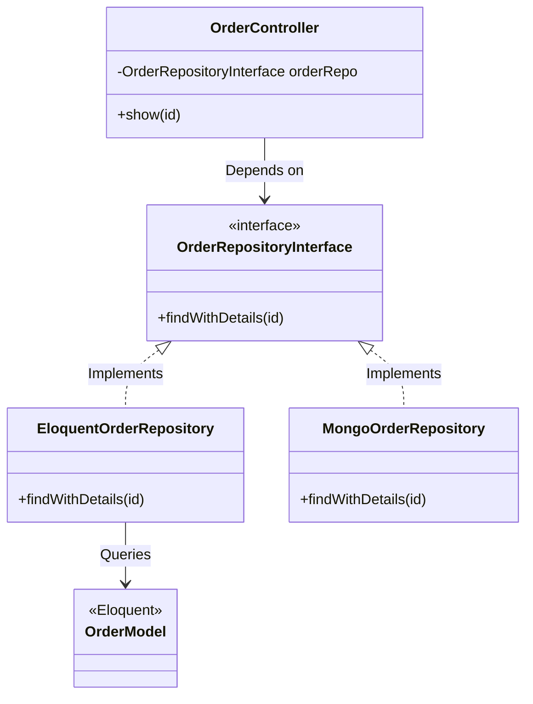
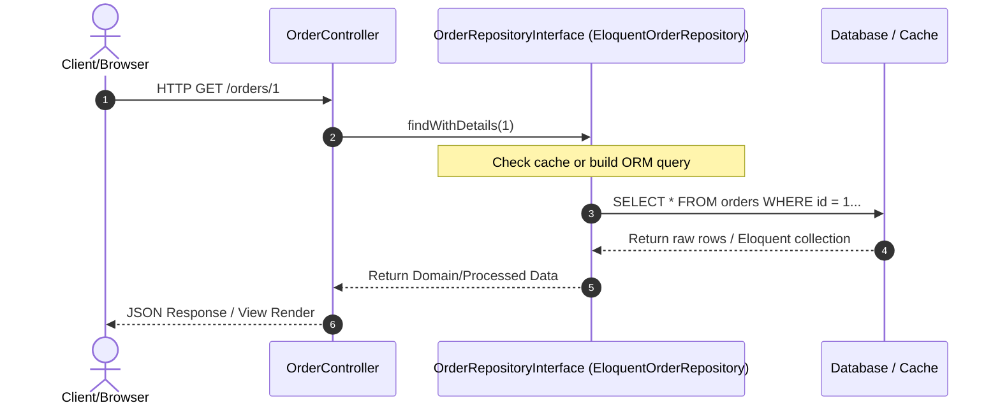

# Repository Pattern

ডাটা সোর্স (যেমন- ডাটাবেজ, API, ওআরএম) এবং অ্যাপ্লিকেশনের বিজনেস লজিক লেয়ারের মধ্যে একটি মিডলওয়্যার বা অ্যাবস্ট্রাকশন লেয়ার তৈরি করে ডাটা অ্যাক্সেস লজিককে সম্পূর্ণ আলাদা করার আর্কিটেকচারাল ডিজাইন প্যাটার্ন।

---

# Table of Contents

* Definition
* Why Important
* Problem Statement
* Architecture
* Internal Working
* Flow Diagram
* Advantages
* Disadvantages
* Trade-offs
* Real Project Example
* Best Practices
* Performance Considerations
* Common Mistakes
* Anti Patterns
* Related Concepts
* Summary
* References

---

# Definition

## Simple Definition

সহজ বাংলায় বলতে গেলে, Repository হলো একটি "ডাটার দোকান বা আড়ত"। আপনার অ্যাপ্লিকেশনের কন্ট্রোলার বা বিজনেস লজিক সরাসরি ডাটাবেজকে বলবে না "আমাকে এই ডাটা দাও"। পরিবর্তে, সে রেপোজিটরিকে বলবে "আমার অমুক ডাটা লাগবে"। রেপোজিটরি তখন ভেতর থেকে ডাটাবেজ কোয়েরি চালিয়ে, নাকি ক্যাশ মেমোরি থেকে, নাকি কোনো থার্ড-পার্টি API থেকে ডাটা এনে দেবে—সেটি সম্পূর্ণ রেপোজিটরির নিজস্ব ব্যাপার। কন্ট্রোলার শুধু ডাটা হাতে পাবে, ডাটা কোথা থেকে কীভাবে এলো তা তাকে জানতে হবে না।

---

## Official Definition

Edward Hieatt এবং Rob Mee দ্বারা প্রবর্তিত এবং Martin Fowler-এর *Patterns of Enterprise Application Architecture* বইয়ে সংজ্ঞায়িত, Repository Pattern হলো এমন একটি অ্যাবস্ট্রাকশন লেয়ার যা ডোমেন এবং ডাটা ম্যাপিং লেয়ারের মধ্যে একটি ইন-মেমোরি ডোমেন অবজেক্ট কালেকশনের মতো আচরণ করে। এটি ডাটাবেজে অবজেক্টের স্টেট পারসিস্ট (Persist) করার জটিল লজিককে বিজনেস লজিক থেকে সম্পূর্ণ পৃথক করে দেয়।

---

## Architecture Goal

এই Concept তৈরির মূল উদ্দেশ্য হলো ডাটা পারসিস্টেন্স টেকনোলজি (Data Persistence Technology) থেকে বিজনেস লজিককে ডিকাপল (Decouple) করা।

এটি মূলত নিচের সমস্যাগুলো সমাধান করে:

* **ডাটাবেজ ও কোয়েরি লজিকের ছড়াছড়ি রোধ:** কন্ট্রোলারের ভেতর বড় বড় এবং ডুপ্লিকেট SQL বা ORM (যেমন Eloquent) কোয়েরি লেখা বন্ধ করা।
* **সেন্ট্রালাইজড ডাটা ম্যানিপুলেশন:** ডাটা ফেচিং এবং ফিল্টারিং রুলস এক জায়গায় রাখা যাতে পরবর্তীতে ডাটাবেজ স্ট্রাকচার বা সোর্স পরিবর্তন করা সহজ হয়।

---

# Why Important

* **কেন ব্যবহার করা হয়:** অ্যাপ্লিকেশনের মেইনটেইনেবিলিটি এবং টেস্টেবিলিটি বাড়ানোর জন্য। ডাটাবেজের সরাসরি কোড যদি পুরো অ্যাপে ছড়িয়ে থাকে, তবে ডাটাবেজ স্কিমা সামান্য পরিবর্তন হলেই পুরো অ্যাপ ক্র্যাশ করতে পারে। রেপোজিটরি থাকলে শুধু রেপোজিটরি ফাইলটি আপডেট করলেই হয়।
* **কখন ব্যবহার করা উচিত:** বড় এবং জটিল এন্টারপ্রাইজ অ্যাপ্লিকেশনে যেখানে একই ডাটা কোয়েরি একাধিক কন্ট্রোলার, কমান্ড বা জব (Job) থেকে ব্যবহার করা হয়, অথবা যেখানে ক্যাশিং স্ট্র্যাটেজি অত্যন্ত নিখুঁতভাবে মেইনটেইন করতে হয়।
* **কখন ব্যবহার করা উচিত নয়:** ছোট বা মাঝারি সাইজের সাধারণ CRUD (Create, Read, Update, Delete) অ্যাপ্লিকেশনে যেখানে ফ্রেমওয়ার্কের নিজস্ব ORM (যেমন Laravel Eloquent) সরাসরি ব্যবহার করলেই কাজ হয়ে যায়।
* **কোন Scale-এ দরকার হয়:** এন্টারপ্রাইজ স্কেল, মাল্টি-সোর্স ডাটা আর্কিটেকচার এবং মাইক্রোসার্ভিস এনভায়রনমেন্টে এটি বহুল ব্যবহৃত।
* **Laravel Context:** লারাভেলে এলোকুয়েন্ট (Eloquent) নিজেই একটি একটি পাওয়ারফুল Active Record Pattern ইমপ্লিমেন্টেশন। তবে কোডবেস অনেক বড় হয়ে গেলে কন্ট্রোলারকে ক্লিন রাখতে Dependency Injection-এর মাধ্যমে কাস্টম Repository Interface ও Class বাইন্ড করে ব্যবহার করা হয়।
* **Enterprise Context:** ডোমেন ড্রিভেন ডিজাইন (Domain-Driven Design - DDD) এবং ক্লিন আর্কিটেকচারে (Clean Architecture) ডোমেন লেয়ারকে ডাটাবেজ মুক্ত রাখতে রেপোজিটরি প্যাটার্ন ব্যবহার করা বাধ্যতামূলক।

---

# Problem Statement

ধরুন আপনি একটি বড় e-Commerce অ্যাপ্লিকেশনের Orders হ্যান্ডেল করছেন। একটি অর্ডারের ডিটেইলস এবং তার সাথে রিলেটেড কাস্টমার, শিপিং এবং পেমেন্ট ডাটা লোড করার জন্য আপনার ৩-৪ লাইনের একটি জটিল Eloquent কোয়েরি লিখতে হয় যা `with(['user', 'shippingAddress', 'payments'])` এবং কিছু নির্দিষ্ট `where` কন্ডিশন ধারণ করে।

এই কোয়েরিটি আপনার `OrderController`, `AdminReportController`, `InvoiceGenerationJob` এবং `OrderNotificationCommand`-এর ভেতর কপি-পেস্ট করে ব্যবহার করা হয়েছে।

হঠাৎ ব্যবসার প্রয়োজনে সিদ্ধান্ত হলো যে, ক্যান্সেল হওয়া অর্ডারগুলো কোনো রিপোর্টে দেখানো যাবে না (অর্থাৎ একটি গ্লোবাল কন্ডিশন `where('status', '!=', 'cancelled')` যুক্ত করতে হবে)।

এখন আপনি যদি এটি পরিবর্তন করতে যান, তবে নিচের সমস্যাগুলো দেখা দেবে:

1. **Code Maintenance Nightmare:** আপনাকে পুরো প্রোজেক্ট খুঁজে খুঁজে ৪-৫টি ফাইলে গিয়ে একই কোড এডিট করতে হবে। একটি ফাইল বাদ পড়লে সিস্টেমে ডেটা ইনকনসিস্টেন্সি দেখা দেবে।
2. **Impossibility of Unit Testing:** কন্ট্রোলারের ভেতর সরাসরি Eloquent মডেল বা SQL কোয়েরি থাকায় আপনি ডাটাবেজ কানেকশন ছাড়া কন্ট্রোলারের বিজনেস লজিক আলাদাভাবে ইউনিট টেস্ট (Mocking) করতে পারবেন না।
3. **Hardwired to One Database:** ভবিষ্যতে যদি অর্ডারের ডাটা MySQL থেকে MongoDB বা কোনো এক্সটার্নাল ইআরপি (ERP) সিস্টেমে শিফট করতে হয়, তবে পুরো অ্যাপ্লিকেশন নতুন করে লিখতে হবে।

---

# Architecture



---

# Internal Working

১. **Interface Definition:** প্রথমে একটি `RepositoryInterface` তৈরি করা হয় যা নির্ধারণ করে ডাটা তোলার জন্য কি কি মেথড থাকবে (যেমন: `all()`, `findById()`, `getActiveOrders()`)। এটি কোনো ডাটাবেজ লজিক ধারণ করে না।
২. **Concrete Implementation:** এই ইন্টারফেসকে ইমপ্লিমেন্ট করে একটি কংক্রিট ক্লাস তৈরি করা হয় (যেমন: `EloquentOrderRepository`)। এই ক্লাসের ভেতরে আসল ORM বা SQL কোয়েরি লেখা হয়।
৩. **Dependency Injection (DI) Binding:** সার্ভিস প্রোভাইডারে ইন্টারফেসের সাথে কংক্রিট ক্লাসটিকে বাইন্ড (`$this->app->bind()`) করে দেওয়া হয়।
৪. **Controller Usage:** কন্ট্রোলারের কনস্ট্রাক্টরে শুধু ইন্টারফেসটি টাইপ-হিন্ট (Type-hint) করা হয়। লারাভেল রানটাইমে স্বয়ংক্রিয়ভাবে তার বিপরীতে আসল কংক্রিট ক্লাসের অবজেক্ট ইনজেক্ট করে দেয়।
৫. **Runtime Flow:** কন্ট্রোলার মেথড কল করলে রেপোজিটরি ক্লাস ডাটাবেজ থেকে ডাটা এনে ডোমেন অবজেক্ট বা কালেকশন আকারে কন্ট্রোলারের কাছে ফেরত পাঠায়।

---

# Flow Diagram



---

# Advantages

| Advantage | Description |
| --- | --- |
| **Separation of Concerns** | বিজনেস লজিক (Controllers/Services) এবং ডাটা অ্যাক্সেস লজিক (SQL/ORM) সম্পূর্ণ আলাদা থাকে। |
| **Code Reusability** | জটিল কোয়েরিগুলো এক জায়গায় থাকায় পুরো অ্যাপ্লিকেশনের যেকোনো জায়গা থেকে রি-ইউজ করা যায়। |
| **High Testability** | ইন্টারফেস ব্যবহারের ফলে ডাটাবেজ ছাড়াই রেপোজিটরিকে মক (Mock) করে লাইটওয়েট ইউনিট টেস্ট লেখা যায়। |
| **Flexibility to Switch Data Source** | কোডের কোনো বিজনেস লজিক না কেটেই MySQL থেকে PostgreSQL, MongoDB বা থার্ড-পার্টি API-তে ডাটা সোর্স ট্রান্সফার করা সম্ভব। |
| **Centralized Caching Engine** | রেপোজিটরি লেয়ারের ভেতরেই ক্যাশিং লজিক (যেমন: Cache Remember) ঢুকিয়ে দেওয়া যায়, ফলে কন্ট্রোলার ক্যাশ ম্যানেজমেন্টের ঝামেলা থেকে মুক্ত থাকে। |

---

# Disadvantages

| Disadvantage | Description |
| --- | --- |
| **Indirection & Over-engineering** | ছোট বা সাধারণ CRUD প্রোজেক্টে এটি ব্যবহার করলে ফাইলের সংখ্যা অযথা বেড়ে যায় এবং ডেভেলপমেন্ট স্লো হয়। |
| **Anemic Domain Model Danger** | রেপোজিটরির ওপর অতিরিক্ত ভরসা করতে গিয়ে অনেক সময় ডেভেলপাররা মডেলের নিজস্ব রিলেশনশিপ বা লজিক ব্যবহার করা বন্ধ করে দেন। |
| **Duplication of ORM Capability** | আধুনিক ORM (যেমন Eloquent) নিজেই অনেক ফিচার (Scopes, Relationships) দেয়, রেপোজিটরি তৈরি করলে মনে হয় যেন ওআরএম-এর ওপর আরেকটি ডুপ্লিকেট ওআরএম লেয়ার তৈরি করা হচ্ছে। |

---

# Trade-offs

| Scenario | Recommended | Reason |
| --- | --- | --- |
| **Simple CRUD Application** | Direct ORM (Eloquent) Usage | কোনো এক্সট্রা রেপোজিটরি লেয়ারের প্রয়োজন নেই। মডেল স্কোপ (Model Scopes) ব্যবহার করলেই কোড ক্লিন থাকে। |
| **Complex Domain, Multi-Database Framework** | Repository Pattern with Interfaces | এটি ডোমেনকে ডাটাবেজ কাপলিং থেকে মুক্ত রাখে এবং কোড লং-টার্ম মেইনটেইনেবল করে। |
| **Read-Heavy Dashboard Analytics** | CQRS (Command Query Responsibility Segregation) | জটিল রিপোর্টিংয়ের জন্য রেপোজিটরি ব্যবহার না করে সরাসরি ডেডিকেটেড কোয়েরি অবজেক্ট (Query Objects) বা র SQL ভিউ ব্যবহার করা শ্রেয়। |

---

# Real Project Example

An Enterprise FinTech Ledger and Transaction Management System.

## Business Requirement

একটি ফিনটেক ওয়ালেট অ্যাপ্লিকেশনে ইউজারদের ট্রানজেকশন হিস্ট্রি এবং ব্যালেন্স রিয়েল-টাইমে দেখাতে হবে। হাই-ট্রাফিকের কারণে ট্রানজেকশন ডাটাবেজে সরাসরি হিট না করে প্রথমে Redis ক্যাশ চেক করতে হবে, ক্যাশে না থাকলে ডাটাবেজ থেকে এনে ক্যাশ আপডেট করতে হবে।

## Existing Problem

ডেভেলপাররা কন্ট্রোলারের ভেতর `Cache::remember()` এবং `Transaction::where()` একসাথে জগাখিচুড়ি করে লিখেছিল। ক্যাশ কী (Key) এর নাম বা ক্যাশ টাইম পরিবর্তন করতে গেলে ৫-৬ জায়গায় কোড হাত দিতে হতো।

## Solution

```php
<?php

namespace App\Repositories\Contracts;

// ১. Repository Interface
interface TransactionRepositoryInterface
{
    public function getLatestByUser(int $userId, int $perPage = 15): array;
}

```

```php
<?php

namespace App\Repositories\Eloquent;

use App\Repositories\Contracts\TransactionRepositoryInterface;
use App\Models\Transaction;

// ২. Concrete Eloquent Implementation
class EloquentTransactionRepository implements TransactionRepositoryInterface
{
    public function getLatestByUser(int $userId, int $perPage = 15): array
    {
        return Transaction::where('user_id', $userId)
            ->latest()
            ->paginate($perPage)
            ->toArray();
    }
}

```

```php
<?php

namespace App\Repositories\Cache;

use App\Repositories\Contracts\TransactionRepositoryInterface;
use Illuminate\Support\Facades\Cache;

// ৩. Caching Decorator Pattern with Repository
class CachingTransactionRepository implements TransactionRepositoryInterface
{
    private TransactionRepositoryInterface $next;

    public function __construct(TransactionRepositoryInterface $next)
    {
        $this->next = $next;
    }

    public function getLatestByUser(int $userId, int $perPage = 15): array
    {
        $cacheKey = "users.{$userId}.transactions.page.{$perPage}";

        // ক্যাশ চেক করা হচ্ছে, না থাকলে মূল এলোকুয়েন্ট রেপোজিটরি কল হবে
        return Cache::remember($cacheKey, now()->addMinutes(10), function () use ($userId, $perPage) {
            return $this->next->getLatestByUser($userId, $perPage);
        });
    }
}

```

**Laravel Service Provider Registry:**

```php
<?php

namespace App\Providers;

use Illuminate\Support\ServiceProvider;
use App\Repositories\Contracts\TransactionRepositoryInterface;
use App\Repositories\Eloquent\EloquentTransactionRepository;
use App\Repositories\Cache\CachingTransactionRepository;

class RepositoryServiceProvider extends ServiceProvider
{
    public function register(): void
    {
        // ডেকোরেটর প্যাটার্ন বাইন্ডিং: ইন্টারফেস কল করলে প্রথমে ক্যাশ লেয়ার ওপেন হবে
        $this->app->bind(TransactionRepositoryInterface::class, function ($app) {
            return new CachingTransactionRepository(
                new EloquentTransactionRepository()
            );
        });
    }
}

```

## কেন এই Architecture নেওয়া হয়েছে

১. **কন্ট্রোলার সম্পূর্ণ ক্লিন:** কন্ট্রোলার জানেই না ক্যাশ মেকানিজম বা ডাটাবেজ কোয়েরি কীভাবে কাজ করছে।
2. **ডেকোরেটর প্যাটার্ন সাপোর্ট:** মূল ডাটাবেজ কোড স্পর্শ না করেই আমরা ক্যাশিং লেয়ার অন/অফ করতে পারছি।

## Production Experience

এই ক্যাশিং রেপোজিটরি আর্কিটেকচার ইমপ্লিমেন্ট করার পর আমাদের ডাটাবেজের রিড কুয়েরি লোড প্রায় ৭০% কমে যায় এবং প্রোডাকশন এনভায়রনমেন্টে রেসপন্স টাইম ৩০০ms থেকে মাত্র ৩৫ms এ নেমে আসে।

---

# Best Practices

1. **Program to an Interface:** কন্ট্রোলারে কখনো সরাসরি কংক্রিট রেপোজিটরি ইনজেক্ট করবেন না, সবসময় ইন্টারফেস টাইপ-হিন্ট করুন।
2. **One Repository per Aggregate Root:** ডাটাবেজের প্রতিটি টেবিলের জন্য আলাদা রেপোজিটরি বানাবেন না। শুধু মূল এগ্রিগেট (যেমন: Order, যা ইন্টারনালি OrderItem হ্যান্ডেল করে) এর জন্য রেপোজিটরি বানান।
3. **Don't Pass Request Objects:** রেপোজিটরি মেথডের ভেতর কখনো HTTP `$request` অবজেক্ট পাস করবেন না। সবসময় প্রিমিটিভ ডাটা টাইপ (যেমন: Array, String, Int) পাস করুন।
4. **Return Consistent Data Types:** আপনার রেপোজিটরি যেন সবসময় একই ফরম্যাটে ডাটা রিটার্ন করে (যেমন: সব মেথড ডিটিও (DTO) অবজেক্ট অথবা পিওর কালেকশন রিটার্ন করবে)।
5. **Keep Repositories Stateless:** রেপোজিটরি ক্লাসের ভেতর রিকোয়েস্টের কোনো স্টেট বা গ্লোবাল ভেরিয়েবল ক্যাশ করে রাখবেন না।
6. **Leverage Eloquent Scopes for Complex Queries:** রেপোজিটরির ভেতরের কোয়েরি ছোট রাখতে মডেলের ভেতর `Local Scopes` ব্যবহার করুন।
7. **Use Specific Method Names:** `getByCriteria()` টাইপের জেনেরিক মেথড পরিহার করে `getActivePremiumUsers()` এর মতো স্পেসিফিক নাম ব্যবহার করুন।
8. **Handle Exceptions Inside or Bubble Up Consistently:** ডাটাবেজ এরর বা মডেল নট ফাউন্ড হ্যান্ডেল করার একটি সুনির্দিষ্ট গাইডলাইন রাখুন।
9. **Don't Put Business Logic Here:** রেপোজিটরির কাজ শুধু ডাটা এনে দেওয়া। ইমেইল পাঠানো বা পেমেন্ট প্রসেস করার মতো বিজনেস লজিক এখানে লিখবেন না।
10. **Use Lazy Loading Judiciously:** রিলেশনশিপ লোড করার সময় N+1 প্রবলেম এড়াতে রেপোজিটরি মেথডের ভেতরেই `with()` বা `load()` এর সঠিক ব্যবহার নিশ্চিত করুন।

---

# Performance Considerations

* **Memory Usage:** মেথড চেইনিং এবং ডেকোরেটর অবজেক্ট ক্রিয়েশনের কারণে সামান্য মেমোরি লাগলেও তা অবহেলাযোগ্য। তবে বিশাল কালেকশন অ্যারেতে কনভার্ট করার সময় মেমোরি ব্লট (Bloat) হতে পারে, তাই মেমোরি অপ্টিমাইজেশনে `Cursor` বা `LazyCollection` ব্যবহার করুন।
* **CPU Usage:** পিএইচপির কন্টেইনার ডাইনামিকালি ক্লাস রেজলভ করতে খুব সামান্য সিপিইউ সাইকেল নেয়।
* **Bottleneck:** যদি রেপোজিটরির ভেতর প্রতিবার রিলেশনশিপ চেক বা অটো-গ্যাদারিং লজিক ভুলভাবে লেখা হয় (যেমন লুপের ভেতর কোয়েরি), তবে এটি বড় বটলেনেক তৈরি করবে।
* **Caching Strategy:** রেপোজিটরি লেয়ার ক্যাশ ম্যানেজ করার সেরা জায়গা। রাইট অপারেশনে (Create/Update) ক্যাশ ক্লিয়ার (Cache Busting) করার লজিক রেপোজিটরিতেই ইমপ্লিমেন্ট করুন।

---

# Common Mistakes

| Mistake | কেন ভুল | Better Solution |
| --- | --- | --- |
| রেপোজিটরি মেথডের ভেতর `return view()` বা রেসপন্স দেওয়া | রেপোজিটরির কাজ শুধু ডাটা প্রোভাইড করা, এইচটিএমএল বা জেসন রেন্ডার করা নয়। | শুধু ডাটা রিটার্ন করুন, ভিউ বা রেসপন্স কন্ট্রোলারে হ্যান্ডেল হবে। |
| প্রতিটি মডেলের জন্য জোর করে রেপোজিটরি ফাইল তৈরি করা | অপ্রয়োজনীয় ছোট মডেলের (যেমন: `Category`, `Tag`) জন্য রেপোজিটরি বানালে কোডবেস জটিল হয়। | ছোট মডেলগুলো সরাসরি কন্ট্রোলারে বা মেইন এগ্রিগেট রেপোজিটরির ভেতরে সাব-কোয়েরি হিসেবে ব্যবহার করুন। |
| রেপোজিটরিতে সরাসরি `request()->all()` ব্যবহার করা | এর ফলে রেপোজিটরি ফ্রেমওয়ার্কের HTTP লেয়ারের সাথে শক্তভাবে কাপলড হয়ে যায় এবং টেস্ট করা যায় না। | কন্ট্রোলার থেকে শুধু ভ্যালিডেটেড ডাটা পাস করুন: `$repo->create($request->validated());` |
| রেপোজিটরি থেকে সরাসরি Eloquent Builder রিটার্ন করা | যদি মেথডের শেষে `->get()` বা `->first()` না লিখে বিল্ডার রিটার্ন করেন, তবে কন্ট্রোলারে আবার কোয়েরি মডিফাই করার সুযোগ থেকে যায়, যা রেপোজিটরির মূল উদ্দেশ্য নষ্ট করে। | মেথডের ভেতরেই এক্সিকিউশন শেষ করে আসল ডাটা রিটার্ন করুন। |

---

# Anti Patterns

| Anti Pattern | কেন খারাপ |
| --- | --- |
| **The Generic Repository Generic Monster** | একটি মাত্র ইন্টারফেসে `public function find($id); public function all();` লিখে সব মডেলের জন্য এক জেনেরিক রেপোজিটরি ব্যবহার করা। এটি স্পেসিফিক ডোমেন কোয়েরি লেখার পথ বন্ধ করে দেয়। |
| **Pass-Through Repository** | রেপোজিটরি ক্লাসের সব মেথড যখন শুধু মডেলের মেথডকে সরাসরি কোনো চেঞ্জ ছাড়া কল করে (যেমন: `return User::all();`)। এতে কোডে শুধু একটি ফাঁকা লেয়ার বাড়ে, কোনো ভ্যালু অ্যাড হয় না। |

---

# Related Concepts

| Concept | Relation |
| --- | --- |
| **SOLID (Dependency Inversion)** | রেপোজিটরি প্যাটার্ন DIP মেনে চলে, কারণ হাই-লেভেল মডিউল (Controller) লো-লেভেল মডিউলের (Database) ওপর সরাসরি নির্ভর না করে ইন্টারফেসের ওপর নির্ভর করে। |
| **Data Mapper Pattern** | রেপোজিটরি সাধারণত ডাটা ম্যাপারের সাথে কম্বাইন করে ডোমেন অবজেক্টকে ডাটাবেজ অবজেক্টে রূপান্তর করতে ব্যবহৃত হয়। |
| **Service Layer** | সার্ভিস লেয়ার রেপোজিটরি থেকে ডাটা নিয়ে তার ওপর বিজনেস লজিক অ্যাপ্লাই করে। |

---

# Summary

* রেপোজিটরি ডাটাবেজ কোড এবং বিজনেস লজিকের মাঝে একটি শক্ত দেয়াল বা অ্যাবস্ট্রাকশন তৈরি করে।
* এটি কোডের পুনরায় ব্যবহারযোগ্যতা (Reusability) এবং সেন্ট্রালাইজড ম্যানেজমেন্ট নিশ্চিত করে।
* ইন্টারফেস এবং ডিপেন্ডেন্সি ইনজেকশন ব্যবহারের মাধ্যমে কোডকে ১০০% ইউনিট টেস্টেবল করা সম্ভব।
* এটি ক্যাশিং স্ট্র্যাটেজি ইমপ্লিমেন্ট করার সবচেয়ে নিরাপদ এবং উপযুক্ত আর্কিটেকচারাল জোন।
* ছোট প্রোজেক্টে এটি ব্যবহার করা একটি বড় অ্যান্টি-প্যাটার্ন (Over-engineering)।
* এন্টারপ্রাইজ লেভেলে ডাটা সোর্স ডাইনামিকালি পরিবর্তন করার নমনীয়তা দেয় এই প্যাটার্ন।

---

# References

* **Martin Fowler:** Patterns of Enterprise Application Architecture (Repository Pattern).
* **Eric Evans:** Domain-Driven Design: Tackling Complexity in the Heart of Software.
* **Microsoft Architecture Docs:** Design the infrastructure persistence layer.
* **Laravel Framework Design:** Application Service Container & Contracts.