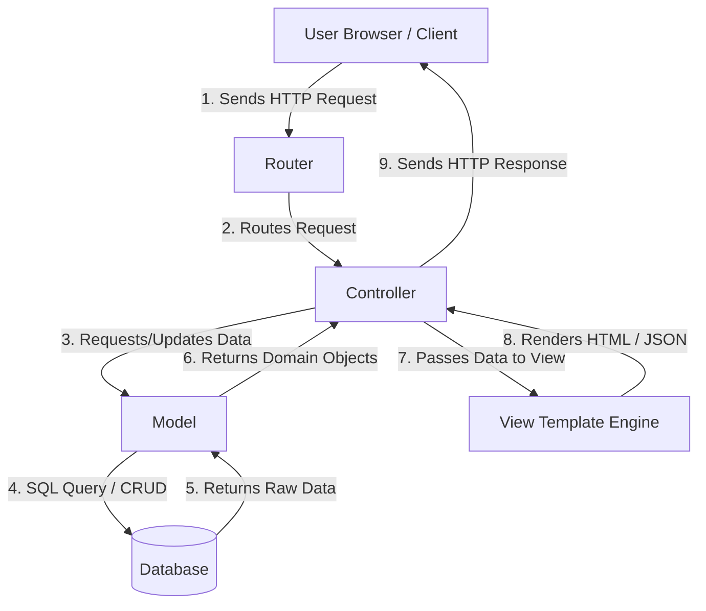
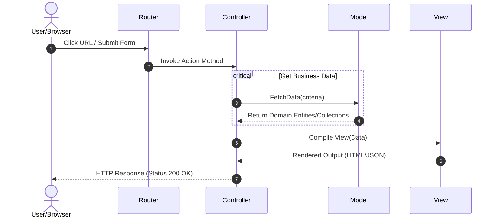

# Model-View-Controller (MVC) Architecture

একটি Software Design Pattern যা অ্যাপ্লিকেশনের Business Logic, User Interface এবং Data Flow-কে তিনটি আলাদা উপাদানে বিভক্ত করে Separation of Concerns (SoC) নিশ্চিত করে।

---

# Table of Contents

* [Definition](https://www.google.com/search?q=%23definition)
* [Simple Definition](https://www.google.com/search?q=%23simple-definition)
* [Official Definition](https://www.google.com/search?q=%23official-definition)
* [Architecture Goal](https://www.google.com/search?q=%23architecture-goal)

* [Why Important](https://www.google.com/search?q=%23why-important)
* [Problem Statement](https://www.google.com/search?q=%23problem-statement)
* [Architecture](https://www.google.com/search?q=%23architecture)
* [Internal Working](https://www.google.com/search?q=%23internal-working)
* [Flow Diagram](https://www.google.com/search?q=%23flow-diagram)
* [Advantages](https://www.google.com/search?q=%23advantages)
* [Disadvantages](https://www.google.com/search?q=%23disadvantages)
* [Trade-offs](https://www.google.com/search?q=%23trade-offs)
* [Real Project Example](https://www.google.com/search?q=%23real-project-example)
* [Best Practices](https://www.google.com/search?q=%23best-practices)
* [Performance Considerations](https://www.google.com/search?q=%23performance-considerations)
* [Common Mistakes](https://www.google.com/search?q=%23common-mistakes)
* [Anti Patterns](https://www.google.com/search?q=%23anti-patterns)
* [Related Concepts](https://www.google.com/search?q=%23related-concepts)
* [Summary](https://www.google.com/search?q=%23summary)
* [References](https://www.google.com/search?q=%23references)

---

# Definition

## Simple Definition

MVC হলো এমন একটি বাড়ি তৈরির প্ল্যানের মতো, যেখানে রান্নাবান্না (Business Logic/Model), ড্রয়িংরুমের সাজসজ্জা (UI/View) এবং গেটম্যান বা ম্যানেজার (Controller) সম্পূর্ণ আলাদা থাকে। একজন গেটম্যান যেভাবে গেস্টের কথা শুনে ভেতরের ব্যবস্থা নেয়, Controller-ও ঠিক একইভাবে ইউজারের রিকোয়েস্ট বুঝে Model এবং View-এর মধ্যে সমন্বয় করে।

## Official Definition

Model-View-Controller (MVC) হলো একটি Architectural Design Pattern যা অ্যাপ্লিকেশনের domain logic (Model), user interface (View) এবং user input control (Controller)-কে decouple বা আলাদা করে। এটি প্রথম ১৯৭০-এর দশকে Trygve Reenskaug কর্তৃক Xerox PARC-এ Smalltalk-80 অ্যাপ্লিকেশনের জন্য উদ্ভাবিত হয়েছিল এবং পরবর্তীতে এটি ওয়েব ও ডেস্কটপ অ্যাপ্লিকেশন ডেভেলপমেন্টের অন্যতম স্ট্যান্ডার্ড আর্কিটেকচারে পরিণত হয়।

## Architecture Goal

MVC আর্কিটেকচারের মূল লক্ষ্য হলো **Separation of Concerns (SoC)** নিশ্চিত করা। এর মাধ্যমে কোডের রক্ষণাবেক্ষণ যোগ্যতা (Maintainability), টেস্টেবিলিটি (Testability) এবং স্কেলেবিলিটি (Scalability) বৃদ্ধি করা হয়, যাতে করে ডেটাবেজের পরিবর্তন বা ইউজার ইন্টারফেসের পরিবর্তন একটির সাথে অপরটিকে অচল না করে দেয়।

---

# Why Important

* **কেন ব্যবহার করা হয়:** কোডের জটিলতা কমানোর জন্য এবং একই অ্যাপ্লিকেশনে ভিন্ন ভিন্ন টিমকে (যেমন: Front-end এবং Back-end) স্বাধীনভাবে কাজ করার সুবিধা দেওয়ার জন্য এটি ব্যবহৃত হয়।
* **কখন ব্যবহার করা উচিত:** যখন অ্যাপ্লিকেশনের সাইজ মাঝারি থেকে বড় হয় এবং যেখানে জটিল Business Logic এবং Data Validation-এর প্রয়োজন থাকে।
* **কখন ব্যবহার করা উচিত নয়:** অত্যন্ত ছোট স্ক্রিপ্ট, Single-purpose Microservices, বা CLI টুলসে যেখানে কোনো UI ইন্টারঅ্যাকশন নেই এবং ডেটার স্থায়িত্ব বা ম্যানিপুলেশন নগণ্য।
* **কোন Scale-এ দরকার হয়:** এটি Small থেকে শুরু করে Enterprise-grade Application সব জায়গাতেই সফলভাবে প্রযোজ্য। তবে খুব বড় Enterprise স্কেলে MVC-এর সাথে Domain-Driven Design (DDD) বা Clean Architecture সংমিশ্রণ করতে হয়।
* **Laravel Context:** Laravel ফ্রেমওয়ার্কের মূল ভিত্তিই হলো MVC। Eloquent ORM কাজ করে Model হিসেবে, Blade engine কাজ করে View হিসেবে এবং Routing-এর সাথে যুক্ত Controller ক্লাসগুলো HTTP রিকোয়েস্ট হ্যান্ডেল করে।
* **Enterprise Context:** মাল্টি-টিম ডেভেলপমেন্টে, বড় রিফ্যাক্টরিং বা UI রিডিজাইনের সময় ব্যাক-এন্ড কোড সুরক্ষিত রাখতে এবং CI/CD পাইপলাইনে Unit ও Integration টেস্টিং সহজ করতে Enterprise-এ MVC অত্যাবশ্যক।

---

# Problem Statement

ধরা যাক, আমরা একটি ই-কমার্স সিস্টেম ডেভেলপ করছি যেখানে আর্কিটেকচার হিসেবে কোনো প্যাটার্ন ব্যবহার করা হয়নি (যাকে আমরা Monolithic Spaghetti Code বলি)। এখানে একটি সিঙ্গেল ফাইলের (যেমন: `index.php`) ভেতরেই ডেটাবেজ কুয়েরি লেখা, HTML টেবিল রেন্ডার করা এবং ডিসকাউন্ট ক্যালকুলেশন করার লজিক রয়েছে।

### বাস্তব Scenario এবং সমস্যা:

১. **কোড ডুপ্লিকেশন:** একই প্রোডাক্ট লিস্ট পেজ ওয়েবসাইটে এবং মোবাইল অ্যাপের API-এর জন্য আলাদা করে পুরো লজিক রি-রাইট করতে হয়।
২. **রক্ষণাবেক্ষণের অসম্ভবতা:** যদি ডেটাবেজের কোনো কলামের নাম পরিবর্তন হয়, তবে অ্যাপ্লিকেশনের শত শত ফাইলের ভেতর ঢুকে HTML-এর মাঝখান থেকে কুয়েরি খুঁজে পরিবর্তন করতে হবে।
৩. **মার্জ কনফ্লিক্ট:** ডিজাইনার যখন HTML/CSS পরিবর্তন করতে যাবে, তখন সে ভুলে PHP লজিক বা কুয়েরি ডিলিট বা ব্রেক করে ফেলতে পারে, যা প্রোডাকশন ডাউনটাইম তৈরি করে।

---

# Architecture

নিচে একটি স্ট্যান্ডার্ড ওয়েব-ভিত্তিক MVC আর্কিটেকচারের Mermaid ডায়াগ্রাম দেওয়া হলো, যেখানে রিকোয়েস্ট লাইফসাইকেল দেখানো হয়েছে:

---

# Internal Working

ওয়েব অ্যাপ্লিকেশনে MVC আর্কিটেকচারের রানটাইম ফ্লো এবং ইন্টারনাল কম্পোনেন্ট নিচে ক্রমানুসারে ব্যাখ্যা করা হলো:

১. **Request Interception:** ব্যবহারকারী যখন ব্রাউজারে কোনো অ্যাকশন নেন (যেমন: `https://example.com/products`), তখন HTTP Request-টি প্রথমে Web Server (Nginx/Apache) হয়ে অ্যাপ্লিকেশন রাউটারে (Router) আসে।
২. **Routing & Controller Selection:** রাউটার ইউআরএল ম্যাপ করে নির্দিষ্ট Controller এবং তার ভেতরের Action Method (যেমন: `ProductController@index`)-কে কল করে।
৩. **Business Logic Execution & Model Interaction:** Controller রিকোয়েস্টের ইনপুট ভ্যালিডেশন করে এবং ডেটা প্রসেস করার জন্য সংশ্লিষ্ট Model-কে কল করে। Model তার ওপরে ডিফাইন করা Business Rules বা ORM ব্যবহার করে ডেটাবেজ থেকে ডেটা নিয়ে আসে।
৪. **Data Transformation:** Model ডেটাবেজ থেকে আসা র ডেটাকে 'Object' বা 'Entity'-তে রূপান্তর করে Controller-এর কাছে ফেরত পাঠায়।
৫. **View Binding:** Controller এবার সেই ডেটা এবং প্রয়োজনীয় মেটাডেটা নিয়ে নির্দিষ্ট View ফাইলের (যেমন: Blade/Twig) কাছে পাঠিয়ে দেয়।
৬. **Response Generation:** View ইঞ্জিন ডেটা এবং HTML স্ট্রাকচার কম্বাইন করে ফাইনাল রেসপন্স (HTML/JSON) তৈরি করে Controller-কে ব্যাক করে এবং Controller সেটি ক্লায়েন্টের ব্রাউজারে Response হিসেবে পাঠিয়ে দেয়।

---

# Flow Diagram

নিচে সিকোয়েন্স ডায়াগ্রামের মাধ্যমে ডেটা ও কন্ট্রোলের লাইফসাইকেল নিখুঁতভাবে ফুটিয়ে তোলা হলো:

---

# Advantages

| Advantage | Description |
| --- | --- |
| **Separation of Concerns** | UI ডিজাইন এবং ব্যাক-এন্ড লজিক সম্পূর্ণ আলাদা থাকায় কোড পরিচ্ছন্ন ও রিডেবল থাকে। |
| **Parallel Development** | ফ্রন্ট-এন্ড ডেভেলপাররা View নিয়ে এবং ব্যাক-এন্ড ডেভেলপাররা Model/Controller নিয়ে একই সাথে কোনো প্রকার ডিপেন্ডেন্সি ছাড়া কাজ করতে পারে। |
| **High Maintainability** | ডেটাবেজ স্কিমা বা ইউজার ইন্টারফেসে পরিবর্তন আনলে পুরো অ্যাপ্লিকেশন ব্রেক করার ঝুঁকি কমে যায়। |
| **Testability** | Model এবং Controller-কে আলাদাভাবে Unit Test করা সহজ হয়, কারণ এর সাথে UI লেয়ারের কোনো টাইট কাপলিং থাকে না। |
| **Reusability of Components** | একটি সিঙ্গেল Model লজিক একাধিক আলাদা আলাদা View (যেমন: ওয়েব পেজ, মোবাইল API, বা CLI কমান্ড)-এ ব্যবহার করা সম্ভব। |

---

# Disadvantages

| Disadvantage | Description |
| --- | --- |
| **Increased Complexity** | অত্যন্ত ছোট বা স্ট্যাটিক ওয়েবসাইটের জন্য MVC আর্কিটেকচার ব্যবহার করলে ফাইলের সংখ্যা এবং কোডের ওভারহেড অনেক বেড়ে যায়। |
| **Fat Controller Vulnerability** | সঠিক গাইডলাইন অনুসরণ না করলে ডেভেলপাররা সমস্ত লজিক Controller-এর ভেতর লিখে ফেলে, যা কোডকে মেইনটেইন করা অসম্ভব করে তোলে। |
| **Strict Learning Curve** | জুনিয়র ডেভেলপারদের জন্য ডাটা ফ্লো, অবজেক্ট ওরিয়েন্টেড কনসেপ্ট এবং ভিউ-বাইন্ডিং মেকানিজম একবারে বোঝা কিছুটা কঠিন হতে পারে। |
| **Inefficiency for SPAs** | আধুনিক Single Page Application (React/Vue)-এর ক্ষেত্রে ব্যাকএন্ডে View লেয়ারের প্রয়োজনীয়তা থাকে না, সেখানে MVC-এর View অংশটি অকেজো হয়ে পড়ে। |
| **Navigation Cost** | কোড ট্রেস করার সময় একসাথে একাধিক ফাইল (Model, View, Controller, Route) ওপেন রাখতে হয়, যা বড় প্রজেক্টে ডেভেলপারদের কনটেক্সট সুইচিং বাড়িয়ে দেয়। |

---

# Trade-offs

| Scenario | Recommended | Reason |
| --- | --- | --- |
| **Monolithic Server-Rendered Web App** | Traditional MVC (with Blade/Twig) | এসইও ফ্রেন্ডলি, সার্ভার সাইড ক্যাশিং সহজ এবং সম্পূর্ণ ইকোসিস্টেম এক জায়গায় থাকে। |
| **Modern Decoupled Architecture (SPA + API)** | API-only MVC (Model-Controller as API) | ফ্রন্টএন্ড ভিউ হ্যান্ডেল করবে Client-side Framework (React/Vue), ব্যাকএন্ড শুধু ডাটা ও বিজনেস লজিক (JSON) সার্ভ করবে। |
| **Microservices with High Throughput** | CQRS / Event-Driven over MVC | রিড এবং রাইট অপারেশন আলাদা করার মাধ্যমে পারফরম্যান্স অপ্টিমাইজ করা সম্ভব, যা ট্র্যাডিশনাল MVC-তে কিছুটা জটিল। |

---

# Real Project Example

## Business Requirement

একটি ফিনটেক (FinTech) স্টার্টআপের জন্য একটি **Wallet Ledger & Transaction System** তৈরি করতে হবে, যেখানে ইউজাররা ফান্ড ট্রান্সফার করতে পারবে এবং তাদের ওয়ালেট স্টেটমেন্ট দেখতে পাবে।

## Existing Problem

পূর্বের সিস্টেমে সিঙ্গেল ফাইলে ট্রানজেকশনের লজিক থাকায় অনেক সময় ডেটাবেজ রেস কন্ডিশন (Race Condition) তৈরি হতো, ভুল অ্যাকাউন্ট ব্যালেন্স আপডেট হতো এবং অডিট লগ ছাড়াই টাকা ট্রান্সফার হয়ে যেত। তাছাড়া স্টেটমেন্টের HTML টেবিলে ডেটা দেখানোর সময়ই হিসাব-নিকাশ করার কারণে লোডিং স্পিড অনেক ধীরগতির ছিল।

## Solution

আমরা এই সিস্টেমটিকে Laravel-এর MVC প্যাটার্নে রি-আর্কিটেক্ট করেছি:

* **Model (`Wallet`, `Transaction`):** ওয়ালেটের ডেটা হোল্ড করা, ব্যালেন্স আপডেট করা এবং ডেটাবেজ ট্রানজেকশন (ACID properties) লক নিশ্চিত করার কাজ করে।
* **Controller (`TransferController`):** রিকোয়েস্ট রিসিভ করা, ইউজারের ব্যালেন্স চেক করার রিকোয়েস্ট মডেলকে পাঠানো এবং ট্রানজেকশন সফল বা ব্যর্থতার ভিত্তিতে ভিউ বা এপিআই রেসপন্স রিটার্ন করা।
* **View (`statement.blade.php`):** এটি শুধুমাত্র কন্ট্রোলার থেকে পাঠানো ট্রানজেকশনের অ্যারে বা কালেকশনটি লুপিংয়ের মাধ্যমে সুন্দরভাবে বুটস্ট্র্যাপ টেবিলে রেন্ডার করে।

## কেন এই Architecture নেওয়া হয়েছে

এই আর্কিটেকচারের ফলে আমাদের কোর ট্রানজেকশন লজিক (Model) সম্পূর্ণ আইসোলেটেড থাকে। আমরা যখনই ওয়েব থেকে মোবাইল অ্যাপ্লিকেশনে শিফট করেছি, আমাদের নতুন কোনো ট্রানজেকশন লজিক লিখতে হয়নি; শুধু একটি নতুন `ApiTransferController` তৈরি করে এক্সিস্টিং মডেল মেথড কল করেছি।

## Production Experience

> **Senior Engineer Insight:** প্রোডাকশনে হাই-কনকারেন্সির সময় দেখা যায় যে `Fat Controller`-এর কারণে ডেটা ভ্যালিডেশন মিস হতে পারে। এই সিস্টেমে আমরা `Form Request` ব্যবহার করেছি ইনপুট ভ্যালিডেশনের জন্য, এবং মডেলে মেথড চেইনিং ও ডাটাবেজ ট্রানজেকশন ব্লক (`DB::transaction`) ব্যবহার করে ফাইনান্সিয়াল ডেটার শতভাগ ইন্টিগ্রিটি নিশ্চিত করেছি।

---

# Best Practices

১. **Thin Controllers, Fat Models:** কন্ট্রোলারের কাজ শুধু রিকোয়েস্ট রিসিভ করা এবং রেসপন্স পাঠানো। সমস্ত কোর বিজনেস লজিক এবং কুয়েরি মডেলে বা সার্ভিস লেয়ারে থাকবে।
২. **Use Form Requests for Validation:** কন্ট্রোলারের ভেতরে ভ্যালিডেশন লজিক না লিখে Laravel-এর `FormRequest` ব্যবহার করুন।
৩. **Mass Assignment Protection:** সর্বদা মডেলে `$fillable` অথবা `$guarded` প্রোপার্টি ডিফাইন করুন সিকিউরিটি নিশ্চিত করতে।
৪. **Keep Views Logicless:** ভিউতে কোনো প্রকার SQL কুয়েরি বা জটিল ক্যালকুলেশন করবেন না। ভিউতে শুধু `if-else` এবং `foreach` এর মতো ডিসপ্লে লজিক থাকবে।
৫. **Leverage Service Layer:** প্রজেক্ট বড় হলে বিজনেস লজিক মডেল থেকেও সরিয়ে আলাদা `Service` ক্লাসে নিয়ে যান, যাতে মডেল শুধু ডেটা ম্যাপিংয়ের কাজ করে।
৬. **Dependency Injection:** কন্ট্রোলারে হার্ডকোডেড ক্লাস ইন্সট্যান্সিয়েট না করে কনস্ট্রাক্টর বা মেথড ইনজেকশনের মাধ্যমে ইন্টারফেস ব্যবহার করুন।
৭. **Use API Resources/Transformers:** এপিআই ডেটা রিটার্ন করার সময় সরাসরি মডেল অবজেক্ট রিটার্ন না করে API Resource ব্যবহার করে ডেটা শেপ করুন।
八. **Eager Loading by Default:** `N+1` কুয়েরি প্রবলেম এড়াতে কন্ট্রোলারে বা মডেলে গ্লোবাল স্কোপে `with()` মেথড ব্যবহার করুন।
৯. **Strict Type Hinting:** কন্ট্রোলার মেথডের প্যারামিটার এবং রিটার্ন টাইপ কঠোরভাবে টাইপ-হিন্ট করুন (যেমন: `public function show(User $user): View`).
১০. **Egress Sanitization:** এক্স-এস-এস (XSS) অ্যাটাক ঠেকাতে ভিউতে ডেটা রেন্ডার করার সময় ফ্রেমওয়ার্কের ডিফল্ট এস্কেপিং মেকানিজম (যেমন: Blade-এর `{{ $data }}`) ব্যবহার করুন।

---

# Performance Considerations

* **Memory Usage:** মডেলে যখন হাজার হাজার রেকর্ড একসাথে মেমোরিতে লোড করা হয় (`Model::all()`), তখন র‍্যামের ওপর প্রেশার পড়ে। এর পরিবর্তে `chunk()`, `cursor()` অথবা `paginate()` ব্যবহার করা উচিত।
* **CPU Usage:** ভিউ লেয়ারে যদি বড় লুপের ভেতর রেগুলার এক্সপ্রেশন বা স্ট্রিং ম্যানিপুলেশন করা হয়, তবে প্রতি রিকোয়েস্টে সিপিইউ সাইকেল নষ্ট হয়। এই ধরনের ট্রান্সফরমেশন কন্ট্রোলারে আগেই প্রসেস করে নেওয়া উচিত।
* **Caching Strategy:** ঘন ঘন পরিবর্তিত হয় না এমন ডেটার জন্য (যেমন: সেটিংস বা ক্যাটাগরি লিস্ট) মডেল লেভেলে ক্যাশিং (`Cache::remember`) মেকানিজম ইমপ্লিমেন্ট করতে হবে যাতে ডেটাবেজের ট্রিপ বেঁচে যায়।
* **Database Impact:** MVC ফ্রেমওয়ার্কের ORM অনেক সময় ব্যাকগ্রাউন্ডে অতিরিক্ত কুয়েরি চালায়। `Laravel Telescope` বা `Clockwork` দিয়ে কুয়েরি কাউন্ট মনিটর করতে হবে।

---

# Common Mistakes

| Mistake | কেন ভুল | Better Solution |
| --- | --- | --- |
| ভিউ ফাইলের ভেতর সরাসরি SQL কুয়েরি লেখা। | এটি Separation of Concerns ভঙ্গ করে। ডাটাবেজ স্ট্রাকচার চেঞ্জ হলে ভিউ ফাইল ক্র্যাশ করবে। | কন্ট্রোলারের মাধ্যমে মডেল থেকে ডাটা এনে ভিউতে শুধু ভেরিয়েবল পাস করা। |
| কন্ট্রোলারের ভেতর শত শত লাইনের লজিক লেখা। | কোড রিইউজেবিলিটি নষ্ট হয় এবং ইউনিট টেস্টিং করা অসম্ভব হয়ে পড়ে। | সার্ভিস লেয়ার বা রিপোজিটরি প্যাটার্ন ব্যবহার করে লজিক এক্সট্র্যাক্ট করা। |
| ইনপুট ভ্যালিডেশন মডেলে বা কন্ট্রোলারে ছড়ানো ছিটানো রাখা। | সিকিউরিটি হোল তৈরি হতে পারে এবং কোডের কনসিস্টেন্সি থাকে না। | ডেডিকেটেড Form Request বা ভ্যালিডেটর ক্লাস ব্যবহার করা। |
| অ্যাপ্লিকেশনের গ্লোবাল স্টেট বা কনফিগারেশন মডেলে হার্ডকোড করা। | কোড এনভায়রনমেন্ট ফ্রেন্ডলি থাকে না (Local vs Production)। | `.env` ফাইল এবং `config/` আর্কিটেকচার ব্যবহার করা। |
| মডেলে আনফিল্টারড ইউজার ইনপুট সরাসরি সেভ করা (`$model->update($_POST)`). | Mass Assignment vulnerability তৈরি হয়, হ্যাকাররা ইলিগ্যাল কলাম আপডেট করতে পারে। | শুধু নির্দিষ্ট ইনপুট ফিল্টার করে নেওয়া (`$request->only(...)`). |

---

# Anti Patterns

| Anti Pattern | কেন খারাপ |
| --- | --- |
| **The Smart View (Anemic Model)** | যখন অ্যাপ্লিকেশনের সমস্ত ডিসিশন মেকিং এবং ক্যালকুলেশন ব্লেড টেমপ্লেটের ভেতর করা হয়, ফলে মডেলগুলো শুধু ডাম্ব ডাটা কন্টেইনারে পরিণত হয়। এটি কোড ডিবাগিংকে নরক বানিয়ে তোলে। |
| **Spaghetti Controller** | একটি সিঙ্গেল কন্ট্রোলার মেথডে ভ্যালিডেশন, বিজনেস লজিক, ফাইল আপলোড, মেইল নোটিফিকেশন, ডেটাবেজ কোয়েরি এবং ভিউ রিটার্ন করার মতো সমস্ত কাজ একসাথে করা। |
| **God Model** | যখন একটি নির্দিষ্ট মডেল (যেমন: `User` model) অ্যাপ্লিকেশনের সমস্ত বিষয়ের সাথে লজিক্যালি যুক্ত হয়ে পড়ে এবং হাজার হাজার লাইনের কোডে পরিণত হয়। |

---

# Related Concepts

| Concept | Relation |
| --- | --- |
| **SOLID Principles** | MVC-এর মূল ভিত্তি হলো single responsibility principle (SRP), যা SOLID-এর প্রথম এবং প্রধান নীতি। |
| **Repository Pattern** | মডেল এবং ডাটা সোর্সের মাঝে আরেকটি লেয়ার তৈরি করে, যা MVC-এর Model অংশকে আরও ডিকাপলড করে তোলে। |
| **Service Layer** | কন্ট্রোলারের জটিল লজিকগুলোকে হ্যান্ডেল করার জন্য এটি ব্যবহৃত হয়, যা "Thin Controller" নিশ্চিত করতে সাহায্য করে। |
| **Dependency Injection** | কন্ট্রোলারে বাইরের অবজেক্ট (যেমন: সার্ভিস, রিপোজিটরি) সরাসরি তৈরি না করে ইনজেক্ট করার মাধ্যমে লুজলি কাপলড আর্কিটেকচার নিশ্চিত করে। |

---

# Summary

* MVC মূলত Separation of Concerns (SoC) নিশ্চিত করার মাধ্যমে কোডের মেইনটেইনেবিলিটি বাড়ায়।
* **Model** শুধুমাত্র ডেটা ও বিজনেসের নিয়মাবলী জানে; এর সাথে UI-এর কোনো সম্পর্ক থাকে না।
* **View** এর একমাত্র কাজ হলো ব্যবহারকারীকে ডেটা প্রেজেন্ট করা; এটি কোনো ডিসিশন মেকার নয়।
* **Controller** ট্রাফিক পুলিশের মতো কাজ করে, রিকোয়েস্ট গ্রহণ করে মডেলে পাঠায় এবং সঠিক ভিউ রেসপন্স নিশ্চিত করে।
* প্রোডাকশন লেভেলে কখনো কন্ট্রোলারকে ভারী (**Fat Controller**) করা যাবে না।
* ভিউ ফাইলের ভেতর সরাসরি ডেটাবেজ কুয়েরি লেখা একটি মারাত্মক আর্কিটেকচারাল ক্রাইম।
* এন্টারপ্রাইজ স্কেলে MVC-এর সাথে সার্ভিস লেয়ার এবং রিপোজিটরি প্যাটার্ন যুক্ত করা উচিত।
* ওআরএম (ORM) ব্যবহারের সময় `N+1` কোয়েরি প্রবলেম এড়াতে সব সময় সচেতন থাকতে হবে।
* মডেলে ম্যাস-অ্যাসাইনমেন্ট সিকিউরিটি হ্যান্ডেল করা বাধ্যতামূলক।
* পারফরম্যান্স অপ্টিমাইজেশনের জন্য মডেল ক্যাশিং অত্যন্ত কার্যকর ভূমিকা পালন করে।

---

# References

* **Official Architecture Design Patterns:** *Patterns of Enterprise Application Architecture (PoEAA)* by Martin Fowler.
* **Laravel Framework Documentation:** [Laravel Architecture Concepts](https://www.google.com/search?q=https://laravel.com/docs)
* **Microsoft Application Architecture Guide:** [Data Patterns - MVC](https://www.google.com/search?q=https://learn.microsoft.com/en-us/previous-versions/msp-n-p/ff649641(v%3Dpandp.10))
* **PHP Fig & Standard Best Practices:** PSR Standards for Code Structure and Autoloading.