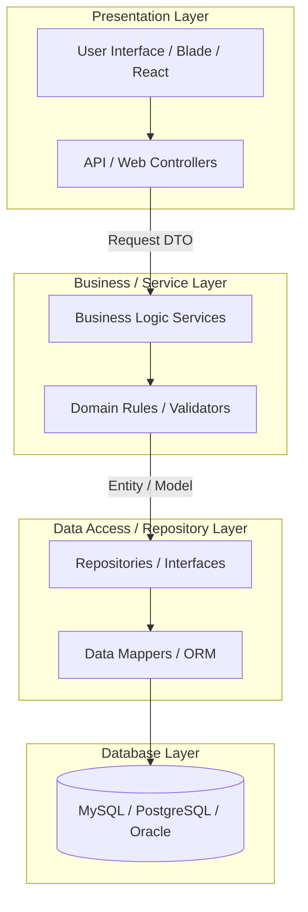
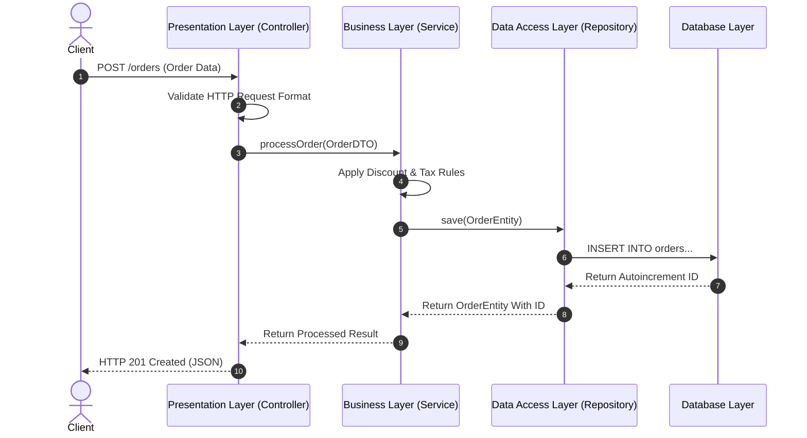

# 🏗️ Layered Architecture (Multitier Architecture)

একটি Software Design Pattern যা অ্যাপ্লিকেশনকে অনুভূমিক (Horizontal) কয়েকটি স্তরে বিভক্ত করে, যেখানে প্রতিটি স্তরের একটি নির্দিষ্ট দায়িত্ব থাকে এবং প্রতিটি স্তর কেবল তার নিচের স্তরের সাথে যোগাযোগ করতে পারে।

---

# Table of Contents

* [Definition](#definition)
* [Simple Definition](#simple-definition)
* [Official Definition](#official-definition)
* [Architecture Goal](#architecture-goal)
* [Why Important](#why-important)
* [Problem Statement](#problem-statement)
* [Architecture](#architecture)
* [Internal Working](#internal-working)
* [Flow Diagram](#flow-diagram)
* [Advantages](#advantages)
* [Disadvantages](#disadvantages)
* [Trade-offs](#trade-offs)
* [Real Project Example](#real-project-example)
* [Best Practices](#best-practices)
* [Performance Considerations](#performance-considerations)
* [Common Mistakes](#common-mistakes)
* [Anti Patterns](#anti-patterns)
* [Related Concepts](#related-concepts)
* [Summary](#summary)
* [References](#references)

---

# Definition

## Simple Definition

Layered Architecture-কে একটি বহুতল রেস্তোরাঁর সাথে তুলনা করা যায়। নিচতলায় থাকে কাঁচামাল বা স্টোর রুম (Database), দোতলায় রান্নাঘর বা শেফ (Business Logic), তিনতলায় ওয়েটার বা সার্ভিস স্টাফ (Service Layer) এবং চারতলায় ডাইনিং এরিয়া বা কাস্টমার টেবিল (Presentation Layer)। কাস্টমার সরাসরি রান্নাঘরে গিয়ে খাবার চাইতে পারে না, তাকে ওয়েটারের মাধ্যমেই আসতে হয়। এই শৃঙ্খলা বজায় রাখাই হলো Layered Architecture।

## Official Definition

Layered Architecture (যা n-tier architecture নামেও পরিচিত) হলো একটি De-facto Standard Architectural Pattern যেখানে সফটওয়্যার উপাদানগুলো অনুভূমিক স্তরে (Horizontal Layers) সংগঠিত হয়। প্রতিটি স্তর তার উপরের স্তরকে নির্দিষ্ট সেবা প্রদান করে এবং তার নিচের স্তরের সেবা গ্রহণ করে। সাধারণত এতে Presentation, Business, Data Access এবং Database—এই চারটি স্ট্যান্ডার্ড স্তর থাকে।

## Architecture Goal

এর মূল লক্ষ্য হলো **Strict Separation of Concerns (SoC)** এবং **Isolation of Layers** নিশ্চিত করা। একটি স্তরের অভ্যন্তরীণ পরিবর্তন যেন অন্য স্তরে কোনো প্রভাব না ফেলে এবং পুরো অ্যাপ্লিকেশনটি যেন অত্যন্ত লুজলি-কাপল্ড (Loosely Coupled) হয়, সেটিই এই আর্কিটেকচারের প্রধান লক্ষ্য।

---

# Why Important

* **কেন ব্যবহার করা হয়:** কোডের মডুলারিটি বৃদ্ধি, রিইউজেবিলিটি এবং জটিল এন্টারপ্রাইজ সিস্টেমের রক্ষণাবেক্ষণ সহজ করার জন্য এটি ব্যবহৃত হয়।
* **কখন ব্যবহার করা উচিত:** যখন একটি নতুন প্রজেক্ট স্ক্র্যাচ থেকে শুরু করা হয় এবং ভবিষ্যৎ রিকোয়ারমেন্ট স্পষ্ট থাকে না, অথবা সিস্টেমটিতে প্রচুর জটিল বিজনেস রুলস এবং ভিন্ন ভিন্ন ডাটা সোর্স থাকে।
* **কখন ব্যবহার করা উচিত নয়:** অত্যন্ত সরল ক্রুড (CRUD) ভিত্তিক অ্যাপ্লিকেশন, ছোট প্রজেক্ট বা প্রোটোটাইপ তৈরিতে, যেখানে অতিরিক্ত লেয়ার কোডের ওভারহেড ও ফাইলের সংখ্যা বাড়িয়ে দেয়।
* **কোন Scale-এ দরকার হয়:** মাঝারি থেকে অত্যন্ত বৃহৎ (Enterprise-scale) অ্যাপ্লিকেশনে এটি বহুল ব্যবহৃত।
* **Laravel Context:** লারাভেলে ডিফল্ট MVC-র বাইরে গিয়ে যখন প্রজেক্ট বড় হতে থাকে, তখন আমরা `Controller` (Presentation) -> `Service` (Business) -> `Repository` (Data Access) -> `Eloquent` (Database) লেয়ার তৈরি করে এই আর্কিটেকচার বাস্তবায়ন করি।
* **Enterprise Context:** কর্পোরেট এবং ব্যাংকিং সফটওয়্যারে যেখানে ডেটাবেজ যেকোনো সময় পরিবর্তন (যেমন: MySQL থেকে Oracle) হতে পারে এবং রেগুলেটরি কমপ্লায়েন্সের কারণে বিজনেস লজিক সম্পূর্ণ আলাদা রাখা প্রয়োজন, সেখানে এটি স্ট্যান্ডার্ড।

---

# Problem Statement

ধরা যাক, আমরা একটি ফিনটেক লোন প্রসেসিং সিস্টেম বানাচ্ছি। যদি আমরা লেয়ার্ড আর্কিটেকচার ব্যবহার না করি, তবে দেখা যাবে কন্ট্রোলারের ভেতরেই ব্যাংকিং ইন্টারেস্ট রেট ক্যালকুলেশন, থার্ড-পার্টি ক্রেডিট স্কোর API কল এবং কাঁচা SQL কুয়েরি একসাথে লেখা হয়েছে।

### বাস্তব Scenario এবং সমস্যা:

১. **ডাটাবেজ ডিপেন্ডেন্সি:** যদি বিজনেস টিম সিদ্ধান্ত নেয় তারা ডাটাবেজ MySQL থেকে PostgreSQL-এ শিফট করবে, তবে পুরো অ্যাপ্লিকেশনের সব কোড রিরাইট করতে হবে, কারণ কুয়েরিগুলো লজিকের সাথে মিশে আছে।
২. **টেস্টিং জটিলতা:** কোনো একটি নির্দিষ্ট বিজনেস রুলের (যেমন: "ইউজারের বয়স ১৮-র কম হলে লোন পাবে না") Unit Test করতে গেলেও পুরো ডাটাবেজ কানেকশন এবং HTTP রিকোয়েস্ট মক (Mock) করতে হবে, যা অত্যন্ত সময়সাপেক্ষ।
৩. **কোড ডুপ্লিকেশন:** একই লোন ক্যালকুলেশন লজিক যদি মোবাইল অ্যাপ API এবং ওয়েব পোর্টাল দুই জায়গায় লাগে, তবে দুই ডেভেলপারের দুই জায়গায় একই বড় কোড ব্লক কপি-পেস্ট করতে হয়।

---

# Architecture

একটি স্ট্যান্ডার্ড ৪-লেয়ার আর্কিটেকচারের Mermaid ডায়াগ্রাম নিচে দেওয়া হলো:

---

# Internal Working

১. **Presentation Layer (Entry Point):** ব্যবহারকারী যখন ইউজার ইন্টারফেসে কোনো বাটনে ক্লিক করেন বা এপিআই হিট করেন, তখন রিকোয়েস্ট প্রেজেন্টেশন লেয়ারে (Controller) আসে। এই লেয়ার শুধু রিকোয়েস্টের ফরম্যাট (HTTP, JSON) বোঝে।
২. **DTO Parsing & Delegation:** কন্ট্রোলার ইনপুট ডাটাকে একটি Data Transfer Object (DTO)-তে রূপান্তর করে এবং বিজনেস লেয়ারের নির্দিষ্ট সার্ভিসকে কল করে।
৩. **Business Logic Execution:** Business/Service Layer রিকোয়েস্টটি প্রসেস করে। এখানে সমস্ত ক্যালকুলেশন, পলিসি এবং কন্ডিশন চেক করা হয়। এই লেয়ার জানে না ডাটা কোথা থেকে আসছে (ওয়েব নাকি মোবাইল) কিংবা ডাটা কোথায় সেভ হচ্ছে (MySQL নাকি ফাইল)।
৪. **Data Access Layer Interaction:** সার্ভিস লেয়ার যখন ডাটা সেভ বা রিট্রিভ করতে চায়, তখন সে Data Access/Repository Layer-কে কল করে।
৫. **Database Isolation:** রেপোজিটরি লেয়ার ORM বা র SQL ব্যবহার করে ডেটাবেজ থেকে ডাটা তুলে আনে এবং তা অবজেক্ট বা এনটিটি আকারে উপরের লেয়ারে ফেরত পাঠায়। পুরো প্রসেস শেষে রেসপন্সটি উল্টো পথে প্রেজেন্টেশন লেয়ার হয়ে ইউজারের কাছে পৌঁছায়।

---

# Flow Diagram

নিচে একটি সিকোয়েন্স ডায়াগ্রামের মাধ্যমে এই আর্কিটেকচারের স্ট্রিল্ট লেয়ার আইসোলেশন দেখানো হলো (কোনো লেয়ার তার ইমিডিয়েট নিচের লেয়ার ছাড়া অন্য কাউকে সরাসরি অ্যাক্সেস করতে পারে না):

---

# Advantages

| Advantage | Description |
| --- | --- |
| **Layer Isolation** | একটি স্তরের ভেতরের মেকানিজম পরিবর্তন করলে অন্য স্তরের কোডে কোনো টাচ করতে হয় না (যেমন: ডাটাবেজ পরিবর্তন)। |
| **Easy Testability** | প্রতিটি লেয়ারকে মকিং (Mocking)-এর মাধ্যমে স্বাধীনভাবে Unit Test করা সম্ভব। বিজনেস লজিক টেস্ট করার জন্য ডাটাবেজের প্রয়োজন হয় না। |
| **High Reusability** | এক জোড়া বিজনেস সার্ভিস লেয়ারকে একই সাথে ওয়েব কন্ট্রোলার, কনসোল কমান্ড এবং এপিআই কন্ট্রোলারে পুনর্ব্যবহার করা যায়। |
| **Strict Security Control** | ডেটাবেজ লেয়ারকে সরাসরি এক্সপোজ না করে মাঝখানে সিকিউরিটি ও ভ্যালিডেশন লেয়ার থাকায় ডেটার নিরাপত্তা বহুগুণ বেড়ে যায়। |
| **Standardization** | এটি একটি অত্যন্ত পরিচিত প্যাটার্ন হওয়ায় নতুন কোনো ডেভেলপার টিমে যোগ দিলে খুব দ্রুত কোডবেস বুঝতে পারে। |

---

# Disadvantages

| Disadvantage | Description |
| --- | --- |
| **Architecture Sinkhole Effect** | অনেক সময় কিছু রিকোয়েস্টের জন্য কোনো বিজনেস লজিক থাকে না (যেমন: শুধু ডাটা রিড করা)। তখন কোডটি কেবল এক লেয়ার থেকে অন্য লেয়ারে পাস হয়, যা অলস কোড তৈরি করে। |
| **Lower Performance** | প্রতি রিকোয়েস্টে একাধিক লেয়ারের অবজেক্ট ট্রান্সফরমেশন এবং মেথড কল হওয়ার কারণে সামান্য পারফরম্যান্স ওভারহেড তৈরি হয়। |
| **Code Bloat (Overhead)** | ছোট প্রজেক্টের জন্য DTO, Service, Repository, Interface তৈরি করতে গিয়ে ফাইলের সংখ্যা এবং কোডের লাইন অপ্রয়োজনীয়ভাবে বেড়ে যায়। |
| **Tight Coupling Vertically** | যদি ডাটাবেজে একটি নতুন কলাম যোগ করতে হয়, তবে অনেক সময় ডাটা লেয়ার, বিজনেস লেয়ার এবং প্রেজেন্টেশন লেয়ার—সবগুলোতেই পরিবর্তন আনতে হয়। |
| **Scalability Bottleneck** | পুরো আর্কিটেকচারটি সাধারণত একটি সিঙ্গেল মনোলিথিক কোডবেস হিসেবে ডেপ্লয় করা হয়, যার ফলে নির্দিষ্ট কোনো লেয়ারকে আলাদাভাবে স্কেল করা কঠিন। |

---

# Trade-offs

| Scenario | Recommended | Reason |
| --- | --- | --- |
| **Simple CRUD / Content Management** | **MVC (Skipping Service/Repo)** | লেয়ার্ড আর্কিটেকচার এখানে অতিরিক্ত জটিলতা তৈরি করবে। সরাসরি কন্ট্রোলার থেকে মডেল কল করাই শ্রেয়। |
| **Complex Domain Rules with frequent DB changes** | **Strict 4-Layer Architecture** | ডেটাবেজ আইসোলেশন এবং বিজনেস লজিক সুরক্ষিত রাখার সুবিধা অতিরিক্ত ফাইলের ওভারহেডের চেয়ে অনেক বেশি মূল্যবান। |
| **High Performance Microservices** | **CQRS / Hexagonal Architecture** | লেয়ার্ড আর্কিটেকচারের রিজিড অনুভূমিক ডিপেন্ডেন্সি হাই-পারফরম্যান্স মাইক্রোসার্ভিসের গতি কিছুটা কমিয়ে দিতে পারে। |

---

# Real Project Example

## Business Requirement

একটি SaaS ভিত্তিক **HR & Payroll System** তৈরি করতে হবে যেখানে কর্মচারীদের বেতন হিসাব করা হবে এবং বিভিন্ন দেশের ট্যাক্স পলিসি অনুযায়ী তা ব্যাংক অ্যাকাউন্টে পাঠানো হবে।

## Existing Problem

পূর্বের সিস্টেমে ট্যাক্স রুলস এবং ব্যাংক ট্রান্সফার এপিআই কল সরাসরি কন্ট্রোলারের ভেতরেই ছিল। যখনই কোনো দেশের ট্যাক্স আইন পরিবর্তন হতো, পুরো সিস্টেম অফলাইন করে কোড এডিট করতে হতো। তাছাড়া ব্যাংকের এপিআই ডাউন থাকলে পুরো পেমেন্ট প্রসেস মাঝপথে আটকে যেত এবং ডাটাবেজ করাপ্ট হতো।

## Solution

আমরা সিস্টেমটিকে ৪-লেয়ার আর্কিটেকচারে রূপান্তর করি:

* **Presentation Layer (`PayrollController`):** শুধুমাত্র পে-রোল রিকোয়েস্ট রিসিভ করে এবং ব্যাচ প্রসেস ট্রিগার করে।
* **Business Layer (`TaxCalculationService`, `PayrollProcessingService`):** কান্ট্রি পলিসি অনুযায়ী কর্মচারীদের নেট স্যালারি হিসাব করে। এই লেয়ার ব্যাংকিং বা ডাটাবেজের খবর রাখে না।
* **Data Access Layer (`EmployeeRepository`, `PayrollRepository`):** হিসাবকৃত ডাটাবেজ স্টেটমেন্ট তৈরি করে এবং ট্রানজেকশন ম্যানেজ করে।
* **Database Layer:** ফাইনাল লেজার ডাটাবেজে লক করে।

## কেন এই Architecture নেওয়া হয়েছে

এই আর্কিটেকচারের ফলে আমরা ট্যাক্স রুলস পরিবর্তনের সময় ডাটাবেজ কোডে হাত না দিয়েই শুধু `TaxCalculationService`-এর ইউনিট টেস্ট রান করে নিশ্চিত হতে পেরেছি যে হিসাব ঠিক আছে। এছাড়া লোকাল ব্যাংকের বদলে যখন থার্ড-পার্টি পেমেন্ট গেটওয়ে (Stripe) যুক্ত করা হয়, তখন বিজনেস লেয়ারে কোনো টাচই করতে হয়নি, শুধু ডাটা লেয়ারের অ্যাডাপ্টার চেঞ্জ করা হয়েছে।

## Production Experience

> **Senior Engineer Insight:** প্রোডাকশনে *Sinkhole Effect* এড়াতে আমরা রিড-অনলি রিপোর্টের জন্য সার্ভিস ও রেপোজিটরি লেয়ার বাইপাস করে সরাসরি কন্ট্রোলার থেকে কুয়েরি বিল্ডার ব্যবহার করেছি। কিন্তু রাইট বা পেমেন্ট অপারেশনের ক্ষেত্রে কঠোরভাবে ৪টি লেয়ারই মেইনটেইন করেছি ডাটা ইন্টিগ্রিটি ও নিরাপত্তার স্বার্থে।

---

# Best Practices

১. **Enforce Strict Layering:** একটি লেয়ার যেন তার নিচের লেয়ারকে ডিঙিয়ে অন্য কোনো লেয়ারকে সরাসরি কল না করে (যেমন: Controller সরাসরি Database কুয়েরি করবে না)।
২. **Program to Interfaces:** বিজনেস লেয়ারে সরাসরি কংক্রিট রেপোজিটরি ক্লাস ইনজেক্ট না করে ইন্টারফেস ইনজেক্ট করুন (Dependency Inversion)।
৩. **Use Data Transfer Objects (DTOs):** লেয়ারগুলোর মধ্যে ডাটা আদান-প্রদানের জন্য র অ্যাসোসিয়েটিভ অ্যারে পাস না করে টাইপ-সেফ DTO ব্যবহার করুন।
৪. **Keep Layers Cohesive:** প্রতিটি লেয়ারের দায়িত্ব সুনির্দিষ্ট রাখুন। কন্ট্রোলারে কখনো গাণিতিক বা ব্যবসায়িক হিসাব লিখবেন না।
৫. **Handle Exceptions at Correct Layer:** ডাটাবেজের লো-লেভেল এক্সেপশন (যেমন: `PDOException`) সরাসরি ইউজারকে না দেখিয়ে ডাটা লেয়ারে ক্যাচ করে কাস্টম ডোমেইন এক্সেপশনে রূপান্তর করে উপরে পাঠান।
৬. **Isolate Third-Party SDKs:** থার্ড-পার্টি কোনো লাইব্রেরি বা SDK সরাসরি বিজনেস লেয়ারে ব্যবহার না করে ডাটা বা ইনফ্রাস্ট্রাকচার লেয়ারে অ্যাডাপ্টার দিয়ে মুড়িয়ে ব্যবহার করুন।
৭. **Domain Entities vs Database Models:** বড় প্রজেক্টে ডেটাবেজের ওআরএম মডেলকে সরাসরি বিজনেস লেয়ারে না পাঠিয়ে তাকে পিওর ডোমেইন এনটিটি (Plain Old PHP Object - POPO)-তে রূপান্তর করে নিন।
৮. **Optimize Read Operations (Open Layering):** পারফরম্যান্সের জন্য রিড-অনলি কুয়েরির ক্ষেত্রে লেয়ার কিছুটা শিথিল (Relaxed Layering) করা যেতে পারে।
৯. **Automate Layer Testing:** আর্কিটেকচারাল রুলস ঠিক আছে কিনা তা চেক করার জন্য `ArchUnit` (বা পিএইচপিতে `Arkitect`) ব্যবহার করে টেস্ট কোড লিখুন, যাতে কেউ ভুল করে লেয়ার ব্রেক করলে বিল্ড ফেইল করে।
১০. **Avoid Circular Dependencies:** লেয়ারগুলোর মধ্যে যেন কোনোভাবেই সার্কুলার ডিপেন্ডেন্সি (যেমন: Layer A কল করে Layer B-কে, আবার Layer B কল করে Layer A-কে) তৈরি না হয়।

---

# Performance Considerations

* **Memory Usage:** প্রতিটি লেয়ারে ডাটা ট্রান্সফরমেশনের কারণে (Request -> DTO -> Entity -> Model) মেমোরিতে একাধিক অবজেক্ট তৈরি হতে পারে। হাই-থ্রুপুট সিস্টেমের জন্য মেমোরি গ্যস হিলিং (Garbage Collection) মনিটর করতে হবে।
* **CPU Usage:** লেয়ারগুলোর মধ্যে গভীর মেথড কল চেইন থাকার কারণে স্ট্যাক ট্রেস বড় হয়, যা সামান্য হলেও সিপিইউ সাইকেল ব্যবহার করে।
* **Caching Strategy:** ক্যাশিং সব সময় বিজনেস লেয়ার এবং ডাটা অ্যাক্সেস লেয়ারের মাঝখানে (Repository Level-এ) ইমপ্লিমেন্ট করা উচিত, যাতে রিড অপারেশনগুলো লেয়ারের একদম নিচে নামার আগেই রিটার্ন করতে পারে।
* **Database Impact:** লেয়ার্ড আর্কিটেকচারে অনেক সময় অলস ডেটা ফেচিং হয় (যেমন: প্রয়োজন নেই এমন কলামও মডেল অবজেক্টের কারণে সিলেক্ট হয়ে আসে)। কুয়েরি প্রজেকশন সব সময় সুনির্দিষ্ট হওয়া উচিত।

---

# Common Mistakes

| Mistake | কেন ভুল | Better Solution |
| --- | --- | --- |
| কন্ট্রোলারের ভেতরেই বিজনেস লজিক এবং ভ্যালিডেশন লিখে ফেলা। | একে 'Fat Controller' বলে। এর ফলে কোড রিইউজ করা যায় না এবং মডুলারিটি নষ্ট হয়। | লজিকগুলো সার্ভিস ক্লাসে মুভ করা। |
| সার্ভিস লেয়ারের ভেতর সরাসরি SQL বা Eloquent কুয়েরি লেখা। | এটি বিজনেস লেয়ারকে ডাটাবেজের সাথে টাইটলি কাপল্ড করে ফেলে। | কুয়েরিগুলো রেপোজিটরি ক্লাসের ভেতর লুকানো। |
| রেপোজিটরি লেয়ার থেকে সরাসরি HTTP রেসপন্স বা রিডাইরেক্ট রিটার্ন করা। | ডাটা লেয়ার কখনো জানে না সে ওয়েব ব্রাউজারের সাথে কথা বলছে নাকি কনসোলের সাথে। | রেপোজিটরি শুধু ডাটা অবজেক্ট রিটার্ন করবে, কন্ট্রোলার রেসপন্স ফরম্যাট ঠিক করবে। |
| প্রতিটি সাধারণ টেবিলের জন্যও জোর করে ৫টি করে লেয়ার এবং ইন্টারফেস তৈরি করা। | ওভার-ইঞ্জিনিয়ারিং। সহজ ক্রুডের ক্ষেত্রে ডেভেলপমেন্টের গতি কমিয়ে দেয়। | সিম্পল টেবিলের জন্য সরাসরি মডেল-কন্ট্রোলার ব্যবহার করা। |
| নিচের লেয়ার থেকে উপরের লেয়ারের কোনো মেথড বা ক্লাস কল করা। | আর্কিটেকচারের দিকনির্দেশনা (Directional Flow) নষ্ট হয় এবং সার্কুলার ডিপেন্ডেন্সি তৈরি করে। | ডাটা প্রবাহ সব সময় উপর থেকে নিচে হবে, নিচে থেকে উপরে শুধু ডাটা রিটার্ন হবে। |

---

# Anti Patterns

| Anti Pattern | কেন খারাপ |
| --- | --- |
| **The Lasagna Architecture** | যখন অ্যাপ্লিকেশনে প্রয়োজনের অতিরিক্ত লেয়ার তৈরি করা হয় (যেমন: ১০-১২টি লেয়ার), যার ফলে কোড রিডাবিলিটি হারিয়ে যায় এবং সামান্য একটি ফিচার যোগ করতেও ডজনখানেক ফাইলে হাত দিতে হয়। |
| **The Sinkhole Anti-pattern** | যখন অ্যাপ্লিকেশনের বেশির ভাগ রিকোয়েস্টই কোনো প্রসেসিং ছাড়াই এক লেয়ার থেকে অন্য লেয়ারে শুধু পাস হয়ে ডেটাবেজ থেকে ডাটা নিয়ে আসে। এটি আর্কিটেকচারের কার্যকারিতা কমিয়ে দেয়। |

---

# Related Concepts

| Concept | Relation |
| --- | --- |
| **Clean Architecture / Onion** | লেয়ার্ড আর্কিটেকচারের একটি উন্নত রূপ, যেখানে ডিপেন্ডেন্সি ভেতরের দিকে (ডোমেইনের দিকে) প্রবাহিত হয়। |
| **Hexagonal Architecture** | লেয়ারগুলোর পরিবর্তে পোর্টস এবং অ্যাডাপ্টারের মাধ্যমে বাইরের সিস্টেমের সাথে যোগাযোগ স্থাপন করে। |
| **Repository Pattern** | লেয়ার্ড আর্কিটেকচারের Data Access Layer বাস্তবায়নের প্রধান হাতিয়ার। |
| **Data Transfer Object (DTO)** | লেয়ারগুলোর সীমানা বা বাউন্ডারি পার করার সময় ডাটা সিকিউর ও টাইপ-সেফ রাখার মাধ্যম। |

---

# Summary

* Layered Architecture পুরো সিস্টেমকে সুনির্দিষ্ট দায়িত্বের ভিত্তিতে অনুভূমিক স্তরে ভাগ করে।
* এর মূল চালিকাশক্তি হলো **Separation of Concerns (SoC)**।
* একটি আদর্শ এন্টারপ্রাইজ সিস্টেমে সাধারণত ৪টি লেয়ার থাকে: Presentation, Business, Data Access, এবং Database।
* কোড আইসোলেশনের কারণে এই আর্কিটেকচারে ডাটাবেজ বা ইউজার ইন্টারফেস পরিবর্তন করা অত্যন্ত সহজ।
* প্রজেক্ট ছোট হলে এই প্যাটার্ন ব্যবহার করা **Over-engineering** এবং এটি কোডের জটিলতা বাড়ায়।
* **Sinkhole Effect** এড়াতে মাঝে মাঝে রিড অ্যাপ্লিকেশনের জন্য লেয়ার কিছুটা শিথিল করা যৌক্তিক।
* লেয়ারগুলোর মধ্যে যোগাযোগের জন্য সর্বদা **DTO** এবং **Interfaces** ব্যবহার করা উচিত।
* এটি মনোলিথিক অ্যাপ্লিকেশনের রক্ষণাবেক্ষণ যোগ্যতা সর্বোচ্চ পর্যায়ে নিয়ে যেতে সাহায্য করে।

---

# References

* **Books:** *Software Architecture Patterns* by Mark Richards (O'Reilly Media).
* **Enterprise Patterns:** *Patterns of Enterprise Application Architecture* by Martin Fowler.
* **Microsoft Cloud Design Patterns:** N-tier architecture style guidelines.
* **Architecture Validation Tools:** ArchUnit Documentation for Layered Systems.