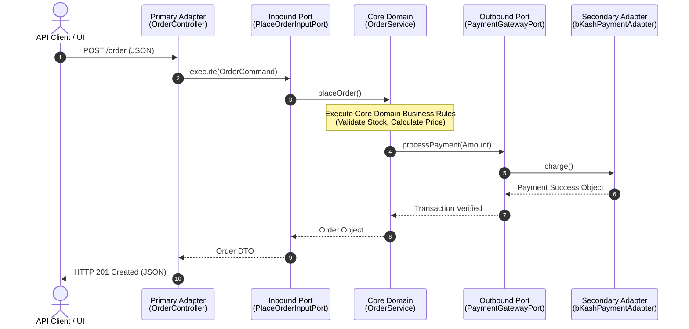

# ⬢ Hexagonal Architecture (Ports and Adapters)

একটি Software Architectural Pattern যার মূল উদ্দেশ্য হলো অ্যাপ্লিকেশনের Core Business Logic-কে তার বাইরের ইনফ্রাস্ট্রাকচার (যেমন: Database, UI, Third-party APIs, Frameworks) থেকে সম্পূর্ণ আলাদা এবং স্বাধীন রাখা।

---

# Table of Contents

* [Definition](https://www.google.com/search?q=%23definition)
* [Simple Definition](https://www.google.com/search?q=%23simple-definition)
* [Official Definition](https://www.google.com/search?q=%23official-definition)
* [Architecture Goal](https://www.google.com/search?q=%23architecture-goal)


* [Why Important](https://www.google.com/search?q=%23why-important)
* [Problem Statement](https://www.google.com/search?q=%23problem-statement)
* [Architecture](https://www.google.com/search?q=%23architecture)
* [Internal Working](https://www.google.com/search?q=%23internal-working)
* [Flow Diagram](https://www.google.com/search?q=%23flow-diagram)
* [Advantages](https://www.google.com/search?q=%23advantages)
* [Disadvantages](https://www.google.com/search?q=%23disadvantages)
* [Trade-offs](https://www.google.com/search?q=%23trade-offs)
* [Real Project Example](https://www.google.com/search?q=%23real-project-example)
* [Best Practices](https://www.google.com/search?q=%23best-practices)
* [Performance Considerations](https://www.google.com/search?q=%23performance-considerations)
* [Common Mistakes](https://www.google.com/search?q=%23common-mistakes)
* [Anti Patterns](https://www.google.com/search?q=%23anti-patterns)
* [Related Concepts](https://www.google.com/search?q=%23related-concepts)
* [Summary](https://www.google.com/search?q=%23summary)
* [References](https://www.google.com/search?q=%23references)

---

# Definition

## Simple Definition

Hexagonal Architecture-কে একটি প্লাগ-অ্যান্ড-প্লে (Plug-and-Play) সিস্টেমের সাথে তুলনা করা যায়। আপনার তৈরি করা কোর বিজনেস লজিকটি হলো একটি ইলেকট্রনিক ডিভাইস, আর এর বাইরের পোর্টগুলো হলো সকেট। এখন এই সকেটে আপনি কারেন্টের প্লাগ লাগাবেন, ব্যাটারি লাগাবেন নাকি সোলার প্যানেল যুক্ত করবেন (অর্থাৎ MySQL ব্যবহার করবেন, MongoDB নাকি মেমোরি অ্যারে)—তা ডিভাইসের অভ্যন্তরীণ কাজের গতি বা লজিককে প্রভাবিত করবে না।

## Official Definition

Alistair Cockburn কর্তৃক ২০০৫ সালে উদ্ভাবিত Hexagonal Architecture (যা **Ports and Adapters Architecture** নামেও পরিচিত) হলো একটি Systems Architecture Pattern। এটি একটি অ্যাপ্লিকেশনের উপাদানগুলোকে এমনভাবে ডিজাইন করতে সাহায্য করে যেন ডোমেইন লজিকটি সহজেই টেস্ট করা যায় এবং এটি কোনো নির্দিষ্ট ফ্রেমওয়ার্ক, ডেটাবেজ বা ইউজার ইন্টারফেসের ওপর টাইটলি কাপল্ড (Tightly Coupled) না থাকে।

## Architecture Goal

এর প্রধান লক্ষ্য হলো **Inversion of Control (IoC)** এবং **Dependency Inversion Principle (DIP)**-এর সর্বোচ্চ ব্যবহারের মাধ্যমে কোর অ্যাপ্লিকেশনকে বাইরের পৃথিবীর প্রযুক্তিগত পরিবর্তন থেকে সুরক্ষিত রাখা। এর ফলে টেকনোলজি স্ট্যাক ব্যাক-এন্ডে পরিবর্তন করলেও কোর লজিকে কোনো কোড চেঞ্জ করতে হয় না।

---

# Why Important

* **কেন ব্যবহার করা হয়:** অ্যাপ্লিকেশনকে অত্যন্ত লুজলি-কাপল্ড (Loosely Coupled) রাখা এবং ইনফ্রাস্ট্রাকচারের ওপর থেকে নির্ভরতা শূন্যে নামিয়ে আনার জন্য।
* **কখন ব্যবহার করা উচিত:** জটিল ডোমেইন মডেল বা বিজনেস লজিক সম্পন্ন এন্টারপ্রাইজ অ্যাপ্লিকেশনে, যেখানে দীর্ঘমেয়াদে প্রযুক্তি বা থার্ড-পার্টি সার্ভিস পরিবর্তনের সম্ভাবনা থাকে।
* **কখন ব্যবহার করা উচিত নয়:** সাধারণ ডেটা এন্ট্রি অ্যাপ বা সিম্পল CRUD ভিত্তিক প্রজেক্টে, যেখানে কোনো জটিল ডোমেইন রুলস নেই।
* **কোন Scale-এ দরকার হয়:** Medium থেকে Enterprise এবং বিশেষ করে **Microservices Architecture**-এর জন্য এটি একটি আইডিয়াল চয়েস।
* **Laravel Context:** লারাভেলে ডিফল্ট ডিরেক্টরি স্ট্রাকচারের বাইরে গিয়ে `app/Domain` নামে আলাদা ডিরেক্টরি তৈরি করে পিওর পিএইচপি ক্লাস (POPO) দিয়ে কোর ডোমেইন লিখে এবং Interfaces (Ports) ও Concrete Service Providers (Adapters) দিয়ে এটি ইমপ্লিমেন্ট করা হয়।
* **Enterprise Context:** মাল্টি-ক্লাউড বা হাইব্রিড ইনফ্রাস্ট্রাকচারে কাজ করা বড় ই-কমার্স বা ফিনটেক অ্যাপ্লিকেশনে এটি ব্যবহৃত হয়, যাতে করে যেকোনো সময় পেমেন্ট গেটওয়ে, নোটিফিকেশন ইঞ্জিন বা ডেটাবেজ ইঞ্জিন প্লাগ-আউট এবং প্লাগ-ইন করা যায়।

---

# Problem Statement

ধরা যাক, আমরা একটি সাবস্ক্রিপশন বেসড ওটিটি (OTT) প্ল্যাটফর্মের পেমেন্ট সিস্টেম তৈরি করছি। শুরুর দিকে কোম্পানি ডিসিশন নিল তারা শুধু `Stripe` ব্যবহার করবে এবং ডেটাবেজ হিসেবে `MySQL` থাকবে। ডেভেলপাররা লারাভেলের কন্ট্রোলার এবং Eloquent মডেলের ভেতরেই স্ট্রাইপের SDK এবং MySQL কুয়েরি সরাসরি ব্যবহার করে কোড লিখে ফেলল।

### বাস্তব Scenario এবং সমস্যা:

১. **থার্ড-পার্টি এপিআইয়ের ওপর টাইট কাপলিং:** ২ বছর পর বিজনেস টিম বলল তারা স্ট্রাইপের পাশাপাশি `bKash` এবং `Stripe-Alternative` যুক্ত করবে এবং কিছু ডেটা দ্রুত রিড করার জন্য `MongoDB`-তে শিফট করবে।
২. **কোড রিরাইট কস্ট:** যেহেতু সম্পূর্ণ কোডবেস স্ট্রাইপ SDK এবং Eloquent-এর ওপর নির্ভরশীল ছিল, তাই এখন পুরো ডোমেইন লজিক ধরে রিফ্যাক্টর করতে হবে।
৩. **টেস্টিং ট্র্যাজেডি:** থার্ড-পার্টি এপিআই এবং লাইভ ডেটাবেজ ছাড়া কোর সাবস্ক্রিপশন এক্সপায়ারেশন লজিকটি এককভাবে টেস্ট (Unit Test) করা অসম্ভব হয়ে পড়ে।

---

# Architecture

হেক্সাগোনাল আর্কিটেকচারের ৩টি মূল অংশ থাকে: **Core Domain** (কেন্দ্রে), **Ports** (ইন্টারফেসসমূহ) এবং **Adapters** (বাইরের ইমপ্লিমেন্টেশন)।

```mermaid
flowchart TD
    subgraph Outer Region (Adapters)
        WebUI[Web Controller / Blade]
        REST[REST API Controller]
        CLI[Artisan Console Command]
        
        MySQL[MySQL / Eloquent Adapter]
        Mongo[MongoDB Adapter]
        Stripe[Stripe Payment Adapter]
    end

    subgraph Hexagon Boundary (Ports)
        InPort[Driver / Inbound Ports <br> Interfaces]
        OutPort[Driven / Outbound Ports <br> Interfaces]
    end

    subgraph Core Center
        Domain[Domain Services / Core Logic]
        Entities[Entities / Value Objects]
    end

    %% Inbound Flow
    WebUI --> InPort
    REST --> InPort
    CLI --> InPort
    InPort --> Domain
    
    %% Outbound Flow
    Domain --> Entities
    Domain --> OutPort
    OutPort --> MySQL
    OutPort --> Mongo
    OutPort --> Stripe

```

---

# Internal Working

১. **Primary/Driving Actors:** ব্যবহারকারী, এপিআই ক্লায়েন্ট বা ক্রন জব হলো ড্রাইভিং অ্যাক্টর। তারা বাইরে থেকে সিস্টেমে রিকোয়েস্ট পাঠায়।
২. **Primary/Inbound Adapters:** এই রিকোয়েস্টটি প্রথমে একটি প্রাইমারি অ্যাডাপ্টারে (যেমন: `HTTP Controller`) হিট করে। অ্যাডাপ্টারটি রিকোয়েস্টকে এমন একটি ফরম্যাটে রূপান্তর করে যা কোর ডোমেইন বুঝতে পারে।
৩. **Inbound Ports:** অ্যাডাপ্টারটি সরাসরি ডোমেইনকে কল না করে একটি **Inbound Port** (ইন্টারফেস)-কে কল করে। কোর ডোমেইন এই ইন্টারফেসটি ইমপ্লিমেন্ট করে রাখে।
৪. **Core Domain Processing:** কোর ডোমেইনের ভেতরে পিওর বিজনেস লজিক এক্সিকিউট হয়। এখানে কোনো ফ্রেমওয়ার্কের ছোঁয়া থাকে না।
৫. **Outbound Ports & Secondary/Driven Adapters:** ডোমেইনের যদি কোনো ডাটা সেভ করতে হয় বা ইমেইল পাঠাতে হয়, তবে সে নিজে সরাসরি ডেটাবেজ বা মেইলারকে চেনে না। সে তার নিজের তৈরি করা **Outbound Port** (যেমন: `UserRepositoryInterface`)-কে কল করে। বাইরের সেকেন্ডারি অ্যাডাপ্টার (যেমন: `EloquentUserRepository`) এই ইন্টারফেসটি ইমপ্লিমেন্ট করে ডেটাবেজে ডাটা রাইট করে।

---

# Flow Diagram

নিচে একটি সিকোয়েন্স ডায়াগ্রামের মাধ্যমে ইনবাউন্ড এবং আউটবাউন্ড ডাটা ফ্লো দেখানো হলো:



---

# Advantages

| Advantage | Description |
| --- | --- |
| **Framework Independence** | আপনার বিজনেস লজিক কোনো নির্দিষ্ট ফ্রেমওয়ার্ক (যেমন: Laravel, Symfony) এর ওপর নির্ভর করে না। ফ্রেমওয়ার্ক পরিবর্তন করা পানির মতো সহজ হয়। |
| **High Testability** | ইনফ্রাস্ট্রাকচার তৈরি হওয়ার আগেই সম্পূর্ণ বিজনেস লজিক ১০০% মক অবজেক্ট বা মেমোরি অ্যাডাপ্টার দিয়ে Unit Test করা যায়। |
| **Pluggability (Flexibility)** | খুব সহজে নতুন কোনো ডাটা সোর্স বা এক্সটার্নাল এপিআই যোগ বা বিয়োগ করা যায় শুধু একটি নতুন অ্যাডাপ্টার ক্লাস লিখে। |
| **Maintainability** | বিজনেস রুলসগুলো এক জায়গায় (Hexagon-এর ভেতরে) কেন্দ্রীভূত থাকায় পলিসি চেঞ্জ হলে কোড মেইনটেইনেবিলিটি চমৎকার হয়। |
| **Parallel Tech Choices** | টিম একই সাথে সিদ্ধান্ত নিতে পারে যে তারা ডেভেলপমেন্টের সময় SQLite ব্যবহার করবে এবং প্রোডাকশনে কোনো বড় ক্লাউড ডেটাবেজে প্লাগ ইন করবে। |

---

# Disadvantages

| Disadvantage | Description |
| --- | --- |
| **High Cognitive Load** | ইন্টারফেস এবং অ্যাডাপ্টারের আধিক্যের কারণে জুনিয়র বা নতুন ডেভেলপারদের জন্য ডাটা ফ্লো ট্র্যাক করা প্রথম দিকে বেশ কঠিন। |
| **Explosion of Classes** | কোডবেসে প্রচুর পরিমাণে ইন্টারফেস, ডিটিও (DTO), কমান্ড এবং অ্যাডাপ্টার ক্লাস তৈরি হয়, যা ফাইলের সংখ্যা অনেক বাড়িয়ে দেয়। |
| **Over-engineering for Simple Apps** | একটি সাধারণ সাইট যেখানে শুধু ডাটাবেজ থেকে ডাটা এনে দেখাতে হবে, সেখানে এই আর্কিটেকচার ব্যবহার করা সময় ও অর্থের অপচয়। |
| **Data Mapping Overhead** | ডাটাবেজ মডেল থেকে ডোমেইন এনটিটি এবং ডোমেইন এনটিটি থেকে আবার রেসপন্স ডিটিও-তে রূপান্তরের কারণে কোডের লাইন বাড়ে এবং সামান্য লেটেন্সি তৈরি হয়। |
| **Framework Feature Sacrifice** | ফ্রেমওয়ার্কের অনেক রেডিমেড ইজি-টু-ইউজ ফিচার (যেমন: Laravel-এর Direct Route-Model Binding) হেক্সাগোনাল আর্কিটেকচারে সরাসরি ব্যবহার করা যায় না। |

---

# Trade-offs

| Scenario | Recommended | Reason |
| --- | --- | --- |
| **Standard Monolith (Short-lived project)** | **Traditional MVC** | দ্রুত বাজারে প্রোডাক্ট ছাড়ার (Time to Market) জন্য এটি সেরা। হেক্সাগোনাল এখানে ডেভেলপমেন্টের গতি কমিয়ে দেবে। |
| **Core Domain Evolution (Long-term SaaS)** | **Hexagonal Architecture** | দীর্ঘমেয়াদে ইনফ্রাস্ট্রাকচার বা ক্লাউড প্রোভাইডার চেঞ্জ করার খরচ এবং রিস্ক প্রায় শূন্যে নেমে আসে। |
| **Heavy Event-Driven / Multi-vendor integrations** | **Hexagonal Architecture** | বিভিন্ন ভেন্ডরের ইনপুট/আউটপুট ফরম্যাট হ্যান্ডেল করার জন্য পোর্টস অ্যান্ড অ্যাডাপ্টারস আর্কিটেকচারের কোনো বিকল্প নেই। |

---

# Real Project Example

## Business Requirement

একটি গ্লোবাল **Crypto & Fiat Wallet Processing Engine** তৈরি করতে হবে, যা ব্যবহারকারীদের ক্রিপ্টোকারেন্সি এবং ট্র্যাডিশনাল কারেন্সিতে লেনদেনের সুবিধা দেবে।

## Existing Problem

শুরুতে শুধু একটিমাত্র লোকাল ক্রিপ্টো এক্সচেঞ্জের API ব্যবহার করা হয়েছিল। পরবর্তীতে আরও ৫টি এক্সচেঞ্জ এবং ৩টি লোকাল ব্যাংক গেটওয়ে যুক্ত করার প্রয়োজন পড়ে। কোডবেসটি লুজলি-কাপল্ড না থাকায় প্রতিটি নতুন এক্সচেঞ্জ যুক্ত করার সময় পুরো পেমেন্ট সেটেলমেন্ট কোড ভেঙে যেত এবং বাগ তৈরি হতো।

## Solution

আমরা পুরো কোডবেসটিকে হেক্সাগোনাল আর্কিটেকচারে রূপান্তর করি:

* **Core Domain:** `Wallet`, `Ledger`, `ExchangeRate` ডোমেইন এনটিটি এবং বিজনেস লজিক তৈরি করা হয় যা সম্পূর্ণ পিওর পিএইচপি।
* **Ports:** ইনবাউন্ড পোর্ট হিসেবে `ProcessTransactionInputPort` এবং আউটবাউন্ড পোর্ট হিসেবে `CryptoExchangeRepositoryPort` ও `PaymentGatewayPort` ইন্টারফেস ডিফাইন করা হয়।
* **Adapters:** বাইন্যান্স, কয়েনবেস এবং লোকাল ব্যাংকের জন্য আলাদা আলাদা আউটবাউন্ড অ্যাডাপ্টার ক্লাস তৈরি করা হয় যা ডোমেইনের তৈরি করা পোর্ট ইমপ্লিমেন্ট করে।

## কেন এই Architecture নেওয়া হয়েছে

এই আর্কিটেকচারের ফলে আমাদের কোর ক্রিপ্টো ট্রেডিং ও ওয়ালেট ব্যালেন্স হিসাবের লজিকটি সুরক্ষিত হয়ে যায়। নতুন কোনো এক্সচেঞ্জ (যেমন: Kraken) যুক্ত করতে চাইলে আমাদের মূল কোডে এক লাইনও হাত দিতে হয় না; আমরা শুধু একটি নতুন `KrakenAdapter` ক্লাস তৈরি করে সিস্টেমের আউটবাউন্ড পোর্টে প্লাগ-ইন করে দিই।

## Production Experience

> **Senior Engineer Insight:** প্রোডাকশনে লারাভেলের `Eloquent` মডেলকে আমরা ডোমেইনের ভেতর ঢুকতে দিইনি। রেপোজিটরি অ্যাডাপ্টারের ভেতরেই Eloquent এর কাজ শেষ করে ডাটাকে পিওর `CryptoWallet` এনটিটি অবজেক্টে ম্যাপ করে ডোমেইনে পাঠিয়েছি। এর ফলে ডোমেইন টেস্ট করার সময় লারাভেলের ডাটাবেজ মকিংয়ের কোনো দরকারই পড়েনি।

---

# Best Practices

১. **No Framework in the Core:** কেন্দ্রের ডোমেইন ডিরেক্টরির ভেতরের কোডে কোনো ফ্রেমওয়ার্কের নেমস্পেস (যেমন: `Illuminate\...`) বা এক্সটার্নাল লাইব্রেরি ইনজেক্ট বা ইউজ করবেন না।
২. **Define Ports Inside the Core:** পোর্টস (Interfaces) সব সময় কোর ডোমেইনের অংশ এবং এটি ডোমেইন ডিরেক্টরির ভেতরেই থাকবে। অ্যাডাপ্টাররা কোর ডোমেইনের পোর্ট দেখে নিজেদের ডিজাইন করবে।
৩. **Keep Adapters Interchangeable:** একটি অ্যাডাপ্টার সরিয়ে আরেকটি বসালে যেন ডোমেইন টের না পায়—এমনভাবে ইন্টারফেস ডিজাইন করুন।
৪. **Use DTOs Across Boundaries:** অ্যাডাপ্টার থেকে ডোমেইনে ডাটা পাস করার সময় সর্বদা ডাটা ট্রান্সফার অবজেক্ট (DTO) ব্যবহার করুন।
৫. **Isolate Domain Exceptions:** ডোমেইনের নিজস্ব কলাম বা কাস্টম এক্সেপশন থাকবে (যেমন: `InsufficientFundsException`), যা কোনো ডেটাবেজ বা এপিআই এরর কোডের ওপর নির্ভরশীল নয়।
৬. **Strict Dependency Direction:** ডিপেন্ডেন্সির দিক সব সময় বাইরের বৃত্ত থেকে ভেতরের ডোমেইনের দিকে হবে। ডোমেইন কখনো বাইরের কাউকে চিনবে না।
৭. **Write Pure Unit Tests:** ডোমেইন লজিক টেস্ট করার জন্য শুধু পিএইচপি ইউনিট টেস্ট ব্যবহার করুন, কোনো ডাটাবেজ মাইগ্রেশন বা টেস্ট ডাটাবেজের প্রয়োজন নেই।
৮. **Use Dependency Injection Container:** লারাভেলের Service Provider ব্যবহার করে ইন্টারফেস (Port)-এর সাথে কংক্রিট ক্লাসের (Adapter) বাইন্ডিং সুচারুভাবে সম্পন্ন করুন।
৯. **Value Objects for Domain Safety:** ডোমেইনের ভেতর প্রিমিটিভ টাইপ (যেমন: স্ট্রিং বা ইন্টিজার) সরাসরি ব্যবহার না করে ভ্যালু অবজেক্ট (যেমন: `Money`, `Email`) ব্যবহার করুন।
১০. **Keep Hexagon Dry, Adapters Wet:** কোর ডোমেইনে কোনো ডুপ্লিকেট বিজনেস লজিক রাখা যাবে না, তবে ভিন্ন ভিন্ন অ্যাডাপ্টারে প্রযুক্তিগত কারণে কিছু ডুপ্লিকেট কোড (যেমন: কার্ল রিকোয়েস্টের কনফিগারেশন) থাকা গ্রহণযোগ্য।

---

# Performance Considerations

* **Memory Usage:** ডাটাবেজ অবজেক্ট থেকে ডোমেইন এনটিটি এবং ডোমেইন এনটিটি থেকে আবার এপিআই রেসপন্সে ডাটা হাইড্রেশন (Hydration) এবং ম্যাপিংয়ের কারণে প্রতি রিকোয়েস্টে অতিরিক্ত অবজেক্ট তৈরি হয়, যা মেমোরি কনসাম্পশন কিছুটা বাড়ায়।
* **CPU Usage:** ইন্টারফেস রেজোলিউশন এবং কাস্টম ট্র্যান্সফরমার বা ম্যাপার রান করার জন্য সামান্য সিপিইউ সাইকেল বেশি খরচ হয়।
* **Caching Strategy:** ক্যাশিংয়ের কাজ ডোমেইনের ভেতরে হবে না। ক্যাশিংয়ের জন্য একটি আলাদা `CachingRepositoryAdapter` তৈরি করতে হবে যা ডোমেইনের আউটবাউন্ড পোর্ট ইমপ্লিমেন্ট করবে।

---

# Common Mistakes

| Mistake | কেন ভুল | Better Solution |
| --- | --- | --- |
| ডোমেইন সার্ভিসের ভেতরে লারাভেলের `Auth::user()` বা `request()` হেল্পার ব্যবহার করা। | ডোমেইন লেয়ার ফ্রেমওয়ার্কের সাথে টাইটলি কাপল্ড হয়ে যায়। | কন্ট্রোলার থেকে ইউজারের আইডি বা ডিটিও ডোমেইন মেথডের প্যারামিটার হিসেবে পাস করা। |
| পোর্টস (Interfaces) গুলোকে অ্যাডাপ্টার ডিরেক্টরির ভেতরে ডিফাইন করা। | এটি ডিপেন্ডেন্সি ডিরেকশন উল্টে দেয় এবং আর্কিটেকচার ধ্বংস করে। | পোর্ট সব সময় কোর ডোমেইন লেয়ারের ভেতর থাকবে। |
| ডোমেইন এনটিটির ভেতরে ডেটাবেজের ওআরএম (Eloquent) মেথড যেমন `$user->save()` কল করা। | ডোমেইন সরাসরি ডেটাবেজের ওপর নির্ভরশীল হয়ে পড়ে। | ডাটা সেভ করার জন্য আউটবাউন্ড পোর্ট (Repository Interface) কল করা। |
| প্রতিটি সাধারণ প্রজেক্টেই জোর করে হেক্সাগোনাল আর্কিটেকচার চাপিয়ে দেওয়া। | ডেভেলপমেন্ট টাইম ও জটিলতা অপ্রয়োজনীয়ভাবে বেড়ে যায়। | প্রজেক্টের সাইজ ও ডোমেইনের জটিলতা বিবেচনা করে আর্কিটেকচার সিলেক্ট করা। |

---

# Anti Patterns

| Anti Pattern | কেন খারাপ |
| --- | --- |
| **The Leaky Hexagon** | যখন ডোমেইন লেয়ারের ডেটা বা টাইপ সরাসরি বাইরের ইনফ্রাস্ট্রাকচারে লিক হয়ে যায় অথবা ইনফ্রাস্ট্রাকচারের কোনো স্পেসিফিক অবজেক্ট ডোমেইনের ভেতর ঢুকে পড়ে। এর ফলে আর্কিটেকচারের মূল উদ্দেশ্য ব্যাহত হয়। |
| **Anemic Domain in Hexagon** | হেক্সাগন তৈরি করা হয়েছে কিন্তু তার ভেতরে কোনো বিজনেস লজিক নেই, ডোমেইন ক্লাসগুলো শুধু খালি কন্টেইনার এবং সমস্ত আসল কাজ অ্যাডাপ্টারের ভেতরেই হচ্ছে। |

---

# Related Concepts

| Concept | Relation |
| --- | --- |
| **Domain-Driven Design (DDD)** | হেক্সাগোনাল আর্কিটেকচার মূলত DDD-এর টেকনিক্যাল ইমপ্লিমেন্টেশনকে অত্যন্ত সহজ ও নিখুঁত করে তোলে। |
| **Clean Architecture / Onion** | হেক্সাগোনাল আর্কিটেকচারেরই আরেকটি রূপ, যেখানে লেয়ারগুলোকে পেঁয়াজের খোসার মতো বৃত্তাকারে সাজানো হয়। |
| **Dependency Inversion (DIP)** | এই আর্কিটেকচারের মূল চালিকাশক্তি হলো DIP, যার মাধ্যমে ডোমেইন ইনফ্রাস্ট্রাকচারের ওপর নিয়ন্ত্রণ বজায় রাখে। |

---

# Summary

* Hexagonal Architecture-এর মূল কথা হলো: **Core Domain ইজ কিং**, বাকি সবকিছু (UI, DB, API) কেবলই এক্সটার্নাল ডিটেইলস।
* অ্যাপ্লিকেশনটি মূলত **Ports** এবং **Adapters**-এর সমন্বয়ে গঠিত।
* **Ports** হলো চুক্তিনামা (Interfaces) এবং **Adapters** হলো বাস্তবায়ন (Concrete Classes)।
* এটি টেস্ট-ড্রিভেন ডেভেলপমেন্ট (TDD)-কে সর্বোচ্চ ত্বরান্বিত করে।
* ফ্রেমওয়ার্ক স্বাধীন হওয়ায় কোডবেসের স্থায়িত্ব ও দীর্ঘমেয়াদী সিকিউরিটি বৃদ্ধি পায়।
* ছোট ও সাধারণ ক্রুড অ্যাপ্লিকেশনের জন্য এটি একটি সম্পূর্ণ **Anti-pattern** বা ওভার-ইঞ্জিনিয়ারিং।
* প্রোডাকশন লেভেলে ডাটা ট্রান্সফরমেশনের জন্য শক্তিশালী ম্যাপার বা হাইড্রেশন মেকানিজম থাকা জরুরি।

---

# References

* **Original Article:** *Ports and Adapters Architecture* by Alistair Cockburn.
* **Books:** *Get Your Hands Dirty on Clean Architecture* by Tom Hombergs.
* **Domain Patterns:** *Implementing Domain-Driven Design* by Vaughn Vernon.
* **Architecture Discussions:** Martin Fowler's blogs on PresentationDomainDataLayering.