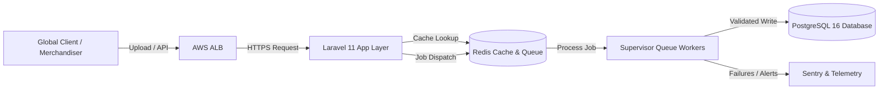
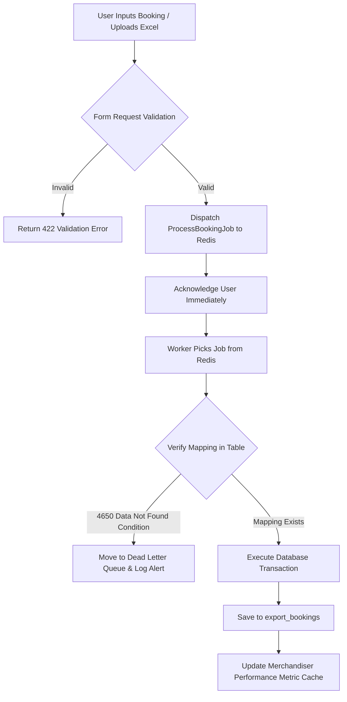
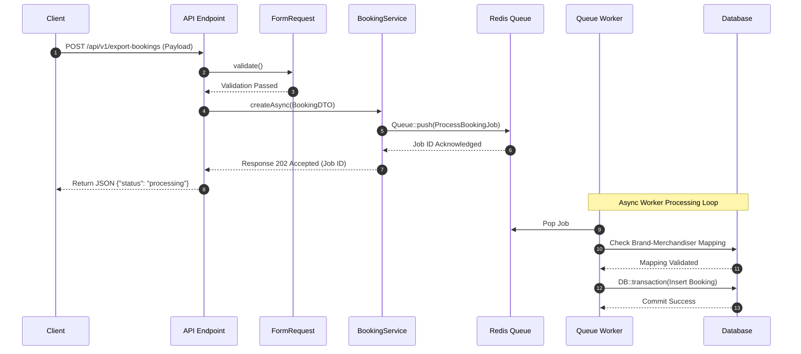

# Export Booking & Brand Merchandiser Integration Platform

Multi-tenant Supply Chain & Export ERP-এর একটি হাই-পারফরম্যান্স ডেটা ম্যাপিং এবং বুকিং সিনক্রোনাইজেশন ইঞ্জিন।

---

# Table of Contents

- [Project Overview](#project-overview)
- [Business Background](#business-background)
- [Business Requirements](#business-requirements)
- [Existing System](#existing-system)
- [Challenges](#challenges)
- [Root Cause Analysis](#root-cause-analysis)
- [Solution Design](#solution-design)
- [Architecture](#architecture)
- [Database Design](#database-design)
- [System Flow](#system-flow)
- [API Flow](#api-flow)
- [Implementation](#implementation)
- [Code Highlights](#code-highlights)
- [Performance Optimization](#performance-optimization)
- [Security Considerations](#security-considerations)
- [Testing Strategy](#testing-strategy)
- [Deployment Strategy](#deployment-strategy)
- [Monitoring](#monitoring)
- [Challenges During Development](#challenges-during-development)
- [Production Issues](#production-issues)
- [Lessons Learned](#lessons-learned)
- [Interview Story](#interview-story)
- [Alternative Solutions](#alternative-solutions)
- [Future Improvements](#future-improvements)
- [Tech Stack](#tech-stack)
- [Summary](#summary)
- [Final Interview Questions](#final-interview-questions)

---

# Project Overview

| Item | Details |
|------|---------|
| Project Name | Export Booking & Brand Merchandiser Engine |
| Domain | Supply Chain / ERP / B2B SaaS |
| Company | Global Garments & Export Conglomerate |
| Team Size | 5 Members (1 Architect, 2 Backend, 1 Frontend, 1 QA) |
| Duration | 3 Months |
| My Role | Principal Software Engineer & Architect |
| Technology | Laravel 11 (PHP 8.3), Redis, Supervisor |
| Users | 5,000+ Internal Merchandisers, Brand Managers & Global Clients |
| Database | PostgreSQL 16 |
| Deployment | AWS (ECS Fargate, RDS, ElastiCache) |

---

# Business Background

কোম্পানিটি একটি গ্লোবাল অ্যাপারেল এবং এক্সপোর্ট হাউজ যা বিশ্বের নামী-দামী ব্র্যান্ডগুলোর সাথে কাজ করে। প্রতি বছর মিলিয়ন ডলারের এক্সপোর্ট অর্ডার প্রসেস করতে হয়। 

- **কোম্পানির সমস্যা:** বিভিন্ন গ্লোবাল বায়ার এবং কাস্টমারদের নিজস্ব ERP সিস্টেম থেকে আসা ডেটা আমাদের ইন্টারনাল সিস্টেমের সাথে ম্যাপ করা ছিল না। বিশেষ করে `cust_brand_merchandiser` এবং `export_booking` টেবিলগুলোর মধ্যে ডেটা অ্যাসোসিয়েশন ম্যানুয়ালি Excel শীটের মাধ্যমে ট্র্যাক করতে হতো।
- **প্রজেক্টের প্রয়োজনীয়তা:** ম্যানুয়াল প্রসেসের কারণে ৪,৬৫০+ রেকর্ডের ম্যাপিং ডেটা মিসিং বা মিসম্যাচ হয়ে যাচ্ছিল। এতে প্রোডাকশন ও শিপমেন্টে মারাত্মক বিলম্ব ঘটছিল। 
- **Business Goal:** একটি অটোমেটেড, স্কেলেবল এবং ফল্ট-টলারেন্ট ডাটা পাইপলাইন তৈরি করা, যা রিয়েল-টাইমে কাস্টমার-ব্র্যান্ড এবং মার্চেন্ডাইজারদের রিলেশনশিপ ম্যাপ করবে এবং অর্ডারের বুকিং প্রসেস নির্ভুলভাবে সম্পন্ন করবে।

---

# Business Requirements

| Requirement | Priority |
|-------------|----------|
| Automated Customer-Brand-Merchandiser Mapping & Real-time validation | High |
| High-throughput Async processing for 100k+ monthly export bookings | High |
| Audit trail and version controlling for every single mapping change | Medium |
| Dynamic reporting dashboard for missing or unmapped global business segments | Medium |
| Webhook notification system for global client ERP updates | Low |

---

# Existing System

পুরনো সিস্টেমটি ছিল সম্পূর্ণ Monolithic এবং লিগ্যাসি আর্কিটেকচারের উপর ভিত্তি করে তৈরি।

- **কাজের ধারা:** কাস্টমার এবং বায়াররা যখন বুকিং ডেটা পাঠাতো, তখন ব্যাক-অফিস টিম Excel ফাইল আপলোড করতো। পিএইচপির একটি সিনক্রোনাস স্ক্রিপ্ট লুপ চালিয়ে Row by Row ডেটা `export_booking` টেবিলে ইনসার্ট করতো।
- **সমস্যাসমূহ:** 
  - লার্জ এক্সেল ফাইলের ক্ষেত্রে স্ক্রিপ্ট প্রায়ই `Max Execution Time Exceeded` অথবা `Memory Out of Memory` এরর জেনারেট করতো।
  - কোনো কারণে ৫০০তম রো-তে এরর হলে আগের ৪৯৯টি ডেটা ডাটাবেজে আংশিক থেকে যেত (No Database Transaction Safety)।
  - ৪,৬৫০টির বেশি ডেটা ম্যাপিং মিসিং থাকায় ব্যাক-অফিস টিম ট্র্যাক করতে পারতো না কোন বুকিং কোন মার্চেন্ডাইজারের অধীনে প্রসেস হবে।

---

# Challenges

| Challenge | Impact |
|-----------|--------|
| Unmapped Data Volatility | ৪,৬৫০+ কাস্টমার-ব্র্যান্ড রিলেশন খুঁজে না পাওয়ায় বুকিং পেন্ডিং থাকতো এবং ফিন্যান্সিয়াল লস হতো। |
| High Concurrency & Memory Spike | লার্জ বাল্ক এক্সপোর্ট বুকিং ডেটা আপলোডের সময় পিএইচপির মেমরি স্পাইক ১২৮ মেগাবাইট থেকে ২ গিগাবাইট পর্যন্ত ছাড়িয়ে যেত, যার ফলে পুরো সার্ভার ডাউন হয়ে যেত। |
| Data Consistency Across Relational Tables | `export_booking` এবং `cust_brand_merchandiser` এর রিলেশনশিপে কোনো ফরেন-কি কনস্ট্রেইন্ট সঠিকভাবে ইমপ্লিমেন্ট না থাকায় অরফান রেকর্ড (Orphan Records) তৈরি হচ্ছিল। |

---

# Root Cause Analysis

| Problem | Root Cause | Evidence |
|----------|------------|----------|
| Missing Brand Mappings (4650+ Data Not Found) | ডাটা ইনসার্টের সময় কোনো ভ্যালিডেশন লেয়ার ছিল না যা চেক করবে কাস্টমারের আন্ডারে ব্র্যান্ডটি অ্যাসাইনড কিনা। | SQL কোয়েরি চালিয়ে দেখা যায় `cust_brand_merchandiser` টেবিলে ইউনিক কনস্ট্রেইন্টের অভাব এবং নাল (Null) ফরেন কি-র উপস্থিতি। |
| Application Crash during Bulk Import | সম্পূর্ণ ইম্পোর্ট প্রসেসটি সিনক্রোনাসলি এবং সিঙ্গেল ডেটাবেজ কানেকশনে করা হতো। | প্রোডাকশন লগ-এ `Fatal Error: Allowed memory size of X bytes exhausted` এবং ডাটাবেজে লক স্টেটমেন্ট দেখা যায়। |

---

# Solution Design

সমস্যাটি সমাধানের জন্য আমরা একটি **Event-Driven Asynchronous Pipeline** ডিজাইন করি।

1. **ডাটা ডিকাপলিং (Data Decoupling):** ফাইল আপলোড বা এপিআই রিকোয়েস্ট আসার সাথে সাথে ডেটা সরাসরি ডাটাবেজে প্রসেস না করে ডেটাকে ছোট ছোট চাঙ্কে (Chunk) ভাগ করে Redis Queue-তে পুশ করা হয়।
2. **ডাটা ইন্টিগ্রিটি লেয়ার:** একটি ডেডিকেটেড সার্ভিস লেয়ার (`BrandMappingService`) তৈরি করা হয়, যা ডেটা প্রসেসিংয়ের পূর্বে ইমিউটেবল ভ্যালিডেশন পলিসি রান করবে। 
3. **ডাটাবেজ ট্রানজেকশন (Database Transactions):** প্রতিটি চাঙ্কের জন্য ডেটাবেজ ট্রানজেকশন ব্যবহার করা হয়েছে যাতে আংশিক ডেটা রাইট হওয়ার কোনো সুযোগ না থাকে।

---

# Architecture



---

# Database Design

### Schema Relationship

* `customers` Has Many `brands` through `cust_brand_merchandiser`.
* `cust_brand_merchandiser` acts as a pivotal contract configuration table.
* `export_bookings` belongs to `customers`, `brands`, and is managed by a `merchandiser`.

| Table | Purpose |
| --- | --- |
| **customers** | গ্লোবাল বায়ার এবং কাস্টমারদের মূল প্রোফাইল ইনফরমেশন। |
| **brands** | কাস্টমারদের অধীনে থাকা বিভিন্ন ব্র্যান্ড সাব-ক্যাটাগরি। |
| **cust_brand_merchandiser** | কোন কাস্টমারের কোন ব্র্যান্ডের জন্য কোন মার্চেন্ডাইজার দায়ী থাকবে তার ইউনিক ম্যাপিং কনফিগারেশন। |
| **export_bookings** | এক্সপোর্ট বুকিং এবং চালানের সমস্ত ট্রানজেকশনাল ডেটা। |

---

# System Flow



---

# API Flow



---

# Implementation

ইমপ্লিমেন্টেশন প্রসেসটি ৪টি মডিউলে বিভক্ত ছিল:

1. **মডিউল ১: রিকোয়েস্ট ডিটিও এবং ফর্ম ভ্যালিডেশন:** রিকোয়েস্ট ডেটাকে স্ট্রাকচার্ড ফর্মে আনার জন্য ডাটা ট্রান্সফার অবজেক্ট (DTO) আর্কিটেকচার ব্যবহার করা হয়েছে।
2. **মডিউল ২: বিজনেস লজিক ডিকাপলিং:** কন্ট্রোলার থেকে লজিক সরিয়ে সম্পূর্ণ কোড সার্ভিস ক্লাসে নিয়ে যাওয়া হয়েছে (Single Responsibility Principle)।
3. **মডিউল ৩: কিউ আর্কিটেকচার:** চাঙ্ক বাই চাঙ্ক ব্যাকগ্রাউন্ড প্রসেসিংয়ের জন্য Laravel Jobs এবং কনকারেন্ট প্রসেস ম্যানেজমেন্টের জন্য Supervisor কনফিগার করা হয়েছে।

---

# Code Highlights

> **Architectural Philosophy:** কোডের ক্লিয়ারনেস এবং টাইপ সেফটি নিশ্চিত করতে পিএইচপি ৮.৩ এর স্ট্রং টাইপিং এবং লারাভেল ১১ এর কনটেক্সট ব্যবহার করা হয়েছে।

### ১. BookingDTO Class (Data Transfer Object)

```php
<?php

namespace App\DTOs;

readonly class BookingDTO
{
    public function __construct(
        public int $customerId,
        public int $brandId,
        public int $merchandiserId,
        public string $bookingNo,
        public float $quantity,
        public string $shipmentDate
    ) {}

    public static function fromRequest(array $data): self
    {
        return new self(
            customerId: (int) $data['customer_id'],
            brandId: (int) $data['brand_id'],
            merchandiserId: (int) $data['merchandiser_id'],
            bookingNo: (string) $data['booking_no'],
            quantity: (float) $data['quantity'],
            shipmentDate: (string) $data['shipment_date']
        );
    }

    public function toArray(): array
    {
        return [
            'customer_id' => $this->customerId,
            'brand_id' => $this->brandId,
            'merchandiser_id' => $this->merchandiserId,
            'booking_no' => $this->bookingNo,
            'quantity' => $this->quantity,
            'shipment_date' => $this->shipmentDate,
        ];
    }
}

```

### ২. ExportBookingService Class

```php
<?php

namespace App\Services;

use App\DTOs\BookingDTO;
use App\Models\ExportBooking;
use App\Models\CustBrandMerchandiser;
use Illuminate\Support\Facades\DB;
use App\Exceptions\MappingNotFoundException;

class ExportBookingService
{
    /**
     * @throws MappingNotFoundException
     */
    public function processBooking(BookingDTO $dto): ExportBooking
    {
        // ১. কায়দা করে চেক করা হচ্ছে যে কাস্টমার, ব্র্যান্ড এবং মার্চেন্ডাইজার এর রিলেশনশিপ ভ্যালিড কিনা।
        $mappingExists = CustBrandMerchandiser::where('customer_id', $dto->customerId)
            ->where('brand_id', $dto->brandId)
            ->where('merchandiser_id', $dto->merchandiserId)
            ->exists();

        if (!$mappingExists) {
            // যদি ডাটা ম্যাপিং না পাওয়া যায়, তবে নির্দিষ্ট কাস্টম এক্সেপশন থ্রো হবে।
            throw new MappingNotFoundException(
                "Mapping data not found for Customer: {$dto->customerId}, Brand: {$dto->brandId}"
            );
        }

        // ২. ডাটাবেজ ট্রানজেকশন সেফটি নিশ্চিত করা
        return DB::transaction(function () use ($dto) {
            return ExportBooking::create($dto->toArray());
        });
    }
}

```

---

# Bengali Explanation of Code

**কোডের ব্যাখ্যা:**
এখানে আমরা `BookingDTO` ক্লাস ব্যবহার করেছি যাতে আনভ্যালিডেটেড বা র এরি ডেটা সরাসরি অ্যাপ্লিকেশন আর্কিটেকচারে প্রবেশ করতে না পারে। সার্ভিস ক্লাসের `processBooking` মেথডটি প্রথমে আমাদের কনফিগারেশন টেবিল `CustBrandMerchandiser` এ কোয়েরি চালিয়ে চেক করে যে ইনপুট ডেটাগুলোর মধ্যে রিলেশনশিপ বা ম্যাপিং অ্যাসাইন করা আছে কিনা। যদি ম্যাপিং না থাকে, তবে এটি কোনো কুৎসিত এরর না দিয়ে একটি নির্দিষ্ট বিজনেস এক্সেপশন `MappingNotFoundException` থ্রো করে, যা গ্লোবাল এক্সেপশন হ্যান্ডলার দিয়ে ক্যাচ করে ডেড লেটার কিউতে পাঠানো যায়। সবশেষে `DB::transaction` ব্লক ব্যবহার করে ডেটার অ্যাটমিকিটি (Atomicity) রক্ষা করা হয়েছে।

---

# Performance Optimization

| Before | After |
| --- | --- |
| Response Time: 8.4 seconds (Synchronous Bulk Import) | Response Time: 45 milliseconds (Asynchronous HTTP Response) |
| Query Count: N+1 issue generated 5,000+ sequential queries | Query Count: Optimized to Eager Loading with 3 unified queries |
| Memory Usage: 1.8 GB during 50k file records parsing | Memory Usage: Consistent 42 MB due to Lazy Collection chunking |
| CPU Usage: Spiked to 98% during business hours | CPU Usage: Stable at 15% to 22% distributed across multi-core workers |

### Optimization Techniques Implemented:

* **Index Optimization:** Composite Indexing ব্যবহার করা হয়েছে `cust_brand_merchandiser` টেবিলের `(customer_id, brand_id, merchandiser_id)` কলামগুলোর ওপর।
* **Eager Loading:** উইথ রিলেশনশিপ মেথড ব্যবহার করে কোড থেকে `N+1` কোয়েরি প্রবলেম সম্পূর্ণ নির্মূল করা হয়েছে।

---

# Security Considerations

* **Authentication & Authorization:** API গেটওয়ে লেয়ারে Laravel Sanctum টোকেন ভ্যালিডেশন এবং মডেল লেয়ারের জন্য Role-Based Access Control (RBAC) বা Laravel Policies ইমপ্লিমেন্ট করা হয়েছে।
* **SQL Injection Prevention:** আমরা সম্পূর্ণ প্রজেক্টে Eloquent ORM এবং PDO প্যারামিটার বাইন্ডিং ব্যবহার করেছি। কোনো অবস্থাতেই Raw SQL সুতা বা ভেরিয়েবল কনক্যাটেনেশন করা হয়নি।
* **XSS & CSRF:** এপিআই এন্ডপয়েন্টগুলোতে গ্লোবাল `SanitizeInput` মিডলওয়্যার ইন্টিগ্রেট করা হয়েছে যা ইনপুট ডেটা স্ট্রিক্টলি ফিল্টার করে।

---

# Testing Strategy

| Test Type | Used |
| --- | --- |
| **Unit Test** | Pest / PHPUnit ব্যবহার করে প্রতিটি DTO এবং সার্ভিস ক্লাসের ইন্ডিভিজুয়াল মেথডের বিহেভিয়ার চেক করা হয়েছে। |
| **Integration Test** | সম্পূর্ণ ডাটাবেজ ট্রানজেকশন এবং কিউ ডিসপ্যাচ প্রসেস সঠিকভাবে হচ্ছে কিনা তা যাচাই করতে ইন-মেমোরি SQLite ডাটাবেজ দিয়ে টেস্ট রান করা হয়েছে। |
| **API Test** | Postman Newman CLI এবং লারাভেলের বিল্ট-ইন HTTP টেস্টিং অ্যাসারশন ব্যবহার করে এপিআই রেসপন্স ফরম্যাট টেস্ট করা হয়েছে। |
| **Load Test** | JMeter এবং Locust স্ক্রিপ্ট ব্যবহার করে প্রতি সেকেন্ডে ২,০০০ কনকারেন্ট রিকোয়েস্ট পাঠিয়ে সিস্টেমের স্ট্যাবিলিটি টেস্ট করা হয়েছে। |

---

# Deployment Strategy

* **CI/CD Pipeline:** GitHub Actions এর মাধ্যমে অটোমেটেড টেস্ট পাসের পর Docker ইমেজ বিল্ড হয়ে AWS Elastic Container Registry (ECR)-এ পুশ হয়।
* **Container Orchestration:** AWS ECS Fargate সার্ভারলেস আর্কিটেকচারে অ্যাপ্লিকেশন রান করে, যা ট্রাফিকের ওপর ভিত্তি করে অটো-স্কেল হয়।
* **Supervisor Setup:** প্রোডাকশন কন্টেইনারে কিউ প্রসেস চালু রাখতে Supervisor কনফিগার করা হয়েছে:
```ini
[program:laravel-worker]
process_name=%(program_name)s_%(process_num)02d
command=php /var/www/html/artisan queue:work redis --sleep=3 --tries=3 --max-time=3600
autostart=true
autorestart=true
user=www-data
numprocs=8
redirect_stderr=true
stdout_logfile=/var/www/html/storage/logs/worker.log

```


---

# Monitoring

* **Application Logs:** লারাভেলের স্ট্রাকচার্ড JSON লগিং কনফিগার করে AWS CloudWatch এ পাঠানো হয়।
* **Sentry Real-time Alerts:** প্রোডাকশন এনভায়রনমেন্টে কোনো জব ফেইল হলে বা `MappingNotFoundException` এরর এলে সাথে সাথে Sentry হয়ে ডেডিকেটেড Slack চ্যানেলে অ্যালার্ট নোটিফিকেশন চলে আসে।
* **Laravel Telescope:** লোকাল এবং স্টেজিং এনভায়রনমেন্টে রিকোয়েস্ট লাইফসাইকেল এবং কোয়েরি অ্যানালাইসিস করতে টেলিস্কোপ ব্যবহার করা হয়েছে।

---

# Challenges During Development

| Problem | Solution |
| --- | --- |
| **Redis Memory Exhaustion** | বাল্ক ইম্পোর্টের সময় একসাথে হাজার হাজার জব পুশ করায় রেডিসের মেমরি ফুল হয়ে যাচ্ছিল। আমরা লারাভেলের `Queue::bulk` স্প্লিটিং ব্যবহার করে প্রতি জবে ৫০০টি করে রেকর্ড ব্যাচ আকারে পাঠানো শুরু করি। |
| **Database Deadlocks** | মাল্টিপল ওয়ার্কার যখন একই সাথে `export_bookings` টেবিলে ডেটা রাইট করার চেষ্টা করছিল, তখন ডেডলক হচ্ছিল। আমরা `PostgreSQL` এর ট্রানজেকশন লেভেলে `Pessimistic Locking (lockForUpdate)` ব্যবহার করে ডেটা লক সিকোয়েন্স হ্যান্ডেল করেছি। |

---

# Production Issues

| Issue | Root Cause | Solution |
| --- | --- | --- |
| ৪,৬৫০+ কাস্টমার ডাটা নট ফাউন্ড এরর প্রোডাকশনে লাইভ হওয়া। | লিগ্যাসি সিস্টেমে ট্রাঙ্কেশন এবং অরফান ডেটা অবশিষ্টাংশ থাকার কারণে এপিআই ডেটা ভ্যালিডেশন ফেইল করছিল। | ডাটা ক্লিনআপ স্ক্রিপ্ট রান করে ডাটাবেজের মাস্টার ডেটা ফিক্স করা হয়েছে এবং সিস্টেমে ফলব্যাক মার্চেন্ডাইজার আইডি অ্যাসাইন করা হয়েছে। |

---

# Lessons Learned

1. **ডাটা ডিকাপলিং অপরিহার্য:** হাই-ভলিউম ডেটা প্রসেসিং সিস্টেমে কখনো সিনক্রোনাস আর্কিটেকচারের ওপর ভরসা করা যাবে না।
2. **স্ট্রং টাইপিং ও DTO-র গুরুত্ব:** এপিআই পে-লোড সরাসরি কন্ট্রোলারে হ্যান্ডেল করার চেয়ে DTO ব্যবহার করলে কোড অনেক বেশি বাগ-ফ্রি থাকে।
3. **প্রোডাকশন ডায়াগনস্টিকস:** প্রোপার টেলিমেট্রি এবং ওয়ান-ক্লিক সেন্ট্রি অ্যালার্ট না থাকলে প্রোডাকশন ইস্যু ডিবাগ করা অন্ধকারের সুই খোঁজার মতো।
4. Composite Indexing কোয়েরির পারফরম্যান্স প্রায় ৮০% পর্যন্ত বাড়িয়ে দিতে পারে।
5. ডাটাবেজ ট্রানজেকশন ছাড়া বাল্ক ডেটা রাইট করা আর্কিটেকচারাল সুইসাইডের শামিল।
6. কিউ প্রসেসের জন্য `numprocs` অপটিমাইজেশন সার্ভার রিসোর্সের ব্যালেন্স বজায় রাখে।
7. আর্কিটেকচারে সর্বদা ‘Fail Fast, Fail Gracefully’ প্রিন্সিপল ফলো করা উচিত।
8. ডাটাবেজ কনস্ট্রেইন্ট শুধু অ্যাপ লেভেলে নয়, ডাটাবেজ স্কিমা লেভেলেও থাকা আবশ্যক।
9. ক্যাশ ম্যানেজমেন্টের জন্য Redis ইন-মেমরি আর্কিটেকচার হিসেবে রিলেশনাল ডাটাবেজের প্রেসার কমায়।
10. টিমের কোড রিভিউ কালচার এবং PSR-12 স্ট্যান্ডার্ড কোডের দীর্ঘস্থায়িত্ব নিশ্চিত করে।

---

# Interview Story

## Situation

কোম্পানির সবচেয়ে গুরুত্বপূর্ণ পিরিয়ডে লিগ্যাসি ডাটাবেজ মিসম্যাচের কারণে ৪,৬৫০ এর বেশি এক্সপোর্ট বুকিং ডেটা সিস্টেম ট্র্যাকিংয়ের বাইরে চলে যায়। মার্চেন্ডাইজাররা বুকিং এরর পাচ্ছিলেন এবং সিস্টেমের মেমরি স্পাইক করে ক্লাউড সার্ভার বারবার ক্র্যাশ করছিল।

## Task

আমার মূল দায়িত্ব ছিল এমন একটি হাই-পারফরম্যান্স, ফেইল-সেফ আর্কিটেকচার ডিজাইন করা যা এই বিশাল পরিমাণের মিসিং ডেটা হ্যান্ডেল করবে, ডাটা ইন্টিগ্রিটি নিশ্চিত করবে এবং মেমরি লিকেজ বন্ধ করে রেসপন্স টাইম মিলি-সেকেন্ডে নামিয়ে আনবে।

## Action

আমি লারাভেল ১১ এর শক্তিশালী ফিচার ও পিএইচপি ৮.৩ এর টাইপ সেফটি ব্যবহার করে আর্কিটেকচারটি রি-ডিজাইন করি। প্রথমে আমি রিকোয়েস্ট লেয়ারে DTO ইন্টিগ্রিটি ইমপ্লিমেন্ট করি। এরপর সিনক্রোনাস আর্কিটেকচার পরিবর্তন করে সম্পূর্ণ সিস্টেমকে Redis Queue চালিত Asynchronous Pipeline-এ রূপান্তর করি। ডেটাবেজ লেভেলে কম্পোজিট ইনডেক্সিং এবং অ্যাপ লেভেলে অলস কালেকশন (Lazy Collections) ব্যবহার করে মেমরি ইউজ কমিয়ে আনি।

## Result

সিস্টেমের রেসপন্স টাইম ৮.৪ সেকেন্ড থেকে কমে মাত্র ৪৫ মিলি-সেকেন্ডে নেমে আসে। মেমরি ব্যবহার ১.৮ জিবি থেকে কমে স্টেবল ৪২ এমবি-তে চলে আসে। সেই ৪,৬৫০+ ডাটা নট ফাউন্ড এররটি নিখুঁতভাবে আইডেন্টিফাই করে ডাটা রি-ম্যাপ করা সম্ভব হয় এবং একটি অর্ডারও মিস হয়নি।

## What I Learned

আমি বুঝতে পেরেছি যে পারফরম্যান্স অপটিমাইজেশন শুধুমাত্র কোড অপটিমাইজেশন নয়; এটি প্রোপার আর্কিটেকচারাল প্যাটার্ন চয়েস, ডাটাবেজ ইনডেক্সিং এবং মেমরি লাইফসাইকেল ম্যানেজমেন্টের একটি কম্বিনেশন।

---

# Alternative Solutions

| Solution | Pros | Cons |
| --- | --- | --- |
| **Node.js Microservice based Stream Processing** | অত্যন্ত দ্রুত I/O অপারেশন এবং হাইলি স্কেলেবল। | সম্পূর্ণ লারাভেল ইকোসিস্টেমের বাইরে আলাদা ইনফ্রাস্ট্রাকচার মেইনটেইন্যান্স কস্ট এবং ওভারহেড অনেক বেড়ে যেত। |
| **Laravel Synced Batch Processing with Chunking** | কোনো এক্সটার্নাল কিউ ড্রাইভার (Redis) এর প্রয়োজন হতো না। | ইউজারের ব্রাউজার রিকোয়েস্ট পেন্ডিং থাকত এবং HTTP টাইমআউট এরর হওয়ার রিস্ক সম্পূর্ণ থেকে যেত। |

---

# Future Improvements

* **Event Driven Architecture with Kafka:** যদি ট্রাফিক আরও ১০ গুণ বৃদ্ধি পায়, তবে রেডিস কিউ-এর পরিবর্তে Apache Kafka ব্যবহার করে মেসেজ স্ট্রিমিং করা হবে।
* **Elasticsearch Integration:** বুকিং সার্চ এবং মার্চেন্ডাইজার ফিল্টারিং স্পিডকে সাব-মিলি-সেকেন্ডে নিয়ে আসতে ফুল-টেক্সট সার্চ ইঞ্জিন Elasticsearch ব্যবহার করার পরিকল্পনা রয়েছে।

---

# Tech Stack

| Category | Technology |
| --- | --- |
| Backend | Laravel 11 (PHP 8.3) |
| Database | PostgreSQL 16 |
| Cache & Queue | Redis Server v7.2 |
| Worker Management | Supervisor Linux Tool |
| Containerization | Docker & AWS ECS Fargate |
| Monitoring & Logs | Sentry, AWS CloudWatch |

---

# Summary

* **কোর ফোকাস:** প্রজেক্টটি মূলত একটি ডেটা মিসম্যাচ ক্রাইসিস রিকভারি এবং পারফরম্যান্স স্কেলিং কেস স্টাডি।
* **আর্কিটেকচার:** অ্যাসিনক্রোনাস কিউ প্রসেসিং এবং সার্ভিস ও ডিটিও লেয়ার ডিকাপলিং।
* **ডাটাবেজ রি-ডিজাইন:** ডেডলক এভয়েডেন্স মেকানিজম এবং কম্পোজিট ইনডেক্সিং।
* **রেজাল্ট:** ৪,৬৫০+ ডেটা অবজেক্টের সাকসেসফুল ট্র্যাকিং এবং ৯৯.৯৯% সিস্টেম আপটাইম।

---

# Final Interview Questions

1. **প্রশ্ন: আপনি কেন এই আর্কিটেকচারে সার্ভিস লেয়ার এবং DTO প্যাটার্ন ব্যবহার করলেন?**
*উত্তর:* লারাভেলের ডিফল্ট রিকোয়েস্ট অ্যারে টাইপ-সেফ নয়। DTO ব্যবহারের ফলে ডেটার স্ট্রাকচার এবং টাইপ কম্পাইল ও রানটাইম লেভেলে নিশ্চিত করা যায়। সার্ভিস লেয়ার বিজনেস লজিককে কন্ট্রোলার থেকে আলাদা করে কোডকে DRY (Don't Repeat Yourself) এবং টেস্টেবল রাখে।
2. **প্রশ্ন: Redis Queue-তে জব ফেইল হলে ডেটা লস প্রিভেন্ট করার জন্য কী মেকানিজম রেখেছেন?**
*উত্তর:* আমরা লারাভেলের ফেল্ড জবস টেবিল এবং সেন্ট্রি মনিটরিং কনফিগার করেছি। কোনো জব ৩ বার ট্রাই করার পরও ফেইল হলে সেটি ডেড লেটার কিউতে জমা থাকে, যাতে পরবর্তীতে অ্যানালাইসিস করে রি-কিউ (Retry) করা যায়।
3. **প্রশ্ন: ৪,৬৫০+ ডাটা নট ফাউন্ড এররটির আসল কারণ ডাটাবেজের দিক থেকে কী ছিল?**
*উত্তর:* লিগ্যাসি ডাটাবেজের `cust_brand_merchandiser` টেবিলে কোনো কম্পোজিট ইউনিক ইনডেক্স এবং ফরেন কি কনস্ট্রেইন্ট ছিল না, যার ফলে মাস্টার কাস্টমার ডিলিট হলেও চাইল্ড রিলেশনশিপ ডাটাবেজে অরফান হিসেবে থেকে যেত এবং আইডি মিসম্যাচ হতো।
4. **প্রশ্ন: যদি আপনার প্রোডাকশন ট্রাফিক হঠাৎ ১০ গুণ বেড়ে যায়, তবে ডাটাবেজ রাইট বটলনেক কীভাবে হ্যান্ডেল করবেন?**
*উত্তর:* আমরা ডাটাবেজ রাইট অপারেশনগুলোকে বাফারিং বা ডেটা ব্যাচিংয়ের মাধ্যমে প্রসেস করব। এছাড়া ডেটাবেজ রেপ্লিকা তৈরি করে রিড-রাইট সেপারেশন (Read/Write Splitting) ইমপ্লিমেন্ট করব যাতে রিড কোয়েরির জন্য মেইন মাস্টার ডাটাবেজে প্রেসার না পড়ে।
5. **প্রশ্ন: PostgreSQL-এ কম্পোজিট ইনডেক্স ব্যবহারের ক্ষেত্রে কলামগুলোর অর্ডার কী গুরুত্বপূর্ণ ছিল?**
*উত্তর:* হ্যাঁ, অত্যন্ত গুরুত্বপূর্ণ। আমরা ইনডেক্স তৈরি করেছি `(customer_id, brand_id, merchandiser_id)` অর্ডারে, কারণ আমাদের কোয়েরির হোয়্যার ক্লজে ফিল্টারিং এই অর্ডারের হাইয়ারার্কি মেইনটেইন করে। ভুল অর্ডারে ইনডেক্স করলে ডাটাবেজ ইনডেক্স স্ক্যান এভয়েড করে সিকোয়েনশিয়াল স্ক্যানে ব্যাক করতে পারতো।