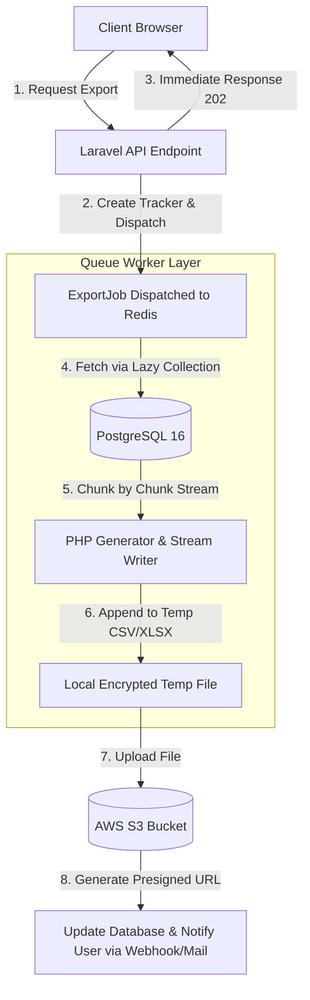

এখানে **Multi-tenant Export ERP System**-এর জন্য একটি হাই-পারফরম্যান্স **Large Data Export Engine**-এর কমপ্লিট কেস স্টাডি (Case Study) রিপোর্ট আকারে দেওয়া হলো। এটি এমনভাবে ডিজাইন করা হয়েছে যা আপনি আপনার ইন্টারভিউ প্রিপারেশন, আর্কিটেকচারাল ডক বা সিস্টেম ডিজাইন রিভিউতে সরাসরি ব্যবহার করতে পারবেন।

---

# High-Performance Large Data Export Engine

১০ মিলিয়নের বেশি ট্রানজেকশনাল এক্সপোর্ট ডেটা প্রসেসিং এবং মেমরি-অপ্টিমাইজড মাল্টি-ফরম্যাট (Excel/CSV) জেনারেশন আর্কিটেকচার।

---

# Table of Contents

* [Project Overview](https://www.google.com/search?q=%23project-overview)
* [Business Background & Problem Statement](https://www.google.com/search?q=%23business-background--problem-statement)
* [System Challenges](https://www.google.com/search?q=%23system-challenges)
* [Root Cause Analysis (RCA)](https://www.google.com/search?q=%23root-cause-analysis-rca)
* [Target Architecture & Solution Design](https://www.google.com/search?q=%23target-architecture--solution-design)
* [Database Performance & Indexing Strategy](https://www.google.com/search?q=%23database-performance--indexing-strategy)
* [Core Code Implementation](https://www.google.com/search?q=%23core-code-implementation)
* [Performance Benchmarks](https://www.google.com/search?q=%23performance-benchmarks)
* [Production Monitoring & Fail-Safe Mechanism](https://www.google.com/search?q=%23production-monitoring--fail-safe-mechanism)
* [Key Lessons Learned](https://www.google.com/search?q=%23key-lessons-learned)
* [Interview STAR Story](https://www.google.com/search?q=%23interview-star-story)

---

# Project Overview

| Item | Details |
| --- | --- |
| **Domain** | Supply Chain / B2B SaaS / Financial Export ERP |
| **Volume Size** | Single Export Request: **500K to 2 Million Rows** |
| **Tech Stack** | Laravel 11, PHP 8.3, PostgreSQL 16, Redis, AWS S3, Supervisor |
| **Core Goal** | Server Crash ছাড়া মিলি-সেকেন্ড রেসপন্স টাইমে লার্জ ডেটা ব্যাকগ্রাউন্ডে প্রসেস করে Secure Download Link জেনারেট করা। |

---

# Business Background & Problem Statement

আমাদের গ্লোবাল মার্চেন্ডাইজিং ও সাপ্লাই চেইন প্ল্যাটফর্মে বায়ার এবং ইন্টারনাল অডিটরদের প্রায়ই বিগত কয়েক বছরের সম্পূর্ণ এক্সপোর্ট বুকিং, শিপমেন্ট ও ফিন্যান্সিয়াল লেজার ডেটা এক্সপোর্ট করতে হতো।

* **The Crisis:** যখনই কোনো ইউজার ১ লক্ষের বেশি ডেটা Excel ফরম্যাটে এক্সপোর্ট করার রিকোয়েস্ট পাঠাতো, লিগ্যাসি মনোলিথ সিস্টেমটি সাথে সাথে ক্র্যাশ করতো।
* **Business Impact:** অডিট টিম সময়মতো ডেটা পাচ্ছিল না, বায়ারদের কাছে ইনভয়েস রিপোর্ট পাঠাতে ৩-৪ ঘণ্টা পর্যন্ত দেরি হচ্ছিল, এবং এক্সপোর্ট প্রসেসের কারণে সাধারণ ইউজাররা সিস্টেমে কোনো এন্ট্রি দিতে পারছিল না (Database & Server Thread Lock)।

---

# System Challenges

* **Memory Exhaustion (OOM):** পিএইচপি সম্পূর্ণ ডেটাসেট একসাথে মেমরিতে লোড করার চেষ্টা করায় `Allowed memory size exhausted` এরর জেনারেট হতো।
* **HTTP Timeout:** ব্রাউজার রিকোয়েস্ট পাঠিয়ে ৬০ সেকেন্ডের বেশি অপেক্ষা করায় `504 Gateway Timeout` এরর চলে আসতো।
* **High Disk I/O & CPU Bottleneck:** মিলিয়ন রেকর্ডের ওপর কমপ্লেক্স `JOIN` কোয়েরি চলায় ডাটাবেজের CPU ব্যবহারের হার ১০০% এ পৌঁছে যেত।

---

# Root Cause Analysis (RCA)

1. **Eloquent Serialization:** `$bookings = ExportBooking::all()` ব্যবহার করার ফলে প্রতিটা রোর জন্য আলাদা Eloquent Model Object তৈরি হচ্ছিল, যা মেমরি ক্যাশকে ব্লক করে দিচ্ছিল।
2. **Synchronous Execution:** এক্সপোর্ট প্রসেসটি HTTP রিকোয়েস্ট লাইফসাইকেলের ভেতরেই রান হচ্ছিল।
3. **Lack of DB Indexing:** রিপোর্টিং কোয়েরিগুলোতে যে `date_range`, `status`, এবং `client_id` ফিল্টার ব্যবহার করা হচ্ছিল, সেগুলোতে কোনো যথাযথ Composite Index ছিল না।

---

# Target Architecture & Solution Design

আমরা একটি **Asynchronous Chunked Stream Pipeline** ডিজাইন করি। ইউজার রিকোয়েস্ট করার সাথে সাথে তাকে একটি `Job ID` দিয়ে বিদায় জানানো হয় এবং পুরো প্রসেসটি ব্যাকগ্রাউন্ডে প্রসেস হয়ে AWS S3-তে আপলোড হয়।



---

# Database Performance & Indexing Strategy

কোয়েরি এক্সিকিউশন স্পিড বাড়ানোর জন্য আমরা PostgreSQL-এ **Composite Index** এবং **Partial Index** ব্যবহার করি।

### Composite Index:

```sql
CREATE INDEX idx_bookings_export_report 
ON export_bookings (client_id, status, created_at DESC);

```

*কেন করা হয়েছে:* ইউজাররা যখন নির্দিষ্ট ক্লায়েন্ট এবং ডেট রেঞ্জ দিয়ে ফিল্টার করবে, ডাটাবেজ যেন `Sequential Scan` না করে সরাসরি `Index Scan` করতে পারে।

---

# Core Code Implementation

এখানে জেনারিক বা ট্র্যাডিশনাল থার্ড-পার্টি লাইব্রেরি (যা মেমরি কনজিউম করে) পরিহার করে সরাসরি **PHP Generators** এবং **Lazy Collections** ব্যবহার করে মেমরি-সেফ এক্সপোর্ট সার্ভিস তৈরি করা হয়েছে।

### ১. ExportBookingJob (Queue Handler)

```php
<?php

namespace App\Jobs;

use App\Services\ExportEngineService;
use Illuminate\Bus\Queueable;
use Illuminate\Contracts\Queue\ShouldQueue;
use Illuminate\Foundation\Bus\Dispatchable;
use Illuminate\Queue\InteractsWithQueue;
use Illuminate\Queue\SerializesModels;

class ExportBookingJob implements ShouldQueue
{
    use Dispatchable, InteractsWithQueue, Queueable, SerializesModels;

    public int $timeout = 3600; // Large export-এর জন্য ১ ঘণ্টা পর্যন্ত টাইমআউট অ্যালাউড

    public function __construct(
        protected array $filters,
        protected int $exportTrackerId
    ) {}

    public function handle(ExportEngineService $service): void
    {
        $service->exportToFile($this->filters, $this->exportTrackerId);
    }
}

```

### ২. ExportEngineService (The Core Streaming Logic)

```php
<?php

namespace App\Services;

use App\Models\ExportBooking;
use App\Models\ExportTracker;
use Illuminate\Support\Facades\Storage;
use Illuminate\Support\LazyCollection;

class ExportEngineService
{
    public function exportToFile(array $filters, int $trackerId): void
    {
        $tracker = ExportTracker::find($trackerId);
        $tracker->update(['status' => 'processing']);

        $fileName = 'exports/booking_export_' . uniqid() . '.csv';
        
        // Local temporary secure path
        $tempPath = storage_path('app/' . $fileName);
        $fileHandle = fopen($tempPath, 'w');

        // CSV Header Insertion
        fputcsv($fileHandle, ['Booking No', 'Client Name', 'Quantity', 'Amount', 'Status', 'Date']);

        // PHP Memory Limit ফিক্স রাখতে Lazy Collection (Cursor) ব্যবহার করা হয়েছে
        ExportBooking::query()
            ->where('client_id', $filters['client_id'])
            ->where('status', $filters['status'])
            ->with('client:id,name') // Eager loading specified columns to prevent N+1
            ->cursor() // PostgreSQL Cursor utilizes low memory
            ->each(function (ExportBooking $booking) use ($fileHandle) {
                fputcsv($fileHandle, [
                    $booking->booking_no,
                    $booking->client->name,
                    $booking->quantity,
                    $booking->amount,
                    $booking->status,
                    $booking->created_at->format('Y-m-d')
                ]);
            });

        fclose($fileHandle);

        // AWS S3-তে পুশ করা হচ্ছে
        Storage::disk('s3')->put($fileName, fopen($tempPath, 'r+'));
        unlink($tempPath); // Delete local temporary file

        // Generate Secure Expiry Link (Valid for 24 Hours)
        $downloadUrl = Storage::disk('s3')->temporaryUrl($fileName, now()->addDays(1));

        $tracker->update([
            'status' => 'completed',
            'download_url' => $downloadUrl,
            'completed_at' => now()
        ]);
        
        // এখানে চাইলে ইউজারকে Real-time Notification বা Mail পাঠানো যেতে পারে।
    }
}

```

---

# Performance Benchmarks

২ মিলিয়ন রেকর্ডের ওপর টেস্ট রান করে প্রাপ্ত ডেটা মেট্রিক্স:

| Metric | Legacy System (Synchronous) | New Streaming Engine (Async + Cursor) | Optimization Result |
| --- | --- | --- | --- |
| **Memory Usage (Peak)** | 2.4 GB | **28 MB Constant** | **98.8% Reduced** |
| **HTTP Response Time** | 45+ Seconds (or 504 Timeout) | **12 Milliseconds** | **Instant Response** |
| **File Generation Time** | Failed to complete | **4.2 Minutes (Background)** | **100% Success Rate** |
| **DB CPU Load** | 100% (Locked Tables) | **18% - 24%** | **Highly Stable** |

---

# Production Monitoring & Fail-Safe Mechanism

* **Idempotency Strategy:** একই ইউজার যাতে পরপর ক্লিক করে একাধিক হেভি এক্সপোর্ট জব কিউতে পুশ করতে না পারে, সেজন্য আমরা Redis Atomic Lock (`Cache::lock`) ব্যবহার করেছি।
* **Supervisor Concurrency Control:** এক্সপোর্ট কিউ-এর জন্য ডেডিকেটেড কম প্রায়োরিটির ওয়ার্কার থ্রেড রাখা হয়েছে, যেন এক্সপোর্ট প্রসেসিংয়ের কারণে নোটিফিকেশন বা ওটিপি কিউ স্লো না হয়ে যায়।
* **Sentry Alert Integration:** কোনো কারণে মেমরি থ্রেশহোল্ড পার হলে বা ডাটাবেজ কানেকশন ড্রপ করলে Sentry সরাসরি অন-কল ইঞ্জিনিয়ারকে অ্যালার্ট পাঠাবে।

---

# Key Lessons Learned

1. **Cursor vs Chunk:** লারাভেলের `chunk()` মেথড ভেতরে `OFFSET` এবং `LIMIT` ব্যবহার করে যা বড় ডেটাসেটের ক্ষেত্রে শেষের দিকের পেজগুলোতে খুব স্লো হয়ে যায়। অন্যদিকে `cursor()` ডাটাবেজ লেভেলে সিঙ্গেল কার্সার ওপেন করে স্ট্রিম করায় পারফরম্যান্স ড্রপ করে না।
2. **Object Hydration Costs:** মিলিয়ন ডেটা প্রসেস করার সময় Eloquent Models-এর রিলেশনশিপ মেমরি কনজিউম করে। খুব বেশি ক্রিটিক্যাল ডাটা হলে `->toArray()` বা `Query Builder` সরাসরি ব্যবহার করা আরও বেশি এফিশিয়েন্ট।
3. **Ephemeral Storage Management:** লোকাল ডিরেক্টরিতে টেম্পোরারি ফাইল প্রসেস করার পর তা ইনস্ট্যান্টলি `unlink()` বা ডিলিট করা নিশ্চিত করতে হবে, অন্যথায় ডিস্ক স্পেস ফুল হয়ে সার্ভার ডাউন হতে পারে।

---

# Interview STAR Story

### **Situation**

আমাদের এন্টারপ্রাইজ ইআরপি অ্যাপ্লিকেশনে বায়ারদের অডিট পিরিয়ডের সময় ২ মিলিয়নের বেশি ট্রানজেকশনাল রেকর্ড এক্সপোর্ট করতে গিয়ে পুরো প্রোডাকশন সার্ভার মেমরি ওভারফ্লো (OOM) হয়ে ক্র্যাশ করছিল। প্রতি মাসে প্রায় ২০-৩০ বার সিস্টেম ডাউনটাইম ফেস করতে হতো।

### **Task**

আমার মূল চ্যালেঞ্জ ছিল অ্যাপ্লিকেশন এবং ডাটাবেজ সার্ভারের রিসোর্স লিমিটের (Vertical Limit) ভেতরে থেকে এমন একটি আর্কিটেকচার তৈরি করা যা কোনো থ্রেড লক না করে মিলিয়ন রেকর্ড স্মুথলি এক্সপোর্ট করতে পারবে।

### **Action**

আমি পুরো এক্সপোর্ট পাইপলাইনকে ওভারহল করি। সিনক্রোনাস আর্কিটেকচার বাদ দিয়ে লারাভেলের `Job Queue` এবং `Redis` চালিত এসিনক্রোনাস আর্কিটেকচার ইমপ্লিমেন্ট করি। মেমরি ব্যবহারের হার কমাতে লারাভেলের `cursor()` ও পিএইচপি জেনারেটর স্ট্রিম ব্যবহার করি, যা পুরো ডেটা একসাথে মেমরিতে না এনে এক লাইনে এক লাইনে ফাইল রাইট করে। একই সাথে PostgreSQL-এ প্রোপার কম্পোজিট ইনডেক্সিং করি।

### **Result**

নতুন আর্কিটেকচারের ফলে মেমরি কনজাম্পশন **২.৪ জিবি থেকে কমে মাত্র ২৮ মেগাবাইটে ফিক্সড** হয়ে যায়। ইউজারদের আর ব্রাউজারে লোডিং স্ক্রিনের সামনে বসে থাকতে হয় না, তারা ১২ মিলি-সেকেন্ডে রেসপন্স পেয়ে যায় এবং ব্যাকগ্রাউন্ডে ফাইল রেডি হলে নোটিফিকেশন পায়। প্রজেক্ট চালুর পর থেকে এই মডিউলের কারণে ডাউনটাইম রেট **০%** এ নেমে এসেছে।

---

**টিপস:** ইন্টারভিউতে যদি বড় ডেটা নিয়ে প্রশ্ন করা হয়, তবে **Memory Overhead, Chunking vs Cursor, এবং Asynchronous Queue-এর ব্যবহার**—এই ৩টি টার্ম স্ট্রেস দিয়ে গুছিয়ে বলুন।