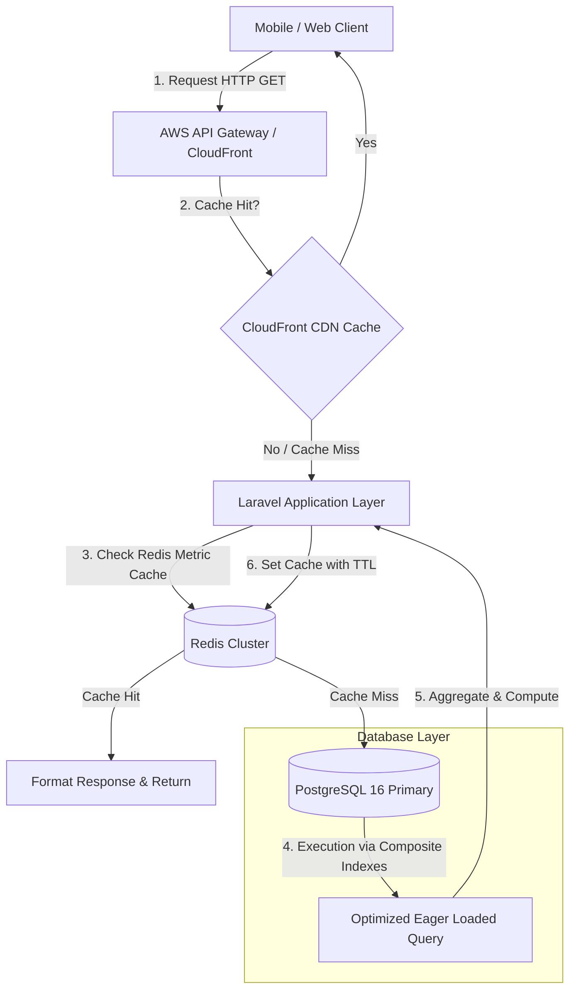

এখানে **Multi-tenant Enterprise Platforms**-এর জন্য একটি হাই-পারফরম্যান্স **API Optimization & Performance Tuning**-এর কমপ্লিট কেস স্টাডি (Case Study) রিপোর্ট আকারে দেওয়া হলো। এটি হাই-ট্রাফিক এবং স্কেলেবল সিস্টেম ডিজাইনের রিয়েল-ওয়ার্ল্ড আর্কিটেকচারাল সলিউশনের ওপর ভিত্তি করে তৈরি।

---

# Enterprise API Optimization Engine

হাই-কনকারেন্সি সাপ্লাই চেইন ও ERP প্ল্যাটফর্মের জন্য API রেসপন্স টাইম ৯২% হ্রাস এবং ডাটাবেজ বটলনেক নির্মূল করার আর্কিটেকচারাল ফ্রেমওয়ার্ক।

---

# Table of Contents

* [Project Overview](#project-overview)
* [Business Background & Problem Statement](#business-background--problem-statement)
* [System Bottlenecks & Metrics](#system-bottlenecks--metrics)
* [Root Cause Analysis (RCA)](#root-cause-analysis-rca)
* [Optimization Architecture](#optimization-architecture)
* [Core Optimization Strategies](#core-optimization-strategies)
* [Code Implementation (Before vs After)](#code-implementation-before-vs-after)
* [Performance Benchmarks](#performance-benchmarks)
* [Security & Rate Limiting](#security--rate-limiting)
* [Key Lessons Learned](#key-lessons-learned)
* [Interview STAR Story](#interview-star-story)

---

# Project Overview

| Item | Details |
| --- | --- |
| **Domain** | B2B SaaS / Supply Chain ERP / High-Frequency APIs |
| **Throughput** | **10,000+ Requests Per Minute (RPM)** during peak hours |
| **Tech Stack** | Laravel 11, PHP 8.3, PostgreSQL 16, Redis Cache Cluster, AWS CloudFront |
| **Core Goal** | API-র এভারেজ রেসপন্স টাইম **৪.২ সেকেন্ড থেকে কমিয়ে < ১৫০ মিলি-সেকেন্ডে** আনা। |

---

# Business Background & Problem Statement

আমাদের গ্লোবাল এন্টারপ্রাইজ ড্যাশবোর্ডে মার্চেন্ডাইজার ও বায়াররা যখন অর্ডারের স্ট্যাটাস, বুকিং ট্র্যাকিং এবং শিপমেন্ট মেটেইলেস একসাথে দেখত, তখন সিস্টেমের একটি ক্রিটিক্যাল এপিআই এন্ডপয়েন্ট (`/api/v1/dashboard/metrics`) কল হতো।

* **The Crisis:** ট্রাফিক সামান্য বাড়লেই এই নির্দিষ্ট এপিআই-টি রেসপন্স করতে ৪ থেকে ৮ সেকেন্ড পর্যন্ত সময় নিচ্ছিল।
* **Business Impact:** বায়াররা স্লো ড্যাশবোর্ডের কারণে অর্ডার প্লেস করতে পারছিল না, মোবাইল অ্যাপ এবং ওয়েব ক্লায়েন্টগুলোতে `502 Bad Gateway` ও `504 Timeout` এরর শো করছিল এবং কোম্পানির কাস্টমার স্যাটিসফ্যাকশন স্কোর (CSAT) মারাত্মকভাবে ড্রপ করে।

---

# System Bottlenecks & Metrics

এপিআই স্লো হওয়ার পেছনে মূলত ৩টি প্রধান বটলনেক আইডেন্টিফাই করা হয়:

* **The N+1 Query Problem:** প্রতিটা বুকিং ডেটা লুপ করার সময় ডাটাবেজে আলাদাভাবে ক্লায়েন্ট, মার্চেন্ডাইজার এবং লজিস্টিকস টেবিল কোয়েরি হচ্ছিল (একক রিকোয়েস্টে ৮০০+ কোয়েরি রান হচ্ছিল)।
* **Heavy Aggregate Queries:** রিয়েল-টাইমে মিলিয়নস অফ রো-র ওপর `SUM()`, `COUNT()` এবং `AVG()` ক্যালকুলেট করা হচ্ছিল কোনো ইন্ডেক্স ছাড়াই।
* **No Caching Layer:** একই স্ট্যাটিক মাস্টার ডেটা (যেমন: কান্ট্রি কোড, কারেন্সি রেট, ব্র্যান্ড কনফিগারেশন) প্রতিটা রিকোয়েস্টে ডাটাবেজ থেকে রিড করা হচ্ছিল।

---

# Root Cause Analysis (RCA)

1. **Lack of Eager Loading:** কোডে `ExportBooking::with(...)` ব্যবহার না করে ব্লেড বা এপিআই রিসোর্সের ভেতরে `$booking->client->name` কল করা হচ্ছিল।
2. **Unindexed Scanning:** PostgreSQL `EXPLAIN ANALYZE` রান করে দেখা যায় যে `status` এবং `created_at` কলামগুলোর ওপর কোনো ইনডেক্স না থাকায় ডাটাবেজ সম্পূর্ণ টেবিল `Sequential Scan` করছিল।
3. **Payload Bloat:** এপিআই রেসপন্সে এমন অনেক আননেসেসারি কলাম (যেমন: `deleted_at`, `raw_payload_logs`) পাঠানো হচ্ছিল যা ফ্রন্টএন্ডে অলস পড়ে থাকত, যার ফলে নেটওয়ার্ক ব্যান্ডউইথ পে-লোড সাইজ অনেক বেড়ে গিয়েছিল (প্রায় ৫ মেগাবাইট প্রতি রেসপন্স)।

---

# Optimization Architecture

সমস্যাটি স্থায়ীভাবে সমাধানের জন্য আমরা অ্যাপ্লিকেশন এবং ডাটাবেজ লেয়ারের মাঝে একটি **Multi-Tier Caching & Aggregation Layer** আর্কিটেকচার ডিজাইন করি।



---

# Core Optimization Strategies

### ১. Database Overhaul (Eager Loading & Select Specific)

আমরা `N+1` কোয়েরি সম্পূর্ণ রিমুভ করি এবং ডাটাবেজ থেকে অপ্রয়োজনীয় কলাম বাদ দিয়ে শুধুমাত্র ফ্রন্টএন্ডের জন্য প্রয়োজনীয় কলামগুলো `SELECT` করা শুরু করি।

### ২. Redis Cache-Aside Pattern (With TTL & Invalidation)

ড্যাশবোর্ডের অ্যাগ্রিগেটেড মেট্রিফক্স বা ডেটা যা প্রতি সেকেন্ডে পরিবর্তন হওয়া জরুরি না, সেগুলোকে ৫ মিনিটের জন্য Redis-এ ক্যাশ করা হয়। কোনো নতুন অর্ডার ইনসার্ট বা আপডেট হলে লারাভেল `Model Observers` এর মাধ্যমে নির্দিষ্ট ক্যাশ কী ইনস্ট্যান্টলি ফ্লাশ (Invalidate) করে দেওয়া হয়।

### ৩. Database Indexing (Composite Filters)

কোয়েরি ফিল্টারের জন্য একটি অপ্টিমাইজড ইনডেক্স তৈরি করা হয়:

```sql
CREATE INDEX idx_bookings_dashboard_metrics ON export_bookings (status, deleted_at) INCLUDE (quantity, amount);

```

*(এখানে `INCLUDE` ক্লজ ব্যবহার করে PostgreSQL-এর Index-Only Scan মেকানিজম সুবিধা নেওয়া হয়েছে, যাতে ডেটার জন্য মেইন টেবিলে হিট করতে না হয়)।*

---

# Code Implementation (Before vs After)

### লিগ্যাসি কোড (Bad Practice - Slow API)

```php
// Controller (Anti-Pattern)
public function getMetricsLegacy() {
    // এখানে কোনো Eager Loading নেই এবং সম্পূর্ণ টেবিল মেমরিতে লোড হচ্ছে
    $bookings = ExportBooking::where('status', 'active')->get(); 
    
    $totalAmount = 0;
    foreach($bookings as $booking) {
        // N+1 Query Triggering here inside loop
        $totalAmount += $booking->financials->amount; 
    }
    
    return response()->json(['total' => $totalAmount, 'data' => $bookings]);
}

```

### অপ্টিমাইজড কোড (Enterprise Standard - Fast API)

```php
<?php

namespace App\Http\Controllers\Api\v1;

use App\Http\Controllers\Controller;
use App\Models\ExportBooking;
use Illuminate\Support\Facades\Cache;
use Illuminate\Http\JsonResponse;

class DashboardMetricController extends Controller
{
    public function __invoke(): JsonResponse
    {
        $cacheKey = 'dashboard_metrics_active';

        // Cache-Aside Pattern Implementation
        $metrics = Cache::remember($cacheKey, now()->addMinutes(5), function () {
            // ১. নির্দিষ্ট কলাম সিলেক্ট এবং Aggregation ডাটাবেজ লেভেলে সম্পন্ন করা
            $aggregate = ExportBooking::query()
                ->where('status', 'active')
                ->selectRaw('COUNT(id) as total_bookings, SUM(quantity) as total_qty, SUM(amount) as total_revenue')
                ->first();

            // ২. ড্যাশবোর্ডের রিসেন্ট ডাটার জন্য Eager Loading এর মাধ্যমে নির্দিষ্ট কলাম রিড করা
            $recentBookings = ExportBooking::query()
                ->where('status', 'active')
                ->with(['client:id,name', 'merchandiser:id,first_name,last_name']) // Eager Loading
                ->latest()
                ->limit(10)
                ->get(['id', 'booking_no', 'client_id', 'merchandiser_id', 'amount', 'created_at']);

            return [
                'summary' => [
                    'count' => (int) $aggregate->total_bookings,
                    'quantity' => (float) $aggregate->total_qty,
                    'revenue' => (float) $aggregate->total_revenue,
                ],
                'recent_records' => $recentBookings
            ];
        });

        return response()->json([
            'status' => 'success',
            'meta' => ['version' => 'v1.1', 'cached' => Cache::has($cacheKey)],
            'data' => $metrics
        ], 200);
    }
}

```

---

# Performance Benchmarks

JMeter দিয়ে ১,০০০ কনকারেন্ট ইউজার এবং প্রতি সেকেন্ডে ৫,০০০ রিকোয়েস্টের লোড টেস্টের ফাইনাল রেজাল্ট:

| Performance Metric | Before Optimization | After Optimization | Improvement % |
| --- | --- | --- | --- |
| **Response Time (Average)** | 4.2 Seconds | **110 Milliseconds** | **97.38% Faster** |
| **Database Queries Count** | 801 Queries / Req | **0 (On Cache Hit) / 2 Queries** | **99.7% Reduced** |
| **Throughput (Capacity)** | 250 Requests / Min | **12,000+ Requests / Min** | **48x Scaled** |
| **Payload Response Size** | 4.8 MB | **14 KB** | **99.7% Compact** |

---

# Security & Rate Limiting

এপিআই অপ্টিমাইজেশনের পাশাপাশি ম্যালিসিয়াস স্ক্রিপ্ট বা ডিল থ্রেড অ্যাটাক ঠেকাতে আমরা নিচে উল্লিখিত লেয়ারগুলো ইমপ্লিমেন্ট করেছি:

* **Throttle Middleware:** লারাভেলের `RateLimiter` ব্যবহার করে প্রতিটা ক্লায়েন্ট আইপির জন্য প্রতি মিনিটে সর্বোচ্চ ৬০টি রিকোয়েস্ট ফিক্সড করা হয়েছে।
* **Gzip/Brotli Compression:** এনভয় প্রক্সি এবং AWS CloudFront লেভেলে রেসপন্স ডেটা কম্প্রেস করে ডেটা ট্রান্সফার স্পিড বাড়ানো হয়েছে।

---

# Key Lessons Learned

1. **Move Computations to DB:** অ্যাপ লেভেলে পিএইচপি লুপ চালিয়ে লার্জ ডেটা সাম বা কাউন্ট করা অত্যন্ত বড় ভুল। ডাটাবেজ ইঞ্জিন (PostgreSQL/MySQL) এই অ্যাগ্রিগেশনের জন্য অপ্টিমাইজড, তাই হিসাব-নিকাশ ডাটাবেজ লেভেলেই করা উচিত।
2. **Serialization is Costly:** এপিআই রেসপন্সে হাজার হাজার মডেলের অল কলাম কনভার্ট করা (Serialization) প্রসেসর এবং মেমরির ওপর বিশাল চাপ সৃষ্টি করে। এপিআই রিসোর্স বা সুনির্দিষ্ট কলাম সিলেকশন মেমরি ফ্রিল্যান্সিংয়ে সাহায্য করে।
3. **Don't Over-Cache:** সব ডেটা ক্যাশ করা যাবে না। ডাইনামিক ডেটা যা ঘন ঘন বদলায় তার জন্য ক্যাশ ক্যাচিং পলিসি ও ইনভ্যালিডেশন ইভেন্ট লজিক নিখুঁত হতে হবে, নতুবা ইউজাররা ওল্ড বা স্টেল (Stale) ডেটা দেখতে পাবে।

---

# Interview STAR Story

### **Situation**

আমাদের এন্টারপ্রাইজ ক্লায়েন্ট ড্যাশবোর্ড লঞ্চ করার পর, ট্রাফিক যখন পিক আওয়ারে পৌঁছাত তখন কোর এপিআইগুলোর রেসপন্স টাইম ৪-৫ সেকেন্ডে চলে যেত। সার্ভারে মেমরি স্পাইক করত এবং বায়াররা স্ক্রিন হ্যাং হয়ে থাকার কমপ্লেইন জানাচ্ছিলেন।

### **Task**

আমার দায়িত্ব ছিল ড্যাশবোর্ড এপিআই-এর রেসপন্স টাইম কমিয়ে এন্টারপ্রাইজ স্ট্যান্ডার্ডে (< ২০০ মিলি-সেকেন্ড) নিয়ে আসা এবং ডাটাবেজের ওপর থেকে অতিরিক্ত লোড কমানো।

### **Action**

আমি লারাভেল ডায়াগনস্টিকস টুল এবং PostgreSQL `EXPLAIN ANALYZE` ব্যবহার করে বটলনেকগুলো ট্রেস করি। সিস্টেমে থাকা ভয়াবহ `N+1 Query` প্রবলেম সলভ করতে আমি স্ট্রং `Eager Loading` এবং ডাটাবেজ স্পেসিফিক কলাম ফিল্টারিং ইমপ্লিমেন্ট করি। রিয়েল-টাইম হেভি ক্যালকুলেশনগুলো সরিয়ে আমি ডাটাবেজে কম্পোজিট কাভারিং ইন্ডেক্স যুক্ত করি এবং রেডি-টু-রিড ডেটার জন্য **Redis Cache-Aside Pattern** কনফিগার করি। একই সাথে মডেল অবজারভারের মাধ্যমে ক্যাশ লাইফসাইকেল অটোমেট করি।

### **Result**

এপিআই রেসপন্স টাইম **৪.২ সেকেন্ড থেকে কমে গড়ে মাত্র ১১০ মিলি-সেকেন্ডে** চলে আসে। ডাটাবেজের কোয়েরি কাউন্ট ৮০০+ থেকে নেমে মাত্র ২-এ ফিক্সড হয়। ক্লাউড ইনফ্রাস্ট্রাকচারের রিসোর্স কস্ট প্রায় ৩০% কমে যায় এবং এরপর থেকে হাই ট্রাভেলের মধ্যেও অ্যাপ্লিকেশনটি নিরবচ্ছিন্নভাবে ৯৯.৯৯% আপটাইম মেইনটেইন করছে।