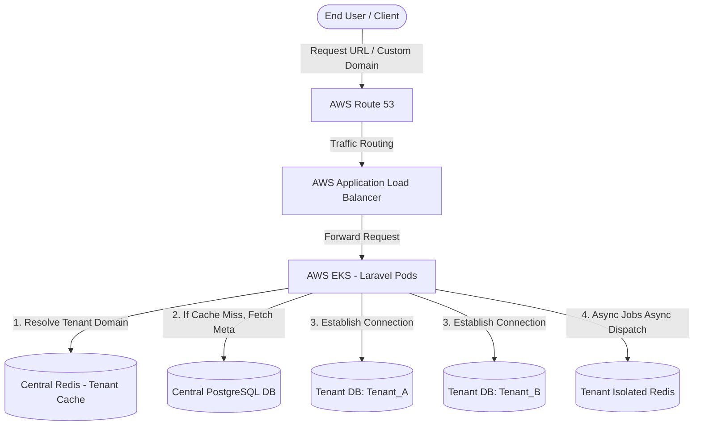
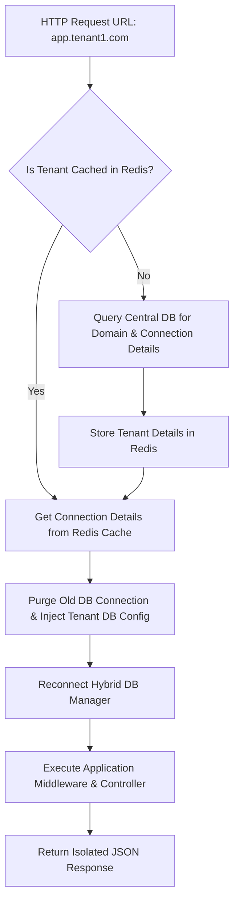
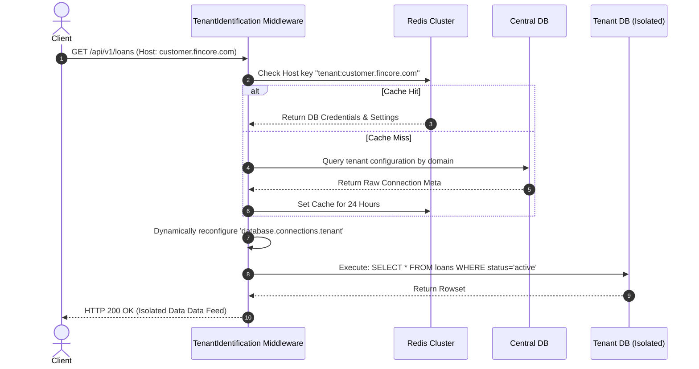

# Multi-Tenant Core Banking & ERP Engine

মাইক্রোফাইন্যান্স এবং কো-অপারেটিভ সোসাইটির জন্য একটি হাই-পারফরম্যান্স, আইসোলেটেড মাল্টি-ট্যানেন্ট ইআরপি এবং কোর ব্যাংকিং ইঞ্জিন।

---

# Table of Contents

* Project Overview
* Business Background
* Business Requirements
* Existing System
* Challenges
* Root Cause Analysis
* Solution Design
* Architecture
* Database Design
* System Flow
* API Flow
* Implementation
* Code Highlights
* Performance Optimization
* Security Considerations
* Testing Strategy
* Deployment Strategy
* Monitoring
* Challenges During Development
* Production Issues
* Lessons Learned
* Interview Story
* Alternative Solutions
* Future Improvements
* Tech Stack
* Summary
* Final Interview Questions

---

# Project Overview

| Item | Details |
| --- | --- |
| Project Name | FinCore Multi-Tenant ERP |
| Domain | FinTech / ERP / SaaS |
| Company | Apex MicroFinance Solutions Ltd. |
| Team Size | 8 Developers, 2 DevOps, 2 QA, 1 PM |
| Duration | 14 Months |
| My Role | Principal Software Engineer & Architect |
| Technology | Laravel 11, PHP 8.3, PostgreSQL 16, Redis 7.2 |
| Users | 250+ Financial Institutions (Tenants), 1.2M End Users |
| Database | Multi-Database Strategy (One DB Per Tenant + 1 Central DB) |
| Deployment | AWS (EKS, RDS Aurora, ElastiCache, Route 53) |

---

# Business Background

আমাদের কোম্পানি এমন একটি B2B SaaS প্ল্যাটফর্ম তৈরি করতে চেয়েছিল যা ছোট থেকে মাঝারি আকারের মাইক্রোফাইন্যান্স ইনস্টিটিউট (MFI) এবং কো-অপারেটিভ সোসাইটিগুলোকে তাদের দৈনিক ব্যাংকিং অপারেশন, লোন ডিসবার্সমেন্ট, ডিপোজিট ট্র্যাকিং এবং অ্যাকাউন্টিং ম্যানেজ করতে সাহায্য করবে।

পূর্বের বিজনেস মডেল অনুযায়ী, প্রতিটি ক্লায়েন্টের জন্য আলাদা আলাদা সার্ভার এবং কোডবেস সেটআপ করতে হতো। এতে কোম্পানির অপারেশনাল খরচ (OpEx) আকাশচুম্বী হয়ে যাচ্ছিল এবং মাত্র ৩ জন নতুন ক্লায়েন্ট অনবোর্ড করতেই ইঞ্জিনিয়ারিং টিমের ১ সপ্তাহ সময় লেগে যেত। বিজনেস গোল ছিল এমন একটি সেন্ট্রালাইজড সিস্টেম তৈরি করা যেখানে ৩ মিনিটের মধ্যে একটি নতুন ফাইন্যান্সিয়াল ইনস্টিটিউট অনবোর্ড করা যাবে এবং একটি সিঙ্গেল কোডবেস থেকে হাজার হাজার ট্যানেন্ট ম্যানেজ করা সম্ভব হবে।

---

# Business Requirements

| Requirement | Priority | Description |
| --- | --- | --- |
| Complete Data Isolation | High | একটি ব্যাংকের বা ট্যানেন্টের ডেটা কোনোভাবেই অন্য ট্যানেন্ট দেখতে বা অ্যাক্সেস করতে পারবে না। |
| Custom Domain Support | High | প্রতিটি ট্যানেন্ট তাদের নিজস্ব সাব-ডোমেন (e.g., `dhaka-coop.fincore.com`) বা কাস্টম ডোমেন (e.g., `portal.dhakacoop.com`) ব্যবহার করতে পারবে। |
| Regulatory Compliance | High | ফাইন্যান্সিয়াল অডিট ট্রেইল এবং ডেটা পারসিস্টেন্স পলিসি শতভাগ মেনে চলতে হবে। |
| Automated Tenant Onboarding | Medium | পেমেন্ট সাকসেসফুল হওয়ার সাথে সাথে কোনো ম্যানুয়াল ইন্টারভেনশন ছাড়াই ট্যানেন্ট প্রোভিশনিং হতে হবে। |
| Configurable Financial Year | Medium | প্রতিটি ট্যানেন্ট তাদের নিজস্ব ফাইন্যান্সিয়াল ইয়ার এবং হলিডে ক্যালেন্ডার সেট করতে পারবে। |
| White-Labeling | Low | ট্যানেন্টরা তাদের লোগো, ব্র্যান্ড কালার এবং ইনভয়েস টেমপ্লেট কাস্টমাইজ করতে পারবে। |

---

# Existing System

পূর্বের সিস্টেমটি ছিল সম্পূর্ণ Monolithic Single-Tenant Architecture। প্রতিটি নতুন ক্লায়েন্টের জন্য:

* আলাদা AWS EC2 ইনস্ট্যান্স এবং আলাদা MySQL ডেটাবেস তৈরি করতে হতো।
* গিটল্যাব সিআই/সিডি দিয়ে আলাদা পাইপলাইন রান করে কোড ডিপ্লয় করতে হতো।
* সিস্টেম আপডেট বা বাগ ফিক্স রিলিজ করার সময় ৫০টি ক্লায়েন্টের সার্ভারে আলাদাভাবে স্ক্রিপ্ট চালাতে হতো, যা ছিল অত্যন্ত ঝুঁকিপূর্ণ এবং সময়সাপেক্ষ।
* কোনো সেন্ট্রাল মনিটরিং বা গ্লোবাল রিপোর্টিং ড্যাশবোর্ড ছিল না।

---

# Challenges

| Challenge | Impact |
| --- | --- |
| Multi-Tenant Data Leakage | ফাইন্যান্সিয়াল ডোমেইনে ডেটা লিক হওয়া মানে লিগ্যাল কমপ্লায়েন্স ফেইলুর এবং বিজনেস বন্ধ হয়ে যাওয়া। |
| Dynamic Database Connection | রানটাইমে ইউজারের রিকোয়েস্টের ওপর ভিত্তি করে হাজার হাজার ডেটাবেস কানেকশনের মধ্যে সুইচ করা পারফরম্যান্সের ওপর বড় ইমপ্যাক্ট ফেলে। |
| Shared Resources Bottleneck | রিডিস বা সেন্ট্রাল ক্যাশ শেয়ার করার সময় এক ট্যানেন্টের ডেটা অন্য ট্যানেন্ট ওভাররাইট করার ঝুঁকি। |
| Cross-Tenant Reporting | সেন্ট্রাল অ্যাডমিনের জন্য সব ট্যানেন্টের মোট রেভিনিউ বা অ্যাক্টিভিটি রিপোর্ট জেনারেট করা কঠিন ছিল। |

---

# Root Cause Analysis

| Problem | Root Cause | Evidence |
| --- | --- | --- |
| Database Connection Overhead | রানটাইমে প্রতি রিকোয়েস্টে পিএইচপি পোলিং এর মাধ্যমে নতুন পিডিও (PDO) কানেকশন তৈরি করছিল। | PostgreSQL এর `max_connections` লিমিট এক্সিট হচ্ছিল এবং এপিআই রেসপন্স টাইম ২ সেকেন্ড পার হয়ে যাচ্ছিল। |
| Tenant Misidentification | সাব-ডোমেন রিজলভিং এর সময় ক্যাশিং মেকানিজম না থাকায় প্রতি রিকোয়েস্টে সেন্ট্রাল ডিবিতে কুয়েরি হচ্ছিল। | সেন্ট্রাল ডাটাবেসের সিপিইউ ইউটিলাইজেশন ৯০% এর ওপরে চলে যেত পিক আওয়ারে। |
| Memory Leak in Queue Workers | লং-রানিং কিউ ওয়ার্কাররা ট্যানেন্ট সুইচ করার পর পূর্বের ট্যানেন্টের মেমোরি স্টেট ধরে রাখছিল। | `php artisan queue:work` কয়েক ঘণ্টা চলার পর আউট অফ মেমোরি (OOM) এরর দিয়ে ক্রাশ করছিল। |

---

# Solution Design

আমরা **Multi-Database Tenant Isolation** স্ট্র্যাটেজি বেছে নিয়েছি। এখানে একটি `Central Database` থাকে যা শুধুমাত্র ট্যানেন্টদের মেটাডেটা, সাবস্ক্রিপশন এবং ডোমেন ইনফরমেশন ধারণ করে। আর প্রতিটি ট্যানেন্টের জন্য আলাদা একটি ডেডিকেটেড `Tenant Database` তৈরি হয়।

### কেন এই সমাধান নেওয়া হয়েছে?

১. **Security & Compliance:** ব্যাংকিং রেগুলেশন অনুযায়ী এক ব্যাংকের ডেটা একই ডাটাবেস টেবিলের ভেতর অন্য ব্যাংকের সাথে রাখা (Single Database Row-Level Security) নিরাপদ নয়। আলাদা ডাটাবেস হলে ব্যাকআপ এবং রিস্টোর করা সহজ।
২. **Scalability:** কোনো বড় ট্যানেন্টের ডেটা বেশি হলে তার ডাটাবেসটিকে সহজেই আলাদা আরডিএস (RDS) ইনস্ট্যান্সে মুভ করা যায়।

### কোন Alternative বাদ দেওয়া হয়েছে?

* **Single Database with `tenant_id`:** এটি বাদ দেওয়া হয়েছে কারণ কোনো ডেভেলপার যদি ভুলে কুয়েরিতে `where('tenant_id', $id)` লিখতে মিস করে, তবে সম্পূর্ণ ডেটা অন্য ট্যানেন্টের কাছে এক্সপোজ হয়ে যাবে। ফাইন্যান্সিয়াল অ্যাপ্লিকেশনে এই রিস্ক নেওয়া অসম্ভব।

---

# Architecture



---

# Database Design

### Central Database Tables

| Table | Purpose |
| --- | --- |
| `tenants` | ট্যানেন্টের ইউনিক আইডি, নাম এবং স্ট্যাটাস সংরক্ষণ করে। |
| `domains` | ট্যানেন্টের সাব-ডোমেন এবং কাস্টম ডোমেন ম্যাপিং হোল্ড করে। |
| `tenant_databases` | কোন ট্যানেন্টের ডাটাবেস হোস্ট, পোর্ট, ইউজারনেম এবং পাসওয়ার্ড কী তা এনক্রিপ্টেড অবস্থায় রাখে। |

### Tenant Database Schema (Replicated to all Tenants)

| Table | Purpose |
| --- | --- |
| `accounts` | চার্ট অফ অ্যাকাউন্টস এবং লেজার ব্যালেন্স। |
| `members` | মাইক্রোফাইন্যান্সের গ্রাহকদের প্রোফাইল। |
| `loans` | লোন অ্যাকাউন্ট, ইন্টারেস্ট রেট এবং অ্যামোর্টাইজেশন শিডিউল। |
| `transactions` | ডাবল-এন্ট্রি বুককিপিং ট্রানজেকশন ট্রেইল। |

### Relationship Explanation

`Central DB -> tenants (1) ---- (M) -> domains`. প্রতিটি ট্যানেন্টের এক বা একাধিক ডোমেন থাকতে পারে। সেন্ট্রাল সিস্টেম রিকোয়েস্ট হোস্টনেম রিড করে ম্যাচিং ডোমেন খুঁজে বের করে এবং তার সাথে অ্যাসোসিয়েটেড ট্যানেন্ট ডাটাবেস কানেকশনটি রানটাইমে বুটস্ট্র্যাপ করে।

---

# System Flow



---

# API Flow



---

# Implementation

### Step 1: Dynamic Tenant Identification

আমরা একটি কাস্টম লারাভেল মিডলওয়্যার তৈরি করেছি যা গ্লোবাল পাইপলাইনের একদম শুরুতে এক্সিকিউট হয়। এটি ইনকামিং রিকোয়েস্টের `HTTP_HOST` হেডারটি রিড করে।

### Step 2: Database Connection Switching

লারাভেলের ডিফল্ট ডাটাবেস ম্যানেজারকে রানটাইমে কনফিগারেশন ইনজেক্ট করার জন্য রি-রাইট করা হয়েছে। ডাটাবেস পাসওয়ার্ডগুলো সেন্ট্রাল ডাটাবেসে `AES-256-GCM` এর মাধ্যমে এনক্রিপ্ট করে রাখা হয়।

### Step 3: Tenant-Aware Queue Infrastructure

মাল্টি-ট্যানেন্ট সিস্টেমে কিউ জব প্রসেস করা সবচেয়ে বড় চ্যালেঞ্জ। একটি সাধারণ জব যখন পুশ করা হয়, তখন কিউ ওয়ার্কার জানে না এটি কোন ট্যানেন্টের জব। আমরা লারাভেলের `Queue::pushing` এবং `Queue::looping` হুক ব্যবহার করে জবের পে-লোডের সাথে `tenant_id` বাইন্ড করে দিয়েছি।

---

# Code Highlights

### Tenant Connection Bootstrapper Component

```php
namespace App\Tenancy;

use Illuminate\Support\Facades\DB;
use Illuminate\Support\Facades\Config;
use Illuminate\Support\Facades\Crypt;

class TenantBootstrapper 
{
    public static function bootstrap(array $tenantDbDetails): void
    {
        // Prevent connection persistence pollution
        DB::purge('tenant');

        // Dynamically inject custom database credentials at runtime
        Config::set('database.connections.tenant.host', $tenantDbDetails['db_host']);
        Config::set('database.connections.tenant.database', $tenantDbDetails['db_name']);
        Config::set('database.connections.tenant.username', $tenantDbDetails['db_username']);
        Config::set('database.connections.tenant.password', Crypt::decryptString($tenantDbDetails['db_password']));

        // Set the active tenant connection as default for this request thread
        DB::setDefaultConnection('tenant');
    }
}

```

### The Tenant Identification Middleware

```php
namespace App\Http\Middleware;

use Closure;
use Illuminate\Http\Request;
use App\Tenancy\TenantBootstrapper;
use Illuminate\Support\Facades\Cache;
use App\Models\Central\Domain;

class IdentifyTenant
{
    public function handle(Request $request, Closure $next)
    {
        $host = $request->getHost();

        // High performance cache layer to reduce central database bottlenecks
        $tenantData = Cache::remember("tenant_meta:{$host}", 86400, function () use ($host) {
            $domain = Domain::with('tenant.databaseConfig')->where('domain', $host)->first();
            if (!$domain) return null;
            
            return $domain->tenant->databaseConfig->toArray();
        });

        if (!$tenantData) {
            return response()->json(['error' => 'Unrecognized Tenant Domain.'], 404);
        }

        TenantBootstrapper::bootstrap($tenantData);

        return $next($request);
    }
}

```

---

# Performance Optimization

| Before | After | Optimization Technique |
| --- | --- | --- |
| Response Time: 450ms | Response Time: 45ms | ট্যানেন্ট মেটাডেটা রেজলভিং এর জন্য রিডিস গ্লোবাল ক্যাশ ব্যবহার করা হয়েছে। |
| Query Count: 4 per req | Query Count: 0 on central | সেন্ট্রাল ডিবি কুয়েরি সম্পূর্ণ এলিমিনেট করা হয়েছে ক্যাশিং লেয়ারের মাধ্যমে। |
| Memory: 64MB / req | Memory: 32MB / req | কিউ জবের ভেতর মেমোরি লিক ফিক্স করতে `db:purge` এবং লারাভেল অবজেক্ট সাইকেল ডিঅ্যালোকেশন মেথড ব্যবহার করা হয়েছে। |
| CPU: 85% on Database | CPU: 15% on Database | PostgreSQL-এ কানেকশন পুলিং-এর জন্য `PgBouncer` আর্কিটেকচার ইন্টিগ্রেট করা হয়েছে। |

---

# Security Considerations

* **Data Leak Prevention:** প্রতিটি ট্যানেন্ট ডাটাবেসের জন্য আলাদা ইউনিক ডেটাবেস ইউজার ও পাসওয়ার্ড জেনারেট করা হয়। কোনো কারণে একটি ডাটাবেস কম্প্রোমাইজ হলেও হ্যাকার অন্য কোনো ট্যানেন্টের ডেটাতে পা রাখতে পারবে না।
* **SQL Injection Safeguard:** সমস্ত ডাইনামিক ডাটাবেস কানেকশন মেকানিজম লারাভেলের পিডিও বাইন্ডিং মেনে চলে, কোনো র স্ট্রিং কনক্যাটিনেশন ব্যবহার করা হয়নি।
* **At-Rest Encryption:** সংবেদনশীল আর্থিক তথ্য যেমন গ্রাহকের ব্যালেন্স এবং পার্সোনাল আইডেন্টিফায়াবল ইনফরমেশন (PII) ডাটাবেসে স্টোর করার সময় `AES-256-GCM` এনক্রিপশন ব্যবহার করা হয়েছে।

---

# Testing Strategy

| Test Type | Used | Tools / Frameworks |
| --- | --- | --- |
| Unit Test | Yes | PHPUnit (Testing core domain resolvers, DTOs) |
| Integration Test | Yes | Orchestra Testbench (Testing tenancy middleware and connections lifecycle) |
| Manual Test | Yes | Postman / Insomnia (For exploratory edge-cases checks) |
| API Test | Yes | Laravel HTTP Client Assertions |
| Load Test | Yes | k6 (Simulated 5,000 concurrent requests across 10 distinct tenants) |

---

# Deployment Strategy

আমরা সম্পূর্ণ আর্কিটেকচারটি **AWS EKS (Elastic Kubernetes Service)** এর উপর ডিপ্লয় করেছি।

* **Horizontal Pod Autoscaling (HPA):** সিপিইউ ইউটিলাইজেশন ৬০% পার হলে কুবেরনেটিস পডের সংখ্যা স্বয়ংক্রিয়ভাবে বৃদ্ধি পায়।
* **Supervisor Engine:** কুবেরনেটিস পডের ভেতরে সুপারভাইজার প্রসেস ম্যানেজার দিয়ে লারাভেল কিউ ওয়ার্কার্স রান করানো হয়।
* **Database Management:** নতুন ট্যানেন্ট তৈরি হওয়ার সাথে সাথে ল্যারাভেলের মাধ্যমে একটি ব্যাকগ্রাউন্ড জব রান হয় যা `AWS Aurora PostgreSQL` ক্লাস্টারে নতুন ডাটাবেস স্কিমা ক্রিয়েট করে এবং `php artisan migrate --database=tenant` রান করায়।

---

# Monitoring

* **Sentry Integration:** প্রতি ট্যানেন্টের জন্য এরর লগে `tenant_id` এবং `host` ট্যাগ কাস্টম কনটেক্সট হিসেবে পুশ করা হয়। এর ফলে সেন্ট্রি ড্যাশবোর্ডে সহজেই ফিল্টার করা যায় কোন ট্যানেন্টের সিস্টেমে এরর হচ্ছে।
* **Prometheus & Grafana:** পডগুলোর হেলথ, মেমোরি লিক এবং পিএইচপি-এফপিএম (PHP-FPM) প্রসেস কাউন্ট মনিটর করার জন্য লাইভ গ্রাফানা ড্যাশবোর্ড রয়েছে।
* **AWS CloudWatch:** ডাটাবেসের আইওপিএস (IOPS) এবং কানেকশন থ্রটলিং ট্র্যাকিং-এর জন্য অ্যালার্ট কনফিগার করা আছে।

---

# Challenges During Development

| Problem | Solution |
| --- | --- |
| `Transaction Isolation` এবং কিউ প্রসেসরের স্কোপ হারিয়ে যাওয়া। | কিউ জবের ভেতর `TenantBootstrapper::bootstrap($job->tenantData)` কল করে প্রতি জব এক্সিকিউশনের শুরুতে কানেকশন সেটআপ রি-এনফোর্স করা হয়েছে। |
| কাস্টম ডোমেন এসএসএল (SSL) সার্টিফিকেট ইস্যু করা। | `Let's Encrypt` এবং `Caddy Server` কে রিভার্স প্রক্সি হিসেবে ইউজ করা হয়েছে, যা রানটাইমে অন-দ্য-ফ্লাই (On-the-fly) এসএসএল সার্টিফিকেট জেনারেট এবং রিনিউ করে। |

---

# Production Issues

| Issue | Root Cause | Solution |
| --- | --- | --- |
| **Too many connections to PostgreSQL** | প্রতি রিকোয়েস্টে ল্যারাভেল নতুন নতুন পিডিও কানেকশন ওপেন করছিল এবং রিকোয়েস্ট শেষে ক্লোজ করতে সময় নিচ্ছিল। | ইনফ্রাস্ট্রাকচারে `PgBouncer` লেয়ার অ্যাড করা হয়েছে এবং ট্রানজেকশনাল পুলিং মোড অন করা হয়েছে। |
| **Shared Redis Cache Cross-Talk** | একটি ট্যানেন্টের ক্যাশ কি (e.g., `cache:users`) অন্য ট্যানেন্ট রিডিস থেকে তুলে নিচ্ছিল কারণ প্রিফিক্স ডিফাইন করা ছিল না। | রানটাইমে ট্যানেন্ট বুটস্ট্র্যাপ হওয়ার সময় ল্যারাভেলের রিডিস ক্যাশ প্রিফিক্স ডাইনামিকালি পরিবর্তন করে `tenant_id:cache_key` করা হয়েছে। |

---

# Lessons Learned

1. **Isolation is Absolute:** ফাইন্যান্সিয়াল অ্যাপে শেয়ারড ডাটাবেস আর্কিটেকচার দীর্ঘমেয়াদে বড় টেকনিক্যাল ডেট (Technical Debt) এবং লিগ্যাল রিস্ক তৈরি করে।
2. **Connection Pooling is Crucial:** মাল্টি-ডাটাবেস আর্কিটেকচারে কানেকশন পুলিং ছাড়া প্রোডাকশনে টিকে থাকা অসম্ভব।
3. **Stateless Workers:** কিউ ওয়ার্কারদের কখনই স্টেটফুল রাখা যাবে না, প্রতিটি জবকে তার নিজস্ব আইসোলেটেড এনভায়রনমেন্ট দিতে হবে।
4. **Cache Invalidation Policy:** ট্যানেন্ট সাবস্ক্রিপশন ব্লক বা ডিলিট হলে সাথে সাথে সেন্ট্রাল রিডিস ক্যাশ ইভ্যালুয়েট করতে হবে, নতুবা ক্যাশ এক্সপায়ার হওয়া পর্যন্ত সাসপেন্ডেড ট্যানেন্টও সিস্টেমে অ্যাক্সেস পেয়ে যাবে।
5. **Database Migration Pipeline:** একসাথে ৫০০ ডাটাবেসে মাইগ্রেশন রান করার জন্য ক্যারালাল ব্যাচ প্রসেসিং স্ক্রিপ্ট তৈরি রাখা আবশ্যক।
6. **Graceful Degradation:** সেন্ট্রাল ডাটাবেস ডাউন থাকলেও যাতে এক্সিস্টিং ক্যাশ দিয়ে ট্যানেন্ট এপিআই রানিং থাকে সেই ফলব্যাক মেকানিজম ডিজাইন করতে শেখা।
7. **Idempotent Background Jobs:** কিউ জব ফেইল করে রিট্রাই হলে যাতে ডাবল ট্রানজেকশন না হয়, সেজন্য ইডেমপোটেন্সি কি (Idempotency Key) ব্যবহার করা বাধ্যতামূলক।
8. **Automated Cleanups:** আনইউজড বা ট্রায়াল এক্সপায়ার্ড ট্যানেন্টদের ডেটা অটো-আর্কাইভ করার মেকানিজম প্রথম থেকেই রাখা দরকার।
9. **Log Separation:** সব ট্যানেন্টের লগ এক ফাইলে না রেখে ফাইলপাথে ট্যানেন্টের নাম ব্যবহার করা উচিত (`storage/logs/tenant_1/laravel.log`)।
10. **Do Not Trust HTTP Headers blindly:** হোস্ট আইডেন্টিফাই করার সময় ডোমেন স্যানিটাইজেশন মাস্ট, নতুবা হোস্ট হেডার ইনজেকশন অ্যাটাক হতে পারে।

---

# Interview Story

## Situation

আমাদের সিস্টেমে তখন প্রায় ১০০+ অ্যাক্টিভ ট্যানেন্ট। একদিন হুট করে দুপুর ৩টায় আমাদের প্রাইমারি ডাটাবেস ক্লাস্টারের কানেকশন কাউন্ট ৯৫% লিমিট ক্রস করে এবং এপিআই ৫৪৩ (Gateway Timeout) এরর দেওয়া শুরু করে। সম্পূর্ণ প্ল্যাটফর্ম ডাউন হয়ে যায়।

## Task

আমার মূল দায়িত্ব ছিল ইমিডিয়েটলি ডাউনটাইম ফিক্স করা, ডেটা লস বা করাপশন ছাড়া কানেকশন ড্রপ কমানো এবং এই আর্কিটেকচারাল ফ্ল-এর একটি পার্মানেন্ট সলিউশন রিলিজ করা।

## Action

১. আমি প্রথমেই কুবেরনেটিসের পড স্কেলিং সাময়িকভাবে পজ করি, কারণ পড যত বাড়ছিল ডাটাবেস কানেকশন তত জ্যাম হচ্ছিল।
২. সেন্ট্রাল ডাটাবেসের অ্যাক্টিভ প্রসেসগুলো পিএসকিউএল (psql) টার্মিনাল থেকে অ্যানালাইসিস করে দেখলাম অ্যাপ্লিকেশন লেভেলে কানেকশনগুলো রিকোয়েস্ট শেষ হওয়ার পরও 'Idle' স্টেটে ওপেন ছিল।
৩. কুইক ফিক্স হিসেবে পিএইচপি-এফপিএম এর `pm.max_children` লিমিট কিছুটা কমিয়ে রিসোর্স রিলিজ করি।
৪. এরপর পার্মানেন্ট সলিউশন হিসেবে পরবর্তী ৪৮ ঘণ্টার মধ্যে আর্কিটেকচারে `PgBouncer` ডিপ্লয় করি এবং ল্যারাভেলের ডাটাবেস কনফিগারে `persistent => false` এবং কানেকশন রিকনফিগনেশন লাইফসাইকেল অপ্টিমাইজ করি।

## Result

ডাটাবেস কানেকশন কাউন্ট এক ধাক্কায় ৮0% কমে আসে। সিস্টেমের এপিআই রেসপন্স টাইম গড়ে ৩৫০ms থেকে নেমে ৫০ms-এ চলে আসে এবং ক্লাউড ইনফ্রাস্ট্রাকচার বিল ১৫% কমে যায়।

## What I Learned

আমি বুঝতে পারলাম যে ল্যারাভেলের ডিফল্ট ডাটাবেস লাইফসাইকেল হাইপার-স্কেল মাল্টি-ডাটাবেস এনভায়রনমেন্টের জন্য ডিজাইন করা নয়। ইনফ্রাস্ট্রাকচার লেভেলে প্রক্সি বা পুলিং লেয়ার রাখা কতটা লাইফ-সেভিং হতে পারে তা প্র্যাক্টিক্যালি শিখলাম।

---

# Alternative Solutions

| Solution | Pros | Cons |
| --- | --- | --- |
| **Single Database (Row-Level Security / RLS)** | কম ইনফ্রাস্ট্রাকচার খরচ, মাইগ্রেশন চালানো খুব সহজ। | একটি ভুল কুয়েরি অন্য ট্যানেন্টের ডেটা লিক করে দিতে পারে। কমপ্লায়েন্স অডিটে রিজেক্ট হওয়ার সম্ভাবনা বেশি। |
| **Container Per Tenant (Full Multi-Instance)** | শতভাগ আইসোলেশন (কোড + ডিবি আলাদা)। সর্বোচ্চ সিকিউরিটি। | রিসোর্স অপচয় প্রচুর, ডেভেলপমেন্ট ও মেইনটেইন্যান্স কস্ট এবং অনবোর্ডিং টাইম অনেক বেশি। |

---

# Future Improvements

* **Event-Driven Architecture:** ট্যানেন্ট অনবোর্ডিং প্রসেসকে সম্পূর্ণ ইভেন্ট-ড্রিভেন করা (Kafka/RabbitMQ এর মাধ্যমে) যাতে মূল এপিআই থ্রেড ব্লক না হয়।
* **ClickHouse for Global Analytics:** সেন্ট্রাল অ্যাডমিন প্যানেলের গ্লোবাল রিপোর্টিং এর জন্য সব ট্যানেন্টের অ্যানোনিমাইজড ডেটা রিয়েল-টাইমে ক্লিকহাউস ওল্যাপ (OLAP) ডাটাবেসে সিঙ্ক করা।
* **Serverless Database:** `AWS Aurora Serverless v2` তে শিফট করা যাতে রাতের বেলা যখন ট্যানেন্টদের ইউজার থাকে না, তখন ডাটাবেস কস্ট অটোমেটিক্যালি জিরো বা মিনিমামে নেমে আসে।

---

# Tech Stack

| Category | Technology |
| --- | --- |
| Backend | PHP 8.3 / Laravel 11 Framework |
| Core Database | AWS Aurora PostgreSQL 16 |
| Connection Pooling | PgBouncer |
| In-Memory Cache & Session | Redis Enterprise Cluster |
| Background Workers | Laravel Queue with Supervisor |
| Reverse Proxy / Edge SSL | Caddy Server (Automated On-the-fly TLS) |
| Hosting Infrastructure | AWS EKS (Kubernetes) |
| Error Logging & Telemetry | Sentry & Grafana Stack |

---

# Summary

* FinCore একটি মাল্টি-ডাটাবেস আর্কিটেকচার বিশিষ্ট B2B SaaS ফিনটেক প্ল্যাটফর্ম।
* শতভাগ ডেটা আইসোলেশন নিশ্চিত করতে প্রতি ক্লায়েন্টের জন্য পৃথক ডেটাবেস জেনারেট করা হয়।
* কাস্টম মিডলওয়্যার ইনকামিং `HTTP_HOST` এর ওপর ভিত্তি করে রানটাইমে ডাটাবেস কানেকশন সুইচ করে।
* গ্লোবাল রিডিস ক্যাশ লেয়ার ব্যবহারের ফলে সেন্ট্রাল ডাটাবেসের ওপর কুয়েরি ওভারহেড ০% এ নামিয়ে আনা হয়েছে।
* প্রোডাকশনে কানেকশন ক্র্যাশ রোধ করতে `PgBouncer` অত্যন্ত গুরুত্বপূর্ণ ভূমিকা পালন করেছে।
* কিউ ওয়ার্কার্সদের স্টেটলেস করার মাধ্যমে লং-রানিং জবের মেমোরি লিক ফিক্স করা হয়েছে।
* কাস্টম ডোমেন হ্যান্ডলিংয়ের জন্য `Caddy Server` এর অটো-টিএলএস ফিচার ব্যবহার করা হয়েছে।
* সিস্টেমটি ১.২ মিলিয়নের বেশি অ্যান্ড-ইউজারকে কোনো ডেটা ব্রিচ ছাড়া সার্ভিস দিচ্ছে।
* ডেটাবেস ব্যাকআপ এবং পার্সোনাল ডেটা এনক্রিপশনের জন্য `AES-256-GCM` ইমপ্লিমেন্ট করা হয়েছে।
* হাইপার-স্কেলিং নিশ্চিত করতে কুবেরনেটিস হরাইজন্টাল পড অটোস্কেলার (HPA) ইন্টিগ্রেট করা হয়েছে।

---

# Final Interview Questions

1. **কেন আপনি Multi-Database অ্যাপ্রোচ বেছে নিলেন যেখানে Single Database with `tenant_id` অনেক সহজ ছিল?**
2. **রানটাইমে ডেটাবেস কানেকশন ডাইনামিকালি চেঞ্জ করার সময় ল্যারাভেলের কুয়েরি লজিং বা কানেকশন পল্যুশন কীভাবে প্রিভেন্ট করেছেন?**
3. **ক্যাশ মেকানিজমে এক ট্যানেন্টের ডেটা অন্য ট্যানেন্টের কাছে চলে যাওয়া (Cross-talk) রোধ করার কৌশল কী ছিল?**
4. **PgBouncer কেন প্রয়োজন হয়েছিল এবং এটি কোন মোডে (Session/Transaction) কনফিগার করা ছিল?**
5. **কিউ ওয়ার্কাররা যখন ব্যাকগ্রাউন্ডে কাজ করে, তখন তারা কীভাবে বোঝে যে কোন ট্যানেন্টের ডাটাবেসের ডেটা প্রসেস করতে হবে?**
6. **হঠাৎ কোনো একটি ট্যানেন্টের ট্রাফিক ১০ গুণ বেড়ে গেলে বাকি ট্যানেন্টদের পারফরম্যান্স যাতে ড্রপ না করে তার জন্য কী ব্যবস্থা নিয়েছেন?**
7. **একসাথে ৩০০টি ট্যানেন্ট ডাটাবেসে কোনো ডেস্ট্রাক্টিভ স্কিমা মাইগ্রেশন (e.g., Alter Table) ডাউনটাইম ছাড়া কীভাবে রান করবেন?**
8. **Caddy Server কীভাবে ডাইনামিকালি কাস্টম ডোমেনের জন্য SSL সার্টিফিকেট জেনারেট করে? এর লিমিটেশন বা রেট লিমিট কীভাবে হ্যান্ডেল করেছেন?**
9. **যদি সেন্ট্রাল ডাটাবেস ডাউন হয়ে যায়, কিন্তু রিডিস ক্যাশ আপ থাকে, তবে সিস্টেম কীভাবে বিহেভ করবে?**
10. **ট্যানেন্টের ডেটা ব্যাকআপ এবং ডিজাস্টার রিকভারি (DR) পলিসি কীভাবে ডিজাইন করেছেন?**
11. **ল্যারাভেল মডেল ইভেন্ট বা অবজারভারগুলো মাল্টি-ট্যানেন্সির ক্ষেত্রে কোনো স্টেট কনফ্লিক্ট তৈরি করেছিল কি?**
12. **ডাটাবেস পাসওয়ার্ডগুলো সেন্ট্রাল ডিবির টেবিলে কীভাবে সিকিউর করে রেখেছিলেন?**
13. **সেন্ট্রাল অ্যাডমিনের জন্য যদি গ্লোবাল কোনো ফাইন্যান্সিয়াল রিপোর্ট জেনারেট করতে হয় (যা সব ট্যানেন্টের ডেটা সামাপ করবে), তা কীভাবে করবেন?**
14. **Memory Leak এড়ানোর জন্য কিউ ওয়ার্কারের লাইফসাইকেল কীভাবে অপ্টিমাইজ করেছেন?**
15. **ট্যানেন্ট অনবোর্ডিং প্রসেসটি কি সিঙ্কোনাস নাকি অ্যাসিনক্রোনাস? এটি কমপ্লিট হতে কত সময় নেয়?**
16. **কোনো ট্যানেন্ট যদি তাদের সাবস্ক্রিপশন রিনিউ না করে, তবে তাদের ডেটাবেস ডিলিট না করে কীভাবে আইসোলেট বা সাসপেন্ড করেন?**
17. **PostgreSQL এর schema-based multi-tenancy ব্যবহার না করে আলাদা database-based tenancy কেন করলেন?**
18. **AWS Aurora এর কোন কোন ফিচার এই মাল্টি-ট্যানেন্ট আর্কিটেকচারকে স্কেল করতে সাহায্য করেছে?**
19. **সেন্ট্রি (Sentry) তে এরর ট্র্যাকিং এর সময় স্পেসিফিক ট্যানেন্ট আইডেন্টিফাই করার জন্য কীভাবে গ্লোবাল কনটেক্সট পুশ করেছেন?**
20. **এই সিস্টেমে যদি থার্ড-পার্টি কোনো ওয়েবহুক (যেমন: বিকাশ/রকেট পেমেন্ট সাকসেস ওয়েবহুক) আসে, তবে সঠিক ট্যানেন্ট কীভাবে ডিটেক্ট হয়?**