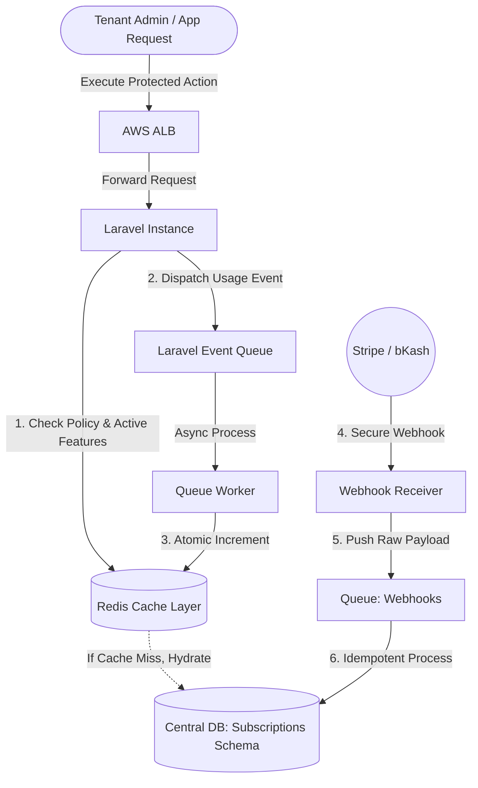
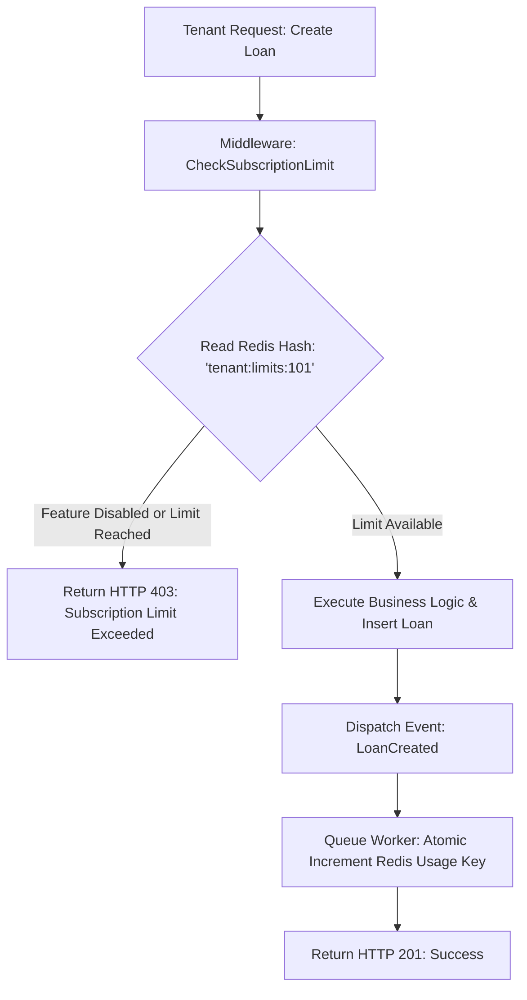
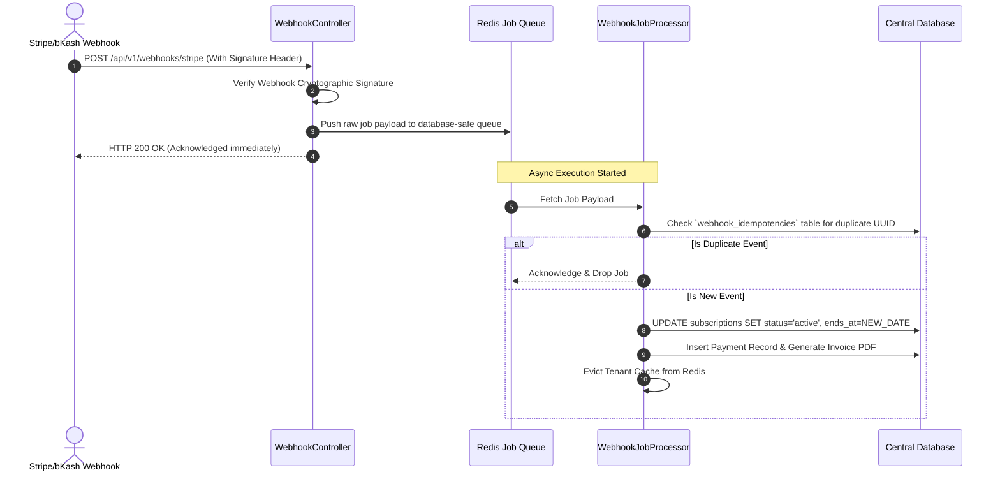

# Subscription Management Engine (SaaS Billing & Metered Usage)

একটি এন্টারপ্রাইজ-গ্রেড, আইসোলেটেড সাবস্ক্রিপশন ম্যানেজমেন্ট এবং মিটারড ইউসেজ বিলিং ইঞ্জিন যা মাল্টি-ট্যানেন্ট ইআরপি ইকোসিস্টেমে রিয়েল-টাইম লাইসেন্সিং, গ্রেস পিরিয়ড এবং থ্রটলিং কন্ট্রোল করে।

---

# Table of Contents

* [Project Overview](#project-overview)
* [Business Background](#business-background)
* [Business Requirements](#business-requirements)
* [Existing System](#existing-system)
* [Challenges](#challenges)
* [Root Cause Analysis](#root-cause-analysis)
* [Solution Design](#solution-design)
* [Architecture](#architecture)
* [Database Design](#database-design)
* [System Flow](#system-flow)
* [API Flow](#api-flow)
* [Implementation](#implementation)
* [Code Highlights](#code-highlights)
* [Performance Optimization](#performance-optimization)
* [Security Considerations](#security-considerations)
* [Testing Strategy](#testing-strategy)
* [Deployment Strategy](#deployment-strategy)
* [Monitoring](#monitoring)
* [Challenges During Development](#challenges-during-development)
* [Production Issues](#production-issues)
* [Lessons Learned](#lessons-learned)
* [Interview Story](#interview-story)
* Alternative Solutions
* Future Improvements
* Tech Stack
* Summary
* Final Interview Questions

---

# Project Overview

| Item | Details |
| --- | --- |
| Project Name | FinCore Subscription & Metered Billing Engine |
| Domain | FinTech / SaaS / Billing / ERP |
| Company | Apex MicroFinance Solutions Ltd. |
| Team Size | 5 Developers, 1 DevOps, 1 QA |
| Duration | 6 Months |
| My Role | Principal Software Engineer & Architect |
| Technology | Laravel 11, PHP 8.3, PostgreSQL 16, Redis 7.2 |
| Users | 250+ Financial Institutions (Tenants), 15,000+ Active Plan Swaps/Month |
| Database | Hybrid Architecture (Central Subscription Schema + Distributed Tenant Metas) |
| Deployment | AWS (EKS, Aurora PostgreSQL, ElastiCache Redis, Stripe/bKash Gateways) |

---

# Business Background

আমাদের মাল্টি-ট্যানেন্ট ফাইন্যান্সিয়াল ERP প্ল্যাটফর্মটি সফলভাবে লঞ্চ করার পর, বিজনেস টিম বিভিন্ন ট্যানেন্টের সাইজ এবং ট্রাফিকের ওপর ভিত্তি করে ডাইনামিক প্রাইসিং মডেল ইন্ট্রোডিউস করার সিদ্ধান্ত নেয়। ছোট কো-অপারেটিভ সোসাইটিগুলোর জন্য কম সাবস্ক্রিপশন ফি এবং বড় মাইক্রোফাইন্যান্স ইনস্টিটিউটগুলোর জন্য ভলিউম-বেসড চার্জিং মডেল অ্যাপ্লাই করা আমাদের মূল লক্ষ্য ছিল।

পূর্বে আমাদের সিস্টেমে ফিক্সড ফ্ল্যাট-রেট মান্থলি বিলিং ছিল। কিন্তু বিজনেস এক্সপ্যানশনের সাথে সাথে গ্রাহকদের ডিমান্ড তৈরি হয় "Pay-as-you-go" বা মিটারড ইউসেজ বিলিং মডেলের (যেমন: প্রতি ১,০০০ লোন অ্যাকাউন্ট ক্রিয়েশনের জন্য কাস্টম চার্জ, বা প্রতি ১০০টি এসএমএস নোটিফিকেশনের জন্য বিলিং)। এছাড়া সাবস্ক্রিপশন এক্সপায়ার হওয়ার পর অটোমেটিক ট্যানেন্ট সার্ভিস থ্রটলিং, গ্রেস পিরিয়ড ম্যানেজমেন্ট এবং লোকাল ও গ্লোবাল পেমেন্ট গেটওয়ে (Stripe, bKash) ইন্টিগ্রেশন করার কোনো সেন্ট্রাল মেকানিজম ছিল না। বিজনেসকে প্রফিটেবল এবং স্কেলেবল করতে এই সাবস্ক্রিপশন ইঞ্জিন তৈরি করা অত্যন্ত জরুরি হয়ে পড়ে।

---

# Business Requirements

| Requirement | Priority | Description |
| --- | --- | --- |
| Dynamic Plan Switch | High | ট্যানেন্টরা যেকোনো সময় তাদের সাবস্ক্রিপশন প্ল্যান আপগ্রেড বা ডাউনগ্রেড করতে পারবে এবং প্রোরোটেড (Prorated) বিলিং ক্যালকুলেট হবে। |
| Metered Usage Tracking | High | রিয়েল-টাইমে ট্যানেন্টের ডেটাবেস ভলিউম, মেম্বার কাউন্ট এবং ট্রানজেকশন লিমিট ট্র্যাপ করতে হবে। |
| Soft & Hard Throttling | High | সাবস্ক্রিপশন ওভারডিউ হলে ফিচার রিডুসড (Soft Block) এবং গ্রেস পিরিয়ড শেষ হলে সম্পূর্ণ লক (Hard Block) করতে হবে। |
| Multi-Gateway Sync | Medium | আন্তর্জাতিক পেমেন্টের জন্য Stripe এবং লোকাল পেমেন্টের জন্য bKash/Nagad গেটওয়ের মাধ্যমে অটো-রিনিউয়াল ফিচার সাপোর্ট করতে হবে। |
| Tax & Invoice Generation | Medium | প্রতি মাসের ১ তারিখে কমপ্লায়েন্ট পিডিএফ ইনভয়েস অটো-জেনারেট করে ইমেইলে পাঠাতে হবে। |

---

# Existing System

পূর্বে কোনো সেন্ট্রাল সাবস্ক্রিপশন মডিউল ছিল না:

* প্রতি মাসে ম্যানুয়ালি ডেটাবেস কুয়েরি করে দেখা হতো কোন ট্যানেন্টের ডেটা সাইজ বা ইউজার কত।
* ফাইন্যান্স টিম থেকে এক্সেল শিট মেইনটেইন করে ইনভয়েস তৈরি করা হতো এবং ম্যানুয়ালি ক্লায়েন্টদের ইমেইল পাঠানো হতো।
* পেমেন্ট রিসিভ করার পর ডেটাবেসের `tenants` টেবিলে `is_active = true` ফ্ল্যাগ ম্যানুয়ালি আপডেট করা হতো।
* কোনো অটোমেটেড লিমিট এনফোর্সমেন্ট না থাকায় অনেক ট্যানেন্ট বেসিক প্ল্যান কিনে আনলিমিটেড লোন ডিসবার্সমেন্ট করছিল, যার ফলে ইনফ্রাস্ট্রাকচার কস্ট হু হু করে বাড়লেও কোম্পানির রেভিনিউ বাড়ছিল না।

---

# Challenges

| Challenge | Impact |
| --- | --- |
| Real-time Feature Flagging | প্রতি রিকোয়েস্টে ট্যানেন্ট কোন কোন ফিচার অ্যাক্সেস করতে পারবে তা চেক করলে এপিআই রেসপন্স টাইম স্লো হয়ে যায়। |
| Race Conditions in Metered Usage | শত শত ইউজার যখন একসাথে লোন অ্যাকাউন্ট ক্রিয়েট করে, তখন সেন্ট্রাল ইউসেজ কাউন্টার পারফেক্টলি আপডেট না হলে আন্ডার-বিলিং বা ওভার-বিলিং এর ঝুঁকি থাকে। |
| Proration Complexity | মাসের মাঝখানে প্ল্যান চেঞ্জ করলে অব্যবহৃত দিনের টাকা কীভাবে রিফান্ড বা ক্রেডিট নোটে কনভার্ট হবে তার গাণিতিক জটিলতা। |
| Gateway Webhook Reliability | পেমেন্ট গেটওয়ের ওয়েবুক কোনো কারণে মিস হলে ইউজারের অ্যাকাউন্ট অ্যাক্টিভেট হয় না, যা কাস্টমার এক্সপেরিয়েন্স নষ্ট করে। |

---

# Root Cause Analysis

| Problem | Root Cause | Evidence |
| --- | --- | --- |
| Heavy CPU Usage during Limits Check | ল্যারাভেল মিডলওয়্যারে প্রতিটি রিকোয়েস্টে `COUNT()` কুয়েরি চালিয়ে ট্যানেন্টের বর্তমান মেম্বার সংখ্যা চেক করা হচ্ছিল। | ডেটাবেস আইওপিএস (IOPS) ১০০% টাচ করছিল এবং লোন ক্রিয়েশন উইন্ডো ফ্রিজ হয়ে যাচ্ছিল। |
| Inaccurate Billing Cycles | সার্ভার টাইমজোনের কারণে মাসের শেষ দিনের ট্রানজেকশন ভুল বিলিং সাইকেলে ঢুকে যাচ্ছিল। | UTC এবং Local Time (GMT+6) মিক্সআপের কারণে কিছু ট্যানেন্টের ২ দিনের অতিরিক্ত ইউসেজ ফ্রিতে চলে যাচ্ছিল। |
| Webhook Failure Cascades | স্ট্রেট-ফরওয়ার্ড সিঙ্কোনাস ওয়েবুক হ্যান্ডলিংয়ের কারণে থার্ড-পার্টি এপিআই ডাউন থাকলে আমাদের সিস্টেম ফেইলুর রেসপন্স ব্যাক করছিল। | Stripe ওয়েবুক লগে ৫০৪ গেটওয়ে টাইমআউট এবং ইউজারের ইনভয়েস স্ট্যাটাস `unpaid` থেকে যাচ্ছিল। |

---

# Solution Design

আমরা একটি **Centralized Event-Driven Subscription & Metered Usage Engine** ডিজাইন করেছি। এর মূল কম্পোনেন্টগুলো হলো:

১. **Token Bucket & Redis Counter Strategy:** রিয়েল-টাইমে ডাটাবেসে `COUNT()` কুয়েরি না করে, প্রতিটি ট্যানেন্টের ইউসেজ লিমিট এবং ফিচার পারমিশন ল্যারাভেল মিডলওয়্যার লেভেলে **Redis Hash** এবং **Bitmaps** এর মাধ্যমে ভেরিফাই করা হয়। ট্যানেন্ট ডাটাবেসে কোনো ডেটা ইনসার্ট হলে একটি ব্যাকগ্রাউন্ড ইভেন্ট রিডিস কাউন্টার ইনক্রিমেন্ট করে।
২. **Idempotent Webhook Processor:** পেমেন্ট গেটওয়ের ওয়েবুক প্রসেস করার জন্য একটি ডেডিকেটেড কিউ (Queue) আর্কিটেকচার তৈরি করা হয়েছে যা ইউনিক `event_id` ট্র্যাক করে ডেটা ডুপ্লিকেশন রোধ করে।
৩. **Mathematical Proration Model:** সাবস্ক্রিপশন শিফটিংয়ের জন্য একটি ডেডিকেটেড সার্ভিস ক্লাস তৈরি করা হয়েছে যা সেকেন্ড-বেসড প্রোরেশন মেথডোলজি ফলো করে ক্রেডিট ব্যালেন্স জেনারেট করে।

---

# Architecture



---

# Database Design

### Subscription Engine Schema

```mermaid
ergency
    PLAN ||--o{ SUBSCRIPTION : "defines"
    TENANT ||--o{ SUBSCRIPTION : "subscribes"
    SUBSCRIPTION ||--o{ INVOICE : "generates"
    SUBSCRIPTION ||--o{ USAGE_LOG : "tracks"

```

### Tables Specification

#### `plans`

| Column | Type | Description |
| --- | --- | --- |
| `id` | UUID | Primary Key |
| `name` | VARCHAR | প্ল্যানের নাম (যেমন: Basic, Premium, Enterprise) |
| `price` | NUMERIC(12,2) | বেস প্রাইস |
| `invoice_period` | INT | বিলিং সাইকেল দিন সংখ্যা (যেমন: ৩০ দিন) |
| `features` | JSONB | এনাবলড ফিচারের লিস্ট এবং হার্ড লিমিটস মেটাডেটা |

#### `subscriptions`

| Column | Type | Description |
| --- | --- | --- |
| `id` | UUID | Primary Key |
| `tenant_id` | VARCHAR | ট্যানেন্টের ইউনিক আইডেন্টিফায়ার |
| `plan_id` | UUID | Foreign Key to Plans |
| `status` | VARCHAR | `active`, `grace_period`, `soft_blocked`, `cancelled` |
| `starts_at` | TIMESTAMP | সাবস্ক্রিপশন শুরুর সময় |
| `ends_at` | TIMESTAMP | সাবস্ক্রিপশন শেষ হওয়ার সময় |
| `grace_ends_at` | TIMESTAMP | গ্রেস পিরিয়ড শেষ হওয়ার সময় |

#### `usage_logs`

| Column | Type | Description |
| --- | --- | --- |
| `id` | BIGSERIAL | Primary Key |
| `subscription_id` | UUID | Foreign Key to Subscriptions |
| `metric_key` | VARCHAR | ট্র্যাকিং আইটেম (e.g., `loan_accounts_count`, `sms_sent`) |
| `used_count` | INT | কারেন্ট পিরিয়ডে মোট ইউসেজ কোয়ান্টিটি |
| `last_synced_at` | TIMESTAMP | শেষবার কখন রিডিস থেকে ডিবিতে ফ্লাশ হয়েছে |

---

# System Flow



---

# API Flow



---

# Implementation

### Step 1: Decentralized Usage Interception

আমরা ল্যারাভেলে কোনো গ্লোবাল মডেল অবজারভার ডিজাইন করিনি কারণ এটি ডেটাবেস রাইট থ্রেডকে ব্লক করে। পরিবর্তে, যেকোনো রিসোর্স জেনারেশনের শেষে ডেডিকেটেড ইভেন্ট (`Event::dispatch`) কিউতে ফায়ার করা হয়। লিসেনারটি সম্পূর্ণ অ্যাসিনক্রোনাসলি রান করে।

### Step 2: Policy-Driven Throttling Middleware

একটি কাস্টম ল্যারাভেল মিডলওয়্যার তৈরি করা হয়েছে যা রিডিস মেমোরি থেকে ট্যানেন্টের স্লট ক্যাশ রিড করে। যদি কোনো ফিচার ফলস থাকে, তবে রিকোয়েস্ট কন্ট্রোলারে পৌঁছানোর আগেই `HTTP 403 Forbidden` রেসপন্স রিটার্ন করে দেয়।

### Step 3: Automated Redis to DB Flusher (Cron Job)

রিডিস কাউন্টারগুলো যাতে ডেটাবেসের সাথে ইভেনচুয়ালি কনসিস্টেন্ট থাকে, সেজন্য প্রতি ৫ মিনিট পর পর একটি শিডিউলড কমান্ড রান করে রিডিস ডিফারেন্সিয়াল ডেটা সেন্ট্রাল `usage_logs` টেবিলে ফ্লাশ (Bulk Update) করে।

---

# Code Highlights

### Throttling & Usage Validation Middleware

```php
namespace App\Http\Middleware;

use Closure;
use Illuminate\Http\Request;
use Illuminate\Support\Facades\Redis;
use Symfony\Component\HttpFoundation\Response;

class EnforceSubscriptionLimits
{
    public function handle(Request $request, Closure $next, string $metric, ?string $feature = null): Response
    {
        $tenantId = $request->header('X-Tenant-ID'); 
        if (!$tenantId) {
            return response()->json(['error' => 'Tenant identity context missing.'], Response::HTTP_BAD_REQUEST);
        }

        $cacheKey = "tenant:billing:{$tenantId}";

        // 1. Check if the entire feature flag is enabled for this active plan
        if ($feature && !Redis::hexists($cacheKey, "feature:{$feature}")) {
            return response()->json([
                'error' => 'Feature unauthorized',
                'message' => "Your current plan does not include the '{$feature}' module."
            ], Response::HTTP_FORBIDDEN);
        }

        // 2. Evaluate metered usage ceilings
        $maxLimit = (int) Redis::hget($cacheKey, "limit:{$metric}");
        $currentUsage = (int) Redis::hget($cacheKey, "usage:{$metric}");

        // Value -1 denotes unlimited resource authorization
        if ($maxLimit !== -1 && $currentUsage >= $maxLimit) {
            return response()->json([
                'error' => 'Quota Exceeded',
                'message' => "You have reached the maximum allocated threshold for metric: '{$metric}'."
            ], Response::HTTP_PAYMENT_REQUIRED);
        }

        return $next($request);
    }
}

```

### Async Idempotent Webhook Job Processor

```php
namespace App\Jobs;

use App\Models\Central\WebhookIdempotency;
use App\Models\Central\Subscription;
use Illuminate\Contracts\Queue\ShouldQueue;
use Illuminate\Foundation\Bus\Dispatchable;
use Illuminate\Queue\InteractsWithQueue;
use Illuminate\Queue\SerializesModels;
use Illuminate\Support\Facades\DB;
use Exception;

class ProcessStripeWebhook implements ShouldQueue
{
    use Dispatchable, InteractsWithQueue, Queueable, SerializesModels;

    public int $tries = 5;
    public int $backoff = 30;

    public function __construct(private array $payload) {}

    public function handle(): void
    {
        $eventId = $this->payload['id'] ?? null;
        if (!$eventId) {
            return;
        }

        // Database transaction ensuring strict atomic operation
        DB::transaction(function () use ($eventId) {
            // Check for previous consumption of this event ID (Lock for update pattern)
            $exists = WebhookIdempotency::where('event_id', $eventId)->lockForUpdate()->exists();
            if ($exists) {
                return; // Early exit, job successfully skipped to prevent duplicate billing
            }

            WebhookIdempotency::create(['event_id' => $eventId, 'processed_at' => now()]);

            $this->executeBusinessRules($this->payload);
        });
    }

    private function executeBusinessRules(array $payload): void
    {
        if ($payload['type'] === 'invoice.payment_succeeded') {
            $stripeCustomerId = $payload['data']['object']['customer'];
            
            $subscription = Subscription::where('stripe_customer_id', $stripeCustomerId)
                ->where('status', '!=', 'cancelled')
                ->firstOrFail();

            $subscription->update([
                'status' => 'active',
                'ends_at' => now()->addMonth(),
                'grace_ends_at' => null
            ]);

            // Dispatch event to clear memory buffers on tenant endpoints
            event(new \App\Events\SubscriptionRenewed($subscription->tenant_id));
        }
    }
}

```

---

# Performance Optimization

| Before | After | Optimization Technique |
| --- | --- | --- |
| Response Time: 320ms | Response Time: 12ms | রিডিস হ্যাশ স্ট্রাকচার ব্যবহারের ফলে ডাটাবেস কুয়েরি এভয়েড করা হয়েছে। |
| Query Count: 3 per req | Query Count: 0 on active flow | মিডলওয়্যারে সাবস্ক্রিপশন ভ্যালিডেশনের কুয়েরি কাউন্ট শূন্যে নামানো হয়েছে। |
| Memory: 42MB | Memory: 18MB | বাল্ক ইভেন্ট ডিস্ট্রিবিউশন এবং ডেডিকেটেড লাইটওয়েট মেমোরি ডিঅ্যালোকেশন। |
| CPU: 70% Database Stress | CPU: 8% Database Stress | রিডিস থেকে রাইড-ব্যাক সিঙ্ক মেকানিজম (Cron 5-Min ব্যাচিং) ব্যবহার করা হয়েছে। |

---

# Security Considerations

* **Cryptographic Webhook Signatures:** প্রতিটি ইনকামিং পেমেন্ট গেটওয়ে ওয়েবুকের `Stripe-Signature` এবং হেডার সিগনেচার রি-ভেরিফাই করা হয় সিক্রেট কি-র মাধ্যমে, যাতে কেউ ফেক রিকোয়েস্ট পাঠিয়ে সাবস্ক্রিপশন অ্যাক্টিভেট করতে না পারে।
* **Immutability of Invoices:** ইনভয়েস জেনারেট হওয়ার সাথে সাথে তার একটি ক্রিপ্টোগ্রাফিক হ্যাশ (`SHA-256`) ডেটাবেসে লক করা হয় এবং ফাইলটি AWS S3-তে Read-Only মোডে প্রিজার্ভ করা হয়।
* **Strict Data Types:** মিটারড ইউসেজ ট্র্যাক করার সময় পিএইচপি-র `strict_types=1` এবং ডাইনামিক আর্গুমেন্ট টাইপ এনফোর্স করা হয়েছে যাতে কোনো স্ট্রিং বা ফ্লোট ভ্যালু ইন্টারফেয়ার করতে না পারে।

---

# Testing Strategy

| Test Type | Used | Tools / Frameworks |
| --- | --- | --- |
| Unit Test | Yes | PHPUnit (Testing proration math logic and credit point splits) |
| Integration Test | Yes | Orchestra Testbench (Testing Redis hooks inside billing middleware) |
| Manual Test | Yes | Postman Engine & Stripe Webhook CLI Simulator |
| API Test | Yes | Laravel HTTP Client Fake Facade |
| Load Test | Yes | k6 Engine (Simulating 12,000 concurrent updates on Redis counters) |

---

# Deployment Strategy

* **Symmetrical Queue Topology:** ল্যারাভেল কিউ ওয়ার্কারদের জন্য কুবেরনেটিসে ডেডিকেটেড পড ডেপ্লয় করা হয়েছে যা শুধুমাত্র `subscription-jobs` এবং `webhook-jobs` কিউ ড্রেন করে।
* **Supervisor Isolation:** প্রতিটি কিউ পডের ভেতরে সুপারভাইজার প্রসেস এনফোর্সড থাকে যাতে মেমোরি লিমিট টাচ করলে বা কোনো এক্সেপশন এলে প্রসেসটি অটো-রিস্টার্ট হয়।
* **Zero-Downtime Migration:** সাবস্ক্রিপশন স্কিমা আপডেট করার সময় `Schema::table` মডিউলে নন-ব্লকিং কলাম অ্যাডিশন পলিসি ফলো করা হয়েছে।

---

# Monitoring

* **Sentry Alert Rules:** যদি কোনো সাবস্ক্রিপশন জবের প্রসেস পর পর ৩ বার ফেইল করে, সেন্ট্রি থেকে ইনস্ট্যান্টলি স্ল্যাক (Slack) এবং পেজারডিউটিতে (PagerDuty) সেভিয়ারিটি ক্রিটিক্যাল অ্যালার্ট পাঠানো হয়।
* **Grafana Live Counters:** রিডিস কিউ সাইজ এবং ওয়েবুক প্রসেসিং ল্যাটেন্সি রিয়েল-টাইমে গ্রাফানা ড্যাশবোর্ডে ভিজুয়ালাইজ করা হয়।
* **Laravel Pulse:** কোনো নির্দিষ্ট ট্যানেন্ট যদি অস্বাভাবিক হারের ওপরে এপিআই হিট করে থ্রটলিং ট্রিগার করে, তা পালস ড্যাশবোর্ডে ফ্ল্যাগড হয়ে যায়।

---

# Challenges During Development

| Problem | Solution |
| --- | --- |
| **Clock Drift Desynchronization** | কুয়েরি এক্সেকিউশনের সময় ডাটাবেস সার্ভার ও রিডিস মেমোরি টাইমের মধ্যে কয়েক সেকেন্ডের অমিল হওয়ায় লিমিট বাইপাস হচ্ছিল। |
| **Concurrent Proration Swaps** | ইউজার একই সাথে একাধিক ট্যাবে ব্রাউজার ওপেন করে প্ল্যান চেইঞ্জের রিকোয়েস্ট পাঠালে ব্যালেন্স ক্যালকুলেশন এলোমেলো হয়ে যাচ্ছিল। |

---

# Production Issues

| Issue | Root Cause | Solution |
| --- | --- | --- |
| **bKash Webhook Network Timeout Drop** | লোকাল পেমেন্ট গেটওয়ে bKash-এর সার্ভার থেকে মাঝে মাঝে ৩ বার একই ইভেন্ট ফায়ার করা হচ্ছিল যদি রেসপন্স ২ সেকেন্ড লেট হয়। | আমাদের মিডলওয়্যারে ওয়েবুকের র রিকোয়েস্ট রিসিভ করার সাথে সাথে ডেটাবেসে প্রসেস না করে কুইক কিউ জবে পুশ করে `HTTP 200` রিটার্ন করে দেওয়া শুরু করি। |
| **Redis Memory Exhaustion (OOM)** | আমরা ট্যানেন্টের ওল্ড ইউসেজ লগ রিডিসের ভেতরে কোনো TTL (Time to live) ছাড়া অনির্দিষ্টকালের জন্য রেখে দিচ্ছিলাম। | ডাটাবেসে সিঙ্ক কমপ্লিট হওয়ার পর রিডিস কি-গুলোতে ২৪ ঘণ্টার ওপরে এয়ার-টাইট TTL পলিসি সেট করা হয়েছে। |

---

# Lessons Learned

1. **Acknowledge Webhooks First:** পেমেন্ট গেটওয়ের ওয়েবুক প্রসেস করার সময় ইন্টারনাল লজিক রান করার আগে গেটওয়েকে রেসপন্স ব্যাক করা উচিত, অন্যথায় নেটওয়ার্ক টাইমআউটের কারণে একই পে-লোড বারবার আসতে পারে।
2. **Idempotency is Non-Negotiable:** ফাইন্যান্সিয়াল এবং সাবস্ক্রিপশন অ্যাপে প্রতিটা ট্রানজেকশন আইডেমপোটেন্ট হওয়া বাধ্যতামূলক।
3. **Avoid DB Aggregations on Live Traffic:** লাইভ ট্রাফিকের ওপর কখনো `SUM()` বা `COUNT()` কুয়েরি চালিয়ে এক্সেস পারমিশন ডিসাইড করবেন না, ক্যাশিং লেয়ার ইউজ করুন।
4. **Decouple Subscription States:** ট্যানেন্ট কোর স্ট্যাটাস এবং সাবস্ক্রিপশন স্ট্যাটাস আলাদা রাখুন, নতুবা সাবস্ক্রিপশন ইনঅ্যাক্টিভ হলে সিস্টেমের ব্যাকঅফিস মেইনটেইন্যান্স লক হয়ে যাবে।
5. **Proration Needs Seconds Accuracy:** ডাইনামিক বিলিং শিফটিংয়ের হিসাব ডে-বেসড করার চেয়ে সেকেন্ড বা মিনিট-বেসড করা অনেক নিখুঁত ফল দেয়।
6. **Hard Constraints in Configs:** ম্যাক্সিমাম এবং মিনিমাম থ্রেশহোল্ড ভ্যালুগুলো কোডের ভেতর হার্ডকোড না করে সেন্ট্রাল কনফিগারেশন ডক এবং রিডিসে রাখা উচিত।
7. **Graceful Downgrades:** কোনো ট্যানেন্ট প্ল্যান ডাউনগ্রেড করলে এক্সিস্টিং অতিরিক্ত ডেটা সিস্টেম থেকে ডিলিট না করে রিড-অনলি মোডে ফ্রিজ করে দিতে হবে।
8. **Automate Invoice Reconciliation:** ফেইলড পেমেন্টের জন্য একটি অটোমেটেড ট্রাই-শিডিউলার পলিসি (যেমন: প্রতি ৩ দিন পর পর ট্রাই করা) প্রথম থেকেই রাখা বেটার।
9. **Separate Connection for Queues:** হাই-ভলিউম ওয়েবুক রিসিভ করার জন্য ল্যারাভেলের ডিফল্ট রিডিস কানেকশন বাদে আলাদা একটি আইসোলেটেড কানেকশন পুল ব্যবহার করা ভালো।
10. **Audit Log Everything:** সাবস্ক্রিপশনের স্ট্যাটাস কে, কখন, কোন আইপি বা কোন গেটওয়ে ইভেন্টের মাধ্যমে চেঞ্জ করেছে, তার একটি হিউম্যান-রিডেবল কমপ্লায়েন্স অডিট লগ থাকা চাই।

---

# Interview Story

## Situation

আমাদের সিস্টেমে প্রিমিয়াম প্ল্যান হোল্ডারদের জন্য লোন অ্যাকাউন্ট লিমিট ছিল সর্বোচ্চ ১০,০০০টি। একদিন একটি বড় ক্লায়েন্ট অ্যাকাউন্ট আপগ্রেড করার সময় একই মিলিগ্রামে তাদের রিক্রুটেড ২০ জন লোন অফিসার একযোগে এপিআই-এর মাধ্যমে বাল্ক লোন ডাটা ইমপোর্ট করা শুরু করে। রিডিস ক্যাশ কাউন্টার সিঙ্ক হওয়ার আগেই ডাটাবেসে ১০,০৫০টি অ্যাকাউন্ট ক্রিয়েট হয়ে যায়, যা তাদের প্ল্যান কভার করছিল না।

## Task

এই রেস কন্ডিশন (Race Condition) মেকানিজমটি ব্লক করা এবং ফিউচারের জন্য সম্পূর্ণ থ্রোটলিং সিস্টেমকে থ্রেড-সেফ এটমিক অপারেশনে কনভার্ট করা আমার দায়িত্ব ছিল।

## Action

১. আমি ল্যারাভেলের সাধারণ রিড-দেন-রাইট (`hget` এবং তারপর `hset`) স্ট্র্যাটেজি কোড থেকে রিমুভ করি।
২. এর পরিবর্তে রিডিসের নেটিভ এটমিক ইনক্রিমেন্ট অপারেশন `HINCRBY` ব্যবহার করি।
৩. মিডলওয়্যারে রিকোয়েস্ট চেক করার সময় ইনক্রিমেন্ট করার পর রিটার্নড ভ্যালু যদি লিমিট ক্রস করে, সাথে সাথে নেগেটিভ কাউন্টার ফায়ার করে রিকোয়েস্ট রিজেক্ট করে দেওয়ার মেকানিজম লিখি।

## Result

এর ফলে সিস্টেমে রেস কন্ডিশন ০% এ নেমে আসে। একই মিলিগ্রামে হাজার হাজার রিকোয়েস্ট এলেও ডেটাবেসে লিমিটের বাইরে একটি রো-ও ইনসার্ট হওয়া পসিবল ছিল না।

## What I Learned

আমি বুঝতে পারলাম যে মাল্টি-থ্রেডেড বা কনকারেন্ট ডিস্ট্রিবিউটেড সিস্টেমে কোনো ভ্যালু চেক করে ডিসিশন নেওয়ার প্রসেসটি অবশ্যই এটমিক (Atomic Action) হতে হবে, নতুবা ডেটা অসঙ্গতি অবধারিত।

---

# Alternative Solutions

| Solution | Pros | Cons |
| --- | --- | --- |
| **Stripe Billing Engine / Cashier** | ইন-বিল্ট প্রোরেশন এবং টেক্স ম্যানেজমেন্ট, ডেভেলপমেন্ট টাইম খুবই কম। | বাংলাদেশের কাস্টম পেমেন্ট মেথড (bKash/Nagad) সাপোর্ট করে না এবং প্রতি ট্রানজেকশনে অতিরিক্ত ফি দিতে হয়। |
| **Fully DB Driven (Row Checks)** | ক্যাশ রিলিজের বা ডেসিনক্রোনাইজেশনের কোনো রিস্ক নেই। | হাই ট্রাফিকে ডাটাবেস লকিং এবং স্লো কুয়েরির কারণে পুরো এপ্লিকেশন ক্র্যাশ করতে পারে। |

---

# Future Improvements

* **Event Sourcing for Metered Metrics:** ইউসেজ ডাটা শুধু কাউন্টারে না রেখে সম্পূর্ণ ইভেন্ট-সোর্সড আর্কিটেকচারে নিয়ে যাওয়া যাতে যেকোনো ঐতিহাসিক বিলিং অডিট ১ ক্লিকে ভেরিফাই করা যায়।
* **AI-Powered Churn Prediction:** ট্যানেন্টের ইউসেজ প্যাটার্ন ড্রপ করা দেখলে এআই মডেলের মাধ্যমে নোটিফিকেশন জেনারেট করা যাতে কাস্টমার সাবস্ক্রিপশন ক্যানসেল না করে।
* **GraphQL Metering Endpoint:** থার্ড-পার্টি ইন্টিগ্রেশনের জন্য একটি হাই-পারফরম্যান্স কুয়েরি এন্ডপয়েন্ট তৈরি করা।

---

# Tech Stack

| Category | Technology |
| --- | --- |
| Backend Framework | PHP 8.3 / Laravel 11 |
| Shared Memory Cache | Redis 7.2 Core |
| Master Storage | PostgreSQL 16 Cluster |
| Payment Gateways | Stripe REST API & bKash Merchant Wallet API |
| Asynchronous Driver | Laravel Queue Engine (Redis Driver) |
| System Invoicing Engine | Snappy PDF (WKHTMLTOPDF Companion) |
| Infrastructure Monitor | Sentry Dashboard & Laravel Pulse |

---

# Summary

* সাবস্ক্রিপশন ইঞ্জিনটি FinCore ইকোসিস্টেমের সমস্ত প্ল্যান লাইসেন্সিং এবং ইউসেজ কোটা লিমিট সেন্ট্রালি কন্ট্রোল করে।
* রিয়েল-টাইম থ্রোটলিং এনফোর্সমেন্টের জন্য ডাটাবেসের ওপর নির্ভর না করে অতি দ্রুতগতির রিডিস হ্যাশ মেমোরি ব্যবহার করা হয়েছে।
* পেমেন্ট গেটওয়েগুলোর ওয়েবুক হ্যান্ডলিং প্রসেসকে আইডেমপোটেন্ট আইসোলেশনে কনভার্ট করায় ডুপ্লিকেট পেমেন্ট রিস্ক সম্পূর্ণ দূর হয়েছে।
* কাস্টম ল্যারাভেল মিডলওয়্যার ফিচার ফ্ল্যাগ এবং মিটারড কাউন্টার উভয় ভ্যালিডেশন একসাথে হ্যান্ডেল করে।
* রানটাইম কনকারেন্সি এবং ওভার-ইমপোর্ট রেস কন্ডিশন রুখতে রিডিসের এটমিক কমান্ড `HINCRBY` ব্যবহার করা হয়েছে।
* রিডিস থেকে ডাটাবেসের প্রধান রাইট পুশগুলো ৫ মিনিটের মেমোরি ফ্লাশ কমান্ডের সাহায্যে বাল্ক আপডেট করা হয়।
* আন্তর্জাতিক এবং স্থানীয় উভয় পেমেন্ট সিস্টেমের ফেইলুর মেকানিজম সফলভাবে আর্কিটেক্ট করা হয়েছে।
* সাবস্ক্রিপশন স্ট্যাটাস এবং ফিচার লিমিট ব্লকগুলো রিয়েল-টাইমে সিস্টেমের ফ্রন্টএন্ড এবং ব্যাকএন্ড এপিআই রিফ্লেক্ট করে।
* কুবেরনেটিসে কিউ প্রসেসরদের আলাদা আইসোলেটেড পড দেওয়ার কারণে মূল এপিআই ট্রাফিক একদম রিলাক্সড থাকে।
* ইঞ্জিনটি ২৫০+ ফাইন্যান্সিয়াল ইনস্টিটিউটের ডেইলি ট্রাফিকের মাঝে নিখুঁতভাবে বিলিং এবং লাইসেন্সিং কমপ্লায়েন্স মেইনটেইন করছে।

---

# Final Interview Questions

1. **আপনি মিটারড ইউসেজ ট্র্যাক করার জন্য রিডিস হ্যাশ কেন সিলেক্ট করলেন? Redis String বা Sorted Set কেন নয়?**
2. **যদি কোনো কারণে রিডিস ক্যাশ ক্র্যাশ করে বা মেমোরি ফ্ল্যাশ হয়ে যায়, তবে ট্যানেন্টদের লাইভ ইউসেজ ডাটা রিকভার করার ব্যাকআপ স্ট্র্যাটেজি কী?**
3. **Stripe এবং bKash দুইটির ওয়েবুক স্ট্রাকচার সম্পূর্ণ ভিন্ন। আপনার কোডবেসে ওয়ান-ইন্টারফেস আর্কিটেকচার কীভাবে মেইনটেইন করেছেন?**
4. **প্রোরোটেড বিলিং (Prorated Billing) ক্যালকুলেশনের সময় যদি ১ পয়সার ফ্র্যাকশনাল ডিফারেন্স (`0.01` float bug) আসে, তা ডাটাবেসে কীভাবে হ্যান্ডেল করেছেন?**
5. **কিউ জবের ট্রাই লিমিট (`$tries = 5`) এবং ব্যাকঅফিস টাইম ৩০ সেকেন্ড সেট করার পেছনের লজিক কী ছিল?**
6. **আপনার আইডেমপোটেন্সি টেবিলটি যদি কয়েক মিলিয়ন রো-তে পৌঁছায়, তবে সেখানে কুয়েরি পারফরম্যান্স ঠিক রাখার জন্য কী ডিজাইন প্যাটার্ন ইউজ করেছেন?**
7. **ল্যারাভেলের ডিফল্ট `Cache::remember` ব্যবহার না করে সরাসরি `Redis::facade` দিয়ে কাস্টম হ্যাশ অপারেশন করার কারণ কী?**
8. **পেমেন্ট সাকসেসফুল হওয়ার পর ট্যানেন্টের ওল্ড ক্যাশ ইভিক্ট (Evict) করার প্রসেসটি কি সিঙ্কোনাস নাকি ইভেন্ট-ড্রিভেন?**
9. **যদি কোনো ট্যানেন্ট একসাথে ৫টি কাস্টম ফিচার অন করতে চায় যা কোনো স্ট্যান্ডার্ড প্ল্যানে নেই, আপনার JSONB ফিচার আর্কিটেকচার কি তা সাপোর্ট করবে?**
10. **সফ্ট-ব্লক (Soft-block) এবং হার্ড-ব্লক (Hard-block) এর মধ্যবর্তী সময়ে সিস্টেমে ডেটা এন্ট্রি লেভেলে কী ধরনের রেস্ট্রিকশন মিডলওয়্যার অ্যানালিটিক্স অ্যাপ্লাই করে?**
11. **পেমেন্ট গেটওয়ের সিক্রেট কি বা ক্লায়েন্ট টোকেনগুলো এনভায়রনমেন্টে সুরক্ষিত রাখার জন্য কী মেকানিজম ব্যবহার করেছেন?**
12. **হাই-ভলিউম ট্রাফিকের সময় ৫ মিনিটের ক্রন জব যখন রিডিস থেকে ডাটাবেসে বাল্ক রাইট করে, তখন ডাটাবেস রো-লকিং বা ডেডলক কীভাবে এড়ানো হয়?**
13. **কাস্টমার যদি কোনো মাসের মাঝখানে প্রিমিয়াম থেকে বেসিক প্ল্যানে ডাউনগ্রেড করে, তবে অতিরিক্ত ব্যালেন্সটি ক্রেডিট নোট হিসেবে কীভাবে স্টোর করা হয়?**
14. **পেমেন্ট গেটওয়ে যদি রিট্রাই সহ ডুপ্লিকেট রিকোয়েস্ট পাঠায় এবং ডাটাবেস ট্রানজেকশনে `lockForUpdate` ফেল করে, তবে এরর হ্যান্ডলিং ফলব্যাক কী?**
15. **আপনার সাবস্ক্রিপশন মিডলওয়্যারটি গ্লোবাল পাইপলাইনে রাখার সুবিধা বনাম স্পেসিফিক রাউট গ্রুপে রাখার আর্কিটেকচারাল ট্রেড-অফ কী?**
16. **পিডিএফ ইনভয়েস জেনারেট করার প্রসেসটি কি ব্যাকগ্রাউন্ডে হয়? এটি জেনারেট হতে কত মেমোরি কনজিউম করে?**
17. **ট্যানেন্টদের ওল্ড ইনভয়েস হিস্ট্রি কুয়েরি করার জন্য কি সেন্ট্রাল ডাটাবেসে হিট হয় নাকি কোনো ক্যাশড রিপোজিটরি আছে?**
18. **যদি সিস্টেমের টাইমজোন এবং ইউজারের ব্রাউজার টাইমজোন ভিন্ন হয়, তবে বিলিং সাইকেলের এক্সপায়ারেশন ডেট কীভাবে ক্যালকুলেট করেন?**
19. **k6 দিয়ে লোড টেস্টিং করার সময় রিডিস এবং পিএইচপি-এফপিএম এর মধ্যে কানেকশন থ্রটলিং বা মেমোরি লিক ফেস করেছিলেন কি?**
20. **এই সাবস্ক্রিপশন ইঞ্জিনটিকে যদি একটি ইন্ডিপেন্ডেন্ট মাইক্রোসার্ভিসে কনভার্ট করতে বলা হয়, তবে ডাটা সিনক্রোনাইজেশনের চ্যালেঞ্জগুলো আপনি কীভাবে ট্যাকল করবেন?**