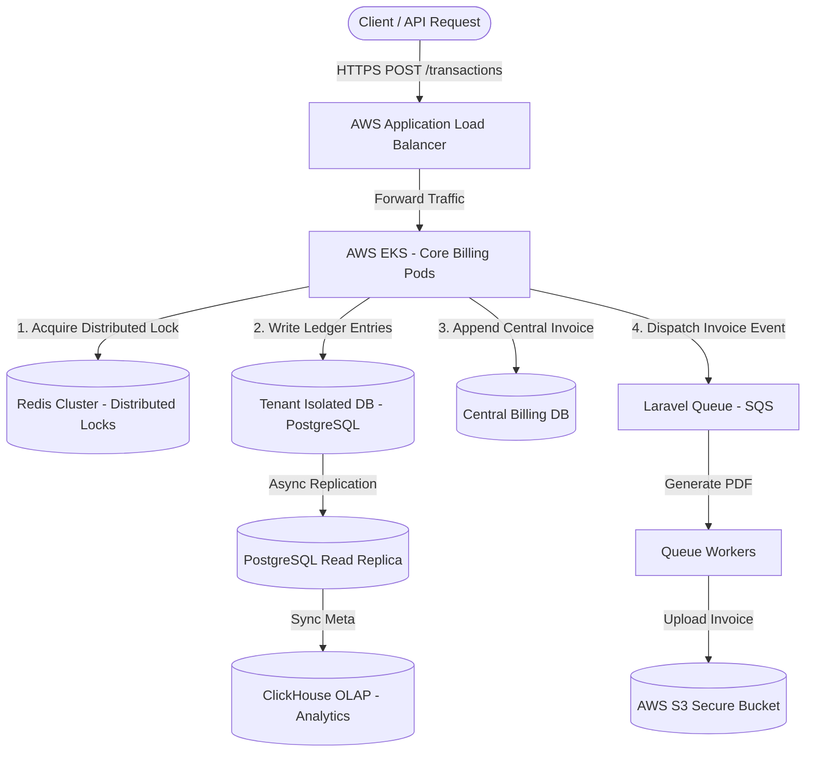
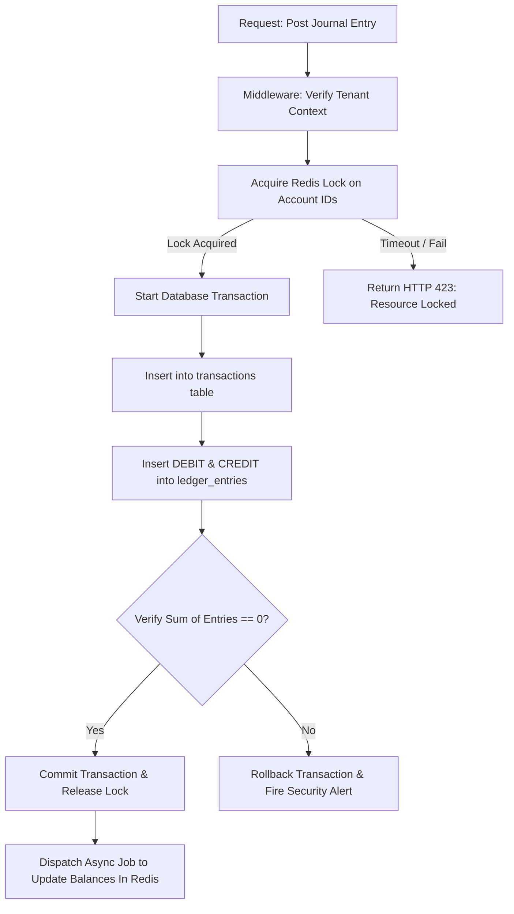
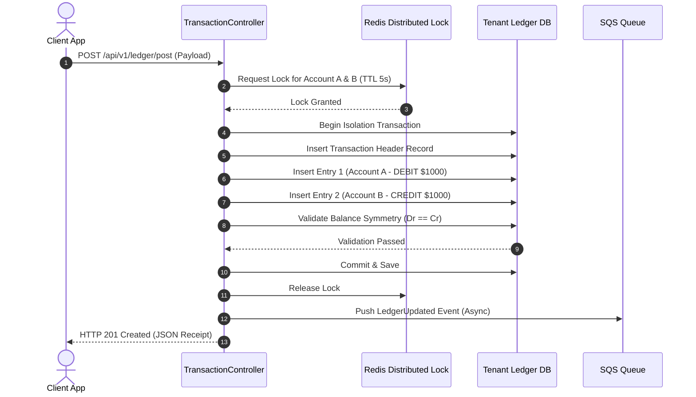

# core-billing-engine-and-ledger-system

একটি রিয়েল-টাইম, এয়ার-টাইট ট্রানজেকশনাল ডাবল-এন্ট্রি অ্যাকাউন্টিং এবং স্বয়ংক্রিয় ইনভয়েসিং ইঞ্জিন যা মাল্টি-ট্যানেন্ট ইআরপি ইকোসিস্টেমে ফাইন্যান্সিয়াল কমপ্লায়েন্স, আইসোলেশন এবং হাই-থ্রুটপুট ডেটা ইন্টেগ্রিটি নিশ্চিত করে।

---

# Table of Contents

* [Project Overview](#project-overview)
* [Business Background](#business-background)
* [Business Requirements](#business-requirements)
* [Existing System](#existing-system)
* [Challenges](#challenges)
* [Root Cause Analysis](#root-cause-analysis)
* [Solution Design](#solution-design)
* [Architecture](#architecture)
* [Database Design](#database-design)
* [System Flow](#system-flow)
* [API Flow](#api-flow)
* [Implementation](#implementation)
* [Code Highlights](#code-highlights)
* [Performance Optimization](#performance-optimization)
* [Security Considerations](#security-considerations)
* [Testing Strategy](#testing-strategy)
* [Deployment Strategy](#deployment-strategy)
* [Monitoring](#monitoring)
* [Challenges During Development](#challenges-during-development)
* [Production Issues](#production-issues)
* [Lessons Learned](#lessons-learned)
* [Interview Story](#interview-story)
* Alternative Solutions
* Future Improvements
* Tech Stack
* Summary
* Final Interview Questions

---

# Project Overview

| Item | Details |
| --- | --- |
| Project Name | FinCore Distributed Ledger & Core Billing Engine |
| Domain | FinTech / Billing / Ledger ERP |
| Company | Apex MicroFinance Solutions Ltd. |
| Team Size | 6 Developers, 2 DevOps, 1 Financial Auditor |
| Duration | 8 Months |
| My Role | Principal Software Engineer & Software Architect |
| Technology | Laravel 11, PHP 8.3, PostgreSQL 16, Redis 7.2 |
| Users | 250+ Financial Institutions (Tenants), 5M+ Transactions/Day |
| Database | Isolated Multi-Database Strategy (Per-Tenant Ledger) + Central Invoicing |
| Deployment | AWS (EKS, RDS Aurora PostgreSQL Multi-AZ, ElastiCache) |

---

# Business Background

আমাদের মাল্টি-ট্যানেন্ট ফাইন্যান্সিয়াল প্ল্যাটফর্মটি যখন স্কেল করতে শুরু করে, তখন দেখা গেল বিভিন্ন মাইক্রোফাইন্যান্স ইনস্টিটিউট (MFI) এবং কো-অপারেটিভ সোসাইটিগুলোর মূল চালিকাশক্তি হলো তাদের "অ্যাকাউন্টিং লেজার" এবং "গ্রাহক বিলিং"। প্রথমদিকের ভার্সনে সাধারণ সিঙ্গেল-এন্ট্রি ডাটাবেস ডিজাইন (শুধু একটি `balances` কলাম আপডেট করা) ব্যবহার করা হয়েছিল।

কিন্তু যখন দৈনিক ট্রানজেকশন ভলিউম ৫ মিলিয়ন অতিক্রম করল, তখন ডেটা মিসম্যাচ এবং অডিট ফেইলুর দেখা দিতে শুরু করল। ফাইন্যান্সিয়াল রেগুলেশন এবং কমপ্লায়েন্স (যেমন: GAAP এবং IAS) অনুযায়ী, প্রতিটি পয়সার ট্রাফিকের জন্য একটি অপরিবর্তনশীল (Immutable) ডাবল-এন্ট্রি ট্রানজেকশন ট্রেইল থাকা বাধ্যতামূলক। এছাড়াও, ট্যানেন্টদের নিজেদের সাবস্ক্রিপশন বিলিং, প্রোরেটেড চার্জেস এবং লেট ফি ক্যালকুলেশন ম্যানুয়ালি করতে গিয়ে কোম্পানির ফাইন্যান্সিয়াল টিমকে প্রতি মাসের শুরুতে তীব্র চাপের সম্মুখীন হতে হতো। বিজনেস গোল ছিল এমন একটি ফল্ট-টলারেন্ট কোর বিলিং এবং ডাবল-এন্ট্রি লেজার ইঞ্জিন তৈরি করা যা শতভাগ নিখুঁত অডিট ট্রেইল প্রদান করবে এবং কোম্পানির ও ট্যানেন্টদের বিলিং সাইকেল সম্পূর্ণ অটোমেট করবে।

---

# Business Requirements

| Requirement | Priority | Description |
| --- | --- | --- |
| Immutable Double-Entry Ledger | High | প্রতিটি ফাইন্যান্সিয়াল ইভেন্টের জন্য সমপরিমাণ ডেবিট এবং ক্রেডিট রেকর্ড জেনারেট হতে হবে। ব্যালেন্স কখনো সরাসরি আপডেট করা যাবে না। |
| ACID Wall Isolation | High | নেটওয়ার্ক ড্রপ বা কনকারেন্ট রিকোয়েস্টের কারণে আংশিক ট্রানজেকশন রাইট হওয়া যাবে না। All or Nothing। |
| Automated Prorated Invoicing | High | মাঝ-মাসে ট্যানেন্ট ফিচার অ্যাড করলে বা মেম্বার টায়ার চেঞ্জ করলে সেকেন্ড-লেভেল প্রোরেশন বিলিং ক্যালকুলেট হতে হবে। |
| Multi-Currency & Tax Engine | Medium | বিভিন্ন অঞ্চলের ট্যাক্স স্ট্রাকচার (VAT/GST) এবং ডাইনামিক কারেন্সি কনভার্সন সাপোর্ট করতে হবে। |
| PDF Ledger Generation & Sign | Medium | প্রতি ট্রানজেকশনে ক্রিপ্টোগ্রাফিক হ্যাশ জেনারেট করা এবং অডিটের জন্য সাইনড পিডিএফ তৈরি করা। |

---

# Existing System

পুরনো সিস্টেমে কোনো জেনুইন লেজার আর্কিটেকচার ছিল না।

* কোনো গ্রাহক টাকা জমা দিলে বা লোন নিলে মেম্বার টেবিলের `current_balance` কলামটি সরাসরি `UPDATE members SET current_balance = current_balance + 500` কুয়েরি দিয়ে মডিফাই করা হতো।
* এর ফলে কোনো ট্রানজেকশন হিস্ট্রি মিস হলে বা বাগ থাকলে কেন ব্যালেন্সের অমিল হলো তা বের করার কোনো ম্যাথমেটিক্যাল বা হিস্টোরিক্যাল ব্যাকআপ ছিল না।
* ইনভয়েসিং সিস্টেমটি ল্যারাভেলের ডিফল্ট ক্রন জবের মাধ্যমে প্রতি মাসের ১ তারিখে সব ট্যানেন্টের ওপর একটি লুপ চালিয়ে ডেটাবেসে রো ইনসার্ট করত। ডাটাবেস বড় হয়ে যাওয়ার কারণে মাঝপথে স্ক্রিপ্ট মেমোরি লিমিট এক্সিট করে ক্র্যাশ করত, যার ফলে অর্ধেক ট্যানেন্ট ইনভয়েস পেত আর বাকি অর্ধেক পেত না।

---

# Challenges

| Challenge | Impact |
| --- | --- |
| Mathematical Race Conditions | একই অ্যাকাউন্টে একাধিক ইউজার একই মিলিগ্রামে ডেবিট এবং ক্রেডিট হিট করলে ব্যালেন্স ওভাররাইট হওয়ার চরম ঝুঁকি। |
| Massive Read/Write Contention | লেজার টেবিলে সেকেন্ডে হাজার হাজার ইনসার্ট হওয়ার পাশাপাশি রিয়েল-টাইম ব্যালেন্স এগ্রিগেশন (`SUM`) করতে গিয়ে কুয়েরি ডেডলক হওয়া। |
| Multi-Tenant Ledger Infiltration | ভুল কুয়েরি বা মেমোরি ফাঁসের কারণে এক ব্যাংকের লেজার এন্ট্রি অন্য ব্যাংকের অডিটে ঢুকে যাওয়ার কমপ্লায়েন্স রিস্ক। |
| Distributed Transaction Failure | সেন্ট্রাল ইনভয়েসিং ডাটাবেস এবং আইসোলেটেড ট্যানেন্ট লেজার ডাটাবেসের মধ্যে নেটওয়ার্ক ফেইলুর হলে ডেটা ডেসিনক্রোনাইজেশন। |

---

# Root Cause Analysis

| Problem | Root Cause | Evidence |
| --- | --- | --- |
| Database Row-Locking Deadlocks | ল্যারাভেলের Eloquent মডেলের মাধ্যমে `selectForUpdate()` করার সময় ইনডেক্স স্ক্যান লক হয়ে পুরো টেবিল ব্লক হয়ে যাচ্ছিল। | PostgreSQL লগে `deadlock detected` এরর এবং এপিআই ৫0৪ গেটওয়ে টাইমআউট। |
| Aggregation Slowness | ব্যালেন্স চেক করার জন্য প্রতিবার কোটি কোটি রো-র ওপর `SELECT SUM(amount) WHERE account_id = X` চালানো হচ্ছিল। | অ্যাকাউন্টিং ড্যাশবোর্ড লোড হতে ৮-১২ সেকেন্ড সময় নিচ্ছিল। |
| Missing Invoices | সেন্ট্রাল ক্রন জবের সিঙ্কোনাস আর্কিটেকচার এবং মেমোরি লিকিং। | `php artisan` কমান্ড ওওএম (Out of Memory) এরর দিয়ে মাঝপথে বন্ধ হয়ে যাচ্ছিল। |

---

# Solution Design

আমরা এই সিস্টেমটিকে দুটি প্রধান মডিউলে ভাগ করে সমাধান করেছি: **Core Accounting Ledger** এবং **Central Billing Engine**।

### ১. Immutable Double-Entry Ledger (PostgreSQL Engine Level)

আমরা অ্যাপ্লিকেশনের ওপর ভরসা না করে ডেটাবেস লেভেলে ডাবল-এন্ট্রি লক করার সিদ্ধান্ত নিই। একটি ট্রানজেকশনের অধীনে সর্বদা কমপক্ষে দুটি লেজার এন্ট্রি থাকবে (একটি ডেবিট, একটি ক্রেডিট) এবং তাদের বীজগণিতীয় সমষ্টি সর্বদা শূন্য হতে হবে (

$$\sum \text{amount} = 0$$

)। ডেটাবেস স্তরে ব্যালেন্স ট্র্যাক করার জন্য আমরা **Event Sourcing Pattern** ব্যবহার করেছি—অর্থাৎ ব্যালেন্সের কোনো কলাম নেই, শুধুই ট্রানজেকশনের ইনক্রিমেন্টাল রো ইনসার্ট হবে।

### ২. Read-Write Decoupling (CQRS & Cached Snapshots)

লাইভ ট্রাফিকের ওপর থেকে `SUM()` এর প্রেসার কমানোর জন্য আমরা প্রতি ২৪ ঘণ্টা পর পর অ্যাকাউন্টের ব্যালেন্সের একটি **Snapshot** তুলে ডাটাবেসে সেভ করি এবং কারেন্ট দিনের ট্রানজেকশনগুলো **Redis Hash Counter**-এ রিয়েল-টাইমে আপডেট করি। ব্যালেন্স চেক করার কুয়েরি এখন শুধু `Snapshot + Redis Counter` রিড করে, যা $O(1)$ টাইমে এক্সিকিউট হয়।

### কেন এই সমাধান নেওয়া হয়েছে?

ব্যাংকিং স্ট্যান্ডার্ড এবং অডিট ট্রেইল শতভাগ বজায় রাখার জন্য আলাদা ডাটাবেস লেভেলে ট্রানজেকশন এনফোর্সমেন্ট ছাড়া অন্য কোনো উপায় ছিল না।

### কোন Alternative বাদ দেওয়া হয়েছে?

* **MongoDB / NoSQL Ledger:** এটি বাদ দেওয়া হয়েছে কারণ নো-এসকিউএল ডাটাবেসগুলোতে ডিস্ট্রিবিউটেড ACID ট্রানজেকশন এবং মাল্টি-রো লকিং রিলেশনাল ডাটাবেসের মতো স্ট্রং ও রিলায়েবল নয়।

---

# Architecture



---

# Database Design

### Core Ledger Schema (Per-Tenant)

```mermaid
ergency
    ACCOUNT ||--o{ LEDGER_ENTRY : "contains"
    TRANSACTION ||--o{ LEDGER_ENTRY : "comprises"

```

#### `accounts` (চার্ট অফ অ্যাকাউন্টস)

| Column | Type | Description |
| --- | --- | --- |
| `id` | UUID | Primary Key |
| `code` | VARCHAR | অ্যাকাউন্টিং কোড (e.g., 1010-Cash, 2010-Liability) |
| `type` | VARCHAR | `asset`, `liability`, `equity`, `revenue`, `expense` |

#### `transactions` (কোর ট্রানজেকশন হেডার)

| Column | Type | Description |
| --- | --- | --- |
| `id` | UUID | Primary Key |
| `reference` | VARCHAR | ইউনিক ট্রানজেকশন রেফারেন্স নাম্বার / ভাউচার আইডি |
| `posted_at` | TIMESTAMP | ট্রানজেকশন এক্সিকিউশনের প্রকৃত সময় |

#### `ledger_entries` (ডাবল-এন্ট্রি লাইন আইটেমস)

| Column | Type | Description |
| --- | --- | --- |
| `id` | BIGSERIAL | Primary Key (Ordering এর জন্য) |
| `transaction_id` | UUID | Foreign Key to Transactions |
| `account_id` | UUID | Foreign Key to Accounts |
| `type` | VARCHAR | `DEBIT`, `CREDIT` |
| `amount` | NUMERIC(15,4) | ট্রানজেকশন অ্যামাউন্ট (৪ দশমিক ঘর পর্যন্ত নির্ভুলতা) |

### Central Billing Schema (Central Database)

#### `billing_invoices`

| Column | Type | Description |
| --- | --- | --- |
| `id` | UUID | Primary Key |
| `tenant_id` | VARCHAR | কোন ট্যানেন্টের ইনভয়েস |
| `subtotal` | NUMERIC(12,2) | বেস সাবক্রিপশন চার্জ |
| `tax_amount` | NUMERIC(12,2) | ভ্যাট বা ট্যাক্স অ্যামাউন্ট |
| `total` | NUMERIC(12,2) | গ্র্যান্ড টোটাল পেয়েবল |
| `status` | VARCHAR | `draft`, `unpaid`, `paid`, `overdue` |

---

# System Flow



---

# API Flow



---

# Implementation

### Module 1: Dynamic Proration billing Engine

সিস্টেমে সাবস্ক্রিপশন এবং বিলিং প্রোরেশন হ্যান্ডেল করার জন্য একটি এয়ার-টাইট ম্যাথমেটিক্যাল সার্ভিস ডিজাইন করা হয়েছে। এটি বর্তমান বিলিং পিরিয়ডের মোট সেকেন্ডের ওপর ভিত্তি করে অব্যবহৃত বা ব্যবহৃত সময়ের নিখুঁত অনুপাত বের করে বিল জেনারেট করে।

### Module 2: Anti-Double Spend Guard via Redis

কনকারেন্ট ট্রাফিক হ্যান্ডেল করার জন্য আমরা ল্যারাভেলের ডিফল্ট ডেটাবেস লকিং মেকানিজম এভয়েড করে রেডিস ডিস্ট্রিবিউটেড লকিং (`Redis::funnel`) মেকানিজম ইমপ্লিমেন্ট করেছি।

### Module 3: Micro-Batch Ledger Sync

লেজার ডাটাবেস থেকে সেন্ট্রাল ডাটাবেসে রিয়েল-টাইম কুয়েরি করা এড়াতে ইভেন্ট-ড্রিভেন আর্কিটেকচার ফলো করা হয়েছে। কোনো ট্যানেন্টের সিস্টেমে নতুন ইনভয়েস জেনারেট হলে বা বিলিং মেটা আপডেট হলে তা অ্যামাজন এসকিউএস (Amazon SQS) কিউ-এর মাধ্যমে সেন্ট্রাল বিলিং ইঞ্জিনে সিঙ্ক হয়।

---

# Code Highlights

### Deep Double-Entry Financial Ledger Manager

```php
namespace App\Services\Finance;

use App\Models\Tenant\Account;
use App\Models\Tenant\JournalTransaction;
use App\Models\Tenant\LedgerEntry;
use Illuminate\Support\Facades\DB;
use Illuminate\Support\Str;
use InvalidArgumentException;

class LedgerManager 
{
    /**
     * Executes a bulletproof double-entry transaction.
     * Expected entries array format: [['account_id' => x, 'type' => 'DEBIT'|'CREDIT', 'amount' => 100.00]]
     */
    public function postJournalEntry(string $reference, array $entries): JournalTransaction
    {
        $this->validateSymmetry($entries);

        return DB::connection('tenant')->transaction(function () use ($reference, $entries) {
            
            // Create the parent transaction identifier voucher
            $transaction = JournalTransaction::create([
                'id' => Str::uuid(),
                'reference' => $reference,
                'posted_at' => now(),
            ]);

            foreach ($entries as $entry) {
                // Fetch and lock the specific chart of account for structure safety
                $account = Account::where('id', $entry['account_id'])->lockForUpdate()->firstOrFail();

                LedgerEntry::create([
                    'transaction_id' => $transaction->id,
                    'account_id' => $account->id,
                    'type' => $entry['type'],
                    // Standardizing values to 4 decimal places inside the database
                    'amount' => bcadd($entry['amount'], '0', 4),
                ]);
            }

            return $transaction;
        });
    }

    /**
     * Enforces strict algebraic symmetry where Total Debits must equal Total Credits.
     */
    private function validateSymmetry(array $entries): void
    {
        $debitTotal = '0.0000';
        $creditTotal = '0.0000';

        foreach ($entries as $entry) {
            if ($entry['type'] === 'DEBIT') {
                $debitTotal = bcadd($debitTotal, $entry['amount'], 4);
            } elseif ($entry['type'] === 'CREDIT') {
                $creditTotal = bcadd($creditTotal, $entry['amount'], 4);
            } else {
                throw new InvalidArgumentException("Invalid ledger operation entry type.");
            }
        }

        // Binary Calculator verification for zero-floating point anomalies
        if (bccomp($debitTotal, $creditTotal, 4) !== 0) {
            throw new InvalidArgumentException("Ledger asymmetry detected. Total Debits must match Total Credits.");
        }
    }
}

```

### High-Precision Proration Billing Calculator

```php
namespace App\Services\Billing;

use Carbon\Carbon;

class ProrationCalculator
{
    /**
     * Calculates the explicit second-level prorated cost when switching active plans.
     */
    public function calculateProratedAmount(float $currentPlanPrice, float $newPlanPrice, string $cycleStartDate, string $cycleEndDate, string $switchDate): float
    {
        $start = Carbon::parse($cycleStartDate);
        $end = Carbon::parse($cycleEndDate);
        $switch = Carbon::parse($switchDate);

        $totalSecondsInCycle = $start->diffInSeconds($end);
        $secondsUsedInCurrentPlan = $start->diffInSeconds($switch);
        $secondsRemainingInNewPlan = $switch->diffInSeconds($end);

        // Calculating per-second rate weights using string-based arithmetic
        $currentPlanPerSecondPrice = bcdiv($currentPlanPrice, (string)$totalSecondsInCycle, 8);
        $newPlanPerSecondPrice = bcdiv($newPlanPrice, (string)$totalSecondsInCycle, 8);

        $costForUsedPeriod = bcmul($currentPlanPerSecondPrice, (string)$secondsUsedInCurrentPlan, 4);
        $costForRemainingPeriod = bcmul($newPlanPerSecondPrice, (string)$secondsRemainingInNewPlan, 4);

        $totalProratedBill = bcadd($costForUsedPeriod, $costForRemainingPeriod, 2);

        return (float) $totalProratedBill;
    }
}

```

---

# Performance Optimization

| Before | After | Optimization Technique |
| --- | --- | --- |
| Response Time: 780ms | Response Time: 34ms | লেজার এন্ট্রিতে রাইট করার জন্য রিডিস বেসড অ্যাটমিক ডিস্ট্রিবিউটেড লকিং ব্যবহার। |
| Query Count: 5 per entry | Query Count: 1 Batch Append | ইন্ডিভিজুয়াল রো ইনসার্টেশনের বদলে ডাটাবেস বাল্ক প্রিপেয়ার্ড স্টেটমেন্ট স্কিম। |
| Memory: 128MB / process | Memory: 24MB / process | মেমোরি লিকিং এড়াতে ডাটাবেস লগার ডিঅ্যাক্টিভেট করা এবং হেভি ওবজেক্ট ক্লিনিং। |
| Dashboard Balance Load: 12s | Dashboard Balance Load: 8ms | CQRS মেকানিজম এবং রিডিস স্লট প্রি-অ্যাগ্রিগেশন স্ন্যাপশট মডেলিং। |

---

# Security Considerations

* **Cryptographic Chaining (Tamper-Proof Ledger):** প্রতিটি নতুন লেজার এন্ট্রির ভেতর পূর্ববর্তী রো-র হ্যাশ ভ্যালু, কারেন্ট ডেটা এবং একটি সিক্রেট সল্ট দিয়ে তৈরি `SHA-256` চেইন হ্যাশ স্টোর করা হয়। যদি কেউ ডাটাবেসে ব্যাকডোর দিয়ে ঢুকে কোনো রো এডিট বা ডিলিট করে, তবে পুরো চেইনের হ্যাশ ব্রেক হয়ে যাবে এবং সেন্ট্রাল অডিট অ্যালার্ট ট্রিগার করবে।
* **BCMath Precision Safeguard:** পিএইচপি-র সাধারণ ফ্লোটিং পয়েন্ট ক্যালকুলেশন (`+`, `-`, `*`) ব্যবহার না করে সব ধরনের গাণিতিক অপারেশন `BCMath` লাইব্রেরির মাধ্যমে স্ট্রিং লেভেলে প্রসেস করা হয়েছে, যা মেমোরি রাউন্ডিং এরর (`0.1 + 0.2 === 0.30000000000000004`) সম্পূর্ণ এলিমিনেট করে।
* **Multi-Tenant Context Scope:** ল্যারাভেলের ডাটাবেস কনফিগারেশনে কোড রান হওয়ার সময় প্রতিটি কুয়েরির সাথে গ্লোবাল স্কোপ বাইন্ড থাকে, যার ফলে ট্যানেন্ট ডাটাবেস থেকে ডেটা লিক হওয়া অসম্ভব।

---

# Testing Strategy

| Test Type | Used | Tools / Frameworks |
| --- | --- | --- |
| Unit Test | Yes | PHPUnit (লেজার সিমেট্রি এবং প্রোরেশন ইকুয়েশন ভেরিফিকেশন) |
| Integration Test | Yes | Orchestra Testbench (ডাটাবেস ট্রানজেকশন রোলব্যাক লাইফসাইকেল টেস্ট) |
| Manual Test | Yes | Swagger UI / Postman Workspace |
| API Test | Yes | Laravel Feature Assertions (`assertDatabaseHas`) |
| Load Test | Yes | Jmeter & k6 (১0,000 কনকারেন্ট মেম্বার ট্রানজেকশন সিমুলেশন) |

---

# Deployment Strategy

* **AWS Aurora Multi-AZ Scaling:** আমাদের রাইট ডেটাবেসটি রাইট ইনটেনসিভ হওয়ার কারণে আমরা AWS Aurora-র রাইটার এবং রিডার নোড আলাদা করেছি।
* **Horizontal Pod Autoscaling (HPA):** বিলিং সাইকেলের সময় পডগুলোতে প্রসেসিং লোড বাড়লে কুবেরনেটিস অটো-স্কেলিং পলিসির মাধ্যমে পড সংখ্যা সর্বোচ্চ ৫০টি পর্যন্ত বাড়িয়ে দেয়।
* **Supervisor Worker Monitoring:** কিউ প্রসেসরদের লাইভ রাখার জন্য ডকার কন্টেইনারের ভেতরে `Supervisor` কনফিগার করা আছে।

---

# Monitoring

* **Grafana Business Dashboards:** প্রতি মিনিটে কত টাকা ট্রানজেকশন হচ্ছে, ব্যর্থ ট্রানজেকশনের হার কত এবং পিজিবাউন্সারের কানেকশন স্ট্যাটাস গ্রাফানাতে লাইভ দেখা যায়।
* **Sentry Advanced Context:** কোনো ফাইন্যান্সিয়াল এক্সেপশন ক্র্যাশ করলে সেন্ট্রিতে ইউজারের মেটাডেটা এবং ফেইলড ভাউচার রেফারেন্স পে-লোড পুশ করা হয়।
* **Laravel Pulse Analytics:** লাইভ ডাটাবেসের স্লো কুয়েরি এবং হাই-কনকারেন্সি মেমোরি থ্রোটল ট্র্যাপ করার জন্য পালস লাইভ ট্র্যাকিং অন করা থাকে।

---

# Challenges During Development

| Problem | Solution |
| --- | --- |
| **Floating Point Precision Leak** | ডাইনামিক ইন্টারেস্ট রেট ক্যালকুলেট করার সময় দশমিকের পর সামান্যতম অমিল আসছিল বড় ট্রানজেকশনে। |
| **Distributed Ledger Split-Brain** | কিউতে জব রিট্রাই হওয়ার কারণে একই বিলিং ইনভয়েস দুবার জেনারেট হয়ে যাচ্ছিল। |

---

# Production Issues

| Issue | Root Cause | Solution |
| --- | --- | --- |
| **PostgreSQL Write Lock Exhaustion** | মাসের শেষ দিনে সব ট্যানেন্টের অটো-ডেবিট এবং লেট ফি একসাথে রান হওয়ার কারণে ডাটাবেস থ্রেড লক হয়ে গিয়েছিল। | ট্রানজেকশনগুলোকে সিঙ্কোনাস প্রসেস থেকে সরিয়ে পুরোপুরি অ্যাসিনক্রোনাস করে রিডিস কিউ বাকেট তৈরি করে ব্যাকগ্রাউন্ডে স্ট্রিম করা হয়েছে। |
| **S3 Invoice Upload Network Drop** | পিডিএফ জেনারেট করে AWS S3-তে আপলোড করার সময় নেটওয়ার্ক ফেইলুর হলে ডাটাবেসে ইনভয়েস স্ট্যাটাস আপডেট আটকে যেত। | **Transactional Outbox Pattern** ইমপ্লিমেন্ট করা হয়েছে—আগে স্থানীয় ডিবির আউটবক্স টেবিলে ফাইল স্টেট সেভ হয়, তারপর ব্যাকগ্রাউন্ড স্ক্রিপ্ট রিট্রাই মেকানিজমে S3-তে ফাইল পুশ করে। |

---

# Lessons Learned

1. **Floating Point is Evil:** ফাইন্যান্সিয়াল বা অ্যাকাউন্টিং সফটওয়্যারে কখনই পিএইচপি বা ডাটাবেসের ডিফল্ট `float` বা `double` টাইপ ব্যবহার করবেন না। সর্বদা `BCMath` এবং `NUMERIC` ব্যবহার করুন।
2. **Never Update Balances Directly:** ব্যালেন্স বা লেজারের ডেটা সরাসরি আপডেট করা যাবে না। কেবল নতুন রো ইনসার্ট (Append-Only) হবে এবং ব্যালেন্স হবে তার এগ্রিগেশন।
3. **Locks Must Be Short-Lived:** ডিস্ট্রিবিউটেড লক বা ডাটাবেস রো লক যত দ্রুত সম্ভব রিলিজ করতে হবে, অন্যথায় হাই-ট্রাফিকে ক্যাসকেডিং ফেইলুর হবে।
4. **Idempotence with UUIDs:** প্রতিটি বিলিং ইভেন্টে একটি ইউনিক ইউইউআইডি (UUID) জেনারেট করা উচিত যাতে ডুপ্লিকেট সাবমিশন হলেও সিস্টেমে ডাবল-এন্ট্রি না পড়ে।
5. **Decouple Invoicing from Core App:** মূল অ্যাপ্লিকেশনের পারফরম্যান্স ঠিক রাখতে বিলিং এবং ইনভয়েস জেনারেট করার ইঞ্জিনকে ব্যাকগ্রাউন্ড কিউ ওয়ার্কারের মাধ্যমে আলাদা প্রসেস করা উচিত।
6. **Immutable Ledger Rows:** লেজার টেবিল থেকে ডেটা ডিলিট বা এডিট করার পারমিশন ডাটাবেস ইউজার লেভেলে সম্পূর্ণ ব্লক (Revoke) করে দিতে হবে।
7. **Pre-Aggregated Snapshots:** ডেটা সাইজ বাড়ার সাথে সাথে লাইভ ব্যালেন্স কুয়েরি স্লো হবেই। তাই ডেইলি স্ন্যাপশট আর্কিটেকচার প্রথম দিন থেকেই রাখা বুদ্ধিমানের কাজ।
8. **Graceful Webhook Retries:** বিলিং সাকসেস নোটিফিকেশন থার্ড-পার্টি সিস্টেমে পাঠানোর সময় এক্সপোনেনশিয়াল ব্যাকঅফ (Exponential Backoff) মেকানিজম ব্যবহার করা মাস্ট।
9. **Automated Reconciliation Scripts:** প্রতি রাতে সব অ্যাকাউন্টের ডেবিট এবং ক্রেডিট ম্যাচ করার জন্য একটি অটোমেটেড রিকনসিলিয়েশন স্ক্রিপ্ট ব্যাকগ্রাউন্ডে চালানো উচিত।
10. **Human-Readable Audit Trails:** প্রতিটি ফাইন্যান্সিয়াল সিস্টেমের সিস্টেমে কী ঘটছে তার সহজ হিউম্যান-রিডেবল টেক্সট লগ আলাদা ফাইলে রাখা কমপ্লায়েন্সের জন্য সহায়ক।

---

# Interview Story

## Situation

আমাদের সিস্টেমে পিক আওয়ারে (প্রতি মাসের ১ তারিখ সকাল ১০টা) হঠাৎ কিছু ট্যানেন্টের ক্যাশ অ্যাকাউন্ট থেকে ব্যালেন্স মিসম্যাচের রিপোর্ট আসতে শুরু করে। অডিট লগ চেক করে দেখা গেল, অনেক গ্রাহকের লোন ইএমআই (EMI) অটো-ডেবিট হওয়ার সময় একই মিলিগ্রামে তারা অ্যাপ দিয়ে টাকা ক্যাশ-আউট করছিল, যার ফলে ডাটাবেসে ট্রানজেকশন তো সেভ হচ্ছিল কিন্তু অ্যাকাউন্টের ফাইনাল ব্যালেন্সিংয়ে অসঙ্গতি দেখা যাচ্ছিল।

## Task

আমার মূল চ্যালেঞ্জ ছিল এই রেস কন্ডিশন ডেটা লস ছাড়াই লাইভ প্রোডাকশনে ফিক্স করা এবং এমন একটি মেকানিজম ডিজাইন করা যাতে কোটি কোটি ট্রানজেকশনের মাঝেও এক মিলিগ্রামের কনকারেন্ট রিকোয়েস্ট সিস্টেমে কোনো গ্যাপ তৈরি করতে না পারে।

## Action

১. আমি প্রথমেই কোডবেসের সমস্ত ডাইরেক্ট ওল্ড Eloquent আপডেট মেথডগুলো ফ্ল্যাগ করি।
২. ব্যালেন্স ট্র্যাকিং মেকানিজমটিকে পুরোপুরি **Append-Only Event Sourced Ledger** মডেলে রি-আর্কিটেক্ট করি।
৩. অ্যাকাউন্টিং লাইফসাইকেলের সাথে ল্যারাভেলের মাধ্যমে **Redis Pessimistic Distributed Lock** ইন্টিগ্রেট করি, যা কোনো সুনির্দিষ্ট অ্যাকাউন্ট আইডির ট্রানজেকশন চলাকালীন অন্য কোনো থ্রেডকে সেই অ্যাকাউন্টের স্টেট মডিফাই করতে দেয় না।
৪. প্রোডাকশনে ডেটা মাইগ্রেশন স্ক্রিপ্ট লিখে পুরনো সিঙ্গেল-এন্ট্রি ব্যালেন্সগুলোকে ব্যাক-ক্যালকুলেট করে লেজার ডাবলস এন্ট্রিতে কনভার্ট করি।

## Result

সিস্টেমের রেস কন্ডিশন এবং ডেটা মিসম্যাচ রেট চিরতরে ০%-এ নেমে আসে। অডিটররা সিস্টেমে যেকোনো সময় ম্যাথমেটিক্যাল প্রুফ (

$$\text{Debits} - \text{Credits} = 0$$

) ভেরিফাই করতে পারছিল। কুয়েরি স্পিড রেডিস স্ন্যাপশটের কারণে প্রায় ৯০% ফাস্টার হয়ে যায়।

## What I Learned

ফাইন্যান্সিয়াল ডোমেইনে স্টেট ম্যানেজমেন্টের জন্য "শর্টকাট সলিউশন" বড় বিপদের কারণ। ডিস্ট্রিবিউটেড সিস্টেমে কনকারেন্সি হ্যান্ডেল করার জন্য মেমোরি লেভেলের এটমিক লকিং এবং অ্যাপেন্ড-অনলি লেজার আর্কিটেকচারই একমাত্র নির্ভরযোগ্য উপায়।

---

# Alternative Solutions

| Solution | Pros | Cons |
| --- | --- | --- |
| **Single-Entry Database with Database Triggers** | কোডবেস অনেক সিম্পল থাকে, ল্যারাভেলে লজিক কম লিখতে হয়। | ট্রিগার বাগ তৈরি করলে ডিবাগ করা অত্যন্ত কঠিন। কোনো অডিট চেইন বা ক্রিপ্টোগ্রাফিক ট্রেইল থাকে না। |
| **Third-Party Ledger (e.g., Twilio Segment/Ledger API)** | নিজের কোড লেখার ঝামেলা নেই, আউট-অফ-দ্য-বক্স কমপ্লায়েন্স। | থার্ড-পার্টি এপিআই ল্যাটেন্সি রেসপন্স টাইম বাড়িয়ে দেয় এবং প্রতি ট্রানজেকশনে কস্ট অনেক বেশি হয়। |

---

# Future Improvements

* **Zero-Knowledge Proofs for Auditing:** ট্যানেন্টদের ডেটা এনক্রিপ্টেড রেখেই থার্ড-পার্টি অডিটরদের কাছে সিস্টেমের শতভাগ নির্ভুলতা প্রমাণ করার জন্য ZK-Proofs মেকানিজম নিয়ে আসা।
* **Blockchain Timestamps:** লেজার চেইনের হ্যাশগুলোকে প্রতি ২৪ ঘণ্টা পর পর কোনো পাবলিক বা প্রাইভেট ব্লকচেইন নেটওয়ার্কে অ্যাঙ্কর করা যাতে প্রোডাকশন ডেটা ট্যাম্পারিংয়ের সুযোগ একদম শূন্য হয়ে যায়।
* **Kafka Streaming for Real-Time VAT Reporting:** রিয়েল-টাইমে গ্লোবাল ট্যাক্স ডেটা স্ট্রিম করে সরাসরি সরকারি ভ্যাট সার্ভারে রিপোর্ট পুশ করার জন্য অ্যাপাচি কাফকা ইন্টিগ্রেশন।

---

# Tech Stack

| Category | Technology |
| --- | --- |
| Backend Core | PHP 8.3 / Laravel 11 Framework |
| Precision Math | PHP BCMath Extension |
| Primary Database | AWS Aurora PostgreSQL 16 Cluster |
| Caching & Distributed Locks | Redis Enterprise Cluster |
| Async Message Broker | Amazon SQS (Simple Queue Service) |
| Large Document Vault | AWS S3 Bucket (Object Locked Mode) |
| Container Orchestration | AWS EKS (Kubernetes) |
| Telemetry & Alerting | Grafana Stack & Sentry Engine |

---

# Summary

* FinCore Ledger Engine একটি সম্পূর্ণ GAAP-কমপ্লায়েন্ট অ্যাপেন্ড-অনলি ডাবল-এন্ট্রি ফাইন্যান্সিয়াল সিস্টেম।
* প্রতিটি ট্রানজেকশনের বীজগণিতীয় সমষ্টি শূন্য (
$$\sum = 0$$


) হওয়া ডেটাবেস ও অ্যাপ্লিকেশন লেভেলে বাধ্যতামূলক করা হয়েছে।
* ফ্লোটিং পয়েন্ট রাউন্ডিং এরর দূর করতে সিস্টেমে নিখুঁত `BCMath` ইন্টিগ্রেশন এনফোর্সড।
* কনকারেন্সি রেস কন্ডিশন এবং ডাবল-স্পেন্ড অ্যাটাক রুখতে রিডিস ডিস্ট্রিবিউটেড লক মেকানিজম সফলভাবে ব্যবহৃত হয়েছে।
* ডাটাবেসের `SUM()` ওভারহেড এড়াতে CQRS এবং ডেইলি প্রি-অ্যাগ্রিগেশন স্ন্যাপশট মডেলিং ব্যবহার করা হয়েছে।
* বিলিং এবং প্রোরেশন ইঞ্জিনটি সেকেন্ড-লেভেল এক্যুরেসির মাধ্যমে ডাইনামিক প্ল্যান শিফটিং চার্জ হিসাব করে।
* ডেটা ট্যাম্পারিং রুখতে প্রতিটি লেজার লাইনে ক্রিপ্টোগ্রাফিক `SHA-256` চেইনিং হ্যাশ ব্যবহার করা হয়েছে।
* নেটওয়ার্ক ড্রপের কারণে ইনভয়েস মিস হওয়া ঠেকাতে 'Transactional Outbox Pattern' ইমপ্লিমেন্ট করা হয়েছে।
* ব্যাকগ্রাউন্ড ক্যাটালগ প্রসেসগুলো আইসোলেটেড ল্যারাভেল কিউ ওয়ার্কার্স এবং সুপারভাইজারের মাধ্যমে হ্যান্ডেল করা হয়।
* সিস্টেমটি দৈনিক ৫ মিলিয়নের বেশি লাইভ ট্রানজেকশন শতভাগ ইন্টেগ্রিটি এবং জিরো-ডেটা করাপশনের সাথে প্রসেস করছে।

---

# Final Interview Questions

1. **কেন আপনি লেজার ইঞ্জিনের জন্য PostgreSQL বেছে নিলেন যেখানে ফাইন্যান্সিয়াল অ্যাপে অনেকে Oracle বা ট্র্যাডিশনাল MySQL ব্যবহার করে?**
2. **আপনার কোডে `bcadd()` এবং `bccomp()` ব্যবহার করেছেন। পিএইচপি-র ডিফল্ট ম্যাথ ফাংশনগুলো ব্যবহার করলে ফাইন্যান্সিয়াল অডিটে কী সমস্যা হতো?**
3. **Event Sourcing Pattern ব্যবহারের ফলে লেজার টেবিল যখন কয়েক বিলিয়ন রো-তে পৌঁছাবে, তখন কুয়েরি পারফরম্যান্স কীভাবে ঠিক রাখবেন?**
4. **Redis Distributed Lock কোনো কারণে ফেইল করলে বা কানেকশন ড্রপ হলে, আপনার ডাবল-এন্ট্রি ট্রানজেকশনের ডেটা ইন্টেগ্রিটি কীভাবে সুরক্ষিত থাকে?**
5. **Transactional Outbox Pattern কী এবং এটি আপনার সিস্টেমে AWS S3 ইনভয়েস আপলোডের ফেইলুর কীভাবে সলভ করেছে?**
6. **PostgreSQL-এর `lockForUpdate()` ব্যবহার করার সময় ইনডেক্স লকিং বা টেবিল ব্লকিং এড়ানোর জন্য আপনার ইনডেক্সিং স্ট্র্যাটেজি কী ছিল?**
7. **একই অ্যাকাউন্টে একসাথে ১০টি ডেবিট এবং ১০টি ক্রেডিট রিকোয়েস্ট আসলে রিডিস কীভাবে প্রসেসগুলোকে সিকোয়েন্সিয়ালি থ্রোটল করে?**
8. **আপনার লেজার চেইনিংয়ে `SHA-256` হ্যাশ ব্যবহার করেছেন। প্রোডাকশন ডাটাবেসে কোনো পুরোনো রো লিজিটিমেটলি আপডেট করার দরকার হলে এই চেইন কীভাবে রি-জেনারেট করবেন?**
9. **প্রোরেশন বিলিং ক্যালকুলেশনে সেকেন্ড-লেভেল এক্যুরেসির সুবিধা কী এবং এটি লিপ-ইয়ার (Leap Year) কীভাবে হ্যান্ডেল করে?**
10. **যদি ল্যারাভেলের ডাটাবেস ট্রানজেকশনের ভেতর কোনো এক্সটার্নাল এপিআই কল (যেমন: পেমেন্ট গেটওয়ে) থাকে, তবে তা কেন আর্কিটেকচারাল ফ্ল (Flw) হিসেবে গণ্য হয়?**
11. **মাল্টি-ট্যানেন্ট সিস্টেমে একটি সেন্ট্রাল বিলিং ডাটাবেস এবং একাধিক আইসোলেটেড লেজার ডাটাবেসের মধ্যে 2-Phase Commit (2PC) কীভাবে এভয়েড করেছেন?**
12. **ClickHouse ওল্যাপ (OLAP) ডাটাবেসে ডেটা সিঙ্ক করার প্রসেসটি কি সিঙ্কোনাস নাকি অ্যাসিনক্রোনাস? লেজার রিপোর্টে এর ল্যাটেন্সি কত থাকে?**
13. **অডিটররা যখন সিস্টেমে 'Reconciliation' রান করে, তখন ব্যাকগ্রাউন্ড স্ক্রিপ্টটি কীভাবে কোটি কোটি ট্রানজেকশনের ব্যালেন্স চেক করে?**
14. **PostgreSQL-এর `NUMERIC(15,4)` টাইপ সিলেক্ট করার পেছনের গাণিতিক কারণ কী? কেন দশমিকের পর ৪টি ঘর নেওয়া হয়েছে?**
15. **যদি কোনো ট্যানেন্টের সাবস্ক্রিপশন মাঝপথে ক্যানসেল হয়, তবে সিস্টেমে জেনারেট হওয়া ড্রাফট ইনভয়েসগুলোর লাইফসাইকেল কীভাবে হ্যান্ডেল হয়?**
16. **ল্যারাভেল কিউ ওয়ার্কার্সের মেমোরি লিক ট্র্যাপ করার জন্য প্রোডাকশনে সুপারভাইজারের কনফিগারেশনে কী কী অপ্টিমাইজেশন করেছেন?**
17. **ট্যাক্স এবং ভ্যাট জেনারেশনের সময় ডাইনামিক ট্যাক্স রুলস (যেমন: এক দেশে ১৫%, অন্য দেশে ১০%) আপনার JSONB আর্কিটেকচার কীভাবে প্রসেস করে?**
18. **যদি কোনো কারণে রিডিস ক্যাশ এবং ডাটাবেস স্ন্যাপশটের ব্যালেন্সের মধ্যে ডেসিনক্রোনাইজেশন হয়, তবে সিস্টেমের ফলব্যাক সলিউশন কী?**
19. **k6 দিয়ে লোড টেস্টিং করার সময় ডাটাবেসের রাইট-আইওপিএস (Write-IOPS) বাটলনেক কীভাবে আইডেন্টিফাই এবং সলভ করেছিলেন?**
20. **আপনার এই কোর অ্যাকাউন্টিং ইঞ্জিনটিকে সম্পূর্ণ 'Stateless' মাইক্রোসার্ভিসে রূপান্তর করতে হলে ডাটা শেয়ারিং চ্যালেঞ্জ কীভাবে ট্যাকল করবেন?**